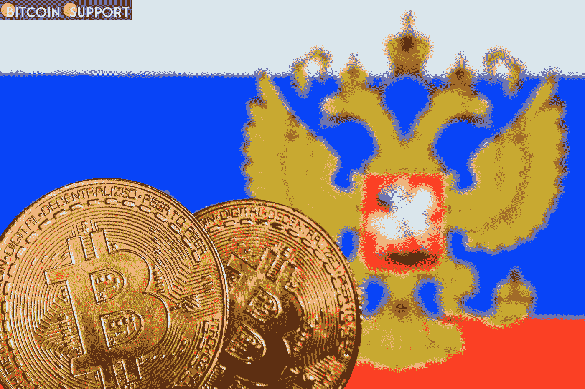

# 这就是为什么最近比特币的上涨与俄罗斯的制裁毫无关系

> 原文：<https://medium.com/coinmonks/heres-why-the-recent-bitcoin-rally-had-nothing-to-do-with-russian-sanctions-e37960d9bb7b?source=collection_archive---------50----------------------->

**Visit our website:-** [**https://bitcoinsupports.com/**](https://bitcoinsupports.com/)

本周早些时候，比特币(BTC)价格飙升至 44000 美元以上，据称这是因为美国对俄罗斯实施了新的制裁。然而，新的研究表明，俄罗斯人通过使用加密货币规避制裁的说法是没有根据的。根据区块链分析公司 Chainalysis 的统计数据，3 月 3 日，以卢布计价的加密活动价值为 3410 万美元。这比一周前 2 月 24 日的 7，010 万美元下降了 50%。2021 年 5 月，以卢布计价的加密活动金额达到了 1.58 亿美元的新高。Chainalysis 的通讯高级总监 Madeleine Kennedy 说:

“这只是 2021 年 5 月俄罗斯密码交易量创下历史新高时所见证的交易量的一小部分”’。

根据花旗集团的数据，从俄国实际购买的比特币平均每天只有 210 BTC。因此，俄罗斯的购买力似乎对加密货币市场没有什么影响。据比特币支持报道，[这可能是因为重新购买鲸鱼。包括亚历山大·桑德斯在内的花旗分析师在周三的](https://bitcoinsupports.com/the-bitcoin-rally-has-slowed-but-btc-whales-are-becoming-more-active/)[报告中写道](https://www.bnnbloomberg.ca/russia-s-crypto-volumes-are-stalling-across-the-major-exchanges-1.1732193)

**随着俄罗斯和美国之间的战争升级，比特币和加密货币的价格正在调整。**

俄罗斯军方周四在欧洲最大的核设施 Zaporizhzhia 外进行了大规模轰炸，加大了对乌克兰的战争力度。加密货币市场反应迅速，在过去 24 小时内已经下跌了 5%。

比特币(BTC)目前交易价格为 41323 美元，市值 7850 亿美元，下跌 5%。除了比特币，所有十大替代币都出现了 5%至 10%的健康回调。Fundstrat 的数字资产战略主管 Sean Farrell 写道:

“持续的波动可能是持续的地缘政治冲突和宏观不确定性的结果。“如果价格继续下跌，”最近的先例让我们有一些信心，购买者将在 33，000 美元至 35，000 美元的区域增加，“他说，暗指比特币。

**访问我们的网站:-**[**https://bitcoinsupports.com/**](https://bitcoinsupports.com/)

**免责声明:以上为作者观点，不应视为投资建议。读者应该自己做研究。**

> 加入 Coinmonks [电报频道](https://t.me/coincodecap)和 [Youtube 频道](https://www.youtube.com/c/coinmonks/videos)了解加密交易和投资

# 另外，阅读

*   [AscendEx Staking](https://coincodecap.com/ascendex-staking)|[Bot Ocean Review](https://coincodecap.com/bot-ocean-review)|[最佳比特币钱包](https://coincodecap.com/bitcoin-wallets-india)
*   [Bitget 回顾](https://coincodecap.com/bitget-review)|[Gemini vs block fi](https://coincodecap.com/gemini-vs-blockfi)|[OKEx 期货交易](https://coincodecap.com/okex-futures-trading)
*   [美国最佳加密交易机器人](https://coincodecap.com/crypto-trading-bots-in-the-us) | [经常性回顾](https://coincodecap.com/changelly-review)
*   [在印度利用加密套利赚取被动收入](https://coincodecap.com/crypto-arbitrage-in-india)
*   [霍比评论](https://coincodecap.com/huobi-review) | [OKEx 保证金交易](https://coincodecap.com/okex-margin-trading) | [期货交易](https://coincodecap.com/futures-trading)
*   [麻雀交换评论](https://coincodecap.com/sparrow-exchange-review) | [纳什交换评论](https://coincodecap.com/nash-exchange-review)
*   最好的[加密税务软件](/coinmonks/best-crypto-tax-tool-for-my-money-72d4b430816b) | [硬币追踪评论](/coinmonks/cointracking-review-a-reliable-cryptocurrency-tax-software-5114e3eb5737)