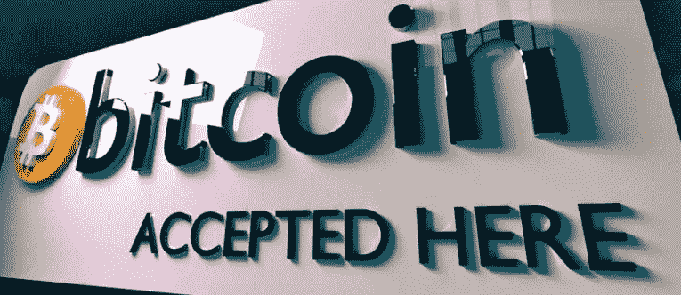
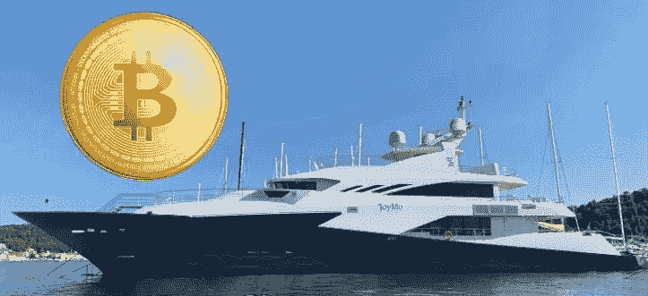

# 嘿，商人，密码持有者花钱大手大脚

> 原文：<https://medium.com/coinmonks/hey-merchants-crypto-holders-are-big-spenders-5ad90d29f915?source=collection_archive---------59----------------------->

上周，我参加了一次 BitPay 炉边聊天，并有机会在本周观看了由 Bitpay 委托进行的弗雷斯特研究，题为“使用 Bitpay 接受比特币的总体经济影响”。BitPay 在记录商户的影响方面具有独特的优势，因为他们目前每年处理 10 亿美元的区块链支付。出于显而易见的原因，我对这个话题很好奇，因为我交谈过的大多数比特币和密码持有者都是投资者/储户，不一定会花掉他们辛苦赚来的密码。

作为该方法的核心，Forrester 审查了四个商家的交易数据。该报告的结论是，如果你正在考虑接受加密作为商品或服务的支付方式，这可能是一个聪明的举动，可以找到新的客户，增加篮子的大小，为你的产品赢得更多的消费者。这项研究立即引起我的注意的是，加密消费者平均比使用传统卡支付的典型客户多花 450 美元，他们不怕麻烦地寻找接受加密支付的企业。

毫不奇怪，比特币是商家整体交易中很大一部分使用的主要加密货币，然而，其他加密货币也引起了人们的兴趣并得到了使用。每笔交易的范围在 100 美元到 5000 美元之间，这对商家来说是个好消息，因为他们平均还节省了 1.25%的交易费用。更多的花费和更少的费用有什么不喜欢的？商家也免受这些讨厌的退款，因为加密实际上是一种推式支付，而不是拉式支付，所以所有的销售都是最终的。

也有一些非常挥金如土的人:“我能用我的比特币买那艘游艇吗？”

其中一位嘉宾是 Bob Denison，Denison Yachting 的创始人，他迄今为止已经完成了 14 笔比特币交易。还有，在整个交易过程中，这些比特币游艇买家似乎更容易也更快处理。根据 Bob 的说法，一艘新游艇的正常交易时间是 45 天，而比特币游艇的交易时间要快 30%到 40%。如果你正在为你的奢侈品和服务寻找高净值客户，那么你应该认真考虑接受加密。根据 BitPay 的数据，今年迄今为止，他们总交易处理量的 32%是奢侈品(汽车、船只、珠宝等)，这解释了每年$1B 里程碑的原因。

根据该报告，加密持有者更经常购买高价商品是有原因的:近一半的交易是由拥有 5 万美元或更多加密资产的客户进行的。在购买清单上排名靠前的其他热门商品包括食品、游戏和电脑电子产品，超过 50%的人在去年购买过这些商品。服装和旅游的比例略低于 50%。有趣的是，随着密码持有者的人口统计数据的演变，以及交易随着商家的广泛采用而变得更加主流，促进了商品和服务的密码使用，我们将看到这种情况在未来几年如何变化。

目前，在进行研究的美国和英国，它仍然是一个秘密男孩俱乐部，68%的交易由 25-54 岁的男性进行。但我们确实看到了人口变化的迹象，30%的人是女性，另外 30%的人把秘密藏在非保管方式中，比如冷冻钱包。在我看来，非托管持有者更多地代表了加密货币的保守持有者，他们是为了更长期的投资机会。

在这里引用杰弗里·摩尔的话，我们才刚刚开始跨越鸿沟。平均而言，在这个时间点上，商家可能只能看到 2–4%的加密销售交易。当我与认为进入加密货币为时已晚的人交谈时，这一点总是让我窃笑:有 96%以上的加密交易市场尚未进行。虽然最大的加密支付处理商之一的年交易量为 10 亿美元，但我们仍处于加密经济的早期。

祝一切顺利，

吉姆(人名)

> 加入 Coinmonks [电报频道](https://t.me/coincodecap)和 [Youtube 频道](https://www.youtube.com/c/coinmonks/videos)了解加密交易和投资

# 另外，阅读

*   [3 商业评论](/coinmonks/3commas-review-an-excellent-crypto-trading-bot-2020-1313a58bec92) | [Pionex 评论](https://coincodecap.com/pionex-review-exchange-with-crypto-trading-bot) | [Coinrule 评论](/coinmonks/coinrule-review-2021-a-beginner-friendly-crypto-trading-bot-daf0504848ba)
*   [莱杰 vs n rave](/coinmonks/ledger-vs-ngrave-zero-7e40f0c1d694)|[莱杰 nano s vs x](/coinmonks/ledger-nano-s-vs-x-battery-hardware-price-storage-59a6663fe3b0) | [币安评论](/coinmonks/binance-review-ee10d3bf3b6e)
*   [Bybit 交易所评论](/coinmonks/bybit-exchange-review-dbd570019b71) | [Bityard 评论](https://coincodecap.com/bityard-reivew) | [Jet-Bot 评论](https://coincodecap.com/jet-bot-review)
*   [3 commas vs crypto hopper](/coinmonks/3commas-vs-pionex-vs-cryptohopper-best-crypto-bot-6a98d2baa203)|[赚取加密利息](/coinmonks/earn-crypto-interest-b10b810fdda3)
*   最好的比特币[硬件钱包](/coinmonks/hardware-wallets-dfa1211730c6) | [BitBox02 回顾](/coinmonks/bitbox02-review-your-swiss-bitcoin-hardware-wallet-c36c88fff29)