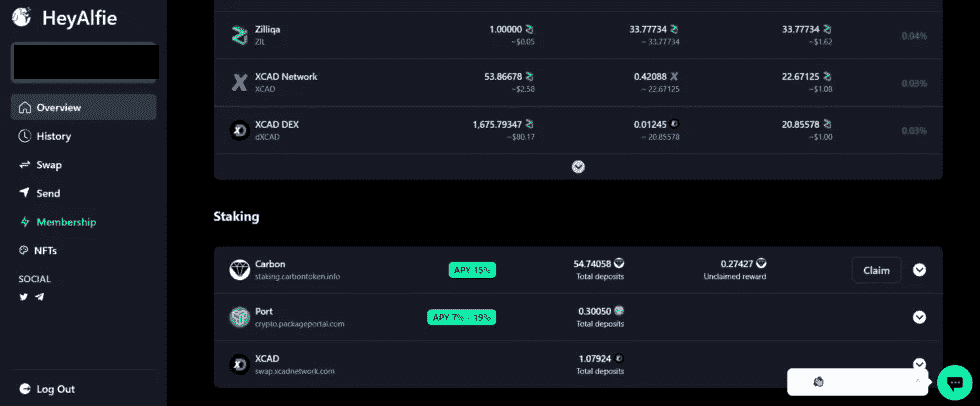

# HeyAlfie 概述

> 原文：<https://medium.com/coinmonks/heyalfie-overview-7c3eec89103e?source=collection_archive---------32----------------------->

作为加密、NFT 和 DeFi 爱好者，在区块链航行是一项挑战。很难简单地买到你想要的硬币(看看你比特币基地)，更不用说进入不同的流动性池，赌注合同和不同链条上的贷款平台。活跃用户需要为多个链创建多个钱包，连接到几个不同的网站，并记得领取他们的奖励。虽然你可能认为你永远不会忘记申领奖励，但这种事经常发生——问问 Zilliqa 区块链的赌注者，gZil 奖励何时结束:有几个没人申领，被永久消灭了。这就是为什么朋友 Moe Tengku、Sam Zulkifli 和 Adam Helmi 创建了 HeyAlfie——一个集中、易于使用的仪表板，以帮助您更好地浏览加密世界。

**赫亚菲是什么？**

目前正在与 Zilliqa 的项目生态系统合作，HeyAlfie 允许用户将多个钱包连接到一个简化的可视化仪表板上，以查看整个投资组合。同样重要的是，一旦用户连接起来，他们就可以从赌注合约和流动性池中获得回报，在多个分散交易所(dex)中增加流动性，查看 NFT，并在一个地方交换令牌。但这些功能对于这个创意群体来说只是个开始。

HeyAlfie’s Dashboard Overview

[HeyAlfie](https://app.heyalfie.io/) 正在通过出售他们的[Alfie NFT](https://app.heyalfie.io/membership)来筹集流动性和资金。然而，阿尔菲·NFT 并不是一个普通的 NFT。拥有一个阿尔菲 NFT 允许用户利用目前可用的优质功能，以及在管道中的功能。HeyAlfie dashboard 目前的功能包括连接多个钱包，连接 Zilliqa 生态系统中的所有分散式应用程序(dApps)，选择多种货币和查看您的交易历史。该团队还在努力整合 staking Alfie NFTs，这是一个易于使用的贷款平台，具有导出功能的完整交易历史，个人资料页面和活动通知。从长远来看，他们希望增加农业奖励警报、钱包损益(P & L)、非永久性损失分析、风险计算器、社交反馈互动、与集中交易所的连接，并创建一个去中心化的自治组织(DAO)。欲了解该团队的完整名单，请访问此链接[此处](https://heyalfie.notion.site/heyalfie/5abcdb59e77642dda5bcd09c9694d8ff?v=ede67ab0cee84259a281b5165ff75e76)。

尽管通过 Zilhive 提供资金，并从 Zilliqa 区块链开始，但 HeyAlfie 计划扩展业务，将新连锁店引入他们的仪表板。允许用户从他们喜爱的 XCAD 和 Zilswap 池，以及诸如 Anchor 和 MMF 等其他池中索赔。首席执行官兼联合创始人 Moe 表示，目前 HeyAlfie 是为“Zilliqa 超级用户”打造的，即大量参与 Zilliqa 生态/社区，但也使用其他链的用户。他们的重点是帮助 Zilliqa 内的社区连接到他们已经使用的其他连锁店。HeyAlfie 的用户也可以放心，他们在申请、添加或交换令牌时不会支付额外的费用。这个函数只是一个契约调用，所以 HeyAlfie 不从事务中获取任何东西。

You can claim staking rewards and DEX rewards right on HeyAlfie’s dashboard.

贷款是 Zilliqa 社区中讨论的一个热门话题，目前有几个不同的项目正在开发中。这些平台对 Zilliqa 生态系统来说非常好，并且需要创造额外的流动性，最终导致更多的活动。赫亚菲正在酝酿一个简单的概念，即从借款人的股份中获取回报，并给予他们即时的流动性，让他们做任何想做的事情，而无需分拆股份。他们只是索取你的赌注回报，而你以 0%的利率投资 Zilliqa 上的其他几个项目。它仍处于开发阶段，但从听起来，这可能是新借款人涉足加密贷款的一个好方法。

联合创始人萨姆说，HeyAlfie 最大的障碍是要跟上 Zilliqa 不断增长的生态系统中的所有新项目。新的 dApps、Dexes 和 NFT 项目正在定期发布。例如，NFT 可以出现在几个不同的市场上，很难一次看到你钱包里所有的 NFT。HeyAlfie 允许你在一个地方看到所有的东西，不管你是从哪个市场买的。如果 dApp 或 NFT 的合同目前不在仪表板上，你可以简单地在他们的[电报聊天](https://t.me/heyalfie_io)中给团队发消息，他们会很快回复你。

HeyAlfie’s NFT viewing dashboard. You can also send NFTs to different wallets via HeyAlfie.

截至今天，HeyAlfie 大约有 24，000 个钱包连接，每天活跃用户约 500 人。随着 eco 的发展和更多连锁店的加入，可以肯定这些数字会攀升。

对于 Zilliqa 的初学者或经验丰富的用户，HeyAlfie 使与生态系统的交互变得简单，并深入了解您的整体投资组合。我建议将你的钱包连接到应用程序，购买一两个阿尔菲 NFT，享受视觉和交互式仪表盘的体验。虽然用于投资和交易的集中仪表板的概念并不新鲜，但在我们都在尽力驾驭的混乱、不断变化的加密世界中，它是一个潜在的游戏改变者。

> 加入 Coinmonks [电报频道](https://t.me/coincodecap)和 [Youtube 频道](https://www.youtube.com/c/coinmonks/videos)了解加密交易和投资

# 另外，阅读

*   [AscendEx Staking](https://coincodecap.com/ascendex-staking)|[Bot Ocean Review](https://coincodecap.com/bot-ocean-review)|[最佳比特币钱包](https://coincodecap.com/bitcoin-wallets-india)
*   [霍比审核](https://coincodecap.com/huobi-review) | [OKEx 保证金交易](https://coincodecap.com/okex-margin-trading) | [期货交易](https://coincodecap.com/futures-trading)
*   [网格交易机器人](https://coincodecap.com/grid-trading) | [Cryptohopper 审查](/coinmonks/cryptohopper-review-a388ff5bae88) | [Bexplus 审查](https://coincodecap.com/bexplus-review)
*   [7 个最佳零费用加密交易平台](https://coincodecap.com/zero-fee-crypto-exchanges)
*   [氹欞侊贸易评论](https://coincodecap.com/anny-trade-review) | [霍比保证金交易](/coinmonks/huobi-margin-trading-b3b06cdc1519)