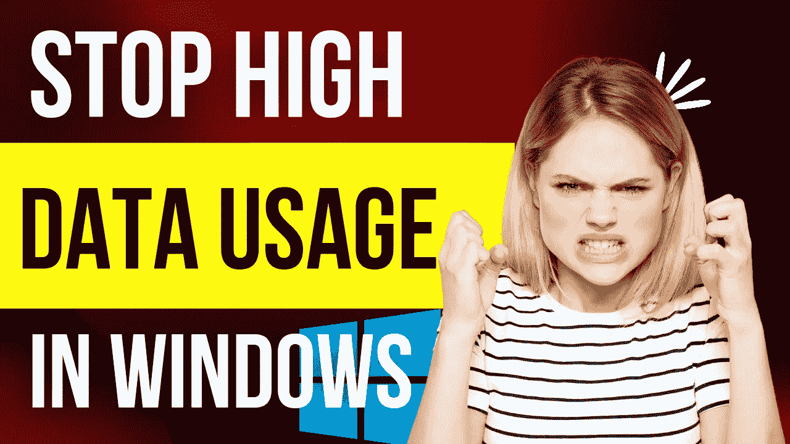

# WINDOWS 10/11 中的高数据使用率:一个完美的解决方案

> 原文：<https://medium.com/coinmonks/high-data-usage-in-windows-10-11-a-perfect-solution-c886c3c0a783?source=collection_archive---------33----------------------->

那么你是一名 Windows 操作系统用户，你一直在向你奶奶抱怨你的笔记本电脑或台式电脑像光速一样消耗你的带宽？事实是，你并不孤单。

Windows 用户最常遇到这个问题，因为在用户不知情的情况下，大量进程在后台运行，导致他们的数据消耗率一直很高。像 Linux/ubuntu 这样的 Windows 版本不会经历这种悲伤的活动。其中一个需要关注的因素是应用程序更新、广告在你不知情的情况下加载，甚至是病毒(最糟糕的情况)。我该如何解决这个问题？尽管 windows 附带了计量连接功能来限制后台数据的使用，但这并不能完全阻止高消耗。还有希望吗？

经过几个月的研究，并试图找出一个更好的和“永久的”解决这个问题的方法，我们 Cryptoruppted 团队已经设法解决了这个问题，我们为你制作了一个简明的视频教程，以及你可能需要在描述中提供的所有链接。

现在观看👉【https://youtu.be/1UJLfcgtK4I 号

无论你面临什么样的挑战，你都可以把它们放在评论区，这样你就可以快速解决问题了！

此外，当你关注和解决这个大问题时，通过喜欢和订阅我们的频道来帮助我们接触更多的人。

Cryptoruppted 是一个由对 web3 和技术充满热情的年轻人组成的团队。我们将为您带来最新的加密和技术教程，这将使您在设备上的体验鼓舞人心而不累。与 CRYPTORUPPTED:[YOUTUBE](https://youtube.com/channel/UCpfNrZ6rS2Upp65iQLW67DA)[TWITTER](https://twitter.com/cryptoruppted?t=4ub4-ZJ9_wYVU2oRaUVGoA&s=09)[TELEGRAM](https://t.me/cryptoruppted)

> *加入 Coinmonks* [*电报频道*](https://t.me/coincodecap) *和* [*Youtube 频道*](https://www.youtube.com/c/coinmonks/videos) *了解加密交易和投资*

# 另外，阅读

*   [3 商业评论](/coinmonks/3commas-review-an-excellent-crypto-trading-bot-2020-1313a58bec92) | [Pionex 评论](https://coincodecap.com/pionex-review-exchange-with-crypto-trading-bot) | [Coinrule 评论](/coinmonks/coinrule-review-2021-a-beginner-friendly-crypto-trading-bot-daf0504848ba)
*   [莱杰 vs n rave](/coinmonks/ledger-vs-ngrave-zero-7e40f0c1d694)|[莱杰 nano s vs x](/coinmonks/ledger-nano-s-vs-x-battery-hardware-price-storage-59a6663fe3b0) | [币安评论](/coinmonks/binance-review-ee10d3bf3b6e)
*   [Bybit Exchange 审查](/coinmonks/bybit-exchange-review-dbd570019b71) | [Bityard 审查](https://coincodecap.com/bityard-reivew) | [Jet-Bot 审查](https://coincodecap.com/jet-bot-review)
*   [3 commas vs crypto hopper](/coinmonks/3commas-vs-pionex-vs-cryptohopper-best-crypto-bot-6a98d2baa203)|[赚取加密利息](/coinmonks/earn-crypto-interest-b10b810fdda3)
*   最好的比特币[硬件钱包](/coinmonks/hardware-wallets-dfa1211730c6) | [BitBox02 回顾](/coinmonks/bitbox02-review-your-swiss-bitcoin-hardware-wallet-c36c88fff29)
*   [BlockFi vs 摄氏度](/coinmonks/blockfi-vs-celsius-vs-hodlnaut-8a1cc8c26630) | [Hodlnaut 审核](/coinmonks/hodlnaut-review-best-way-to-hodl-is-to-earn-interest-on-your-bitcoin-6658a8c19edf) | [KuCoin 审核](https://coincodecap.com/kucoin-review)