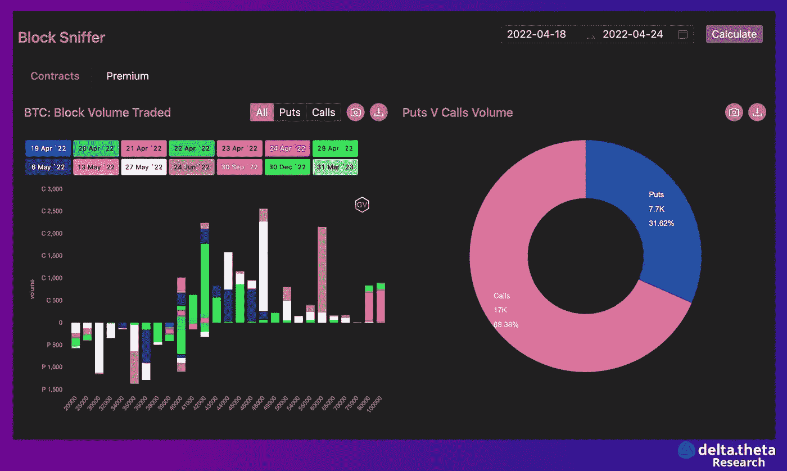

# 高通胀也打击了加密市场

> 原文：<https://medium.com/coinmonks/high-inflation-has-also-hit-the-crypto-market-89bfac96c0a?source=collection_archive---------20----------------------->

4 月 18 日至 25 日的一周是加密市场横盘整理的一周，偶尔会出现短期波动。加密货币总市值指数从 1.86 万亿美元开始，第二天跌至 1.768 万亿美元。到本周中期，出现了复苏，达到了 1.933 万亿美元的局部高点。

然而，到了周末，又出现了下跌，达到了 1.735 万亿美元的第二个局部底部。最新的下跌可能是由于对即将召开的美联储会议的预期，在这次会议上，关键利率有可能上调 0.5 个百分点。

“第一种加密货币”的价格本周也有大致相同的轨迹。比特币在 39 800 水平附近开始，然后在 38 800 找到了“第一个局部底部”。然后，我们可能会看到 42 860 点的上涨，然后在 38 360 点出现“第二次探底”。因此，周末的跌幅为 3.6%，但我们应该指出这一周的强烈波动，这是由市场的高度不确定性造成的。

Etherium 有一个类似的图表，具有典型的“双底”结构，但波动性略低。起点是 2980，之后是 2890 的第一个局部底部。随后上涨至 3170 点，然后在 2800 点附近形成第二个局部底部。进一步的走势将很大程度上取决于价格是否最终在 3000 点以下盘整。

# 新闻

Twitter 即将完成一笔交易，以 465 亿美元的价格将公司出售给埃隆·马斯克。此举将把世界首富与有影响力的社交网络结合在一起。据媒体报道，这笔交易最早可能于周一完成。消息传出后，总督汇率上涨了 9%(有猜测称，这位企业家可能会将加密货币整合到社交网络界面中)。

区块链安全公司 CertiK [在宣布总估值为 20 亿美元的 8800 万美元 B3 系列融资后仅两周，又筹集了 6000 万美元。据该公司首席执行官称，最新一轮融资是由投资者需求驱动的。软银愿景基金和老虎环球是本轮唯一的参与者。这是软银首次投资区块链安全公司。CertiK 的估值在短短三个月内翻了一番，因为加密货币黑客的增加凸显了对安全的需求。](https://www.coindesk.com/business/2022/04/22/certik-closes-60m-round-raises-total-of-148m-in-2-weeks/)

北海巨妖已经成为第一家被许可在阿布扎比运营受监管的数字资产平台的加密交易所。该交易所将允许其全球 800 多万用户直接以迪拉姆投资、交易、融资和提取虚拟资产。此前，币安和 FTX 进入了阿联酋市场。

风险投资巨头安德森·霍洛维茨(Andreessen Horowitz)正在深入加密领域，[推出了一个新的学术实验室](https://www.theblockcrypto.com/post/142869/a16z-crypto-is-launching-an-academic-research-lab-focused-on-web3)，以应对快速发展的数字资产行业面临的研究挑战。A16z Crypto Research 将由著名博弈论专家、斯坦福大学和哥伦比亚大学教授 Tim Roughgarden 领导。他去年被 a16z 聘为研究顾问，现在将接任研究主管。新实验室将专注于识别和解决阻碍加密货币大规模扩散的基础研究问题，并将协助该基金的一些投资组合公司。

# 市场形势

衍生品市场活动正在下降，但仍远高于 2020 年至 2021 年牛市之前的水平。高通胀也影响到了加密市场——平均水平超过 7 %- 8 %,永续比特币期货和季度期货之间 3%的融资利率收益率对投资者不再感兴趣。

尽管市场在短期内波动较大，但从长期来看，波动水平仍在下降。在这种情况下，购买 0.2 delta 的半年度期权可能会很有意思——在最初的再融资加息期之后，央行政策的首批结果可能会在夏季结束时得到评估。如果行动产生积极效果，这一事实可能会成为市场的强劲增长动力。

48 000 个看涨期权和 30 000 个看跌期权的潜在未平仓权益集中度，反映了当前 40 000 水平对比特币的重要性。目前，看跌期权在很大程度上被用作保险，而不是一种定向交易的方法。

过去一周，主要交易活动是月度和季度期权(行权日在 6 月)。48 000 和 60 000 水平的看涨期权的主要交易量是由于本周后半周比特币价格下跌导致溢价降低，以及以比以前更低的价格购买预期波动性的有趣机会而形成的。

在全球范围内，加密货币市场继续处于整合阶段。由于与传统金融市场的高度相关性，交易所的比特币股票正在下降，波动性也在下降，但整体兴趣和流动性水平仍远高于 covid 之前的水平，为未来的增长奠定了潜在的强大基础。

> 加入 Coinmonks [电报频道](https://t.me/coincodecap)和 [Youtube 频道](https://www.youtube.com/c/coinmonks/videos)了解加密交易和投资

# 另外，阅读

*   [OKEx vs KuCoin](https://coincodecap.com/okex-kucoin) | [摄氏替代品](https://coincodecap.com/celsius-alternatives) | [如何购买 VeChain](https://coincodecap.com/buy-vechain)
*   [币安期货交易](https://coincodecap.com/binance-futures-trading)|[3 comas vs Mudrex vs eToro](https://coincodecap.com/mudrex-3commas-etoro)
*   [如何购买 Monero](https://coincodecap.com/buy-monero) | [IDEX 评论](https://coincodecap.com/idex-review) | [BitKan 交易机器人](https://coincodecap.com/bitkan-trading-bot)
*   [CoinDCX 评论](/coinmonks/coindcx-review-8444db3621a2) | [加密保证金交易交易所](https://coincodecap.com/crypto-margin-trading-exchanges)
*   [红狗赌场评论](https://coincodecap.com/red-dog-casino-review) | [Swyftx 评论](https://coincodecap.com/swyftx-review) | [CoinGate 评论](https://coincodecap.com/coingate-review)