# 高概率的交易设置，包括交易时段、初始余额和交易量。-第三部分

> 原文：<https://medium.com/coinmonks/high-probability-scalping-setups-with-sessions-initial-balance-and-session-volume-profile-83af17f0a5a?source=collection_archive---------1----------------------->

这是第 3 部分，也是关于会话、初始余额和交易量概况的系列文章的最后一部分。在这最后一部分，我将一步一步地讲解如何在高概率交易中使用多重汇合。

如果没有看过[往期文章](/coinmonks/understanding-sessions-initial-balance-and-session-volume-profile-for-day-trading-part-2-4ad44ffd4c6b)，就不要看这个；因为，你不会理解这些概念。

## **第一步:**

从一张干净的图表开始

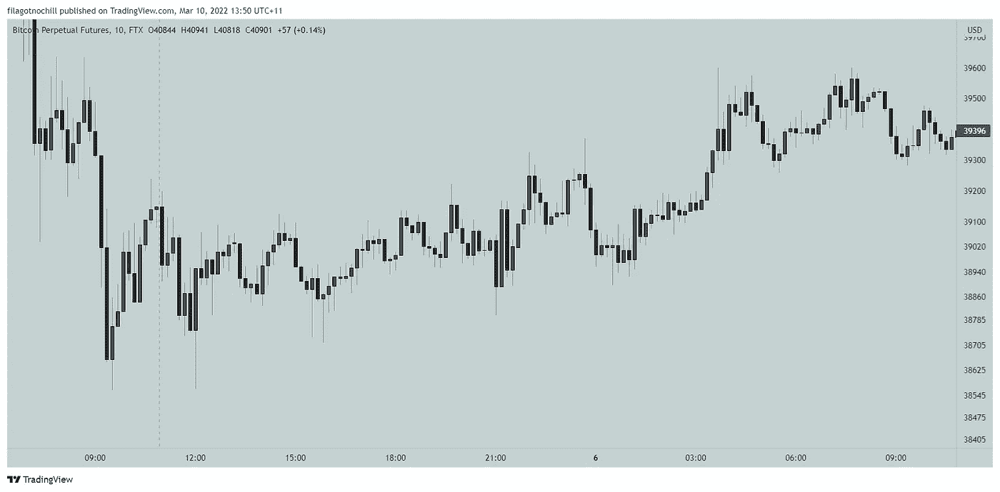

10 min chart BTCPERP on FTX

## **第二步:**

我们需要两个主要指标:

*   [sigma basis 时段高点和低点](https://www.tradingview.com/script/t3NN0tLS-Sigma-Session-High-Lows-Session-Highlights/)—sigma basis 的免费指标
*   固定范围交易量配置文件—交易视图上默认可用的自由指示器

## 可选:

我们使用额外汇合的可选指标。

*   入口和出口的 TD 序列和计数。您可以使用 tradingview 中的任何一个。我用的是[TDS-v . 1.1—ArthaSas 的指标— TradingView](https://www.tradingview.com/script/b5CVAOlF-TDS-V-1-1/) 。看一下说明就知道怎么用了。或者，您可以使用 Sigmabasis 的[适马算法购买/出售体积蜡烛](https://www.tradingview.com/script/NzzKzZEn-Sigma-Algo-Buy-Sell-Volume-Candles/)。
*   [Sigmabasis TWAP(sTWAP)](https://www.tradingview.com/script/HSi76Hut-Sigma-Time-Weighted-Average-Price-sTWAP/)—这是 sigma basis 推出的一个溢价指标。你必须注册或加入 discord(免费)获得 90 天免费访问。下面提供了链接。

*如果您已经知道如何使用 TWAP >* ，请跳到步骤 3

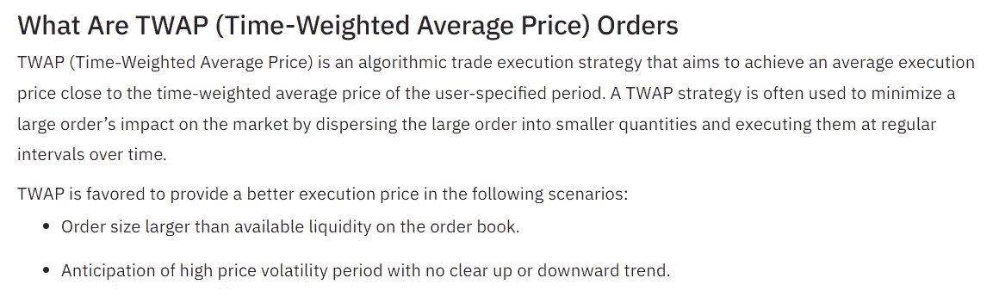

Source: [What Is TWAP (Time-Weighted Average Price) Strategy and How Does It Work | Binance Support](https://www.binance.com/en/support/faq/80655cc54d8a4b2bb8ea097001844fd1)

如何使用 sTWAP 进行日内交易？

将设置更改为以下内容:

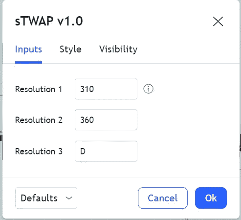

根据我的观察，大型机构在这些时间段执行他们的 TWAP 机器人:每天，6 小时(360)，5 小时(310)。价格高于 TWAP 水平和线，看涨。价格低于 TWAP 水平，线看跌。

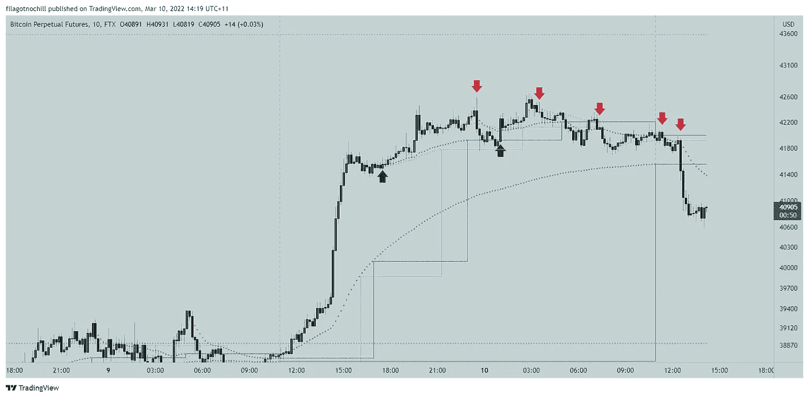

Institutional Selling on each TWAP session

## **第三步:**

在干净的图表上添加 sHL:

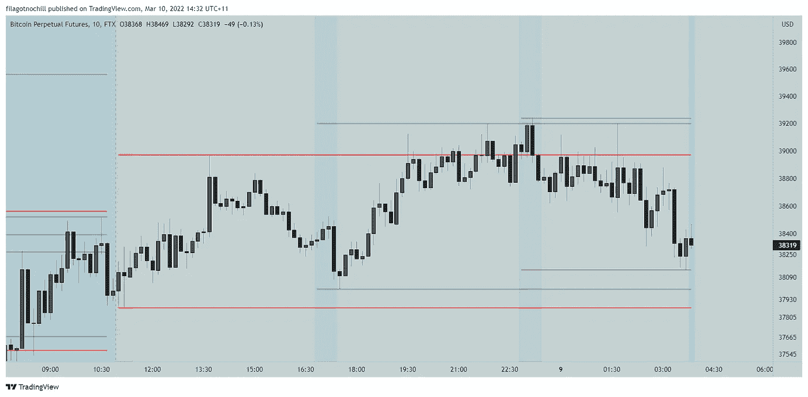

You will have something like this

现在添加初始余额(每个时段的开盘价)，我用的是 10 分钟图表。

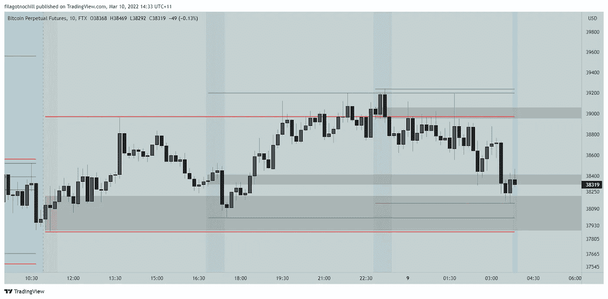

It will look like this

## **第四步:**

现在添加固定范围体积轮廓:

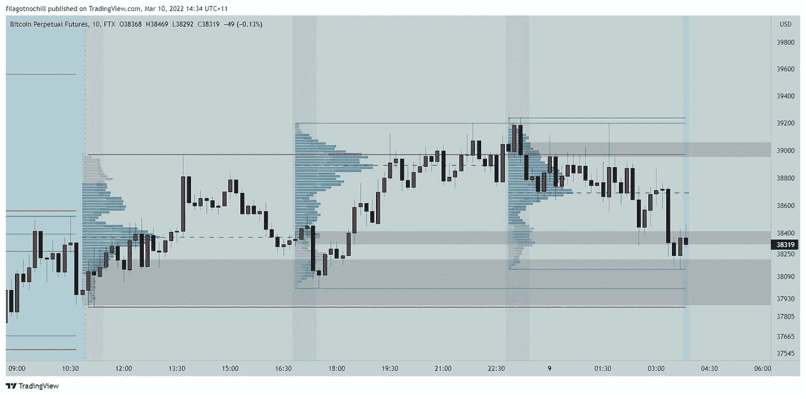

Start of the aftermarket session. I added the fixed range volume profile from session open to open. I explained this on the previous article.

## 第五步:

我们的设置现在已经完成。根据设置，我们将寻找条目并形成我们的偏见。

**在这个时间点上，从上一期(美国)到上一期(亚洲)我看到了什么？**

*   价格处于亚洲的控制点(POC ),并从亚洲的初始余额(IB)反弹
*   价格在美国市场处于低位。
*   价格处于伦敦的价值区低点(VAL ),并从伦敦的 IB 反弹。

让我们观察下一根蜡烛会发生什么？

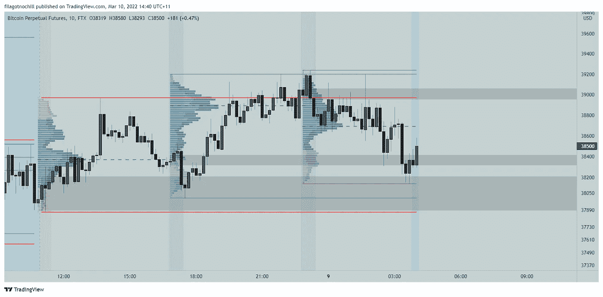

**什么变了？**

*   价格高于伦敦 IB。
*   价格反弹超过亚洲的 POC。
*   进入美国价值区(VA)的价格

**我有什么偏见？**

*   基于上述综合因素，我认为价格极有可能吸收美国 IB 的流动性(以灰色方框突出显示)
*   因此，我采取了一个有限的长期进入

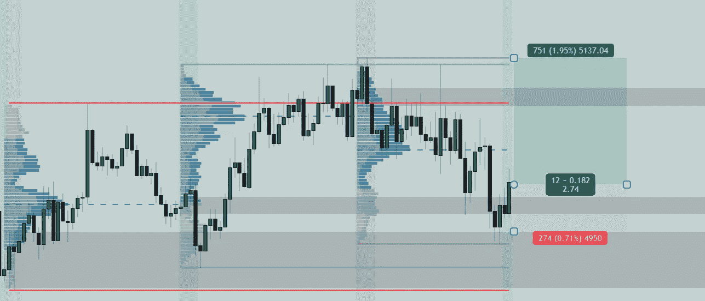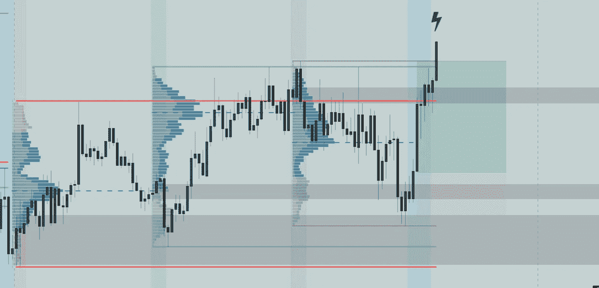

turns out I was right on this trade

让我们使用可选指标(sTWAP 和 TD)来看看发生了什么。如果您使用 tradingview pro，您可以将屏幕分成两个图表。一个用于主设置，另一个用于次级汇流。

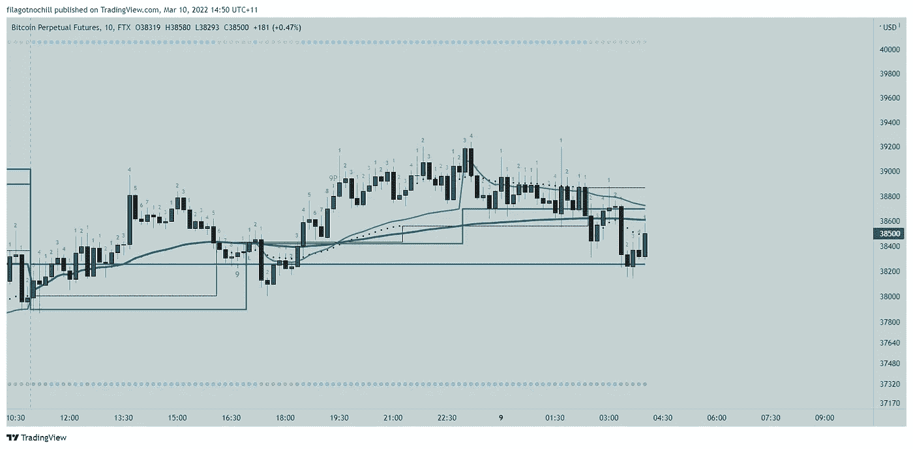

蓝色水平=每日

绿色= 360 (6 小时)

黑色= 310 (5 小时)

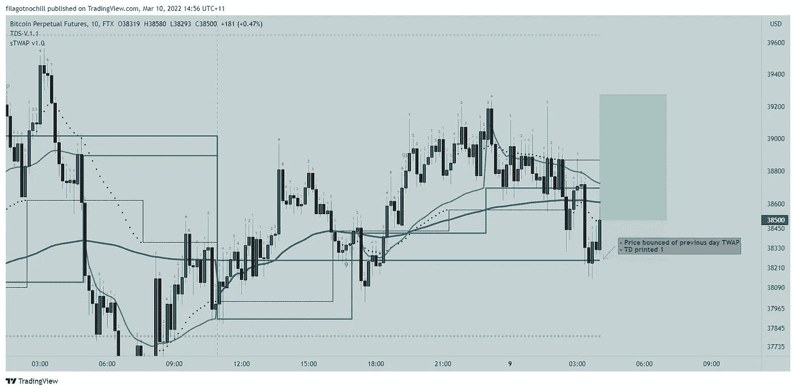

*   价格从 TWAP 前一日水平反弹
*   TD 打印 1。我用 TD 在它印 1 的时候买入，在它印 7、8、9 的时候拿掉一些利润。

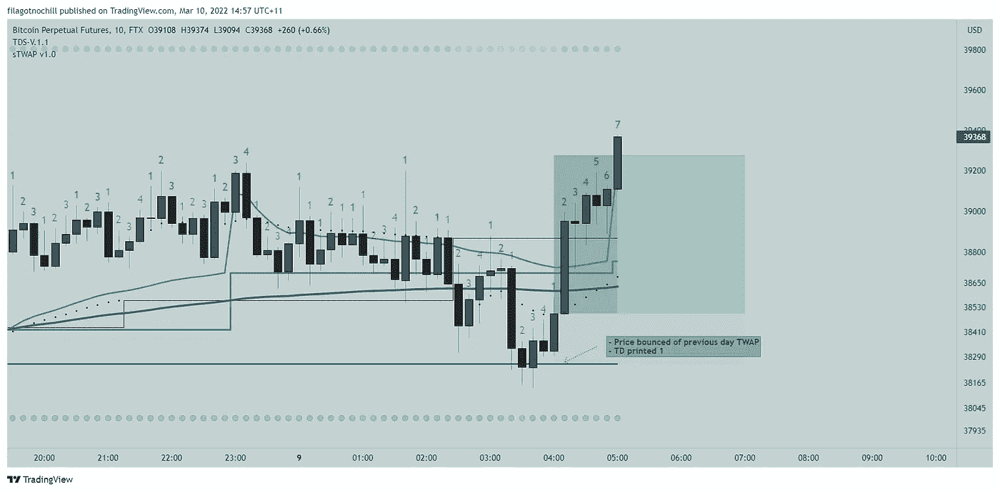

TD printed 7, close the trade or sell 70%

这都是关于我的计划。

这可能看起来有很多事情要做。然而，当你训练好你的眼睛，并一次又一次地练习这个方法时，它就变得再容易不过了。自信的话连二次设置都不看。这给了我优势。您可以使用此设置进行任何加密货币、差价合约、外汇或股票的日间交易。

**关于交易心理的一些话:**

当然，我可以灵活地说，通过这种策略，我的客户增长了 10 倍，成功率为 70%。但是你的结果会和我的一样吗？不要！

两个词定义你的交易表现:**恐惧和希望**

> “在我们应该**恐惧**的时候，我们**充满希望**，在我们应该**恐惧**的时候，我们**充满希望**。”—汤姆·豪加德

即使这种情况出现，你知道这即将发生，你也不会交易，因为你害怕。

如果交易对你不利，你不会平仓，因为你是**有希望的**，它将会反弹(即使故事已经改变)。相反，你会通过增加亏损来平均你的亏损。

此外，如果它上涨并回撤一点点，你会担心它会回来并带走你所有的利润。再次恐惧！所以你把止损设在进场附近。接下来会发生什么，你的止损只需要满足你的目标。 ***你没有加仓，而是想着移动止损。***

评级结果来自情绪化和个人化的交易管理。

交易时消除所有的情绪。像人工智能一样交易。提高你的反应时间。用这个:[***【echalk.co.uk】战斗机飞行员挑战赛***](https://www.echalk.co.uk/amusements/Games/pilotTrainer/pilotTrainer.html)

作为日内交易者，你需要遵守纪律，每天同一时间坐在桌子上，观察每根蜡烛线。我每天只交易 7 个小时，从交易后市场开始；都是头皮交易。

如果我使用 10 分钟图表，我必须观察 42 根蜡烛，如果我使用 5 分钟图表，我必须观察 84 根蜡烛。你认为作为一个日内交易者，你必须 24/7 都呆在图表上。不你不知道。通过控制我的时间，我可以享受生活中的其他事情，平静地交易。

***感谢阅读。适马交易快乐！***

# **获得 90 天免费使用 Sigmabasis 指标:**

*   [sigmabasis.com](https://www.sigmabasis.com/)

# 加入 discord 以获得访问权限:

*   [https://discord.gg/utR9wysjEV](https://discord.gg/utR9wysjEV)

# 在 twitter 上关注 Sigmabasis:

*   [Sigmabasis (@sigmabasis) /推特](https://twitter.com/sigmabasis)