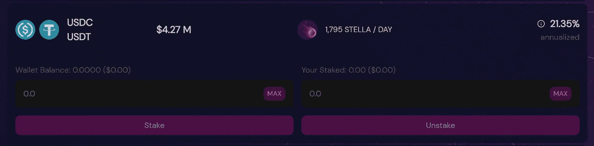
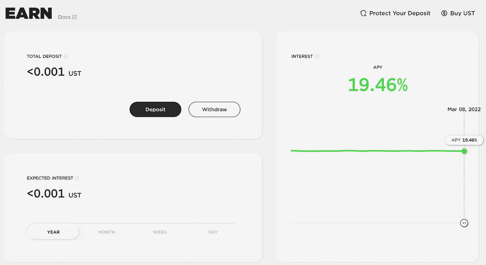
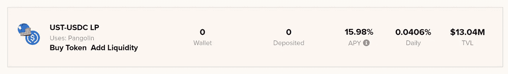
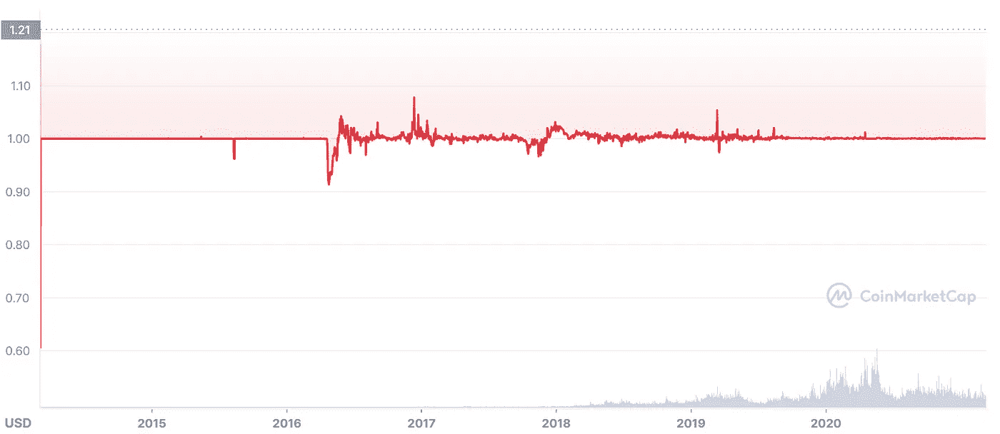

# 比特币下跌，稳定币上涨

> 原文：<https://medium.com/coinmonks/high-yields-during-the-bear-market-2196029ccc70?source=collection_archive---------57----------------------->

年初至今，比特币-18.68%，以太坊-31.58%，索拉纳-50.84%。我相信你已经听过很多人说*“比特币是个骗局”、“我告诉过你了”和“现在是熊市吗？”*

如果我告诉你，在这个动荡的市场中，有一种方法可以产生高收益，会怎么样？！

**欢迎来到 stablecoin 农场！**

稳定的硬币赌注是产生收益而不被市场波动**动摇**的最佳方式！

这基本上是一种策略，随着时间的推移，帮助你增加购买力，这样你就可以利用下跌或随着时间的推移增加投资。

什么是稳定币？

*稳定币是一种与美元或黄金等“稳定”储备资产挂钩的数字货币。Stablecoins 旨在降低相对于比特币等非挂钩加密货币的波动性。*——比特币基地

简单来说:这是美元的加密版本。

我可以在哪里下注？

1.  Stella Swap 是 Moonbeam parachain 网络的首批自动做市商(AMM)、分散式交易所(DEX)之一。也就是说，我们将前往 [Stella Swap](https://app.stellaswap.com/farm?filter=stables) ，你将能够产生高达 21.35%的收益率。

[Stella Swap](https://app.stellaswap.com/farm?filter=stables)

下面这条推文展示了从 A-Z 到 how to 的指示:

2. [Anchor Protocol](https://app.anchorprotocol.com/earn) 是一种分散式储蓄协议，为稳定的土地货币存款提供低波动收益。其发行利率稳定在 19.54%。锚定利率由来自主要区块链的多元化赌注回报流驱动，因此可以预期比货币市场利率稳定得多。

[Anchor Protocol](https://app.anchorprotocol.com/earn)

以下是如何在锚定协议中投入你的$UST 的一步一步的过程:

3. [Beefy Finance](https://app.beefy.finance/#/avax) 是一个去中心化的多链收益优化平台，允许其用户从他们的加密资产中赚取复利。不是最好的，但你会赚到不错的 15.98%。

**酷豆，现在有什么收获？**

稳定货币的风险是货币脱钩，其中一种货币的汇率上升或下降，导致流动性池(Lp)失去其价值。

[$USDT peg](https://coinmarketcap.com/currencies/tether/)

像互联网上的许多事情一样，也有违反智能合同或简单地说黑客攻击的可能性。如果黑客设法侵入协议，将没有办法收回你的资产和资金。

