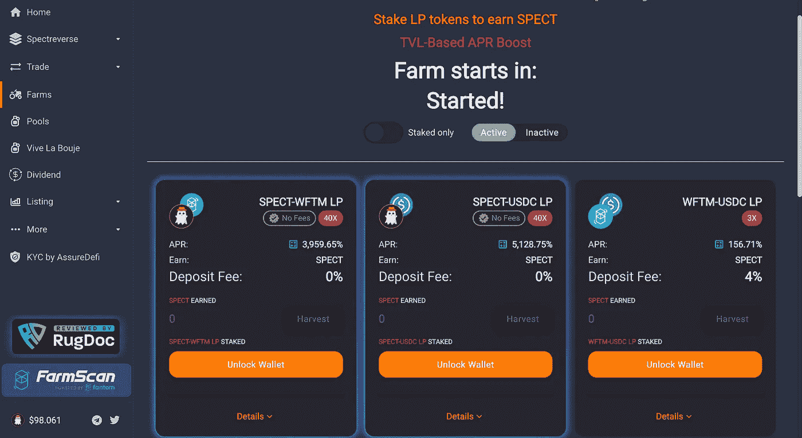

# 加密货币的高收益——解释

> 原文：<https://medium.com/coinmonks/high-yields-in-cryptocurrency-explained-a3c494824038?source=collection_archive---------23----------------------->

一旦你尝到了加密货币过山车般的波动性，你可能会开始寻找一种确保稳定回报的方法，而不用经历交易中的疯狂起伏。因此，投资加密资产的收益对投资者来说极具吸引力。

无需打开分散的钱包，您可以通过在各种平台上押注您的加密货币来获得高收益。例如，提供加密借贷服务的领先机构之一 BlockFi 现在为押注美元提供高达 [9.25%](https://blockfi.com/rates) 的 APYs(每月复利)收益率。

相比之下，将美元存入美国银行账户的回报率仍低于 0.5%。在通货膨胀达到 40 年来的最高水平，1 月份的消费者价格指数(CPI)同比飙升至 7.5%的时候，将钱存入传统的储蓄账户自然会稀释一个人的购买力。

在分散融资(DeFi)中，收益率有时可能令人瞠目结舌。最引人注目的赚取收益率的方式被称为*流动性挖掘*，一些新兴的分散协议提供高达 1000%甚至 10000%的 APYs。

据推测，你可以通过简单地将一对代币——通常由一个新铸造的代币和一个主流代币组成，如 ETH、DOT、USDC——存入一个流动性池一年左右的时间，获得 10 倍或 100 倍的资金。

这看起来好得难以置信，对吧？

在我们深入研究加密产生的高收益之前，我们可能必须首先了解收益在传统金融中是如何工作的。

## 什么是屈服？

根据 [Investopedia](https://www.investopedia.com/ask/answers/09/difference-between-yields-and-interest-rate.asp#:~:text=Yield%20is%20the%20annual%20net,the%20time%20they%20are%20issued.) ，y*field 是指投资者从股票或债券等投资中获得的回报。获得收益的最常见方式可能来自美国政府发行的国债，这被认为是无风险的——因为它们得到了美国政府的完全信任和信用支持，美国政府从未拖欠过债务*

如今，10 年期美国国债收益率约为 1.92%，这意味着如果你在美国国债上投资 100 美元，你将获得 101.92 美元的回报。投资者每六个月获得利息，到期时获得面值。

收益率几乎总是随着债券需求的变化而变化。这是因为债券价格与收益率成反比:当需求高，国债价格上涨时，收益率下降——相反，当需求低，国债价格下跌，收益率上升。

10 年期美国国债收益率是一个重要的经济基准。它通常受到多种因素的影响，如市场状况、整体经济实力，以及最重要的是美联储设定的基准利率。随着经济增长，利率往往会上升，因此借钱需要更高的成本，所以股票往往会下跌。投资者选择追逐“无风险”资产，比如 10 年期美国国债。

例如，由于疫情的爆发，收益率在 2020 年 3 月 9 日暴跌至 0.54%的历史低点；近两年后，由于预计美联储将在 2022 年至少加息四次，收益率因此飙升，目前在 1.9% — 2%之间浮动。

当加密冬天开始时，对稳定硬币的需求上升，投资者回避高风险资产，如替代硬币。随着投资者远离杠杆交易，不太稳定的货币被借入以换取渴望的 BTC 和其他加密货币，稳定货币的借贷收益率相应下降。

## 加密产量

如今，大多数加密公司就像数字资产的银行一样运作。他们为客户提供数字钱包、加密储蓄账户以及借贷加密货币等服务。

Celsius Network 是一家加密贷款公司，其管理的资产去年翻了两番，达到 250 亿英镑，为收购 Synthetix Network 的标志 SNX 提供了高达 17.85%的收益率。在它的平台上投资 USDT 或 USDC 这样的稳定资本可以让你获得超过 10%的收益；BTC 和瑞士联邦理工学院的收益率可能仍在 4%至 5%左右。Celsius 支付 CEL(Celsius 的本地代币)或 staked 代币的收益率，前者的回报率要高得多。

2 月初，BlockFi 支付了总计 1 亿美元，以解决与 SEC 和美国各州之间关于“[出售未注册证券](https://www.bloomberg.com/news/articles/2022-02-12/blockfi-to-pay-100-million-to-sec-states-over-crypto-lending)的纠纷。监管机构指控 BlockFi 提供未注册的产品，为出借数字资产的客户支付高收益。

根据与监管机构的协议，BlockFi 将停止接受新的美国客户的收益账户。与此同时，该公司为其商业行为辩护，声称可以提供高利息回报，因为机构投资者继续以更高的利率从他们那里借入资产。

加密货币是否应该被视为证券继续引起争议，因为越来越多的企业试图被构造为加密银行。对加密公司提供高收益的担忧不止于此。

当被问及 Celsius 如何通过为投资者提供高收益率，不仅击败传统银行，还击败其他金融科技巨头时，Celsius 的创始人兼首席执行官 Alex Mashinsky[在多个场合评论说](https://www.youtube.com/watch?v=DJPogJVkQUE&ab_channel=KitcoNEWS)该公司出租数字资产以影响交易者，并从赌注和贷款之间的利息差中获利。

他进一步解释道，银行之所以向客户提供如此低的利息，是因为他们一直在敲客户的竹杠。基本上，他认为 Clesius 是一个游戏规则改变者，主要是因为该公司优先考虑其客户，而不是其利润率。

然而，最近彭博[的一篇文章](https://www.bloomberg.com/news/articles/2022-01-27/celsius-s-18-yields-on-crypto-are-tempting-and-drawing-scrutiny)通过该公司一名前雇员的消息来源透露，“Celsius 通过 DeFi 协议投资了数亿美元的客户资金”。Celsius 去年 12 月承认，该公司在一次 DeFi 黑客攻击中损失了 5400 万美元，但用户资产没有受到影响。

加密公司能够为存放的资产提供两位数的收益率，可能是因为缺乏透明度和监管方面的相对宽松。不过，归根结底，这完全取决于一个人为了获得高回报可以承受多大的风险。有人可能会问:如果这是加密公司赚取高收益的方式，为什么不直接把钱存入 DeFi 协议呢？

## DeFi 中的产量

Defi 是掘金的狂野西部，是赚大钱的地方。如果你不幸得到了[地毯](https://coinmarketcap.com/alexandria/glossary/rug-pull)，你可能会失去高产农业的一切。或者，当你成为未知池的早期流动性提供者时，你可以在几小时内将你的头寸翻倍。

高风险，高回报。

基本上，有三种方法可以通过 DeFi 获得收益。

1.  *借贷。*

人们向你支付利息，借你的密码进行他们自己的杠杆投资。这可以通过 AAve、Compound 等协议来实现。你可以像在中央加密公司那样存钱。不过，区别在于没有从息差中获利的中介机构。你通过将资产借给其他 DeFi 用户来赚取收益。

*2。打桩。*

这是一种激励机制，由 Ethereum、Olympus 和 Terra 等利益证明网络实施，以验证交易和确保网络稳定性。在区块链上下注一定数量代币的用户有资格成为“验证者”,验证每一笔交易。作为回报，他们赚取交易费，作为他们在区块链下注的同类令牌的奖励。本质上，硬币所有者提供他们的硬币作为验证块的机会的抵押品。

To be a validator of the Ethereum Blockchain requires a minimal holding of 32 ETH

*3。高产农业*。

这是赚取或损失最大收益的地方。[正如我之前所写的](https://medium.com/p/ee937c51fd61/edit)，在 AMM(自主做市商)模式下，流动性提供者将一对代币放在特定的资金池中，以赚取交易费用。奖励由其中一个赌注代币支付。

通常，由主流代币组成的对得到的奖励比其他新发行的代币少得多。流动性挖掘是代币发行者奖励任何愿意持有新发行代币的人的重要方式。

例如， [SPECTREFI](https://spectrefi.com/) ，一个建立在 Fantom 网络上的农场，有它的原生令牌 SPECT，可供挖掘。截至发稿时，SPECT token 的最大供应量为 3000 个，其中只有 50 个是初始供应量。市场上只有不到 2%的代币。

然而，总锁定价值已经上升到超过 116 万，这意味着许多人愿意提供流动性并以 SPECT 代币获得奖励。

为什么？因为他们 1)相信代币的价值会上升，2)资金池的年利率非常高。

所以……当平台通过铸造大量代币来制造炒作，从而抛出疯狂的年利率时，年利率最终跟不上供应激增导致的大规模通胀，代币迅速贬值。

如果一个人将同等价值的 Fantom Token 和 SPECT Token——作为流动性对——存入资金池一年，他可以获得近 4000%的收益率。太疯狂了，对吧？粗略的是，尽管存款费用为 0%,但人们必须承担 SPECT 大幅贬值和高额非永久性损失的风险。由于本地令牌的初始供应量仅占总供应量的 0.06%，因此存在巨大的不确定性。

此外，地毯拉是产量农业的一个主要风险。任何人只需调整几行代码就可以创建一个农场，其产量以本地令牌的形式给出。所以，他也可以通过关闭整个农场来窃取你所有的存款。由于对未知实体的信任，你可能会失去你所拥有的一切。

每当你看到一个平台提供巨大的年利率，一旦销售奖励的重量超过对代币的需求，代币的价值就可能急剧下降。因此，游戏计划是不断让新的人进入淘金热，直到炒作变得不可持续。然后价格下跌可能是真正的灾难性的，你会看到代币在几个小时内损失 99%的价值。加入这些“农场”的人大多押注于在需求仍可持续时成为早期卖家，而不是成为被抛弃的人。

这听起来像不像你在细价股中经常看到的抽送和抛售计划？是的。它们属于同一个剧本，尽管执行方式不同。

尽管在一些产量农业协议中存在所有类似骗局的性质，但流动性池对于引导新代币的采用至关重要，前提是代币的分发不至于过于激进，以至于超过需求。总体而言，流动性挖掘使代币发行过程民主化，并为任何人提供了铸造、推广和货币化类似于特定项目的原生代币的机会。

## 风险和回报

天下没有免费的午餐，密码空间可能是你发现例外的最后一个地方。

当评估提供有吸引力的年利率的 DeFi 项目时，弄清楚收益率来自哪里是很重要的。重新分配给代币持有者的平台费能维持这么高的收益率吗？如果不是，那么可能是平台故意膨胀代币，希望有更多的人愿意购买，并不断膨胀。

保持警惕，保持谨慎。

> 加入 Coinmonks [电报频道](https://t.me/coincodecap)和 [Youtube 频道](https://www.youtube.com/c/coinmonks/videos)了解加密交易和投资

# 另外，阅读

*   [AscendEx Staking](https://coincodecap.com/ascendex-staking)|[Bot Ocean Review](https://coincodecap.com/bot-ocean-review)|[最佳比特币钱包](https://coincodecap.com/bitcoin-wallets-india)
*   [霍比审核](https://coincodecap.com/huobi-review) | [OKEx 保证金交易](https://coincodecap.com/okex-margin-trading) | [期货交易](https://coincodecap.com/futures-trading)
*   [比特币基地跑马圈地](https://coincodecap.com/coinbase-staking) | [Hotbit 点评](/coinmonks/hotbit-review-cd5bec41dafb) | [KuCoin 点评](https://coincodecap.com/kucoin-review)
*   购买 Dogecoin 的 7 种最佳方式
*   [iTop VPN 审查](https://coincodecap.com/itop-vpn-review) | [曼陀罗交易所审查](https://coincodecap.com/mandala-exchange-review)
*   [比特币基地 vs 瓦济克斯](https://coincodecap.com/coinbase-vs-wazirx) | [比特鲁点评](https://coincodecap.com/bitrue-review) | [波洛涅克斯 vs 比特鲁](https://coincodecap.com/poloniex-vs-bittrex)
*   [美国最佳加密交易机器人](https://coincodecap.com/crypto-trading-bots-in-the-us) | [经常性评论](https://coincodecap.com/changelly-review)
*   [A-Ads 审查](https://coincodecap.com/a-ads-review) | [Bingbon 审查](https://coincodecap.com/bingbon-review) | [Mudrex 投资](https://coincodecap.com/mudrex-invest-review-the-best-way-to-invest-in-crypto)
*   [瓦济里克斯 NFT 评论](https://coincodecap.com/wazirx-nft-review)|[Bitsgap vs Pionex](https://coincodecap.com/bitsgap-vs-pionex)|[坦吉姆评论](https://coincodecap.com/tangem-wallet-review)
*   [如何使用 Solidity 在以太坊上创建 DApp？](https://coincodecap.com/create-a-dapp-on-ethereum-using-solidity)