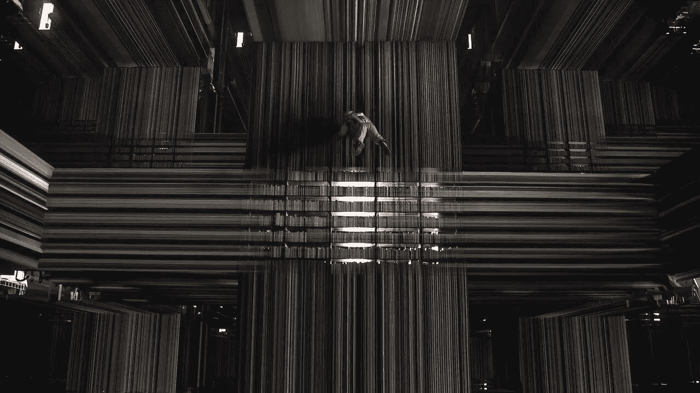
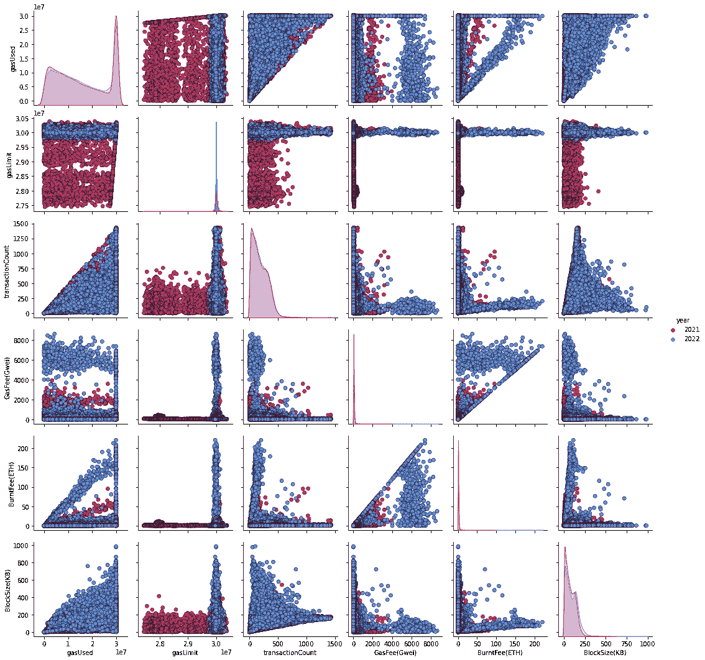
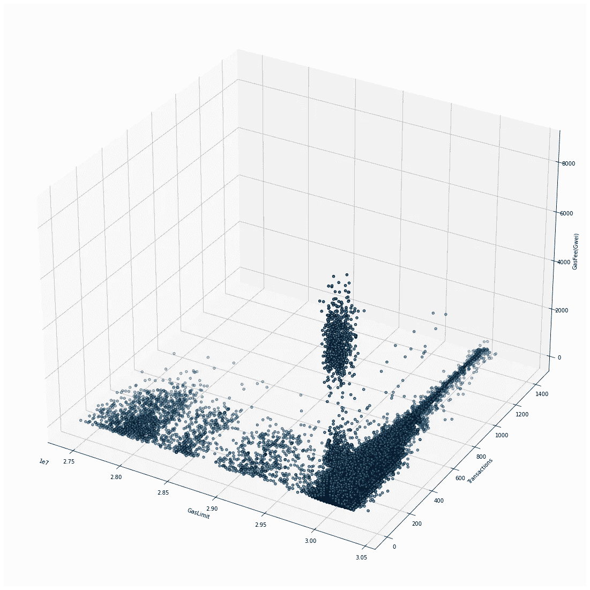
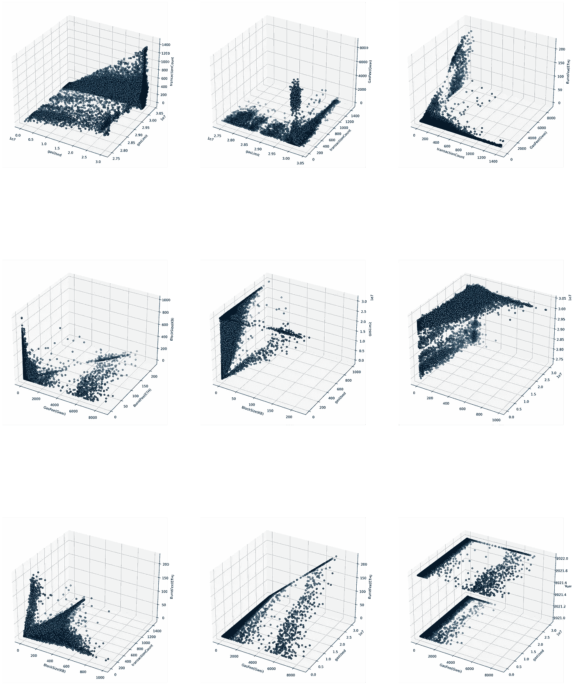
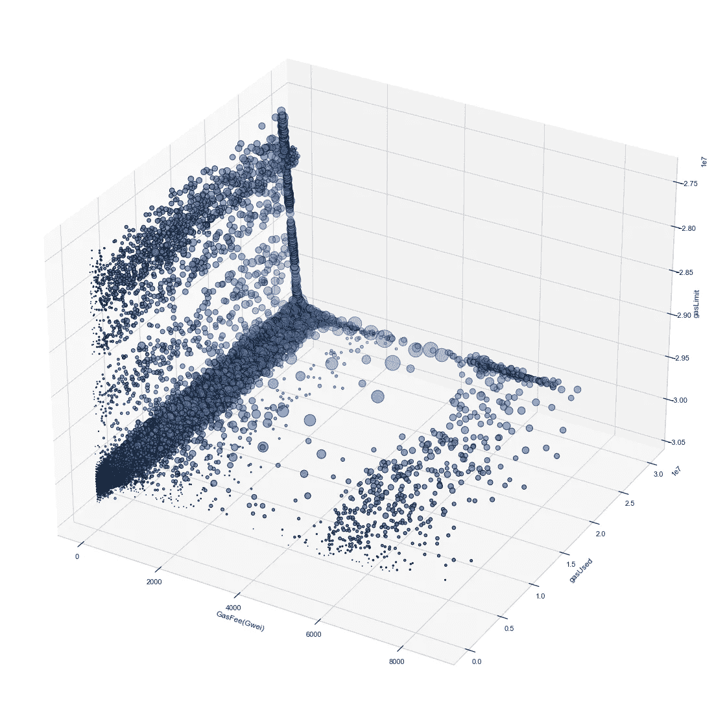
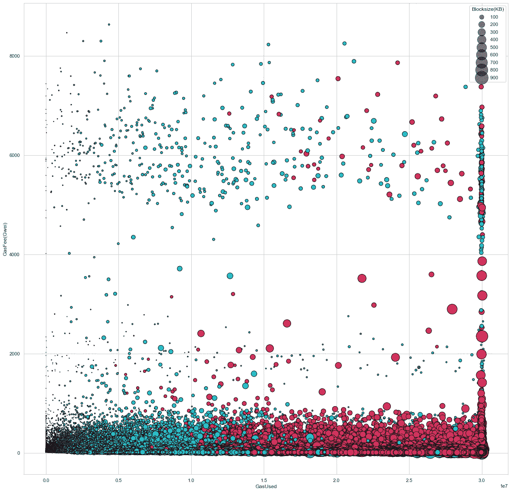
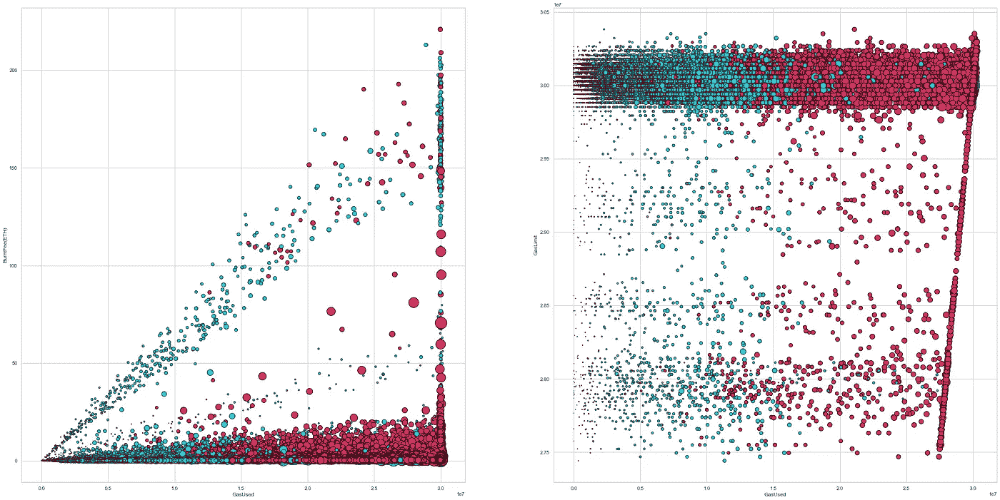
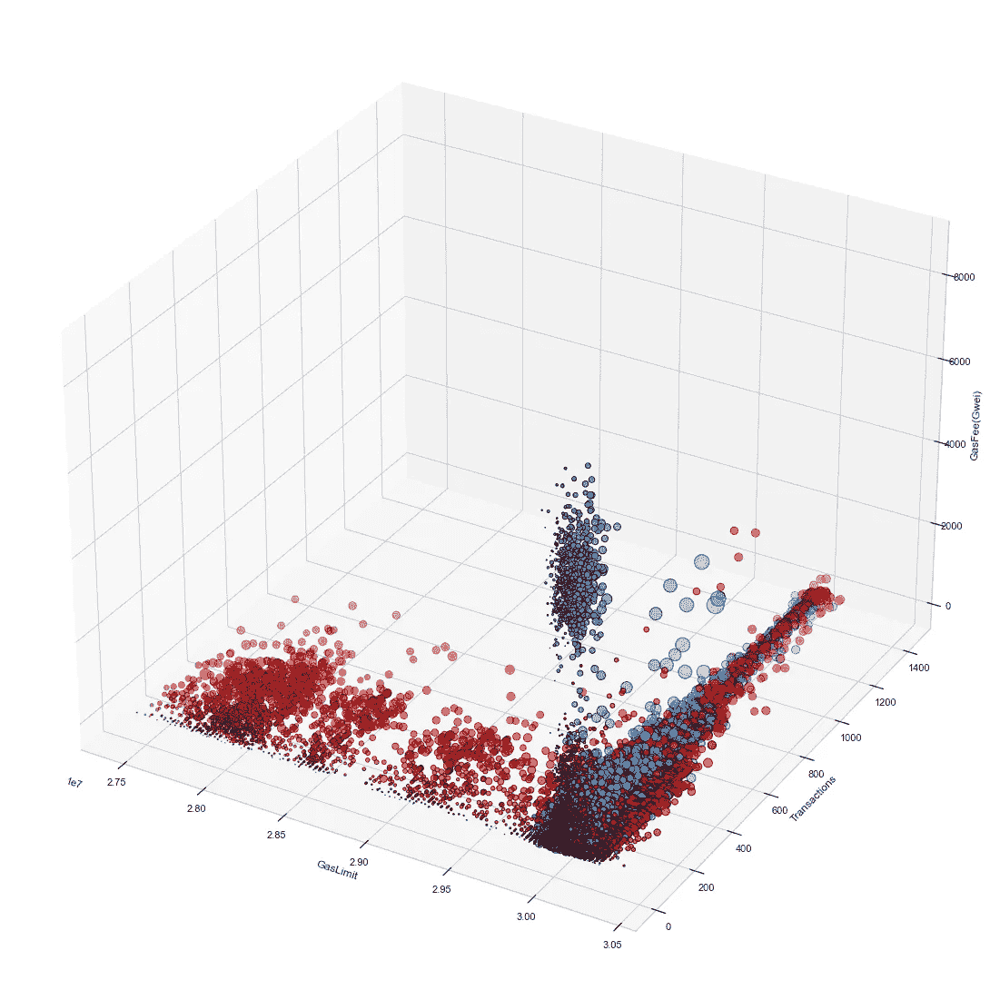

# 高维分析—以太坊区块链第一层

> 原文：<https://medium.com/coinmonks/higher-dimensional-analysis-ethereum-blockchain-layer-1-4a5b0d9fe28a?source=collection_archive---------53----------------------->

## *mainnet 块数据的多维可视化*

Iconic scene from the movie Interstellar — 5D moment

从洞穴壁画、统计手绘板和地图到现代交互式数据可视化，人们已经走过了漫长的道路。进步是渐进的，在过去的几十年里呈指数级增长。
早期的目的是交流，或者用一种比随机数字和文本更有意义的方式让复杂的东西在视觉上可以理解，现在它仍然服务于这个目的。如今，我们在医学、汽车、太空中使用先进的信息图表，而最新的元宇宙则超越了疯狂。但是，核心仍然是从一个角度去理解一些事情。

我们已经在 EIP-1559 分析(参考文献中的链接)中看到，在一维和二维视图中，开采区块的不同特性或特征如何确定单个参数如何随时间变化，其出现的时间(频率)及其范围和分布，基本上是以基本的统计方式。现在，我们站在更高的高度，从不同的角度看待事物。这是为了看到提取见解的不同方法，而不是确定信息本身。

> 三维可视化

**离散或分类的第三维:**

Fig1: Scatter Plot with 3rd dimension(categorical) varying with hue

上面的图显示了由第三个因素区分的任何两个特征之间的关系(这通常是具有有限可能值的分类)。在这种情况下，我使用时间(年)作为第三维度，我们可以在采样数据上看到 2021 年和 2022 年的数据差异。

在这几个次要情节中，我们可以清楚地看到 2021 年数据在整个范围内的广泛分布，以及 2022 年集中在特定缩小点的数据。而其余的似乎与公共数据点重叠。

***连续第三维度:***

沿着长度、宽度和深度的经典 3 点投影(x，y，z)将为我们提供所有三个特征相互之间的视图，并且确定任何聚类组的机会可能会增加。

Fig2: 3D projected Scatter Plot (20x20)

这是一个 3d 投影散点图，包含针对整个采样数据绘制的 Gaslimit、Gasfee 和块交易计数。我们可以看到形成的数据簇和气体极限 3.00 附近的数据浓度。在不同的坐标系中使用相同的参数，观点会有所不同，视角可能会改变，但对于一组数据来说，事实总是相同的。

下面我们可以看到多个散点图，这些散点图具有不同的可能特征组合。在某些情况下，我们可以感觉到三维投影的局限性，我们无法清楚地估计 z 轴值或图表底部的高度。一个解决方案是交互式视图。

Fig3: 3D Scatter Plot Matrix

另一种方法是使用第三个参数作为气泡的大小。根据连续值改变大小，将自动对较高的值进行比例调整，但极端的异常值将是一个问题。
密度图也是如此，我们有较高气体费或使用气体的点会在较暗的阴影中，限制基本费用集中在阈值附近会使边界难以确定。

> 在 4D 视觉化

要将下一个参数引入视图，我们需要首先确定其离差和范围的性质，这取决于数据的类型，如连续数据和分类数据。基于这些，我们可以在 3D 散点图中的气泡大小中额外添加该特征，考虑到这些值是广泛多样的，可以很容易地区分。

Fig4: 3D scatter plot with 4rth dimension as size

这是一个三维散点图，气体费(单位 gwei)、使用的气体和气体极限(按反向排序)作为一个 x、y、z 笛卡尔图形，第四维的块大小(单位 KB)随着绘制的气泡大小而变化。在这里，挖掘块的大小是离散的，并且具有最小大小，即使没有事务，这使得它成为以这种方式使用它的完美变量。

Fig5: 2-dimensional Scatter Plot with size and hue as additional dimensions

如果某个特征的可能值有限(大多为 0-9)，则可以很容易地将其作为色调/颜色变量的一种形式包括在内，而连续且更多的数值则是我们在绘图时使用的气泡大小或标记。

Fig6: visible clusters in 4D

上面的图是二维散点图，分别显示了使用的气体与燃烧费(ETH)和气体极限的关系，块尺寸(KB)是根据数据值随气泡尺寸变化的第三维度。第四维将是大于平均值的交易计数和剩余的交易计数的分类划分，随色调/颜色而变化。
此处可以显示数据的聚类，还可以进一步优化，以获得具有特定边界的更好的组。

> 在 5D 视觉化

Fig7: 5D scatter plot

如您之前所见，块大小(KB)是第 4 个维度，第 5 个维度是 gas 相对于平均值的条件值。所有蓝色气泡的用气量都高于平均值，这是从整个取样数据集中计算出来的。对于 6D，我们甚至可以更高，但是渲染该图需要相当多的时间，并且需要更高的计算能力来绘制具有多个特征的所有 400K+行的块数据。

虽然我们可以看到一些集群的形成，但信息是相当普遍和预期的。这一切都归结为明智地使用图中的参数，这些参数应根据数据的性质、类型和格式来确定，这些参数会直接影响可视化，从而影响您从中提取的视觉洞察力。这只是冰山一角，我只是使用采样数据来可视化数据，并查看已经提取的几个参数的任何潜在模式。

企业用例将使用来自数据的洞察力来关注来自 DeFi 交易所/钱包/游戏/智能合同的用户/交易，以确定营销、优化解决方案、筹资计划、AMM 池预测等的类别。

正如我们在市场上看到的，以太坊即将推出所有新的解决方案，尤其是针对扩展的解决方案——乐观汇总、侧链、ZK-汇总、分片技术、渠道等。这极大地影响了以太坊的交易和安全，尽管它们在今天被广泛使用。这种类型的分析将有助于确定这些解决方案的性能或效率，并确定基准，或者可以是一个比较各种特征的框架，以根据业务使用案例选择最佳技术。

## 参考:

 [## EIP-1559 燃气费市场变化分析(EDA):以太坊区块链

### EIP 1559 早在 2019 年 4 月就已提出，并于 2021 年 8 月与相关 EIPs 一起实施，以…

medium.com](/@vteki/eip-1559-gas-fee-market-change-analysis-eda-ethereum-blockchain-66c498dc9f26) 

> *加入 Coinmonks* [*电报频道*](https://t.me/coincodecap) *和* [*Youtube 频道*](https://www.youtube.com/c/coinmonks/videos) *了解加密交易和投资*

# 另外，阅读

*   [Bookmap 评论](https://coincodecap.com/bookmap-review-2021-best-trading-software) | [美国 5 大最佳加密交易所](https://coincodecap.com/crypto-exchange-usa)
*   最佳加密[硬件钱包](/coinmonks/hardware-wallets-dfa1211730c6) | [Bitbns 评论](/coinmonks/bitbns-review-38256a07e161)
*   [新加坡十大最佳加密交易所](https://coincodecap.com/crypto-exchange-in-singapore) | [购买 AXS](https://coincodecap.com/buy-axs-token)
*   [红狗赌场评论](https://coincodecap.com/red-dog-casino-review) | [Swyftx 评论](https://coincodecap.com/swyftx-review) | [CoinGate 评论](https://coincodecap.com/coingate-review)
*   [投资印度的最佳密码](https://coincodecap.com/best-crypto-to-invest-in-india-in-2021)|[WazirX P2P](https://coincodecap.com/wazirx-p2p)|[Hi Dollar Review](https://coincodecap.com/hi-dollar-review)