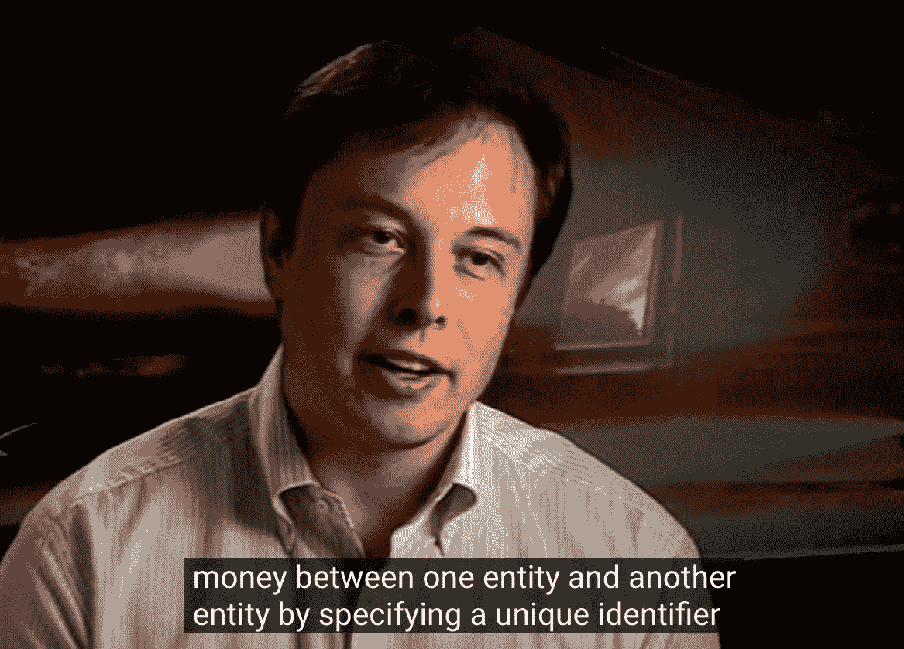
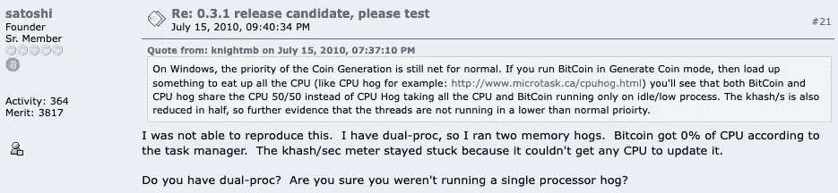
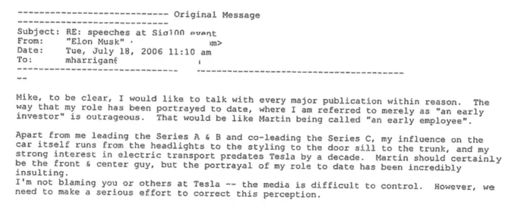

# 中本聪和贝宝联合创始人埃隆·马斯克之间高度具体的共同点

> 原文：<https://medium.com/coinmonks/highly-specific-commonalities-between-satoshi-nakamoto-and-co-founder-of-paypal-elon-musk-4120f36da702?source=collection_archive---------0----------------------->

“It was a way of transferring money between one entity and another entity by specifying a unique identifier, which in this case was an email address.” -Musk on PayPal in 2005, 7:15 [https://www.facebook.com/watch/?v=1151875188973577](https://www.facebook.com/watch/?v=1151875188973577)

# **概述**

*   普通技能
*   常见的语言怪癖
*   通用软件风格
*   公共物理位置和时间可用性
*   共同激励理念

…所有这些都同时成立。

# ***用 C++语言编写生产级软件的能力***

卡明斯基列举了中本聪实现这一目标所需的技能。“他是一名世界级的程序员，对 C++ *编程语言有着深刻的理解，”他说。"他懂经济学、密码学和点对点网络。"
-*[https://www . new Yorker . com/magazine/2011/10/10/the-crypto-currency](https://www.newyorker.com/magazine/2011/10/10/the-crypto-currency)

在 90 年代早期，我为个人电脑编写了一个多任务程序，它欺骗了 CPU cd-r om 来并行操作，所以可以在播放器 sprite 平滑移动的同时连续读取视频。要求***c++****，汇编&直接翻转 CPU 寄存器。那家公司的名字叫火箭科学。命运喜欢讽刺。
-*-[https://twitter.com/elonmusk/status/1005643673353064448](https://twitter.com/elonmusk/status/1005643673353064448)

> 加入 Coinmonks [电报频道](https://t.me/coincodecap)和 [Youtube 频道](https://www.youtube.com/c/coinmonks/videos)了解加密交易和投资

# ***代码被别人描述为‘单片’***

是啊。最初的比特币软件非常的 ***单片*** *。这非常…所有的代码都在一个文件里。每个用户的钱包内容与验证码和共识码有很大的交互。已经好多了。我们已经清理了很多。多年来，比特币核心不同部分之间的分离已经大大改善。
-*[https://hacker noon . com/matt-corallo-on-how-bit coin-works-25a 46 b 547359](https://hackernoon.com/matt-corallo-on-how-bitcoin-works-25a46b547359)

他们看了一眼 Zip2 的代码，开始重写软件的大部分内容。马斯克对他们的一些改变感到恼火，但计算机科学家只需要马斯克用来完成工作的代码行的一小部分。他们有将软件项目分成可以修改和精炼的块的诀窍，而马斯克陷入了典型的自学成才的程序员陷阱，编写开发人员称之为“毛团”的东西——大、 ***单片、*** *大块的代码，这些代码可能会因为神秘的原因而变得疯狂。
-*-[https://www . goodreads . com/quotes/9356850-they-take-one-look-at-zip2-s-code-and-begin-rewriting](https://www.goodreads.com/quotes/9356850-they-took-one-look-at-zip2-s-code-and-began-rewriting)

# ***地点在洛杉矶范奈斯***

*这不是 TOR 出口节点，这意味着这是 Satoshi 在 2009 年 1 月 10 日使用的 IP 地址，他在这一天在****Van Nuys****。
-*[https://whoissatoshi . WordPress . com/2016/02/20/Satoshi-in-California/](https://whoissatoshi.wordpress.com/2016/02/20/satoshi-in-california/)

这架飞机注册在 SpaceX 的一家子公司名下，名为 Falcon Landing，以其可重复使用的火箭命名，联邦航空管理局的记录显示……许多航班从洛杉矶的 ***Van Nuys 机场*** *起飞或降落，距离马斯克拥有五座独立豪宅的贝莱尔托尼街区不远。
-*-[https://www . AFR . com/work-and-careers/management/musks-2018-150000 英里的私人飞机旅行-痛苦的一年-20190130-h1an97](https://www.afr.com/work-and-careers/management/musks-2018-150000-miles-of-private-jet-travel-in-excruciating-year-20190130-h1an97)

# ***一个感觉像“全职员工”的比特币开发者***

*Hanyecz 说，即使他关于比特币的工作是他免费从事的副业项目，中本聪对待他* ***就像他是一名全职员工*** *。“他会说，‘嘿，西区瘫痪了’，或者‘我们有这些问题——我们需要解决这些问题。’
-*[https://www . business insider . com/Satoshi-nakamoto-was-verged-and-bossy-says-bit coin-developer-2018-5](https://www.businessinsider.com/satoshi-nakamoto-was-weird-and-bossy-says-bitcoin-developer-2018-5)

*他称自己为* ***【纳米经理】*** *每周工作约 100 个小时，仍然像他在 2008 年销售第一辆特斯拉跑车之前一样运营着这家汽车制造商。
-*-[https://www . wsj . com/articles/electric-car-pioneer-elon-musk-charges-head-on-at-Detroit-1421033527](https://www.wsj.com/articles/electric-car-pioneer-elon-musk-charges-head-on-at-detroit-1421033527)

# ***2007 年有时间写比特币***

*我相信在过去一年半的时间里，我在编写代码的时候已经处理了所有这些小细节***，而且它们有很多。* -2008 年 11 月 17 日的 Satoshi[https://Satoshi . nakamotoinstitute . org/emails/cryptography/15/# selection-15.0-15.10](https://satoshi.nakamotoinstitute.org/emails/cryptography/15/#selection-15.0-15.10)*

**我每个月大概有 2 到 3 天的时间花在特斯拉相关的业务上，剩下的时间几乎都在 SpaceX 上。* ——2007 年麝香[https://www.youtube.com/watch?v=tqoLRlpROG8&t = 1233s](https://www.youtube.com/watch?v=tqoLRlpROG8&t=1233s)*

# ****【数量级】****

**我认为如果区块链、比特币地址、磁盘空间和带宽需求都比***大一个数量级，那将是不切实际的。***

***RSA 可以做到这两点，但我没有使用它，因为它比***大一个数量级，不切实际。****

***我知道出于竞争的原因，倾向于保密，但如果任何人都可以通过将软件放在服务器上来代理访问他们的国家，它可能会得到更多的使用。***

***如果你只是像我们一样散列一两个块，那么设置缓冲区比实际散列需要多花一个数量级的时间。***

***新的高效单遍算法比* ***快了*** *个数量级。***

**[https://www.google.com/search?q = site % 3A https % 3A % 2F % 2f Satoshi . nakamotoinstitute . org % 2f posts % 2f bitpointalk+% 22 order+of+magnitude % 22](https://www.google.com/search?q=site%3Ahttps%3A%2F%2Fsatoshi.nakamotoinstitute.org%2Fposts%2Fbitcointalk+%22order+of+magnitude%22)**

***100T 美元的全球经济绝大部分是基于化石燃料的，因此国际货币基金组织估计的 5T 美元或 5%的碳补贴是正确的* ***数量级*****

***不要想太多。可能是更少的 F9/FH 航班，但可能比星舰航班中的这些数字多一个* ***数量级*** *。***

***这款发动机的成本需要降低 10 倍。* ***数量级*** *变化是一个新名字的充分理由。***

***当我们的软件能够充分利用特斯拉 FSD 计算机的优势时，改造就会开始，特斯拉 FSD 计算机的能力比特斯拉 FSD 计算机高* ***个数量级*** *。***

***这是没有特斯拉 NN 电脑的情况下。根据我的公开评论，这款车将增加一个数量级***。****

***特斯拉牵引力控制比燃气/柴油***精确一个数量级。****

***方向正确，但天顶是一个* ***数量级*** *比星舰系统&小不回来&降落***

***最接近* ***数量级*** *的火星最小有效载荷的近似值，因此以 10 万美元/吨计算，成本将为 100 亿美元***

***CDC 数字在高保真数据(发病日期已知)和“假定阳性”之间几乎低了一个* ***数量级*** *。***

**[https://twitter.com/search?q = from % 3 aelonmusk % 20 order % 20 of % 20 magnitude&src = typed _ query&f = top](https://twitter.com/search?q=from%3Aelonmusk%20order%20of%20magnitude&src=typed_query&f=top)**

# *****【血腥】*****

***为这个东西写一个描述对于一般观众来说是* ***血腥*** *辛苦。
-*[https://Satoshi . nakamotoinstitute . org/posts/bitcointalk/threads/79/？view=satoshi](https://satoshi.nakamotoinstitute.org/posts/bitcointalk/threads/79/?view=satoshi)**

****见鬼，我要去写博客了。不能把这个放进微博里。
-*-[https://twitter.com/elonmusk/status/943887056492564480](https://twitter.com/elonmusk/status/943887056492564480)***

# *****《色情男》《恋童癖男》*****

**对于那些没有信用卡或不想使用现有信用卡的人来说，比特币会很方便，他们要么不想让配偶看到账单上的数字，要么不放心把自己的号码给 ***【色情男】*** *，或者害怕重复计费。
-*-https://Satoshi . nakamotoinstitute . org/posts/bitcointalk/460/# selection-33.0-33.243**

***不好意思****pedo guy****，你真的是自找的。
-*[https://time . com/5339219/elon-musk-diver-Thai-soccer-team-pedo/](https://time.com/5339219/elon-musk-diver-thai-soccer-team-pedo/)**

# *****写句号后加两个空格*****

****

**[https://bitcointalk.org/index.php?topic=383.msg3295#msg3295](https://bitcointalk.org/index.php?topic=383.msg3295#msg3295)**

****

**[https://i.insider.com/546397d1ecad044756a12570](https://i.insider.com/546397d1ecad044756a12570)**

# *****Visa 信用卡网的具体知识*****

**签证在 2008 财年处理了 370 亿笔交易，即平均每天 1 亿笔交易。
--[https://Satoshi . nakamotoinstitute . org/emails/cryptography/2/# selection-85.208-85.308](https://satoshi.nakamotoinstitute.org/emails/cryptography/2/#selection-85.208-85.308)**

***PayPal 被迫为信用卡转账向 VISA* */MasterCard 支付近 2%的费用，外加支付任何欺诈或拒付费用，总的来说，这大约增加了 1%。
-*[https://www . gawker . com/230076/an-alternate-history-by-elon-musk](https://www.gawker.com/230076/an-alternate-history-according-to-elon-musk)**

# *****对公共领域图形的态度*****

**如果作者可以让他们的图形 ***成为公共领域*** *，那就简单多了。
-*[https://Satoshi . nakamotoinstitute . org/posts/bitcointalk/500/](https://satoshi.nakamotoinstitute.org/posts/bitcointalk/500/)**

**SpaceX 的照片现在可以在知识共享许可下获得。只是把它们全改成了 **-*[【https://twitter.com/elonmusk/status/579210902932574209】](https://twitter.com/elonmusk/status/579210902932574209)***

# *****支付宝的最初设想*****

**许多人不知道这一点，但贝宝的使命是创造一种全球性的货币，这种货币不受这些腐败的银行卡特尔 *和贬低其货币的政府的干扰。我们成功地建立了经济上非常强大的东西，使许多小企业成为可能，我们对此非常自豪，但我们从未实现这个使命。* ——卢克·诺塞克，贝宝
[https://www.youtube.com/watch?v=hOeOzhOxeMU&t = 40s](https://www.youtube.com/watch?v=hOeOzhOxeMU&t=40s)的联合创始人**

> **加入 Coinmonks [电报频道](https://t.me/coincodecap)和 [Youtube 频道](https://www.youtube.com/c/coinmonks/videos)获取每日[加密新闻](http://coincodecap.com/)**

## **另外，阅读**

*   **[复制交易](/coinmonks/top-10-crypto-copy-trading-platforms-for-beginners-d0c37c7d698c) | [加密税务软件](/coinmonks/crypto-tax-software-ed4b4810e338)**
*   **[网格交易](https://coincodecap.com/grid-trading) | [加密硬件钱包](/coinmonks/the-best-cryptocurrency-hardware-wallets-of-2020-e28b1c124069)**
*   **[密码电报信号](http://Top 4 Telegram Channels for Crypto Traders) | [密码交易机器人](/coinmonks/crypto-trading-bot-c2ffce8acb2a)**
*   **[购买比特币印度](/coinmonks/buy-bitcoin-in-india-feb50ddfef94) | [Pionex 评论](/coinmonks/pionex-review-exchange-with-crypto-trading-bot-1e459d0191ea) | [加密交易机器人](/coinmonks/crypto-trading-bot-c2ffce8acb2a)**
*   **[印度加密交易所](/coinmonks/bitcoin-exchange-in-india-7f1fe79715c9) | [比特币储蓄账户](/coinmonks/bitcoin-savings-account-e65b13f92451)**
*   **[Cloudbet 赌场评论](https://coincodecap.com/cloudbet-casino-review) | [点火赌场评论](https://coincodecap.com/ignition-casino-review)**
*   **[币安费](/coinmonks/binance-fees-8588ec17965) | [Botcrypto 评论](/coinmonks/botcrypto-review-2021-build-your-own-trading-bot-coincodecap-6b8332d736c7) | [Hotbit 评论](/coinmonks/hotbit-review-cd5bec41dafb)**
*   **[my constant Review](https://coincodecap.com/myconstant-review)|[8 款最佳摇摆交易机器人](https://coincodecap.com/best-swing-trading-bots)**
*   **[最佳加密交易所](/coinmonks/crypto-exchange-dd2f9d6f3769) | [印度最佳加密交易所](/coinmonks/bitcoin-exchange-in-india-7f1fe79715c9)**
*   **[开发人员的最佳加密 API](/coinmonks/best-crypto-apis-for-developers-5efe3a597a9f)**
*   **最佳[密码借贷平台](/coinmonks/top-5-crypto-lending-platforms-in-2020-that-you-need-to-know-a1b675cec3fa)**
*   **杠杆代币的终极指南**