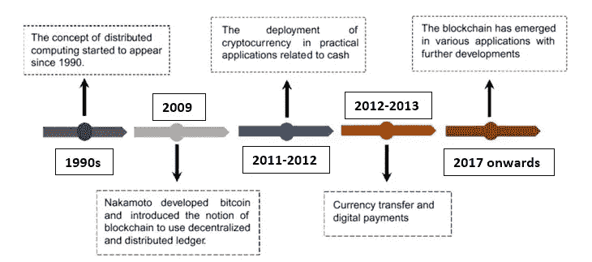
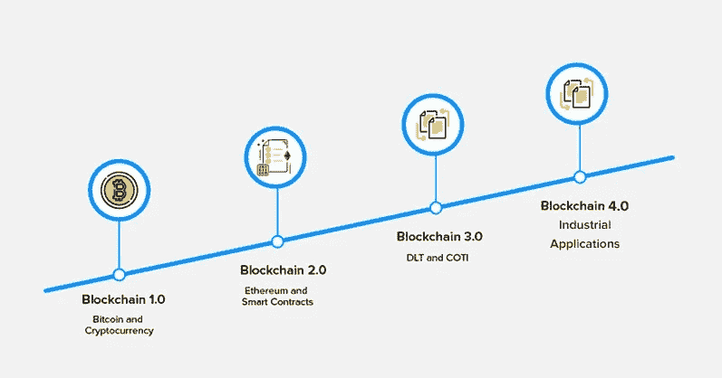
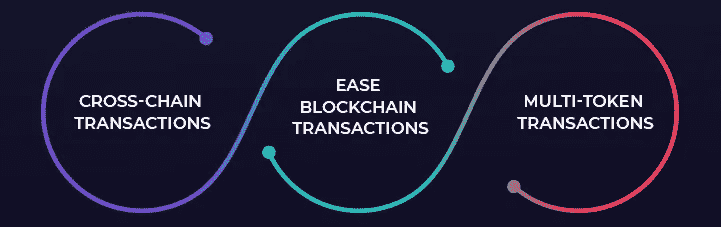

# 区块链的历史和演变

> 原文：<https://medium.com/coinmonks/history-and-evolution-of-blockchain-17e5332e4a6c?source=collection_archive---------21----------------------->

[区块链](/coinmonks/what-is-blockchain-a7082404caa2)作为一个概念已经存在了三十年。其巨大的范围和尚未开发的潜力已经标志着它作为未来的技术。所以，理解它意味着什么，它是如何工作的，或者它能去哪里是一个持续的冒险。与此同时，对其历史和演变的研究也同样引人入胜。

[**Timeline of blockchain**](https://kustard.io/blog/6-minute-introduction-to-blockchain-technology/)

**早年**

早在 1991 年，Stuart Haber 和 W. Scott Stornetta 首先研究了今天称为区块链的概念。他们的目标是通过使用加密保护的区块链使文档的时间戳防篡改。然而，当时的技术在探索这个想法的全部范围方面是有限的。因此，这两个人在进一步开发他们的工作中所能取得的最大成果就是能够在一个块上存储更多的文档。这是超越时代的创新，但没有太多的应用可能性。

> 交易新手？试试[密码交易机器人](/coinmonks/crypto-trading-bot-c2ffce8acb2a)或[复制交易](/coinmonks/top-10-crypto-copy-trading-platforms-for-beginners-d0c37c7d698c)

15 年后，多亏了中本聪，区块链作为技术强国的概念首次出现。他是一个人还是一群人假扮成一个人仍然是个谜，身份背后的真相一点也不重要。他的想法催生了世界上第一个以[比特币](/coinmonks/what-is-bitcoin-e98b2b77c81b)形式出现的区块链应用，为未来的加密货币和技术进步铺平了道路。在区块链历史上具有里程碑意义的 2009 年发布的白皮书中，Nakamoto 阐述了分布式账本背后的核心概念，即区块链通过去中心化提高数字信任的效率。从那时起，更新的应用程序已经发展并演变成今天的区块链技术。

**进化**

区块链[的演变是在其发展的每一个阶段都遇到上限时触发的，这导致了对其实现潜力的深入挖掘。自诞生以来，区块链经历了三次重大的范式转变。简单看一下从区块链 1.0 到区块链 4.0 的几代技术，将有助于更好地理解它在历史上的地位。](/coinmonks/what-is-blockchain-a7082404caa2)

**区块链 1.0**

技术进化的第一阶段始于比特币的诞生。中本聪启动了[创世区块](https://coinsbench.com/understanding-the-architecture-of-a-blockchain-f50ad412bdc4)，从那里进一步开采区块，创造了最古老的加密货币。在发展的这个阶段，区块链技术只有一个目标——让当代传统货币体系更加稳健。区块链 1.0 因此可以说是关于数字交易以及如何改进它的所有内容。

在密码学的使用刚刚兴起的时候，代码大多是用 C++编程语言编写的，协议在[工作证明](/coinmonks/understanding-the-role-of-consensus-in-blockchain-db724fa63a53) (PoW)模型上蓬勃发展。然而，对通过加密货币进行交易应用的关注似乎过于狭隘，这推动了下一阶段的发展。

[**Evolution of blockchain**](https://appinventiv.com/blog/real-impact-of-blockchain-technology-on-economy/)

**区块链 2.0**

2013 年，当 Vitalik Buterin 效仿中本聪出版自己的白皮书时，比特币已经突破了 10 亿美元的估值。他的[以太坊](/@DC.600/what-is-ethereum-part-1-smart-contract-74f259708792)的想法使该技术经历了第一次范式转变，并推出了区块链 2.0。在这一阶段，重点不再是交易，而是智能合同的创建和实施。

这种使用基于自动执行合同运行的透明全自动生态系统的新概念是区块链技术不可或缺的支柱。很快，以太坊超越了其加密货币的身份，成为一个可扩展的多维平台，鼓励构建分散化应用。这为探索和发展下一层次的思想奠定了基础，带来了区块链进化的第三阶段。

**区块链 3.0**

这是区块链进程的关键阶段。区块链 3.0 超越了单纯的交易和智能合约的前提，并在 dApps 的帮助下创造了一场技术革命。在这个阶段，dApps 是提供高效的下一代解决方案的关键，从而席卷经济。更多的资源致力于克服传统生态系统的缺点，如比特币和以太坊。像 R3 这样的区块链财团的崛起标志着进化一代的创新可能性。

作为区块链 1.0 亮点的 PoW 模型被改进和多样化的共识协议所取代，特别是[利益证明](/coinmonks/understanding-the-role-of-consensus-in-blockchain-db724fa63a53) (PoS)机制。像 Hyperledger、Cardano、Solana 和 Polkadot 这样的项目现在处于最前沿，因为具有更平滑可伸缩性的跨链交易和运营已经成为这一代人的规范。

[**Blockchain interoperability**](https://www.analyticssteps.com/blogs/all-about-blockchain-interoperability-2022)

**区块链 4.0**

互操作性仅仅是其进化史中的一块垫脚石。[区块链](/coinmonks/what-is-blockchain-a7082404caa2)与各行业的大规模融合是区块链 4.0 的目标。这些应用中的一些已经被广泛使用，并特别关注潜在的发展。它们包括 Web3 中的互联网去中心化，通过[去中心化金融](/@DC.600/what-is-ethereum-part-3-applications-12097472b9f9) (DeFi)支撑银行和金融服务，混合游戏和区块链以及引入不可替代代币(NFT)，以及通过初始硬币发行(ICO)和初始 DeX 发行(IDO)进行众筹，这有助于推出许多加密货币。此外，由于这个领域提供了丰富的投资选择，像加密交易所和分散交易所(DeX)这样的区块链市场也正在兴起。

区块链 4.0 不是躺在功劳簿上，而是通过涉足更多领域和服务，寻求在未来创造更大的采用率。人工智能(AI)、机器人、大数据、虚拟现实(VR)和增强现实(AR)技术可以与区块链合作，将新颖的应用和解决方案概念化，从而改变各种行业，例如:

●教育

●医疗保健

●物流和供应链管理

●网络安全

●视频流和娱乐

●政府基础设施

●房地产

●零售

●交通和拼车

●农业

●内容创作和发布

●保险

●能源管理

**结论**

有了这样一个令人兴奋的背景故事和随后的发展，区块链空间确实将成为未来几年的一股不可忽视的力量。随着它的发展壮大，它的技术应用和创新方法必将达到更高的高度，书写新的历史。

**也读作:**

[*什么是区块链*？](/coinmonks/what-is-blockchain-a7082404caa2) *|* [*理解共识在区块链中的作用*](/@DC.600/understanding-the-role-of-consensus-in-blockchain-db724fa63a53)

跟随我:

[**LinkedIn**](https://www.linkedin.com/in/a600dc/)|[**Twitter**](https://twitter.com/dc_111)

联系人:**arnab.dc111@gmail.com**

> *加入 Coinmonks* [*电报频道*](https://t.me/coincodecap) *和* [*Youtube 频道*](https://www.youtube.com/c/coinmonks/videos) *了解加密交易和投资*

# 另外，阅读

*   [用于 Huobi 的加密交易信号](https://coincodecap.com/huobi-crypto-trading-signals) | [HitBTC 审查](/coinmonks/hitbtc-review-c5143c5d53c2)
*   [TraderWagon 回顾](https://coincodecap.com/traderwagon-review) | [北海巨妖 vs 双子星 vs BitYard](https://coincodecap.com/kraken-vs-gemini-vs-bityard)
*   [如何在 FTX 交易所交易期货](https://coincodecap.com/ftx-futures-trading)
*   [OKEx vs KuCoin](https://coincodecap.com/okex-kucoin) | [摄氏替代品](https://coincodecap.com/celsius-alternatives) | [如何购买 VeChain](https://coincodecap.com/buy-vechain)
*   [ProfitFarmers 点评](https://coincodecap.com/profitfarmers-review) | [如何使用 Cornix 交易机器人](https://coincodecap.com/cornix-trading-bot)
*   [如何匿名购买比特币](https://coincodecap.com/buy-bitcoin-anonymously) | [比特币现金钱包](https://coincodecap.com/bitcoin-cash-wallets)