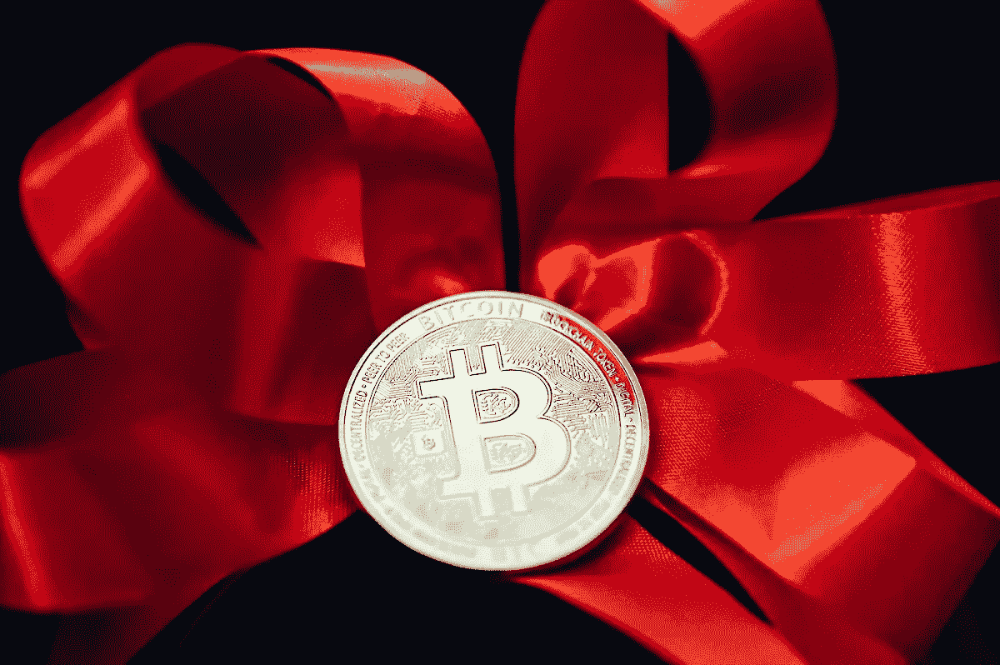
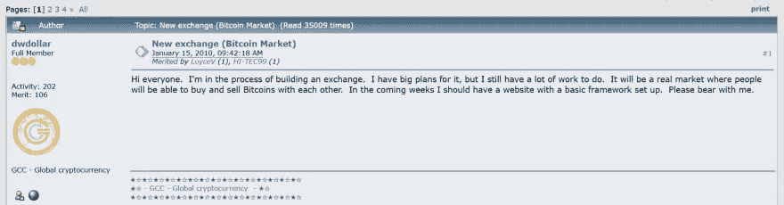
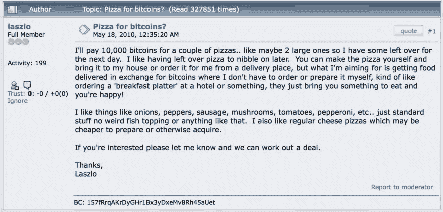
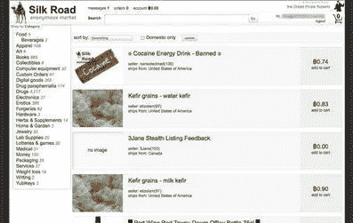
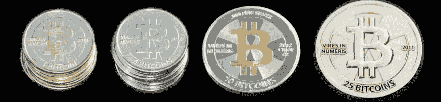
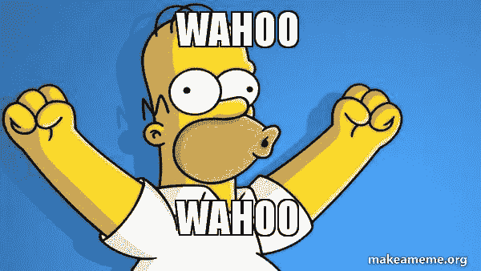

# 比特币的历史！

> 原文：<https://medium.com/coinmonks/history-of-bitcoin-6fd7c32546ab?source=collection_archive---------18----------------------->

**嘿伙计们，**

希望一切都好，

**牛逼，**

所以，今天我们将看到所有关于*比特币的*历史，从它的诞生开始！

阿雅，你没看错，从它出生开始。

那为什么要等？开始吧:)

***比特币的早期历史***
我想你可能听说过'*比特币*(协议)从未被黑过，但他们错了。是啊！*比特币*被黑了。2007 年，一个网站提到“一个化名的中本聪开始研究比特币”。

**现在，让我们来看看进一步的细节。**

**2008 年 8 月 18 日**

bitcoin.org 网站是用 anomymousspeech.com 注册的，这是一家代理注册域名的公司，客户可以选择保持匿名。这表明隐私对于参与*比特币*的个人或团体是多么重要。

**2008 年 10 月 31 日**

这是我们可以说*比特币*正式推出的日期。笔名为中本聪的《比特币白皮书》在 metzdowd.com 一个不知名但很吸引人的邮件列表上发布，该列表深受密码朋克们的喜爱。维基百科是这样描述赛弗朋克的。

2009 年 1 月 3 日

genesis(第一个)区块已开采。这一天，*比特币的*区块链已经形成。在那个时候，第一批比特币，50 个，凭空被创造出来，并被记录到它的区块链中(零块)。包含采矿奖励的交易，即所谓的“coinbase”交易，包含以下文本:

> *《泰晤士报》03/01/2009 财政大臣濒临第二次银行救助】*

这篇文章提到了英国《泰晤士报》的一个标题。

有趣的是:第一个区块开采的 50 个 BTC 是不可描述的。他们坐在地址，但帐户持有人，假定 Satoshi，无论他，她，或他们可能是谁，无法转移到其他任何人，由于一些代码的怪癖。

2009 年 1 月 9 日

这一天，中本聪发布了 0.1 版本的比特币软件及其源代码。在这个的帮助下，人们可以审查代码，下载和运行软件，所以他们可以既是记账员又是矿工。因此，任何想下载和使用比特币的人都可以使用比特币。

**2009 年 1 月 12 日**

第一笔*比特币*支付是从 Satoshi 的地址支付到 Hal Finney 在 block 170 的地址，这是第一次有记录的比特币流动。哈尔·芬尼是一名密码学家、密码朋克和编码员，有些人认为他是 Satoshi 这个假名的幕后黑手。

**2010 年 2 月 6 日**

对比特币来说，这是具有历史意义的一天。因为，第一个比特币交易所“比特币市场”是由 bitcointalk.org 论坛用户“dwdollar”创建的。

以前，人们交易比特币，但在聊天室和留言板中以相对非结构化的方式进行。

2010 年 5 月 22 日

今天是比特币*的披萨日*:)这是有记录以来比特币第一次在现实世界中被用来支付某些东西。美国佛罗里达州的程序员拉兹洛·汉耶茨(Laszlo Hanyecz)在 bitcointalk 论坛上提出支付 1 万 BTC 购买一个披萨。

我爱披萨 btw，开个玩笑:)

【2010 年 7 月 17 日

杰德·麦卡勒(Jed McCaleb)(他最近创建了一个基于 Ripple 的加密货币平台 Steller)将他的卡交易交易所转换成了一个比特币交易交易所。

**很有意思吧？**

**太好了！**

**再来多看一些历史。**

**2010 年 8 月 15 日**

对于比特币来说，这是黑色的一天。这一天，**比特币的**协议被黑了。发现了一个潜在的漏洞，有人在 74638 块利用这个漏洞为自己创造了 1840 亿个比特币。这种奇怪的交易很快被发现，并在社区大多数人的同意下，整个区块链被“分叉”，恢复到以前的状态。

如果有人说，*比特币*甚至没有被黑过，问他们“2010 年 8 月的整数溢出漏洞是怎么回事，当时有人给自己发了 1840 亿比特币？”

**2010 年 9 月 18 日**

第一个采矿池，雪泥池，排列在第一个区块。矿池是一个组织，其中多个参与者结合他们的散列能力，使他们自己有更好的机会赢得区块。参与者根据他们的散列值贡献比例分配奖励。

**2011 年 1 月 7 日**

12 个 BTC 换来了 3000 亿美元。这大概是**比特币**之间甚至达到的最高汇率。然而，这些美元是津巴布韦元。

**2011 年 2 月 9 日**

这一天，Mt Gox *比特币*兑换，比特币与美元达到平价即 1 BTC = 1 美元。

**2011 年 4 月 7 日**

VirWox 是一个允许客户在法定货币和林登币(电脑游戏中使用的虚拟货币)之间转换的网站，集成了比特币。人们现在可以在比特币和里登美元之间直接兑换。这可能是第一个虚拟货币对虚拟货币的交换。

**2011 年 6 月 1 日**

《连线》杂志发表了一篇著名的文章《地下网站让你买到任何能想到的毒品》，作者是阿德里安·陈(Adrian Chen)。它描述了一个名为“丝绸之路”的网站，该网站于 2011 年 2 月推出，由 27 岁的罗斯·威廉·乌尔布利特运营，昵称为“可怕的海盗罗伯茨”。丝绸之路被描述为毒品的易贝。

【2011 年 6 月 20 日

这可能是实体商家接受比特币作为支付手段的第一份书面证据。位于德国柏林的餐厅 77 号房(Room 77)出售比特币快餐。

【2011 年 9 月 2 日

迈克·考德威尔开始创造实物比特币，他称之为卡萨修斯币。它们是金属制成的物理光盘，每个光盘都有一个独特的私人密钥，嵌入在全息标签后面。每枚硬币的私钥都与一个地址相关联，该地址由特定数量的比特币提供资金。正如硬币上所描绘的那样。

【2012 年 5 月 8 日

Satoshi Dice 是 2012 年 4 月 24 日推出的一个赌博网站。用户可以将比特币发送到特定地址，有机会赢得高达 64000 倍的原始赌注。每个地址都有不同的奖金和不同的中奖机会。5 月 8 日，它负责了区块链超过一半的比特币交易量。

【2012 年 11 月 28 日

*比特币的*第一个区块奖励减半日:在 21 万区块上，区块奖励从 50 BTC 降到 25 BTC，减缓了比特币的生成速度。当时交易费用微不足道，所以这一天减半减少了每个区块对矿工的财政奖励的一半。

**2013 年 5 月 2 日**

第一台双向比特币自动取款机在加州圣地亚哥启动。这是一台你可以购买比特币或出售比特币换取现金的机器。这引发了在世界各地安装单向比特币终结机和双向比特币自动取款机的浪潮。

**2013 年 7 月**

本月，第一份*比特币* ETF(交易所交易基金)提案提交给了美国证券交易委员会。ETF 可以让公众更容易投资比特币，因为许多基金可以购买 ETF，但不能直接购买比特币。

**2013 年 8 月 6 日**

*比特币*被美国德克萨斯州一名法官归类为货币。他的众多论点之一和比特币热的确定是:货币？财产？一个保安？一些其他金融资产？新事物？目前还没有一个全球定义，也可能永远不会有一个全球一致的定义。

**2013 年 8 月 9 日**

比特币的价格可以通过彭博软件进行搜索，该软件在传统金融市场的交易者中很受欢迎。彭博使用代号“XBT”来代表比特币，符合 I 货币代码标准。

【2013 年 8 月 20 日

**比特币**在德国被视为私人货币，持有一年以上可以免税。比特币和加密货币的税收待遇是一个主要的争论点，特别是在美国，比特币的买卖吸引了资本收益。

【2013 年 11 月 22 日

维珍银河的所有者理查德·布兰森宣布，他将接受比特币作为太空飞行的支付方式。比特币和太空旅行——活着是多么美好的时光。

***到这里，我们已经走到了比特币历史的尽头***

我知道你觉得很有趣:)

太好了！

那是我的工作。

**再次**，感谢你把这个读出来。新文章见。

还有任何问题，请随时在[LinkedIn](https://www.linkedin.com/in/sarojvrc/)[Twitter](https://twitter.com/iamsarojb)上与我联系

> 加入 Coinmonks [电报频道](https://t.me/coincodecap)和 [Youtube 频道](https://www.youtube.com/c/coinmonks/videos)了解加密交易和投资

# 另外，阅读

*   [block fi vs Celsius](/coinmonks/blockfi-vs-celsius-vs-hodlnaut-8a1cc8c26630)|[Hodlnaut 评审](/coinmonks/hodlnaut-review-best-way-to-hodl-is-to-earn-interest-on-your-bitcoin-6658a8c19edf) | [KuCoin 评审](https://coincodecap.com/kucoin-review)
*   [Bitsgap 审查](/coinmonks/bitsgap-review-a-crypto-trading-bot-that-makes-easy-money-a5d88a336df2) | [Quadency 审查](/coinmonks/quadency-review-a-crypto-trading-automation-platform-3068eaa374e1) | [Bitbns 审查](/coinmonks/bitbns-review-38256a07e161)
*   [密码本交易平台](/coinmonks/top-10-crypto-copy-trading-platforms-for-beginners-d0c37c7d698c) | [Coinmama 审核](/coinmonks/coinmama-review-ace5641bde6e)
*   [印度加密交易所](/coinmonks/bitcoin-exchange-in-india-7f1fe79715c9) | [比特币储蓄账户](/coinmonks/bitcoin-savings-account-e65b13f92451)
*   [OKEx vs KuCoin](https://coincodecap.com/okex-kucoin) | [摄氏替代度](https://coincodecap.com/celsius-alternatives) | [如何购买 VeChain](https://coincodecap.com/buy-vechain)
*   [币安期货交易](https://coincodecap.com/binance-futures-trading)|[3 commas vs Mudrex vs eToro](https://coincodecap.com/mudrex-3commas-etoro)
*   [如何购买 Monero](https://coincodecap.com/buy-monero) | [IDEX 评论](https://coincodecap.com/idex-review) | [BitKan 交易机器人](https://coincodecap.com/bitkan-trading-bot)