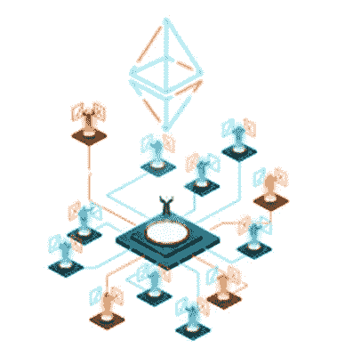
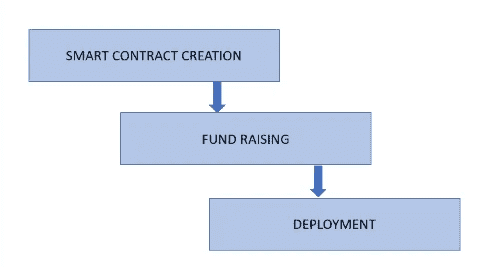
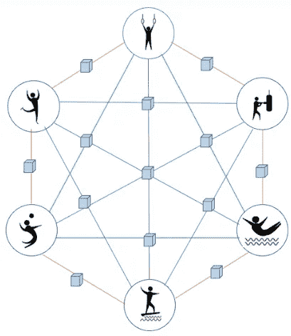

# DAO(去中心化自治组织)搭便车指南

> 原文：<https://medium.com/coinmonks/hitchhikers-guide-to-dao-decentralised-autonomous-organisation-911c2c48100a?source=collection_archive---------17----------------------->

随着越来越多的人接触到现代技术，基于这些技术的新的增强技术正以极快的速度建立起来。在过去的几年里， [DeFi](https://en.wikipedia.org/wiki/Decentralized_finance) 和 [NFT](/devopsinternationalbv/mint-nfts-through-csv-and-list-them-on-opensea-a6159f993a72) 活动经历了巨大的增长，目前 metaverses 和其他 Web 3.0 技术正在点亮数字空间。

已经成功执行的一个新的开创性概念是通过[区块链](https://en.wikipedia.org/wiki/Blockchain)技术引入 [DAO](https://en.wikipedia.org/wiki/The_DAO_(organization)) 。DAO 的接受度急剧上升，它的成员认为这仅仅是一个开始，这保证了在这个领域会有更多的用例出现。让我们更好地理解道。

**分散自治组织**

分散自治组织(DAO)，有时也称为分散自治公司(DAC ),是一种用规则表示的组织，编码为透明的计算机程序，由组织成员控制，没有集中的领导或控制。

一个被设计为去中心化和自动化的组织，类似于通过数字共识在全球范围内无国界地与其他人协调，建立自己的规则并自主决策，所有这些都被编码在一个区块链上。由于规则被嵌入到代码中，因此不需要管理人员，从而消除了任何层次障碍。

道有几种定义。以太坊(ETH)的联合创始人之一 Vatalik Buterin 将 DAO 定义为“[虚拟实体，该实体拥有一组成员或股东，他们有权使用其实体的资金并修改其代码](https://policyreview.info/glossary/DAO)”。

道被用于多种用途，如投资、慈善信托、集资或在没有中介的情况下购买 NFT 的股票。一个很好的例子是:道可以接受来自世界各地的捐款，会员有充分的权利决定如何使用他们的资金。

理解道最简单方法是一分为二

1.  道是一个社区——道的第一个理念是建立一个社区。当一个人要求你加入一个 DAO 时，这应该意味着你需要加入一个社区或组织，使用基于 DAO 的软件来协调、做出决定并就一个想法或决定达成一致。
2.  DAO 是一个软件——其次，它使用智能合约来促进分散的群体决策。没有中央控制点，成员可以使用 DAO 软件通过投票加入。

我们为什么需要刀？

所有的等级结构和集中控制现在又成了一个大问题，限制了组织的发展，使同事/下属感觉不到自己是团队的一部分。这就是为什么我们看到对支持社区的去中心化组织的需求增加了。你可以问自己一个问题-

*   你觉得成为你组织治理的一部分怎么样？
*   这难道不会让你觉得自己在组织中更重要、更有价值吗？

Dao 最有价值的优势之一是缺乏群体间所需的信任。DAO 在发布后采取的每个行动都需要得到社区的批准，这使得它非常透明(可以通过公共区块链在账本上验证)。没有层级表明任何利益相关者都有能力提出一个创新的想法，供整个团队考虑和改进。任何争议都可以通过它的投票系统毫不费力地解决。

DAO 有一个民主化的组织，这意味着:DAO 的所有成员都需要投票决定要实施的任何变革。DAOs 的资金主要以发行代币的众筹为主。Dao 的管理基于机构群体，其运营完全透明且全球化。

因为每个人都在团队中分担风险，所以每个人都有确保团队尽可能高效运作的既得利益。

**刀——核心特征**

*   它使人们能够自治他们的社区，而不用面对官僚主义
*   不需要中央管理机构对组织实施控制
*   道的金融交易和规则记录在区块链上，使交易透明和可验证
*   取消了让第三方参与金融交易的要求
*   智能合同简化了交易(代表组织的规则)
*   如果没有人注意到，规则是无法编辑的，因为 Dao 是透明的，而且通常是公开的

**它是如何工作的？**

DAO 的工作原理是遵循由设计它的人构建的一系列程序。当一个 DAO 被建立时，规则被写入它的代码中，使用智能契约——当满足特定标准时运行的算法。组织中的每个人在加入组织时都同意接受规则，此外，如果这些规则被违反，其资金将被锁定，任何人都不能使用 DAO。因此道确保每个人都遵守规则。

启动 DAO 的步骤解释如下-

**第一步。智能合同的创建**

开发人员的核心团队和社区成员通过智能合同建立了一套规则。这些智能合同为 DAO 的运营设定了基础框架。只要满足一组标准，它们就会自动执行。

基于道的治理系统，只有社区成员可以在以后更改它们。智能合同可以部署在任何区块链上，在推出之前，初始合同必须经过广泛测试，这一点非常关键。

**第二步。资金筹集**

道需要确定一种获得资金和进行治理的方式。核心开发团队发布代表组织份额的治理令牌。

如果人们支持这个团体的使命，同意购买一定数量的代币，他们就会加入这个团体。购买这些代币的人以投资换取投票权。这些投票权通常与其持有的股份成比例。

**第三步。部署**

一旦一切都设置好了，代码就可以投入生产，DAO 就可以部署到区块链上了。从这一点来说，没有任何特殊的权威(那些编写智能合同的人)可以修改道的规则。

只有社区成员(令牌持有者)有权通过投票和达成共识来决定 DAO 的未来。

**刀的好处**

*   投资的总体所有权和透明度
*   参与者可以投票并决定在哪里投资
*   参与者对战略决策有更多的了解和参与
*   无需复杂的技术知识即可与合作伙伴交易道令牌
*   道投资者可以参与一个项目，而不必通过等级障碍
*   道令牌持有者之间的利润和价值分配
*   分散控制在公司内部推出什么产品/什么功能
*   决定创造产品所需要的技能

**刀的使用案例**

1.分散的应用治理

随着去中心化金融生态系统的快速发展，开发人员希望将去中心化扩展到网络级别之外，Dao 通过让用户信任平台而不是开发人员来帮助这些应用程序开发人员。拥有分散应用程序的 Dao 支持用户提议对分散应用程序进行更改，同时允许令牌持有者拥有投票权。

2.提案执行

DAO 最受欢迎的一个用例是帮助成员持有“股份”，他们将这些股份作为投票权，并因此获得回报。投票权可以支持成员决定组织中发生的事情。他们也可以参与像雇佣和奖励员工这样的活动。例如，区块链的 Tezos 和 Decred 都有类似的制度来奖励贡献者的工作。

3.投资融资

为了筹集投资资金或赠款的特定功能，一些 DAO 被创建。这些资金可用于支持分散的应用。Dao 允许成员出资，然后决定最佳投资项目。成员持有这些公司的股份，从而获得一部分利润。例如，LAO(有限责任自治组织)是一个由以太坊爱好者组成的分散自治组织，主要投资于一些加密项目。

**例子**

一家名为 ACME DAO 的公司一直通过全球速卖通销售他们的产品。他们获得了丰厚的利润，该产品也大受欢迎。因此，他们想出了推出自己的电子商务网站的想法。

为了决定是继续使用全球速卖通还是创建自己的电子商务网站，需要所有利益相关方、客户、投资者和合作伙伴的同意。组织内的每一个人以及相关实体通过投票集体做出决定(没有任何集中的权力)。这些决定基于社区的结果/共识。基于投票和共识，ACME DAO 决定开始他们自己的电子商务公司或继续在全球速卖通上销售他们的产品。

**结论**

DAO 可能是 web 3.0 浪潮中的一项突破性技术，它将简化我们在当今数字世界中的工作方式。Dao 距离体育追随者集体打造品牌购买一支运动队或投资者购买闲置土地并让会员决定和投票决定应该建造什么不远了。潜力和用例是无穷无尽的。

参考

【https://ethereum.org/en/dao/ 

[https://blog . ether eum . org/2014/05/06/daos-DACs-das-and-more-an-complete-terminals-guide/](https://blog.ethereum.org/2014/05/06/daos-dacs-das-and-more-an-incomplete-terminology-guide/)

[https://policyreview.info/glossary/DAO](https://policyreview.info/glossary/DAO)

 [## 道(组织)-维基百科

### DAO(程式化)是一个数字化的分散自治组织，也是一种投资者主导的风险投资形式…

en.wikipedia.org](https://en.wikipedia.org/wiki/The_DAO_%28organization%29) 

> 加入 Coinmonks [电报频道](https://t.me/coincodecap)和 [Youtube 频道](https://www.youtube.com/c/coinmonks/videos)了解加密交易和投资

# 另外，阅读

*   [3 商业评论](/coinmonks/3commas-review-an-excellent-crypto-trading-bot-2020-1313a58bec92) | [Pionex 评论](https://coincodecap.com/pionex-review-exchange-with-crypto-trading-bot) | [Coinrule 评论](/coinmonks/coinrule-review-2021-a-beginner-friendly-crypto-trading-bot-daf0504848ba)
*   [莱杰 vs n rave](/coinmonks/ledger-vs-ngrave-zero-7e40f0c1d694)|[莱杰 nano s vs x](/coinmonks/ledger-nano-s-vs-x-battery-hardware-price-storage-59a6663fe3b0) | [币安评论](/coinmonks/binance-review-ee10d3bf3b6e)
*   [Bybit Exchange 审查](/coinmonks/bybit-exchange-review-dbd570019b71) | [Bityard 审查](https://coincodecap.com/bityard-reivew) | [Jet-Bot 审查](https://coincodecap.com/jet-bot-review)
*   [3 commas vs crypto hopper](/coinmonks/3commas-vs-pionex-vs-cryptohopper-best-crypto-bot-6a98d2baa203)|[赚取加密利息](/coinmonks/earn-crypto-interest-b10b810fdda3)
*   最好的比特币[硬件钱包](/coinmonks/hardware-wallets-dfa1211730c6) | [BitBox02 回顾](/coinmonks/bitbox02-review-your-swiss-bitcoin-hardware-wallet-c36c88fff29)
*   [BlockFi vs 摄氏度](/coinmonks/blockfi-vs-celsius-vs-hodlnaut-8a1cc8c26630) | [Hodlnaut 审核](/coinmonks/hodlnaut-review-best-way-to-hodl-is-to-earn-interest-on-your-bitcoin-6658a8c19edf) | [KuCoin 审核](https://coincodecap.com/kucoin-review)