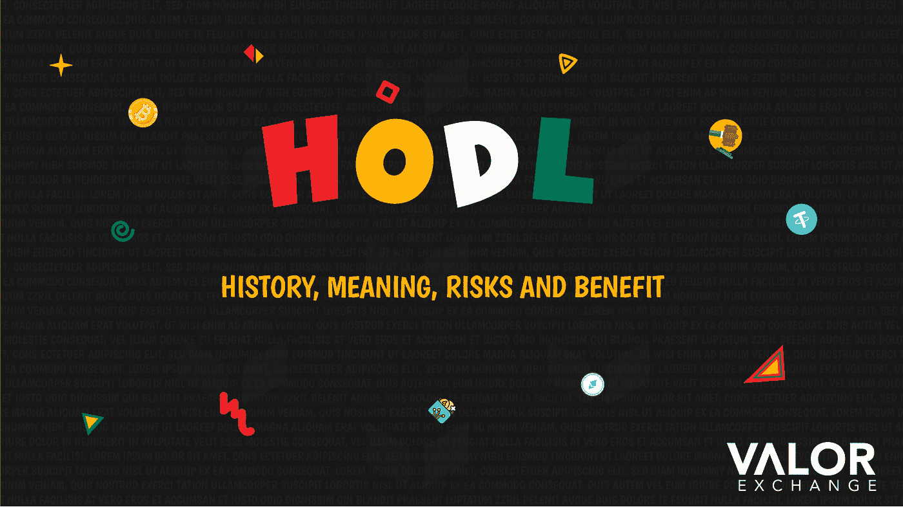

# HODL——历史、意义、风险和收益。

> 原文：<https://medium.com/coinmonks/hodl-history-meaning-risks-and-benefits-5bf9a28d578a?source=collection_archive---------64----------------------->

HODL 实际上是“hold”的一个拼写错误的版本，有一个有趣的故事，它是如何成为每次密码相关讨论中使用最多的术语之一的。

**这一切是如何开始的——HODL 的历史**

2013 年 12 月 18 日，一个用户名或账号为“GameKyuubi”的比特币论坛成员在论坛上分享了一个有趣的观点。

2013 年对于密码交易员来说是重要的一年。比特币的价格从年初的 15 美元飙升至接近年底的 1100 美元。由于该行业的高度不稳定性，同年 12 月中旬降至 438 美元。一些交易者很沮丧，损失了几百万。除了 GameKyuubi，在一个帖子里，他写道“我是霍德林”。

“我持有”的帖子是对价格暴跌的回应。这篇帖子有错别字，并且全部用大写字母书写，以表达作者对自己信念的坚定。拼写错误的 HODL 很快开始流行，最终，互联网上出现了大量与 Hold 一模一样的模因。沿着这条线的某个地方，HODL 开始表示亲爱的生活坚持住。

**hodl 加密比较好吗？**

如果你想为将来存钱或者有特定的财务目标，那么持有你的密码可能是有益的。你不必担心不想要的借项；您可以轻松地将资金发送到国内和国际，并随时存入您想要的金额。

如果你在寻找 Hodl，那就抓住最好的。在 [ValorExchange](https://account.valorexchange.com/) 上，你可以快速安全地将你的法定货币兑换成比特币、以太和系绳。

**总之**

如果你想尝试交易加密货币的避险策略，那就试试 Hodl 吧。但是，你不必把加密货币藏在某个地方。有许多方法可以使用你的密码为你服务。

你可以在 Telegram 上加入我们的[社区。我们分享技巧、资源和更多内容，帮助您获得更多加密价值。为什么？因为我们相信加密货币，并希望让更多人意识到它们的潜力。](https://t.me/valorexchangecommunity)

加密货币不是一个快速致富的计划，我们希望向您展示您可以从您的加密货币中获得多少价值。