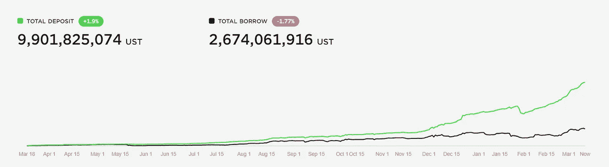

# 锚协议的持有者拒绝了降低收益率的提议

> 原文：<https://medium.com/coinmonks/holders-of-the-anchor-protocol-reject-a-proposal-to-reduce-yield-rates-5588c00b99ab?source=collection_archive---------38----------------------->

**Visit our website:-** [**https://bitcoinsupports.com/**](https://bitcoinsupports.com/)

周六，ANC 令牌持有者果断拒绝了降低基于 Terra 的锚协议(ANC)收益率的提议。Polychain Capital 和 Arca Prop 建议降低费率，目的是将费率最多降低 50%,以使该协议更具可持续性。在 usterra(UST)存款上，ANC 现在提供大约 20%的年收益率。Polychain 的提案旨在逐步降低大额账户的利率，50 万 UST 以上的存款收益率低至 10%。

该提案将投票表决至 3 月 16 日。然而，迄今为止，大约 72%的 ANC 代币持有者投了票，其中 55%投票反对该提案。

**Visit our website:-** [**https://bitcoinsupports.com/**](https://bitcoinsupports.com/)

在 Twitter 上，许多人表达了他们对该计划的不满，声称这将使编程过于复杂，并可能毁了平台。

**ANC Protocol 收益率跑赢大盘**

ANC 是由创建 Terra 的同一批人创建的，目前拥有市场上最高的稳定币收益率，在 20%左右。相比之下，主要稳定货币如泰索、美元硬币和币安美元的收益率高达 12%。尽管相对较高的利率导致整个 2 月份的存款增加，但它也引发了对该体系长期可行性的担忧，因为 ANC 的存款总额是借款总额的 4 倍以上。

**Visit our website:-** [**https://bitcoinsupports.com/**](https://bitcoinsupports.com/)

ANC 通过向 UST 借款人收取利息并留出收益准备金来获得高收益。然而，这种储备在最近几周已经耗尽，促使社区增加其筹款努力。

ANC 和 LUNA 卡的持有者依然惶恐不安。

尽管 ANC 令牌持有者投票反对提议的费率下调，但 ANC 和 Terra 的本地令牌 LUNA 值表现出一定的不确定性。可用于押注该协议的 LUNA 在过去 24 小时内下跌 4.4%，远离关键的 100 美元大关，而 ANC 下跌 11%，至 3.42 美元。随着 Anchor 协议越来越受欢迎，这两种代币的价格在上个月大幅上涨。LUNA 的市值在过去 30 天内几乎翻了一番，达到 346 亿美元，成为市值最大的 DeFi token。

就冻结总价值而言，ANC 是第四大 DeFi 平台(154 亿美元)。

**访问我们的网站:-**[**https://bitcoinsupports.com/**](https://bitcoinsupports.com/)

**免责声明:以上为作者观点，不应视为投资建议。读者应该自己做研究。**