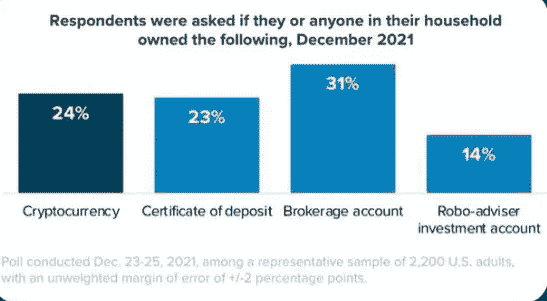

# 持有密码还是有储蓄账户？

> 原文：<https://medium.com/coinmonks/holding-crypto-or-having-a-savings-account-3302c3e8a086?source=collection_archive---------58----------------------->

link: [https://go.morningconsult.com/rs/850-TAA-511/images/220120_State_of_Consumer_Banking.pdf](https://go.morningconsult.com/rs/850-TAA-511/images/220120_State_of_Consumer_Banking.pdf)

全球数据情报公司“Morning Consult”对全球消费者银行和支付的状况进行了一项研究，这是他们对加密货币的发现:

有史以来第一次，拥有加密资产的美国公民数量(24%)略微超过了拥有储蓄账户的公民数量(23%)，并接近拥有…