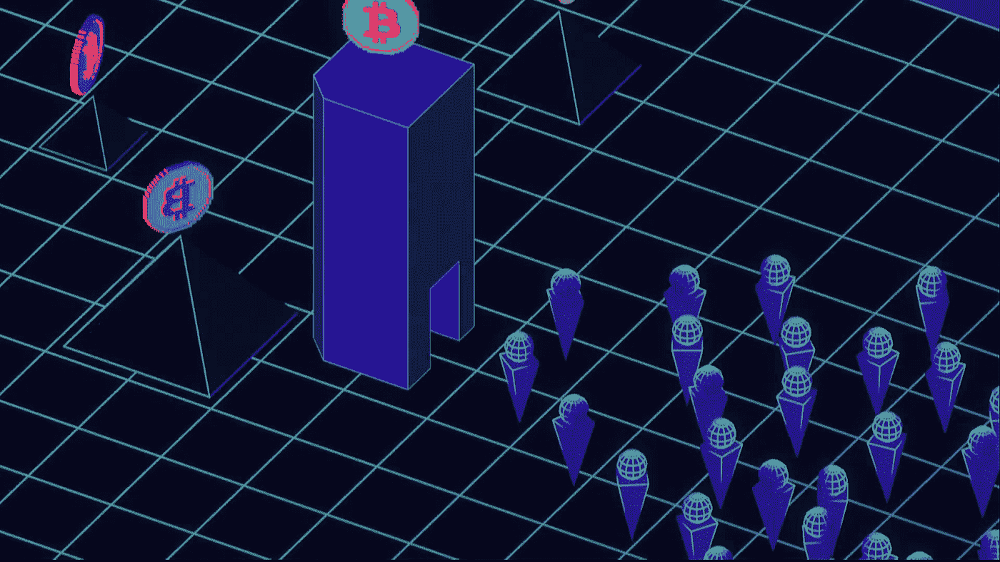

# HollaEx:让做市变得容易

> 原文：<https://medium.com/coinmonks/hollaex-market-making-made-easy-6c799db72f49?source=collection_archive---------21----------------------->

## **开创金融业务的挑战**

通常，人们倾向于认为，为了开始一项金融业务，你需要一笔巨大的初始投资，是的；在人类历史的大部分时间里，这都是事实。那些有钱的人可以转移资本，利用新的商业机会，而那些口袋里没有钱的人则没有机会。

这一社会经济瓶颈是一个由来已久的问题，有多种原因和观点。但是，最近几年，一些非常有趣的事情开始发生了。金融科技为大公司和小公司创造了一个更加公平的竞争环境。

掌控自己的财务并成为一名企业主，这是前所未有的轻松时刻。随着今天所有新的在线工具和技术的出现，我们正处于一个无障碍的时代！

## **创新带来新水**

最近这些创新的一个例子可能是比特币和其他加密货币等区块链资产；这种新的去中心化的理解货币的方式让更多的人能够将金融体系转化为对他们实际有用的东西。

其中一个工具是 HollaEx 流动性网络；一家加密流动性提供商，使做市商比以往任何时候都更接近公众。通过让人们有可能进入一个大的密码市场池，它允许那些资源很少的人运行任何类型的项目。

HollaEx 是一个由开源开发者和 [HollaEx 工具包](https://github.com/bitholla/hollaex-kit)的创造者组成的社区；一个开源的白标加密交换开发工具，它与 HollaEx 网络协同工作，目的是使加密交换成为一项可实现的业务。

这篇文章将关注 HollaEx 网络及其可能性；如果你对 HollaEx 和开源加密工具包感兴趣，可以在 HollaEx.com[找到更多信息。](https://www.hollaex.com/)

## **💦面向所有人的流动性池**

如果我必须选择一个词来定义 HollaEx 网络，我可能会选择“**自由**”。为了证明这一选择的合理性，我们必须理解这个独特的市场网络的基本支柱是什么；它的社区。

你什么意思？有人可能会问:答案很简单。随着交易所建设者的名单越来越多，任何人都可以在 HollaEx 网络中列出他们的资产，无论他们在哪个区块链工作，他们的市值，或者硬币/代币在市场上已经存在了多长时间。

但是，为什么人们会在 HollaEx 网络中列出他们的硬币/代币呢？因为现在全球有超过 200 家交易所在使用这个网络的服务，它给了新的数字资产一个接触到他们从未想过会接触到的新受众的机会。

这一切听起来很棒；但是，好莱克斯占什么份额呢？毕竟生活中没有什么是免费的；你是对的。HollaEx 网络只从产生的交易费用中抽取部分收入，并将其返还给 XHT stakers。关于这方面的更多信息，你可以查看 HollaEx 的[常见问题](https://www.hollaex.com/faq-and-help?category=Fees)。

## **📈市场发源地**

如前所述，HollaEx 网络是一个加密流动性提供商；这是因为市场上交易最多的货币对的流动性已经由 HollaEx 提供。

但是，它不仅仅局限于 HollaEx。为了在这个互联的市场中分一杯羹，世界各地的运营商和交易所正在学习为他们的定制市场对提供加密做市商和流动性的艺术。

这意味着任何人，无论是不是交易所经营者，都可以在网络中列出硬币/代币和硬币对；然后提供流动性，从市场价差中获取收益。

不仅如此，通过让其他运营商在他们的交易所中列出你的流动性提供对，你的市场可以获得营销曝光和增加交易量！

从经营者的角度来看，做市商对于[令牌价格发现](https://www.fxstreet.com/cryptocurrencies/news/token-price-discovery-tools-what-is-price-discovery-and-how-it-could-improve-your-trades-202202231312)也很重要，在这个过程中，一项资产利用其等式中的供需算法决定其现货价格，做市商[在其中发挥了巨大作用。通过良好的流动性，运营商可以提供市场上最具竞争力的价格。](https://marketbusinessnews.com/how-do-crypto-market-makers-work-and-what-is-liquidity/296778/)

## **合上书**

我们离终点越来越近了。如您所见，HollaEx 网络是一个强大的加密流动性工具，可以为运营商、做市商和硬币推广商的项目提供重要支持。

我们希望你喜欢这篇博文，也希望我们已经在 HollaEx 流动性网络中窥见了你的好奇心。如果您还有任何问题，可以在专门的[论坛](https://forum.hollaex.com/)中提问。另外，你可以随时通过我们的[不和谐频道](https://discord.gg/ZN45kTdFd3)联系我们！最后，别忘了看看 HollaEx 的[网站](https://www.hollaex.com/coin-and-market-listing)。

> *加入 Coinmonks* [*电报频道*](https://t.me/coincodecap) *和* [*Youtube 频道*](https://www.youtube.com/c/coinmonks/videos) *了解加密交易和投资*

# 另外，阅读

*   [Bookmap 点评](https://coincodecap.com/bookmap-review-2021-best-trading-software) | [美国 5 大最佳加密交易所](https://coincodecap.com/crypto-exchange-usa)
*   最佳加密[硬件钱包](/coinmonks/hardware-wallets-dfa1211730c6) | [Bitbns 评论](/coinmonks/bitbns-review-38256a07e161)
*   [新加坡十大最佳加密交易所](https://coincodecap.com/crypto-exchange-in-singapore) | [购买 AXS](https://coincodecap.com/buy-axs-token)
*   [红狗赌场评论](https://coincodecap.com/red-dog-casino-review) | [Swyftx 评论](https://coincodecap.com/swyftx-review) | [CoinGate 评论](https://coincodecap.com/coingate-review)
*   [投资印度的最佳密码](https://coincodecap.com/best-crypto-to-invest-in-india-in-2021)|[WazirX P2P](https://coincodecap.com/wazirx-p2p)|[Hi Dollar Review](https://coincodecap.com/hi-dollar-review)
*   [加拿大最佳加密交易机器人](https://coincodecap.com/5-best-crypto-trading-bots-in-canada) | [库币评论](https://coincodecap.com/kucoin-review)