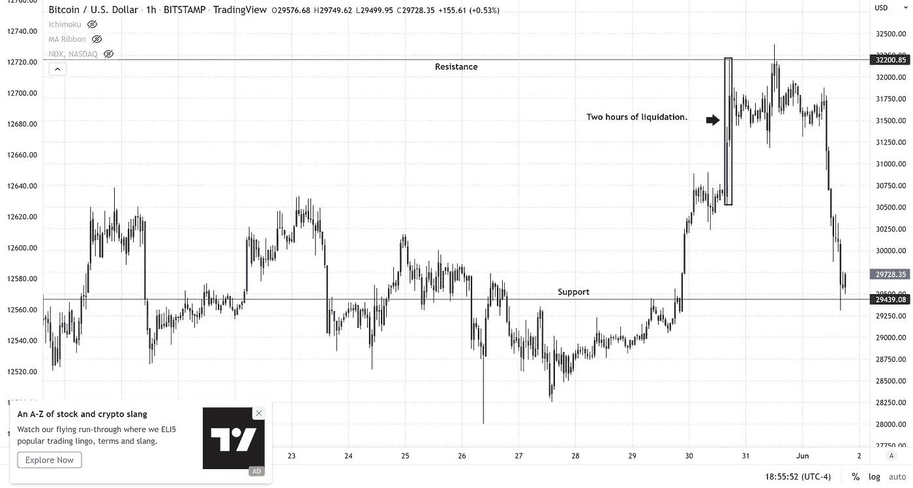
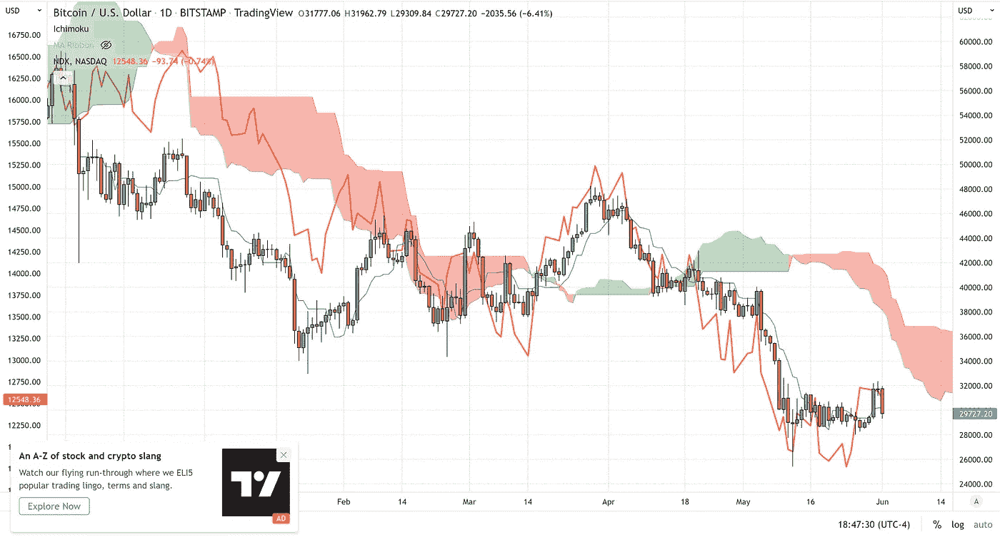

# 牧场上的家

> 原文：<https://medium.com/coinmonks/home-on-the-range-d9c19de4e9f6?source=collection_archive---------50----------------------->

**比特币重新确认区间**

根据 CoinGlass 的链上数据，随着比特币在周二亚洲早盘突破 31，000 美元，7113 万美元的空头在一小时内被清算。接受我建议的交易者也在其中，因为它确实阻止了我们当前的头寸。然而，自从 5 月 5 日从 36，000 美元开始做空以来，我们通过几次跟踪止损点，获得了每比特币近 7，000 美元(6，900 美元)的丰厚利润。

跟踪止损如此之紧，而不是试图在交易区间的底部(大约 28，000 美元至 31，000 美元)附近买入(退出交易)背后的原因是基于 BTC 的能力，即比特币能够基本上保持在 28，75 美元以上，仅标记两根收盘时不超过 100 美元的日线蜡烛。

28，750 美元代表从 2020 年 3 月 Covid 崩盘(3，800 美元)到 2021 年 11 月达到 ATH(69，000 美元)的 61.8% Fibonacci 回撤。我们已经多次强调了这个支撑位的重要性，因为它也是第三次作为底部。

有效持有 61.8%的回撤线作为支撑或阻力是技术交易者最常用的工具之一。尽管加密市场目前充满担忧，但比特币能够保持在这一关键支撑位之上，对于 BTC 多头来说，这是一个可喜的希望灯塔。

这个水平代表了巨大的储存动能，就像一个被压缩的弹簧，一旦展开就可以向任何方向射出。出于这个原因，我们选择不去尝试抄底。因此，如果我们看到价格跌破这一底部，我们可以在市场上从这一变动中获利。

对周二反弹最可能的解释是比特币只是赶上了纳斯达克综合指数和标准普尔 500，这两个指数上周晚些时候出现了大幅上涨。在中短期内，我们还没有接近美国股市的支点。预计比特币在 28000 美元—32000 美元之间继续横盘；在此之上，强阻力在 37，500 美元。

任何有兴趣阅读更多关于比特币的文章的人，只需点击这个[链接](https://www.thegoldforecast.com/bitcoin)。

> 加入 Coinmonks [电报频道](https://t.me/coincodecap)和 [Youtube 频道](https://www.youtube.com/c/coinmonks/videos)了解加密交易和投资

# 另外，阅读

*   [币安 vs FTX](https://coincodecap.com/binance-vs-ftx) | [最佳(SOL)索拉纳钱包](https://coincodecap.com/solana-wallets)
*   [比诺莫评论](https://coincodecap.com/binomo-review) | [斯多葛派 vs 3Commas vs TradeSanta](https://coincodecap.com/stoic-vs-3commas-vs-tradesanta)
*   【Capital.com】|[港加密借贷平台](https://coincodecap.com/crypto-lending-hong-kong)
*   [如何在 Uniswap 上交换加密？](https://coincodecap.com/swap-crypto-on-uniswap) | [A-Ads 评论](https://coincodecap.com/a-ads-review)
*   [WazirX vs CoinDCX vs bit bns](/coinmonks/wazirx-vs-coindcx-vs-bitbns-149f4f19a2f1)|[block fi vs coin loan vs Nexo](/coinmonks/blockfi-vs-coinloan-vs-nexo-cb624635230d)
*   [本地比特币审核](/coinmonks/localbitcoins-review-6cc001c6ed56) | [加密货币储蓄账户](https://coincodecap.com/cryptocurrency-savings-accounts)
*   [什么是保证金交易](https://coincodecap.com/margin-trading) | [美元成本平均法](https://coincodecap.com/dca)