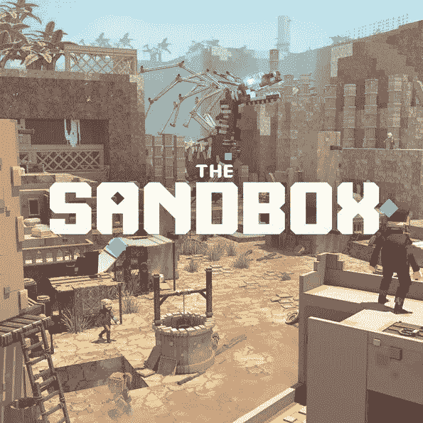
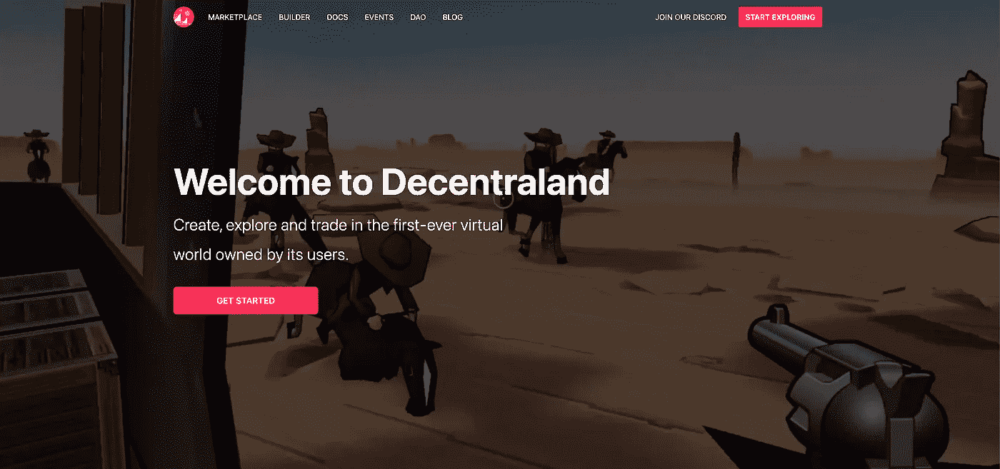
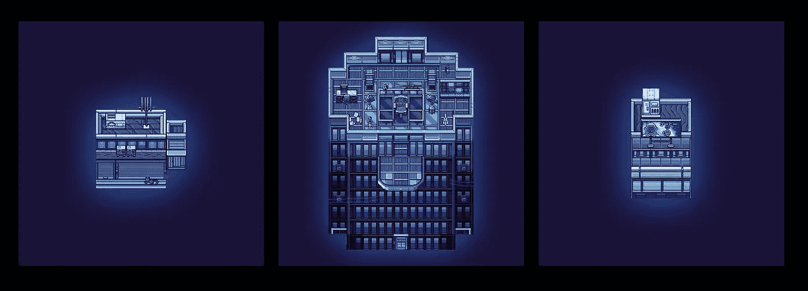
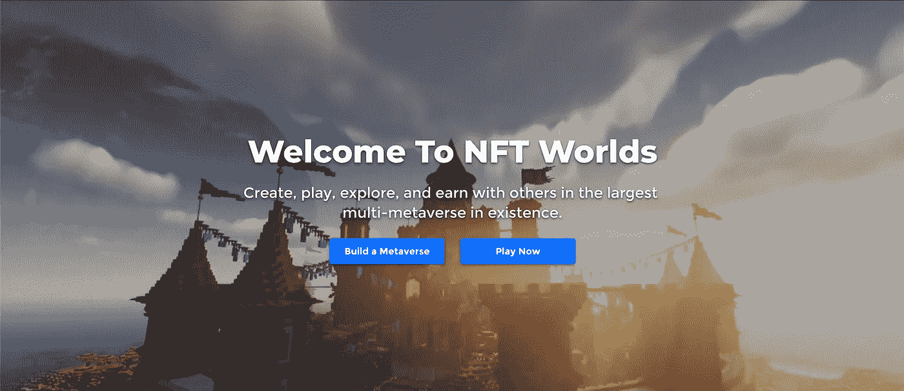
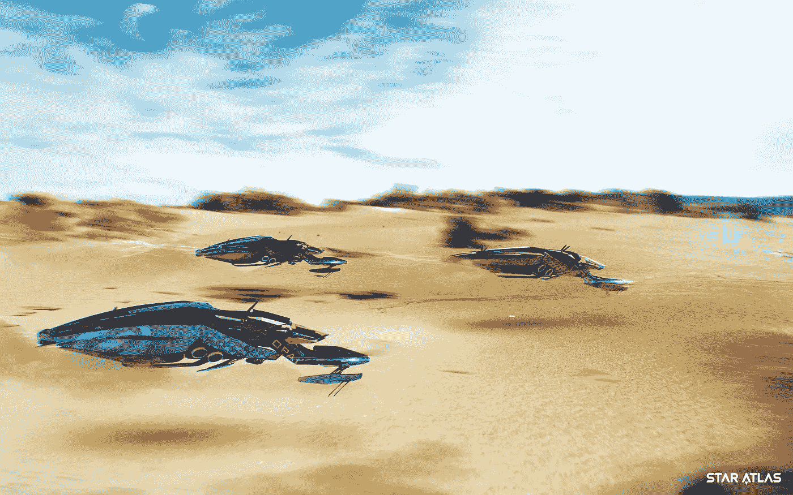

# 元宇宙的自耕农

> 原文：<https://medium.com/coinmonks/homesteading-in-the-metaverse-b4e72d792095?source=collection_archive---------13----------------------->

## 什么是数字房地产，你应该买什么？

欢迎来到边疆。骗局、黑客、土地征服。我们正在见证一个加密的狂野西部，新的土地正在被争夺。“数字房地产”的出现让许多人摸不着头脑，其余的人凑在一起购买梦寐以求的数字“地块”

**但是你应该在这个数字前沿定居吗？**我们采访了一些业内领先的创造者、建设者和思想家来帮助回答这些问题。

*感谢* [*迈格纳*](https://twitter.com/at_mwagner?lang=en)*CEO*[*明星图册*](https://staratlas.com/)*；*[*Loopify*](https://twitter.com/Loopifyyy)*，创始人*[*Treeverse*](https://twitter.com/TheTreeverse)*；* [*荠*](https://twitter.com/wilxlee) *，方正* [*小人*](https://twitter.com/thelittlesnft)*；还有*[*Josh Ong*](https://twitter.com/beijingdou)*，思想领袖* [*沙盒*](https://twitter.com/TheSandboxGame) *大使，为他们做出贡献。*

## **TLDR 篇:**

*   有两种不同类型的游戏世界:**沙盒世界**允许用户在他们拥有的土地上建造房屋，以及**游戏世界**简单地使用土地作为游戏中的资产来获取资源。
*   我担心人为地制造游戏中沙盒土地的稀缺性。价值不是从稀缺中创造出来的。稀缺性是由价值创造的。被高度关注的推特账户没有价值，因为推特账户数量很少。它们之所以有价值，是因为它们为用户提供了价值，很少有客户能够与之竞争。
*   像 NFT 世界这样兼容现有游戏(如《我的世界》)的游戏比那些需要新技能的游戏有很大优势。
*   密切关注新的沙盒土地模型，这些模型不需要固定人为稀缺的土地数量来推动价值和价格。我还在想那会是什么样子。

# 数字空间有什么价值？

数字空间并不是专为 Web3 保留的新想法。我们每个人都已经有了自己的互联网小角落——我们的 Instagram 个人资料、我们的网站和我们的 Pinterest 论坛。我们精心培育和制作每一个。有些更值钱。少一些。

那么，这里有什么新鲜事吗？

区块链是网络的数字所有权层，是 Web3 的关键组件。想象一个有不同虚拟空间的互联网，每个虚拟空间都有不同的风格和不同的目标。有些是身临其境的幻想世界，有复杂的游戏机制。有些是商业网络。其他的只是有建筑杰作的街区。你在这个世界的小角落做什么完全取决于你自己。你可以自由地建造、开发、托管、出租或出售你的空间。

然而，当涉及到这些新兴世界时，仍然有一些必须考虑的技术和潜在的经济限制。

# 拥有数字化稀缺土地有意义吗？

一个大问题是，在数字空间周围人为制造稀缺是否有意义。想想沙盒和分散的虚拟体验(游戏、音乐会、赌场、冒险等)的 YouTube 频道。每个情节都类似于一个创建者帐户。人们当然仍然可以在没有土地的情况下创造资产，甚至将它们货币化，但要创造体验，就需要有空间。

[AltVR](https://www.youtube.com/channel/UCECXzl0xf5HH0z7LvUGjFBg) 在他的[视频](https://www.youtube.com/watch?v=5WsGtvaB-os)中强烈反对稀缺模型。他说，目前的元宇宙项目有所倒退。他们认为稀缺性驱动需求，因此，如果你制造人为的稀缺性，你就会“人为地”驱动需求，而需求又会反过来驱动价格。希望这能最终带来用户价值。

> **元宇宙心态！**
> 
> 用人为的稀缺创造土地>“这是稀缺的，所以它一定是有价值的”>价格上涨>有希望创造价值

他认为，在现实世界中，价值驱动需求，而需求反过来会造成稀缺。稀缺是相对的，没有创造价值的需求，就不是稀缺。真实世界的土地并不因为稀缺而昂贵，它之所以昂贵是因为它为使用者提供了价值，推动了需求并创造了稀缺。

> **真实世界动态**
> 
> 土地提供价值>需求上升>价格上涨>有价值的土地变得更加稀缺

***你明白区别吗？***

问题就变成了，稀缺对数字空间平台有好处吗？我认为当平台的目标是创造排他性时，数字稀缺性是好的。但如果价值本身是提供体验或内容，数字稀缺可能是不好的。如果你的价值模式是基于鼓励尽可能多的人在你的平台上构建——从而促进最高质量和最具扩展性的内容——那么稀缺性是一个坏主意。正如 Loopify 所说，“我不相信在土地上人为制造稀缺，然后围绕它创造价值的概念，它背后必须有意义。我喜欢用的一个例子是:“想象一下，如果你只有限量版的 YouTube 通行证，你就只能发布 YouTube 视频，YouTube 永远不会变得流行。”"

以沙盒为例。似乎很明显，他们正在将排他性作为其平台的核心价值。他们希望沙盒中的土地所有权本质上将用户置于完全不同的元宇宙土地所有者阶层。但这一切都取决于有很多用户来到沙盒。我担心的是，通过人为限制谁可以在沙盒中构建，他们对创新和体验质量施加了约束，从而限制了他们将吸引的用户的最终水平。

另一方面，高昂的收购成本和潜在的利润实际上可能会鼓励更多专注的建设者，并通过强大的网络效应创建真正充满活力的社区。这些沙盒世界提供的各种工具为寻求创造和货币化其才华的创作者提供了强大的工具。

# 在不同的世界寻找房地产

那些寻找数字“房地产”交易的人有很多选择。有两种主要的土地类型:“沙盒”世界，所有者可以按照他们认为合适的方式开发他们的土地，以及“游戏世界”，土地是游戏的一部分，提供获得额外资源的途径。

# “沙盒”世界

## [**沙盒**](https://www.sandbox.game/en/)

[*Opensea Link*](https://opensea.io/collection/sandbox)

沙盒是一个基于体素的游戏(这意味着它看起来类似于像素化人物的《我的世界》)。Littles 的创始人 Wil 说，Littles 正在沙盒中发展，因为它是“一种很好的体验工具”打造体验的能力吸引了 50 多个顶级品牌和公司的合作。用户可以使用沙盒体素编辑器进行构建和创建，然后使用游戏制作工具进行上传，并在自己的土地(由 NFT 代表)上应用各种游戏机制。玩家可以在沙盒市场上出售他们的土地和作品，并使用游戏中的代币$SAND。

这款游戏尚未推出，尽管它在今年早些时候为 5000 名玩家成功运行了一个 Alpha 版本。

沙盒正在做一项令人敬畏的工作，鼓励人们建立游戏内资产并获得沙盒开发技能。

## **底线:**

沙盒的真正价值主张是作为一个可盈利的、去中心化的游戏平台。从积极的方面来看，我认为它处于有利地位，可以利用那些希望为客户提供虚拟体验的顶级品牌(如阿迪达斯和耐克)的进入。正如 Josh Ong 所说，“沙盒将是 Web2 用户的第一个车载设备”，因为已经有了强大的品牌参与。

## [下放 ](https://decentraland.org/)

[*Opensea 链接*](https://opensea.io/collection/decentraland)

分散土地非常类似于沙盒，虽然它不是建立在体素风格。《分散的土地》自 2020 年 2 月开始发售，已经拥有了一个活跃的用户群(大约每月 20，000 人)和一个活跃的 DAO。大多数当前的用例集中在赌场、音乐会和艺术画廊。

## **底线:**

虽然分散土地缺乏沙盒中存在的许多高价值合作伙伴关系，但它通过专注于围绕其 DAO 的分散化和促进高度参与的社区来弥补这一点。分散地目前正在开发虚拟现实集成，这将大大提高世界的沉浸水平。

## [**全球韦布**](https://www.webb.game/)

[*Opensea 链接*](https://opensea.io/collection/worldwidewebbland)

Worldwide Webb 是一个 2D 的 8 位风格的游戏世界，可以在浏览器中玩，专注于与现有项目的兼容性。他们一直致力于整合现有的 NFT 玩家角色。他们已经暗示，拜克和 MAYC 可能很快就会到来。

土地以不同大小的公寓形式存在，用户可以在那里举办活动。该团队正在努力增加[附加功能](https://twitter.com/Worldwide_WEB3/status/1495117305348562944)，包括智能合同兼容性(允许你直接上传一份新合同到你的空间)。

## **底线:**

我对 Worldwide Webb 的长期价值持怀疑态度，但他们确实是第一个展示人们的 PFP NFTs 如何跨虚拟空间使用的公司。我确实认为这让他们处于一个有价值的位置，至少在短期内是如此。从长远来看，我不清楚为什么有人会选择他们而不是一个更沉浸式的世界。

## [**NFT 世界**](https://www.nftworlds.com/)

[*Opensea Link*](https://opensea.io/collection/nft-worlds)

NFT 世界最近人气爆棚。这是一个分散的、完全可定制的体素世界。与沙盒中每个小地块相反，NFT 世界地块本质上是巨大的可玩世界，可以在其上建造或用作通往其他世界的“门户”。

《NFT 世界》可以像《《我的世界》》一样开发，这使得它吸引了大量的《我的世界》游戏玩家和开发者。

## **底线:**

NFT 世界可能是最有趣的“沙盒”世界，NFT 空间已经流行起来。虽然 NFT 世界很少，但每个世界本质上都是一个完整的世界，对于那些不愿意或不能在沙盒或分散土地中获得足够空间的人来说，这是一个更有吸引力的选择。它与《我的世界》的兼容性使得现有人才可以轻松迁移。

# 游戏世界

正如本文[所强调的，一些 P2E 游戏确实令人担忧。](/the-capital/play-to-earn-will-never-work-why-play-to-win-is-destined-for-failure-9d0c1e650e2)首先，P2E 游戏的风险在于人们玩游戏，不是因为它们本身是令人愉快的体验，而是因为他们将它们视为收入来源。问题是，只要有新玩家加入，他们就能保持盈利。如果这个游戏不“有趣”，那么它本质上是不可持续的。

## **轴无穷大**

[*可通过他们的市场*](https://marketplace.axieinfinity.com/land/)

Axie Infinity 是最受欢迎的 P2E 游戏，每月玩家超过 270 万。玩家竞争，战斗，探索，和工艺。这项运动在很大程度上已经成为第三世界国家的收入来源。土地可以购买，但尚未整合到游戏中。

## 

**[*Opensea 链接*](https://opensea.io/collection/treeverse-plots)**

****

**Treeverse 仍在开发中。我和这位在 Twitter 上被称为 [Loopify](https://twitter.com/Loopifyyy) 的创始人进行了交谈，了解了一下大致情况。**

**“Treeverse 的愿景是成为一个区块链 MMORPG，用户可以将他们在游戏中通过手工制作或掠夺获得的物品转化为非功能性物品。”土地可作为创始人地块，可放置在公共地图内。放置土地不影响游戏性，也不允许你创造自己的体验(就像沙盒和分散土地一样)，但是它允许你自定义地图的外观。“Loopify 补充说，如果用户不发布他们的土地，他们将收到一个他们可以定制的私人房子。**

## **[**战狼游戏**](https://wolf.game/)**

**[*Opensea Link*](https://opensea.io/collection/wolf-game-land)**

**狼游戏是一个尚在开发中的 farmville 风格的游戏。土地将允许玩家更快地获得资源，并可能有助于繁殖动物。这款游戏有一个强大的社区，目前由包括 [Gary Vee](https://twitter.com/garyvee) 、 [GMoney](https://twitter.com/gmoneyNFT) 和 [AJ Vaynerchuk](https://twitter.com/ajv) 在内的顶级 NFT 名人玩。**

## **[**星图**](https://staratlas.com/)**

***资产可在其* [*市场*](https://play.staratlas.com/market) 上购买**

****

**也许是最大胆和最有远见的元宇宙项目，星际阿特拉斯正在努力建立一个太空探索游戏，玩家加入派系，探索，征服，采矿，开发，并赢得游戏中的令牌，$ATLAS。**

**他们在游戏中投入了大量的精力，复杂的 DAO 结构和有趣的经济学，两种游戏货币，一种是交易令牌，另一种是具有征税权的治理令牌。**

**根据用户想要什么样的游戏，他们可以是一个[建造者](/star-atlas/star-atlas-in-game-play-adventures-ustur-builder-c8d9936331d8)、一个[战士](https://staratlas.com/newsroom/article/star-atlas-in-game-play-conquest-as-an-oni-fighter)或者一个[地主](/star-atlas/star-atlas-in-game-land-landowner-63f9bd789027)。土地可以交易、开发、开采，甚至用作贷款的抵押品。Land 尚未发布，游戏性仍然有限，但没有比 Star Atlas 更先进的游戏了。**

## **以游戏为中心的底线是:**

**游戏土地和沙盒土地的主要区别在于，对于游戏来说，玩游戏并不需要土地。它们只是作为增加资源获取的额外工具。因为人们只是简单地“玩”它们，而不是在它们的基础上开发，我认为他们完全回避了数字稀缺是否“好”的问题。**

# **最终考虑**

**短期来看，围绕数字房地产的炒作可能会增加。《NFT 世界》的巨大成功表明，允许人们无需掌握新技能就能立即建造的游戏将成为直接赢家。全球范围内 Webb 在 NFT 空间的合作是对 Web3 互操作性潜在力量的伟大展望。**

**分散的土地和沙盒为人们提供了创造独特体验的能力。沙盒和他们广泛的伙伴关系似乎对新的企业合作伙伴和名人采纳者最有吸引力，但分散化的结构可以作为一些非常创新的想法的价值滋生地。**

**就个人而言，我对购买任何沙盒世界的土地都犹豫不决，因为我还不知道人为的稀缺将如何影响创新或需求。**

**游戏中的土地是一个完全不同的模式，我对此非常感兴趣。就我个人而言，我不会在我没有参与的任何游戏中拥有资产。《狼来了》是唯一一款吸引了我足够注意力的游戏。但我会继续关注 Star Atlas 和 Treeverse，主要是因为我相信他们团队的专业知识。**

**这真是一个狂野的西部。模型被测试，社区被建立。虽然围绕数字土地革命有许多合理的问题，但在合适的地方购买土地可能会被证明是一项非常有价值的投资，尤其是有可能出租给未来的开发商。**

# **一个思维实验:**

**我的想法是针对设想理想的数字房地产平台。它需要回答为什么人们想要使用它，来到它的土地上，答案不能是因为土地稀缺或价格高。我认为真正的价值在于给人们提供工具来轻松提供游戏化的体验。此外，基地应该对任何想要的人都是免费的，但要扣除阻止垃圾邮件的费用。决定价值的是建立在它上面的东西。稀缺性变成了拥有一块令人垂涎的土地，因为许多人想要体验这块土地所能提供的一切。我觉得这就像拥有一个梦寐以求的不和谐频道。**

**我还在研究这个…**

# **行动步骤**

*   **跳进[分散地](https://play.decentraland.org/)去探索或参加他们的世界[活动](https://events.decentraland.org/)**
*   **查看一些[沙盒游戏](https://www.youtube.com/watch?v=BW7rDZGjKEU)或玩[沙盒阿尔法第二季](https://www.sandbox.game/en/)**
*   **收听[狼游戏的社区推特空间](https://twitter.com/brydisanto/status/1500612730247647235)并尝试他们的[阿尔法游戏](https://wolf.game/alpha-game)**
*   **看看 NFT 世界[正在建造的一些不可思议的东西](https://www.nftworlds.com/play)**
*   **跳进[全球韦布](https://alpha.webb.game/builds/6528766d/index.html)来玩一玩，加入派对吧**
*   **观看[星图介绍视频](https://www.youtube.com/watch?v=ciFSSd39pAY)**
*   **跟随 [Loopify](https://twitter.com/Loopifyyy) 在 Treeverse 上保持更新，并查看[一些预告。](https://twitter.com/TheTreeverse/status/1500823246526111744)**

**我希望你喜欢这篇文章。在推特上关注我**

**这不是财务建议，仅仅是我对空间的想法。请 DYOR。**

*****我故意不发这篇文章。以下是你支持我写作和研究的方法:*****

**通过我的推荐链接注册！**

*   **[比特币基地](https://coinbase.com/join/levens_au) : *免费领取 10 美元***
*   **[币安](https://accounts.binance.com/en/register?ref=NEC438P0):G*et 10%费用折扣***
*   **[CoinList.co](https://coinlist.co/clt?referral_code=GRTP42):*免费获得 10 美元***

****提示我！
以太坊**(ETH):0x c 8d 7 e 0 ebccb 4588664 b 331 ccae d 087819976358 b**

****比特币**(BTC):BC 1 QY 957 lxpfjw 2 esvrwxc 6 dnyy 4 skjf 7 x 43 d0 vkq**

****索拉纳**(SOL):vrsprsj 8p 79 ge 6g 9 xqaczmprh 8 pcerjgxyydm 5d 8 pzx**

> ***加入 Coinmonks* [*电报频道*](https://t.me/coincodecap) *和* [*Youtube 频道*](https://www.youtube.com/c/coinmonks/videos) *了解加密交易和投资***

# **另外，阅读**

*   **[3 商业评论](/coinmonks/3commas-review-an-excellent-crypto-trading-bot-2020-1313a58bec92) | [Pionex 评论](https://coincodecap.com/pionex-review-exchange-with-crypto-trading-bot) | [Coinrule 评论](/coinmonks/coinrule-review-2021-a-beginner-friendly-crypto-trading-bot-daf0504848ba)**
*   **[莱杰 vs n 格拉夫](/coinmonks/ledger-vs-ngrave-zero-7e40f0c1d694) | [莱杰纳诺 s vs x](/coinmonks/ledger-nano-s-vs-x-battery-hardware-price-storage-59a6663fe3b0) | [币安评论](/coinmonks/binance-review-ee10d3bf3b6e)**
*   **[Bybit Exchange 审查](/coinmonks/bybit-exchange-review-dbd570019b71) | [Bityard 审查](https://coincodecap.com/bityard-reivew) | [Jet-Bot 审查](https://coincodecap.com/jet-bot-review)**
*   **[3 commas vs crypto hopper](/coinmonks/3commas-vs-pionex-vs-cryptohopper-best-crypto-bot-6a98d2baa203)|[赚取加密利息](/coinmonks/earn-crypto-interest-b10b810fdda3)**
*   **最好的比特币[硬件钱包](/coinmonks/hardware-wallets-dfa1211730c6) | [BitBox02 回顾](/coinmonks/bitbox02-review-your-swiss-bitcoin-hardware-wallet-c36c88fff29)**
*   **[BlockFi vs Celsius](/coinmonks/blockfi-vs-celsius-vs-hodlnaut-8a1cc8c26630)|[Hodlnaut 点评](/coinmonks/hodlnaut-review-best-way-to-hodl-is-to-earn-interest-on-your-bitcoin-6658a8c19edf) | [KuCoin 点评](https://coincodecap.com/kucoin-review)**