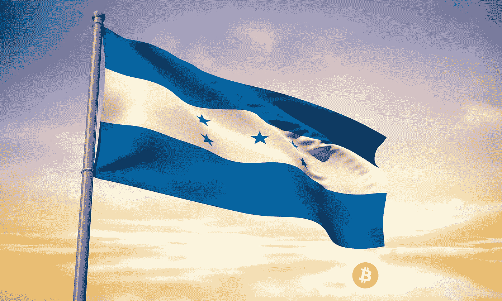

# 洪都拉斯将成为继萨尔瓦多之后第二个采用比特币作为法定货币的国家

> 原文：<https://medium.com/coinmonks/honduras-set-to-become-second-country-after-el-salvador-to-adopt-bitcoin-as-legal-tender-f1c66f789b79?source=collection_archive---------39----------------------->

洪都拉斯可能会成为下一个接受比特币作为法定货币的国家，此举可能会震惊传统机构。比特币多头马克斯·凯泽(Max Keizer)最初在上周五发布的一条推文中传播了这一谣言，内容是“正在发生……”，并附有一幅洪都拉斯国旗的图像。

