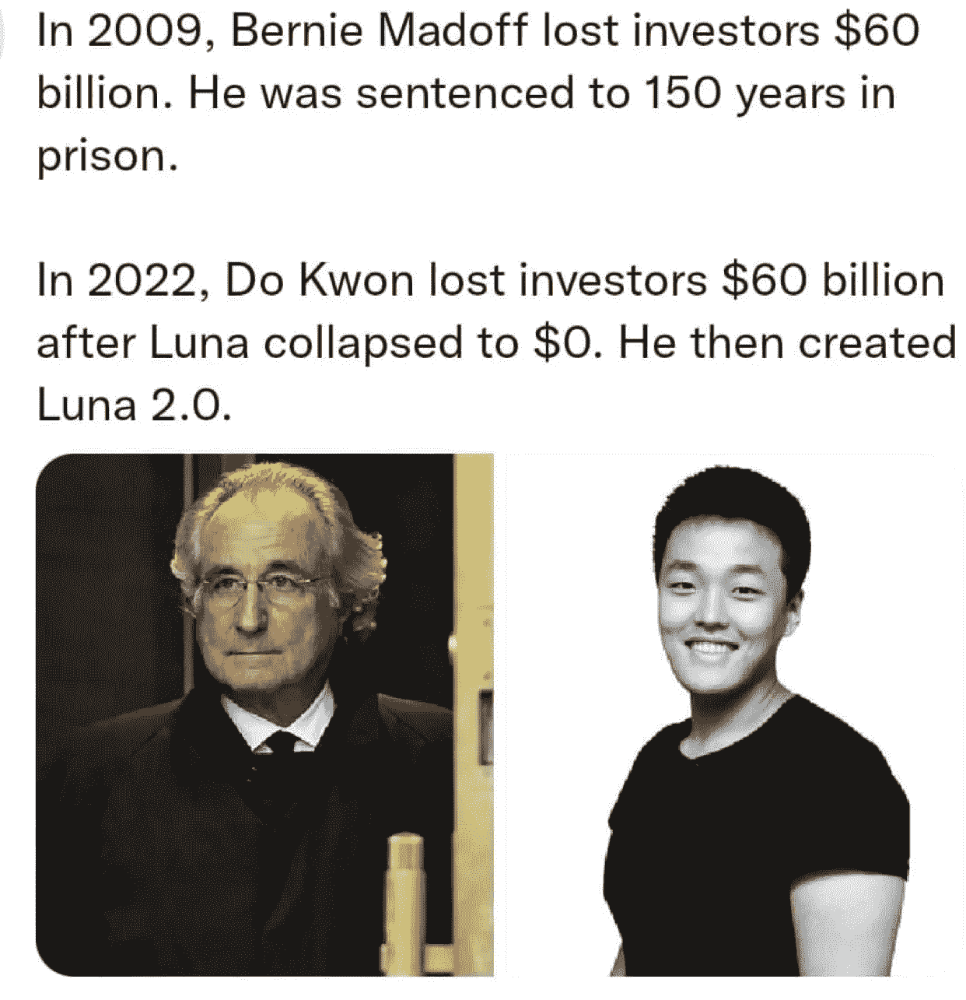

# 老实说，权做了什么违法的事吗？

> 原文：<https://medium.com/coinmonks/honestly-did-do-kwon-do-anything-illegal-ffc763f6aba3?source=collection_archive---------13----------------------->

So did Do Kwon was wrong, but did he do anything illegal?

到现在为止，你可能已经听说过 Terra / Luna 的崩溃以及它在秘密世界中产生的冲击波。

甚至你的阿姨和抓斗司机可能会喋喋不休。

TerraUSD 是由 Terraform 实验室(由 Do Kwon 创建)开发的算法稳定币，在一次“攻击”导致其退出后崩溃，导致 450 亿美元损失。

在 5 月份，总共有 830 亿美元退出了 web3 的去中心化金融领域，这在很大程度上归因于 Terra 的影响。

这不仅是对 Terra 的毁灭性打击，也是对权个人和整个加密生态系统的毁灭性打击。

又是一记从黑暗中袭来的上钩拳，直直地打在了 crypto 的下巴上。

只是这一次，这些文字可能是写在墙上的。

在 Terra/Luna 灭亡前的几个月里，人们一直在挑战由算法支持的 stablecoin 的可持续性和完整性，因为它没有储备支持其价值。

Twitter 上的秘密影响者向道权开火，他激烈地反击，有时带着纯粹的傲慢和不屑。

有时很滑稽，有时听起来很粗鲁。

随着时间的推移，Terra 疯狂的快速流行似乎真的冲昏了他的头脑，模糊了他的客观性和视野。

Terra 的崩溃就像是秘密世界的核爆炸。

它不仅影响了那些与 Terra/Luna 直接相关的人，也对其他链、创业公司、企业、协议、建立在它之上的层产生了连锁反应。

就像纸牌搭的房子一样，当一张纸牌在地基上移位时，其他所有的纸牌都会随之倒下，而且通常会很快倒下。

“权的所作所为非常恶劣。但这并不一定意味着这是违法的。人们每天都在做可怕的事情——比如拒绝帮助一只溺水的小狗，或者对一位祖父母做出残忍的行为——但是，出于这样或那样的原因，这些行为并不被认为是犯罪。”

For reals?

必须提出一些问题:

权做错什么了吗？

他有没有触犯法律？

他应该被关进监狱吗？

是否有理由在法庭上起诉他？

有欺诈或庞氏骗局的证据吗？

Kwon 是故意欺骗客户的吗？

“根据专门研究白领犯罪的法律教授和前检察官兰德尔·埃利亚松的说法，任何刑事案件都必须证明权犯有欺诈罪，而不是鲁莽的管理不善——这很难做到。”

这比我们想象的要复杂得多。

证明他是否有意欺骗投资者，并有意图欺骗客户的钱是非常复杂的。

没有人能确切地证明道权个人从崩溃中获得了财富。

因此，在我们向空中挥舞拳头，指责跆拳道骗局和欺诈之前，请记住，没有人因为无数导致 2008 年金融危机的鲁莽决定而入狱。

嗯，相信更多的细节和幕后信息很快就会公布。

Are whistle-blowers a good or bad thing for crytpo?

自从发布了之前闻所未闻的后台交易和道权及其投资者的详细信息以来，揭发者 FatManTerra 已经获得了近 5 万名粉丝。

多汁。

事实是，至少在表面上，道权没有做任何过分违法的事情。

任何想要购买 Terra/Luna 的人都可以合法、透明、公开地购买。

没有欺骗或欺骗任何人的明显意图。

> 加入 Coinmonks [Telegram group](https://t.me/joinchat/Trz8jaxd6xEsBI4p) 并了解加密交易和投资

当协议做了它应该做的事情时，每个人都赚了很多钱，没人会去问那些困难的问题。

所以，权的所作所为也许是鲁莽的、愚蠢的和错误的，但是它是非法的吗？它违反了任何法律吗？

这是一个艰难的情况，我们作为一个社区必须弄清楚，因为我们继续通过 cryptoland 的旅程。

-

权应该进监狱吗？

-

# startups # business # startupx # growth # success # social media # culture # entrepreneur # strategy # dokwon # luna # terra # terraformlabs # stable coin # luna crash # cryptoland # ust # cryptogeddon #比特币#死亡螺旋#bankrun