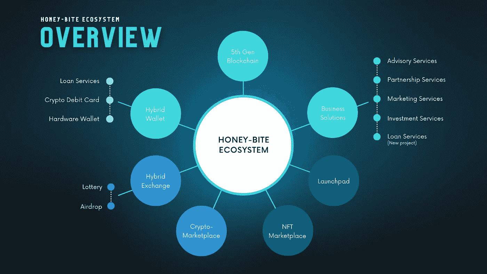

# 什么是蜜咬生态系统？

> 原文：<https://medium.com/coinmonks/honey-bite-ecosystem-1047c0cc76d9?source=collection_archive---------46----------------------->

> 蜜咬生态系统是世界上最广泛的人工智能驱动的加密货币生态系统。这将在一个保护伞下提供几乎所有的设施，以及神经网络支持的第五代区块链技术和混合平台。

通过为个人和商业解决方案提供完全先进但易于访问的生态系统，Honey-Bite 将自己定位为加密世界的重要和全面的价值提供商。

Honey-Bite 生态系统的使命是 100%符合这一方向，以确保方便和易用，同时存储或交易加密货币，使加密更容易在全球范围内使用。即使是 Honey-Bite 生态系统也将确保通过用户友好的选项轻松实现所有功能来处理 crypto。例如发送、接收、存储和支付真实世界的商品和服务，而无需在任何时候将它们转换成法定货币。

> 交易新手？试试[加密交易机器人](/coinmonks/crypto-trading-bot-c2ffce8acb2a)或者[复制交易](/coinmonks/top-10-crypto-copy-trading-platforms-for-beginners-d0c37c7d698c)

所有的加密平台都将根据市场需求通过不断创新来开发。凭借其高性价比和高度先进的服务，用户、创始人和投资者，每个人都将平等受益。Honey-Bite 致力于使 crypto 在全球范围内更加用户友好。

Honey-Bite 生态系统的所有平台和服务都将通过，

**1。混合钱包:**混合钱包将是保管型和非保管型钱包的合并版本，内置加密贷款和加密借记卡以及硬件钱包。

> **1.1 Honey-Bite Lone Portal:** 高达 60%的免息贷款，即时简单。
> 
> **1.2 蜜咬借记卡:**用户可以随时随地将任意稳定的加密货币提取为任意法定货币，无需年费。
> 
> **1.3 硬件钱包:**将拥有先进的安全功能和多重加密存储设施。

**2。Honey-Bite Launchpad:** 将摆脱机器人和不同的操纵战术，集中控制等等。将为风投提供专门的平台和先到先得的设施。

**3。混合交易所:**混合加密货币交易所将通过跨越限制，结合 CEX 和 DEX 平台的积极特征。

> **3.1 抽奖:**对于那些总是在寻找更好的命运测试或新的刺激的用户来说，这是最好的平台。用户可以通过这个平台获得巨大的收益。
> 
> **3.2 空投:**用户可以通过该平台填写空投表格，获得代币奖励。只会提供经过验证的空投。

**4。Honey-Bite 第五代区块链:**启用了神经网络，人工智能驱动的区块链将是用户友好的，超快的，具有极端的安全特性。

**5。秘密市场:**它相当于一个电子市场。用户可以用加密货币支付商品和服务，而无需将其兑换成纸币。

**6。NFT 市场:**用户可以购买艺术品、游戏物品、收藏品、瞬间 NFT 等。此外，它将有一个铸造设施。

**7。商业解决方案:**通过这些商业解决方案，顾问、投资者和创始人，每个人都会同时受益。

> **7.1 咨询服务:**通过这个平台，人们可以成为各种密码项目中的团队成员。
> 
> **7.2 合作伙伴服务:**通过这个平台，人们将获得与各种密码项目合作的机会。
> 
> **7.3 营销服务:**将为加密项目提供最佳营销服务。
> 
> **7.4 投资服务:**它将作为 crypto 创始人和投资者之间的桥梁。此外，这个平台将把投资者聚集在一起。
> 
> **7.5 贷款服务(新项目)**:将提供贷款服务以支持新的加密项目。

在未来，Honey-Bite 将根据加密货币市场的需求推出或采用新的系统和设施，成为加密货币应用的领导者。

***访问我们的网站了解更多信息
网址:***[***honey-bite.com***](https://honey-bite.com/)

***更多信息关注我们
推特:***[***twitter.com/Honey_BiteOffic***](http://twitter.com/Honey_BiteOffic)

> 加入 Coinmonks [电报频道](https://t.me/coincodecap)和 [Youtube 频道](https://www.youtube.com/c/coinmonks/videos)了解加密交易和投资

# 另外，阅读

*   [BigONE 交易所评论](/coinmonks/bigone-exchange-review-64705d85a1d4) | [CEX。IO 审查](https://coincodecap.com/cex-io-review) | [交换区审查](/coinmonks/swapzone-review-crypto-exchange-data-aggregator-e0ad78e55ed7)
*   [最佳比特币保证金交易](/coinmonks/bitcoin-margin-trading-exchange-bcbfcbf7b8e3) | [比特币保证金交易](https://coincodecap.com/bityard-margin-trading)
*   [加密保证金交易交易所](/coinmonks/crypto-margin-trading-exchanges-428b1f7ad108) | [赚取比特币](/coinmonks/earn-bitcoin-6e8bd3c592d9)
*   [WazirX vs coin dcx vs bit bns](/coinmonks/wazirx-vs-coindcx-vs-bitbns-149f4f19a2f1)|[block fi vs coin loan vs Nexo](/coinmonks/blockfi-vs-coinloan-vs-nexo-cb624635230d)
*   [BlockFi 信用卡](https://coincodecap.com/blockfi-credit-card) | [如何在币安购买比特币](https://coincodecap.com/buy-bitcoin-binance)