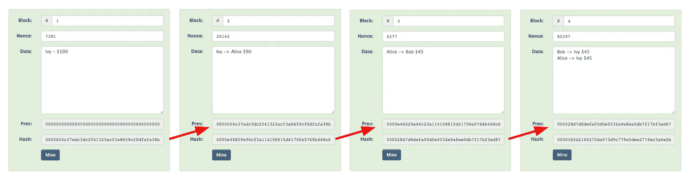

# 亲爱的，我铸造了一个 NFT！

> 原文：<https://medium.com/coinmonks/honey-i-mint-an-nft-dc7c75fdc1d2?source=collection_archive---------51----------------------->

## **第四章:分布式总账系统**

**重述** : *艾米向扎克介绍了比尔的 NFT。*

 [## 亲爱的，我铸造了一个 NFT！

### 第三章:6900 万美元的数字艺术

medium.com](/coinmonks/honey-i-minted-an-nft-f31df65cbf) 

那是一个星期天的早上 8 点，艾米仍然很困。她不是一个早起的人。

“嗨，杰斯！认识一下扎克，我的丈夫。”当杰西卡在线时，艾米通过监视器向杰西卡问好。他们开了一个电话会议。艾米扎克和杰西卡。

“嗨，杰西卡！很高兴见到你。抱歉这么晚打扰你。我希望还没超过你的就寝时间，”扎克说。“感谢您回应我们的请求，直接接听我们的电话。”杰西卡比扎克的时区早 15 个小时。

“嗨，扎克！没关系。很高兴终于见到你了。艾米一直在谈论你，我觉得你也是我的笔友。我是一个夜猫子。这对我来说还是太早了。所以不用担心。”杰西卡说。

“我告诉过你，”艾米说，“这对她来说是完美的时机，但对我来说是糟糕的时机。我这样做是为了你。”艾米在向扎克做鬼脸。扎克也以一张脸回应。

“你们真可爱。但是你让我打这个电话就是为了让我看着你们俩吃醋吗？”杰西卡开玩笑地说。

艾米咯咯地笑着说:“当然不是。我告诉他我周五铸造的 NFT，他问了我很多我无法回答的问题，当我们在金门公园野餐时，他困扰了我一整天。所以，我想我最好找你帮忙。SOS！”艾米不停地挥舞着双手，就好像她被困在了一个小岛上，终于看到一艘船向她驶来。和艾米在一起从来不会无聊。

杰西卡笑了，“你真有趣，艾米。好吧，扎克，你有什么问题，提出来。杰西卡随时为您服务。虽然我自己也不完全是专家。”

“我相信你知道的比我们多。好了，第一个问题来了，NFT 到底是什么？我得到的印象是，这是数字艺术，但艾米说，这是某种证书。是证书、数字艺术还是两者兼而有之？”扎克说。

“是也不是！NFT，代表不可替代的令牌。因此，它可以是任何东西的数字证书。艾米是正确的，NFT 是一个证书，但不仅仅是数字艺术。它可以用于任何形式的艺术。它也可以代表一辆汽车，一个口袋妖怪卡，财产或任何收藏品。只要它是独一无二的，独一无二的，就可以用 NFT 来表示，这样就可以在区块链上被记录和追踪。”

“区块链，”扎克轻声笑道。“我知道什么是块，我也知道什么是链，但区块链，我一点头绪都没有。我是这样一个 noob。”

“别自责了。你并不孤单。事实上，你听说过区块链，你已经把自己放在世界人口的前 20%了。试着问问你周围的十个朋友，我敢打赌他们中听说过区块链的不超过两个，”杰西卡说。“艾米告诉我你在一家审计公司工作，所以你对会计和财务了如指掌，对吗？”

“我不得不，那是支付账单，并把食物放在桌子上，”扎克笑着回答。

Distributed Ledger Technology (DLT)

所以，通常情况下，会计账簿只提供给会计部门、审计师和董事会的人使用。其他任何人都无法获得该信息。大多数人只看到摘要报告，像资产负债表和损益表。作为一名审计员，你应该知道这里可能有一些操纵。与传统的会计惯例相反，区块链让每个人检查每一笔交易，所有的交易甚至在加入账簿之前就被立即审计。”杰西卡解释道。

"那么，区块链是一个向所有人公开的总账系统吗？"扎克在寻求确认。

“的确，这就是为什么区块链也被称为分布式账本技术的原因。它基本上是分类账，就像会计系统中的月度分类账一样连接在一起。虽然这个月的分类账和下个月的分类账之间的联系是期末余额和期初余额，但区块链的分类账(顺便提一下，它们被称为“块”)是使用“哈希”连接起来的，这些哈希是使用一些密码以及在相应块中收集的信息生成的。就像期末余额与相应月份的分类账中记录的交易密切相关一样。”杰西卡解释道。

“对，哈希！我在见你之前做了一些功课，这样我就不会听起来像个白痴。我通过阅读谷歌先生推荐给我的一些文章，试图弄清楚到底什么是“hash”。我向你发誓，我听起来都是胡言乱语。既然你给我解释了，我终于明白了。非常感谢！你真的把我从疯狂中拯救了出来！”扎克惊呼道。

“嘿，Jessica，我真的很好奇，想知道更多关于 NFTs 的事情。还有为什么有人愿意花那么多钱买一个证书？但是我得走了。30 分钟后我有个约会。我希望我能花更多的时间问更多的问题。我让你和艾米继续叙旧。我们很快会聊的。而且从心底里，”扎克把右手放在左胸上，“非常感谢你。和你聊 10 分钟比我看半天书好多了。"

“别客气，”杰西卡说，“这是我终于见到你的完美借口。”她咯咯地笑了。

“对！艾米经常谈起你，但从来没有给我们介绍过彼此。”扎克笑着对艾米谁一直坐在他旁边，她的头在餐桌上，他们坐在笔记本电脑。

“所以是我的错？”艾米直视着扎克的眼睛。

“当然，这是你的错。指责别人总是更容易。”扎克开玩笑地回答道。“好吧，再见。今天晚些时候见。”扎克吻了艾米一下，然后转向显示器说:“杰西卡，我们很快会再见的。哦，圣诞快乐！”

扎克在打电话之前已经穿好衣服，抓起手机和钱包，走出了门。他对准时很挑剔。

“嘿，杰西，我想我需要回到床上去。我们下次再聊，好吗？”艾米闭着眼睛说。

“当然可以。我马上就要结束这里的工作了，我自己也准备睡觉了。我很快会和你谈的。再见！”杰西卡挥挥手。

“拜拜！”艾米放弃了。关闭她的笔记本电脑，走几步到沙发上，敲了下来。

 [## 亲爱的，我铸造了一个 NFT！

### 第五章:抢劫

ivyfung1.medium.com](https://ivyfung1.medium.com/honey-i-minted-an-nft-81c772460fe5) 

*保留所有权利。*

> 加入 Coinmonks [电报频道](https://t.me/coincodecap)和 [Youtube 频道](https://www.youtube.com/c/coinmonks/videos)了解加密交易和投资

# 另外，阅读

*   [3 商业评论](/coinmonks/3commas-review-an-excellent-crypto-trading-bot-2020-1313a58bec92) | [Pionex 评论](https://coincodecap.com/pionex-review-exchange-with-crypto-trading-bot) | [Coinrule 评论](/coinmonks/coinrule-review-2021-a-beginner-friendly-crypto-trading-bot-daf0504848ba)
*   [莱杰 vs n rave](/coinmonks/ledger-vs-ngrave-zero-7e40f0c1d694)|[莱杰 nano s vs x](/coinmonks/ledger-nano-s-vs-x-battery-hardware-price-storage-59a6663fe3b0) | [币安评论](/coinmonks/binance-review-ee10d3bf3b6e)
*   [Bybit Exchange 审查](/coinmonks/bybit-exchange-review-dbd570019b71) | [Bityard 审查](https://coincodecap.com/bityard-reivew) | [Jet-Bot 审查](https://coincodecap.com/jet-bot-review)
*   [3 commas vs crypto hopper](/coinmonks/3commas-vs-pionex-vs-cryptohopper-best-crypto-bot-6a98d2baa203)|[赚取秘密利息](/coinmonks/earn-crypto-interest-b10b810fdda3)
*   最好的比特币[硬件钱包](/coinmonks/hardware-wallets-dfa1211730c6) | [BitBox02 回顾](/coinmonks/bitbox02-review-your-swiss-bitcoin-hardware-wallet-c36c88fff29)
*   [BlockFi vs Celsius](/coinmonks/blockfi-vs-celsius-vs-hodlnaut-8a1cc8c26630)|[Hodlnaut 点评](/coinmonks/hodlnaut-review-best-way-to-hodl-is-to-earn-interest-on-your-bitcoin-6658a8c19edf) | [KuCoin 点评](https://coincodecap.com/kucoin-review)
*   [Bitsgap 审查](/coinmonks/bitsgap-review-a-crypto-trading-bot-that-makes-easy-money-a5d88a336df2) | [Quadency 审查](/coinmonks/quadency-review-a-crypto-trading-automation-platform-3068eaa374e1) | [Bitbns 审查](/coinmonks/bitbns-review-38256a07e161)