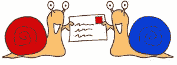

# 亲爱的，我铸造了一个 NFT！

> 原文：<https://medium.com/coinmonks/honey-i-minted-an-nft-e75cca1a3535?source=collection_archive---------34----------------------->

## 第二章:**杰西卡，笔友**

**重述:** *艾米告诉扎克她铸造了一个 NFT。扎克试图了解这是什么，并问是谁介绍给她的。*

 [## 亲爱的，我铸造了一个 NFT！

### 第一章:戈壁，狗

ivyfung1.medium.com](https://ivyfung1.medium.com/honey-i-minted-an-nft-eca81e52e0e7) 

“亲爱的，晚饭吃什么？”扎克淋浴后走进厨房，看起来比以前精神多了。他看到餐桌上的比萨饼和蛤蜊杂烩，微微皱起了眉头。除了冰淇淋，他不喜欢冷冻或罐装食品。

艾米看到了，抱歉地笑着说，“我们要吃我昨天烤的苹果派，甜点是香草冰淇淋。”扎克又满面笑容了。他坐在桌旁，静静地吃着晚餐。

扎克是那种循规蹈矩的人。只要他出门，他总是穿戴整齐；他总是注意餐桌礼仪；他是一名审计员。另一方面，艾米是一个艺术家，也是一个健谈的人。她是一名画家，专攻油画，最近开始接触像素艺术。

"亲爱的，你记得我告诉过你我有一个马来西亚的笔友吗？"艾米问扎克。

“是的，杰西卡，对吗？”扎克记性很好。“你家搬走后你就和她失去了联系，对吗？为什么突然提起她？”

“你问我如何了解 NFTs。是她介绍给我的。她也是一名像素艺术家。我们通过我加入的社区重新联系上了。真是奇迹，对吧？这将是我有史以来最好的圣诞礼物。”艾米很兴奋地告诉扎克同学聚会的事。她的手势被夸大了。她随时会从椅子上跳起来，这是不足为奇的。

“你知道我们是怎么知道我们是笔友的吗？你知道，我在我们的小组公告板上分享了像素化的戈壁，杰西卡留言说她有一个来自纽约的笔友，他有一只长得像戈壁的狗。这引发了一场对话。然后她告诉我她来自马来西亚。她的笔友是一个从香港移民到纽约的中国女孩，我去了…等等…就是我！”艾米的眼睛睁得大大的。她看起来像看到了鬼。她说话时总是很活跃。

“那么，这个 NFT 是什么东西？”扎克插话道。他知道如果他不阻止艾米的话，她会没完没了地讲述她是如何再次遇见杰西卡的。

艾米舀了些蛤蜊杂烩和比萨饼一起吃了一口。“这是一项数字资产。可以用来交易加密货币。”

“你的意思是，如果不是 NFT，你就不能用加密货币出售你的艺术品？”扎克问道。“铸造这种 NFT 有什么好处，我怎么才能看出这是 NFT 的作品呢？你的戈壁像素艺术和你之前给我看过的一模一样？”扎克越来越沮丧了。他进步不大。

“我认为你可以为加密货币艺术。”艾米一边大口吃着比萨饼，一边回答道。现在，扎克已经吃完晚餐，并给自己倒了一杯酒。

“像素艺术看起来还是老样子。是不是 NFT 没什么区别。好吧，让我引用杰西卡的话。NFT 就像是区块链上任何独特资产的存在证明。”艾米自信地背诵，把最后一口比萨饼塞进嘴里，掸了掸手。她伸手去拿酒瓶，拿起扎克放在她身边的空杯子，给自己倒了一杯阿根廷马尔贝克。她的最爱。

"所以你的意思是人们会用加密货币购买你的像素艺术证书？"扎克问，“这听起来很荒谬。”

“对不对？我也这么认为，但它正在发生。你知道，有人以 6900 万美元的价格出售了他的数字艺术拼贴画。这不是很疯狂吗？来，我给你看。我去拿我的笔记本电脑。”艾米站了起来，但她还没来得及采取行动，扎克说:“你答应的香草冰淇淋苹果派在哪里？”

"指挥中心，让我尽快准备好"艾米走向冰箱，从冰箱里拿出两个迷你苹果派，放进微波炉。“只要几分钟。”她喊道，“你能帮我拿一下笔记本电脑吗？我把它放在茶几上。”

艾米从橱柜里拿出两个甜点盘子，舀了两勺香草冰淇淋放在上面。“叮”苹果馅饼做好了。艾米把它们放在盘子里，并在冰淇淋上撒了一些巧克力米饭。

这时候，扎克已经带着笔记本电脑走进了厨房。"这是你的苹果派。"艾米把一个盘子递给扎克。

“我应该用手吃饭吗？”扎克说。

"行动"艾米从抽屉里拿出两把餐叉，递给扎克一把。“不好意思。”她笑了。

艾米从扎克手中接过笔记本电脑，说道:“让我给你看看这 6900 万美元的艺术品。”

 [## 亲爱的，我铸造了一个 NFT！

### 第三章:6900 万美元的数字艺术

ivyfung1.medium.com](https://ivyfung1.medium.com/honey-i-minted-an-nft-f31df65cbf) 

*版权所有*

> 加入 Coinmonks [电报频道](https://t.me/coincodecap)和 [Youtube 频道](https://www.youtube.com/c/coinmonks/videos)了解加密交易和投资

# 另外，阅读

*   [Bybit 融资融券交易](/coinmonks/bybit-margin-trading-e5071676244e) | [币安融资融券交易](/coinmonks/binance-margin-trading-c9eb5e9d2116) | [Overbit 审核](/coinmonks/overbit-review-9446ed4f2188)
*   [有哪些交易信号？](https://coincodecap.com/trading-signal) | [比特斯坦普 vs 比特币基地](https://coincodecap.com/bitstamp-coinbase)
*   [10 本关于加密的最佳书籍](https://coincodecap.com/best-crypto-books) | [英国 5 个最佳加密机器人](https://coincodecap.com/uk-trading-bots)
*   [Koinly 点评](https://coincodecap.com/koinly-review) | [Binaryx 点评](https://coincodecap.com/binaryx-review) | [Hodlnaut vs CakeDefi](https://coincodecap.com/hodlnaut-vs-cakedefi-vs-celsius)
*   [40 个最佳电报频道](https://coincodecap.com/best-telegram-channels) | [1xBit 回顾](https://coincodecap.com/1xbit-review) | [Keevo 钱包回顾](https://coincodecap.com/keevo-wallet-review)