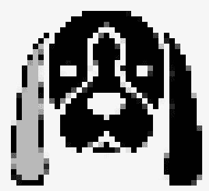

# 亲爱的，我铸造了一个 NFT！

> 原文：<https://medium.com/coinmonks/honey-i-minted-an-nft-eca81e52e0e7?source=collection_archive---------11----------------------->

## **第一章:戈壁，狗**

*序幕*

*作为一名培训师，我经常听到听众为他们将要提出的“愚蠢”问题道歉。没有什么“愚蠢”的问题，尤其是关于“区块链”这个如此新鲜的词，甚至“区块链”这个词本身也只有十年的历史。因此，我没有写一本关于区块链、NFTs 之类的学术书籍，而是挑战自己，讲述人们了解这项新技术的故事。我将根据我遇到的问题和当前的问题，对它进行连载。*

我希望你会像我喜欢创作它一样喜欢它。

“亲爱的，我铸造了一个 NFT！”当她的丈夫扎克下班回家时，艾米大声喊道。

“你铸造了什么？是某种钱吗？这合法吗？”扎克一边问，一边把他的黑色风衣和鞋子放回入口处的柜子里。然后他按下一个按钮，可以看到紫色的光从橱柜的裂缝中渗出。

“一个 NFT，不可替代的令牌！”艾米说，从厨房走进客厅。她继续说道，“NFT 是区块链上独一无二的数字资产。”扎克正在把布面具和袜子放进门边有盖的篮子里。他们是那种比较警惕的夫妻。

“等等，什么链子？请说英语！”扎克一脸迷惑地说，完全迷路了。

艾米笑了。“来，我给你看看。”她把扎克带到餐桌前，她的笔记本电脑就放在那里，并给扎克看了一个网站。在网站上，它有一张一只白耳朵黑狗的像素化图片。

Gobi, the dog.

“那是戈壁。我看过你为它做了很多像素化的图片。所以，现在像素化的艺术被称为 NFT？”艾米看了扎克展示的东西，似乎没有解决他的任何问题。戈壁是艾米十几岁时养的一只狗。它是老死的，15 人类年的长寿狗。她非常伤心，决定从纽约搬到旧金山，和她当时的男朋友扎克在一起，进一步追求她的艺术生涯。

“是的，亲爱的。这是一张戈壁的图片。但是，不，像素化艺术不叫 NFT。它之所以被称为 NFT，是因为我把它放在了区块链上。”艾米故意放慢语速，试图传达信息。她通常说得很快。

扎克只是看着艾米，显然一句话也没听清楚。“但它看起来和以前完全一样。你给它戴了什么链子让它与众不同？”

“一个区块链。某种网络，数据只能写，不能编辑。”Zack 可以从 Amy 的口吃和向上看的眼神中看出，她正在努力回忆她对这个新事物的记忆。

"你为什么想要铸造一个 NFT？"扎克问道。

“我可以卖掉 NFT。这张戈壁的像素化图片，如果卖出去，我会得到 0.1 以太坊的报酬，大概是 300 美元。与我通常收取的任何委托作品或其他展出作品的费用相比，并不算多。但是，由于这些 NFT 对我来说是新的东西，像素艺术对我来说也是新的，我用一个新的别名发表了这篇文章，我完成一件作品所需的时间相对较少，加上我不需要购买任何画布，我认为我对 300 美元感到满意。”艾米恢复了正常的语速和口出狂言的习惯。她看起来充满希望，好像她铸造的名为“天使”的 NFT 已经售出。

“哇，等等，等等，等等！慢点，亲爱的。一个一个地告诉我，在你用这个区块链掐死我之前。”扎克开玩笑说。“我听说过以太坊。这是某种加密货币，对吗？类似比特币的东西？但是这和 NFTs 有什么关系呢？你为什么不把你的 NFT 换成美元呢？我不认为加密货币是法定货币。”扎克听起来相当关心。

艾米笑着说:“现在还不要太担心。我刚刚铸造了 NFT，我不认为它会很快被取走。我们会解决的。当我第一次遇到这个问题时，我就像你现在一样茫然，我花了整个下午试图理解它，现在仍然像你现在一样茫然。”艾米不禁自嘲，“你工作累了。去冲个澡，梳洗完毕，晚饭就准备好了。我们会在晚餐时详细讨论。不要太久。”她把扎克赶出了厨房。

“好吧！一会儿见。告诉我你是怎么看到 NFT 和区块链的东西的。”扎克朝主卧室走去。

“哦，你不会相信我是怎么知道这些的！我们会边吃边聊。”艾米回答道。

回到厨房，艾米打开烤箱，从冰箱里拿出一个中等大小的冷冻披萨，准备好，扔进烤箱。然后，她从橱柜里拿出一罐蛤蜊浓汤，准备好了。所有这些事情不到十分钟就完成了。她不得不迅速做些东西，因为她一整天都沉迷于学习 NFT，甚至忘了带午餐。她饿极了。

在等待比萨饼做好的时候，她整理了餐桌，收集了一些她用作草稿的纸，并把它们一起放在一个垃圾桶里准备回收。

 [## 亲爱的，我铸造了一个 NFT！

### 第二章:杰西卡，笔友

ivyfung1.medium.com](https://ivyfung1.medium.com/honey-i-minted-an-nft-e75cca1a3535) 

*保留所有权利。*

> 加入 Coinmonks [电报频道](https://t.me/coincodecap)和 [Youtube 频道](https://www.youtube.com/c/coinmonks/videos)了解加密交易和投资

# 另外，阅读

*   [CoinFLEX 评论](https://coincodecap.com/coinflex-review) | [AEX 交易所评论](https://coincodecap.com/aex-exchange-review) | [UPbit 评论](https://coincodecap.com/upbit-review)
*   [AscendEx 保证金交易](https://coincodecap.com/ascendex-margin-trading) | [Bitfinex 赌注](https://coincodecap.com/bitfinex-staking) | [bitFlyer 评论](https://coincodecap.com/bitflyer-review)
*   [Bitget 回顾](https://coincodecap.com/bitget-review)|[Gemini vs block fi](https://coincodecap.com/gemini-vs-blockfi)cmd |[OKEx 期货交易](https://coincodecap.com/okex-futures-trading)
*   [AscendEx Staking](https://coincodecap.com/ascendex-staking)|[Bot Ocean Review](https://coincodecap.com/bot-ocean-review)|[最佳比特币钱包](https://coincodecap.com/bitcoin-wallets-india)
*   [霍比评论](https://coincodecap.com/huobi-review) | [OKEx 保证金交易](https://coincodecap.com/okex-margin-trading) | [期货交易](https://coincodecap.com/futures-trading)