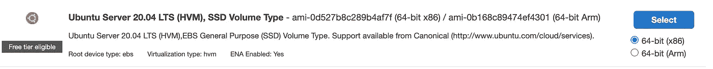
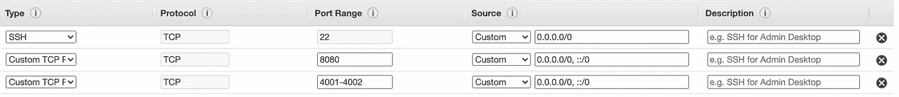
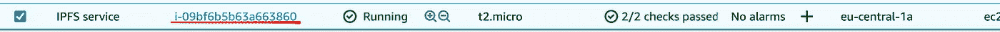
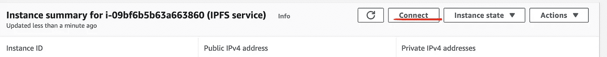
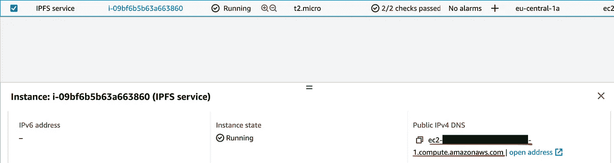
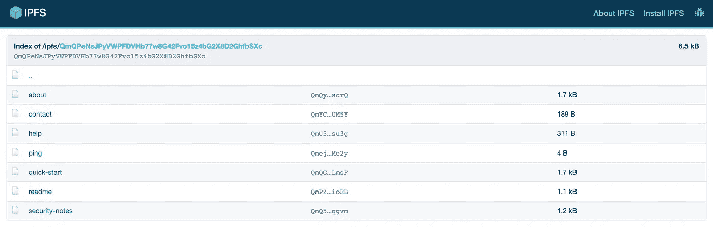

# 通过 IPFS 和 AWS 托管分散式应用程序

> 原文：<https://medium.com/coinmonks/host-a-decentralised-application-with-ipfs-and-aws-1c8e147284ce?source=collection_archive---------0----------------------->

*关于如何使用*[](https://ipfs.io/)**和 AWS EC2* 托管 dApp(关于雪崩)的快速分步指南*

*本文是如何在 Avalanche 上构建 dApp 系列文章的第 3 部分。点击此处查看其他部分:*

*   *[第 1 部分:使用 Hardhat 创建并部署一个 Solidity 契约来雪崩](/@a.a.lechner/create-and-deploy-a-solidity-contract-to-avalanche-with-hardhat-2c5cd5e4fa93)*
*   *[第二部分:用醚、金属屏蔽和反应制造雪崩 dApp](/@a.a.lechner/create-an-avalanche-dapp-with-ethers-metamask-and-react-342d8d22cb30)*
*   *[第 4 部分:链接一个域名到 IPFS 托管的 dApp](/@a.a.lechner/link-a-domain-to-a-dapp-hosted-on-ipfs-6cf155ef689f)*

*👉 **TLDR** :这篇文章解释了如何自己运行一个 [IPFS](https://ipfs.io/) 节点。如果你不想这样做，但仍然希望以分散的方式托管你的文件，你可以选择使用 [pinning 服务](https://docs.ipfs.io/concepts/persistence/#pinning-services)，如 [Pinata](https://www.pinata.cloud/) 、 [Eternum](https://www.eternum.io/) 或 [Fleek](https://fleek.co/hosting/) 。*

## *使用的软件版本:*

*   *nodejs: v16.13.0*
*   *go-ipfs: v0.11.0*
*   *ubuntu 服务器:20.04 LTS*

## *步骤 1:创建并启动 AWS EC2 实例*

*登录 [AWS 管理控制台](https://aws.amazon.com/console/)并点击`Services > Compute > EC2`。在那里点击`Launch instances`。*

*为了简单起见，我们将使用 Ubuntu [AMI](https://docs.aws.amazon.com/AWSEC2/latest/UserGuide/AMIs.html) 。在搜索栏中搜索`Ubuntu`，并选择最新版本。如果您计划使用 AWS 提供的免费层(第一年免费)，请注意 AMI 包含标签`Free tier eligible`:*

**

*在下一页上，您可以选择实例类型，这将定义服务可用的资源。我们再次选择免费层提供的内容，并选择`t2.micro`。*

*现在跳过几个步骤(我们将使用默认值)并点击`Configure Security Group`。在那里，我们将开放端口 8080 和 4001–4002:*

**

*接下来按下`Review and Launch`。这将跳过几个步骤(配置、存储等。)但无论如何我们都要坚持默认值。*

*然后点击`Launch`。这将打开一个对话框来创建一个新的密钥对。选择`create a new key pair`并下载文件，我们将在下一步中需要密钥对文件来通过 SSH 连接到我们的实例。然后点击`Launch Instances`。*

## *步骤 2:连接到您的实例*

*现在让我们连接到创建的实例。一旦实例启动，我们有不同的选择。*

***选项 1** :从 AWS 控制台连接。为此，我们需要做的就是点击实例 id 并按下`Connect`。*

****

***选项 2** :从您的机器通过 SSH 连接。为此，我们首先需要为我们在上一步中下载的密钥对授予正确的权限:*

```
*$ chmod 400 ipfs-key-pair.cer*
```

*现在您可以使用仪表板上显示的`Public DNS (IPv4)`通过 SSH 连接:*

**

```
*$ ssh -i ipfs-key-pair.cer ubuntu@ec2-x-x-x-x.xx-xxxx-x.compute.amazonaws.com*
```

## *第三步:安装 IPFS*

*我们现在连接到我们的 EC2 实例，并准备安装 IPFS。让我们从[发布站点](https://dist.ipfs.io/#go-ipfs)获取`go-ipfs`的最新版本:*

```
*$ wget [https://dist.ipfs.io/go-ipfs/v0.11.0/go-ipfs_v0.11.0_linux-amd64.tar.gz](https://dist.ipfs.io/go-ipfs/v0.11.0/go-ipfs_v0.11.0_linux-amd64.tar.gz)
$ tar xvfz go-ipfs_v0.11.0_linux-amd64.tar.gz
$ rm go-ipfs_v0.11.0_linux-amd64.tar.gz*
```

*现在让我们安装它:*

```
*$ sudo ./go-ipfs/install.sh
Moved ./go-ipfs/ipfs to /usr/local/bin*
```

*您可以通过运行以下命令来检查安装是否成功:*

```
*$ ipfs version
ipfs version 0.11.0*
```

*你可以在官方的 [IPFS 文档](https://docs.ipfs.io/install/command-line/#official-distributions)中找到不同平台更详细的安装指南。*

## *步骤 4:初始化 IPFS 存储库*

*现在，让我们为 IPFS 回购设置文件夹。在本教程中，我们将使用`/home/ubuntu/ipfs/data`，但你可以使用任何你想要的路径。*

*因此，首先我们创建文件夹:*

```
*$ mkdir /home/ubuntu/ipfs/data*
```

*然后，我们将路径添加到您的 bash 配置文件并重新加载它:*

```
*$ echo 'export IPFS_PATH=/home/ubuntu/ipfs/data' >> ~/.profile
$ source ~/.profile*
```

*现在让我们初始化 IPFS 存储库:*

```
*$ ipfs init --profile server
generating ED25519 keypair...done
peer identity: 12D3KooWQC89gZAV45WbL4ecTofnacJkq6ptQfEFWzcBsu71ED8F
initializing IPFS node at /home/ubuntu/ipfs/data
to get started, enter: ipfs cat /ipfs/QmQPeNsJPyVWPFDVHb77w8G42Fvo15z4bG2X8D2GhfbSXc/readme2022-01-14T10:23:19.179Z ERROR provider.queue queue/queue.go:124 Failed to enqueue cid: leveldb: closed*
```

*如果您在最后得到错误日志，不要担心。根据[该螺纹](https://discuss.ipfs.io/t/error-provider-queue-failed-to-enqueue-cid-leveldb-closed/11551/2)对安装没有任何影响。*

***背景**:我们正在用`server`配置文件运行初始化，所以 IPFS 不会试图发现本地节点(这会导致大量的内部流量)。*

*最后，我们将更新 IPFS 配置以限制使用的存储(默认情况下，我们的实例总共只有 8GB 可用)。我们还将打开端口 8080 上的网关，以便能够访问和查看我们的文件。*

```
*$ ipfs config Datastore.StorageMax 2GB
$ ipfs config Addresses.Gateway /ip4/0.0.0.0/tcp/8080*
```

## *步骤 5:设置 IPFS 守护进程*

*我们希望 IPFS 在 EC2 实例启动时自动启动。为此，我们需要使用`systemctl`服务。*

*让我们创建文件`/lib/systemd/system/ipfs.service`:*

```
*$ sudo nano /lib/systemd/system/ipfs.service*
```

*现在我们将把这个启动配置添加到文件中:*

```
*[Unit]
Description=ipfs daemon
[Service]
ExecStart=/usr/local/bin/ipfs daemon --enable-gc
Restart=always
User=ubuntu
Group=ubuntu
Environment="IPFS_PATH=/home/ubuntu/ipfs/data"
[Install]
WantedBy=multi-user.target*
```

*保存文件并重启`systemctl`守护进程，让它找到新的服务:*

```
*$ sudo systemctl daemon-reload
$ sudo systemctl enable ipfs.service*
```

*现在，我们可以启动服务并检查运行状况:*

```
*$ sudo systemctl start ipfs
$ sudo systemctl status ipfs*
```

*您现在应该会看到类似于以下内容的 IPFS 状态:*

```
*● ipfs.service - ipfs daemon
     Loaded: loaded (/lib/systemd/system/ipfs.service; enabled; vendor preset: enabled)
     Active: active (running) since Fri 2022-01-14 11:26:20 UTC; 3s ago
   Main PID: 17712 (ipfs)
      Tasks: 7 (limit: 1147)
     Memory: 50.4M
     CGroup: /system.slice/ipfs.service
             └─17712 /usr/local/bin/ipfs daemon --enable-gcJan 14 11:26:21 ip-172-31-19-228 ipfs[17712]: Swarm listening on /p2p-circuit
Jan 14 11:26:21 ip-172-31-19-228 ipfs[17712]: Swarm announcing /ip4/127.0.0.1/tcp/4001
Jan 14 11:26:21 ip-172-31-19-228 ipfs[17712]: Swarm announcing /ip4/127.0.0.1/udp/4001/quic
Jan 14 11:26:21 ip-172-31-19-228 ipfs[17712]: Swarm announcing /ip4/18.192.213.16/tcp/4001
Jan 14 11:26:21 ip-172-31-19-228 ipfs[17712]: Swarm announcing /ip6/::1/tcp/4001
Jan 14 11:26:21 ip-172-31-19-228 ipfs[17712]: Swarm announcing /ip6/::1/udp/4001/quic
Jan 14 11:26:21 ip-172-31-19-228 ipfs[17712]: API server listening on /ip4/127.0.0.1/tcp/5001
Jan 14 11:26:21 ip-172-31-19-228 ipfs[17712]: WebUI: [http://127.0.0.1:5001/webui](http://127.0.0.1:5001/webui)
Jan 14 11:26:21 ip-172-31-19-228 ipfs[17712]: Gateway (readonly) server listening on /ip4/0.0.0.0/tcp/8080
Jan 14 11:26:21 ip-172-31-19-228 ipfs[17712]: Daemon is ready*
```

*现在，我们可以尝试使用服务的公共 DNS 获取 IPFS 文档。在浏览器中打开此链接:*

```
*http://ec2-xx-xxx-xxx-xx.xx-xxxx-x.compute.amazonaws.com:8080/ipfs/QmQPeNsJPyVWPFDVHb77w8G42Fvo15z4bG2X8D2GhfbSXc*
```

*您应该会看到这样一个文档:*

**

*如果您得到的是一个异常，请仔细检查您是否为实例上的 TCP 流量打开了端口 8080，并且启用了 IPFS 网关(在命令行中键入`ipfs config Addresses.Gateway /ip4/0.0.0.0/tcp/8080`和`sudo systemctl restart ipfs`)。*

## *第六步:建立 dApp*

*如果您有自己的 dApp，只需构建您的应用程序并跳过这一步。*

*如果您还没有，请查看本系列的[教程 1](/coinmonks/create-and-deploy-a-solidity-contract-to-avalanche-with-hardhat-2c5cd5e4fa93) 和[教程 2](/coinmonks/create-an-avalanche-dapp-with-ethers-metamask-and-react-342d8d22cb30) ，其中解释了如何从头开始创建 dApp。如果你不感兴趣，你也可以在你的本地机器上查看这个回购[https://github.com/lechneal/solidity-hello-world-dapp](https://github.com/lechneal/solidity-hello-world-dapp)的最终代码:*

```
*$ git clone [https://github.com/lechneal/solidity-hello-world-dapp](https://github.com/lechneal/solidity-hello-world-dapp) my-awesome-contract*
```

*为了正确加载托管在 IPFS 上的所有资源，我们希望生成的文件使用相对路径。为此，我们将把行`"homepage": "./",`添加到文件`my-awesome-contract/frontend/package.json`中:*

```
*{
  "name": "frontend",
  "version": "0.1.0",
  "homepage": "./",
  ...
}*
```

*那么，让我们使用以下内容来构建应用程序:*

```
*$ cd my-awesome-contract/frontend
$ npm install
$ npm run build*
```

*这将生成文件夹`my-awesome-contract/frontend/build/`中的所有文件。这是我们希望由 IPFS 托管的文件夹。*

## *步骤 7:上传文件*

*要上传我们的文件，我们将使用`scp`。在本地机器上运行下面的命令，但是调整 keypair 的路径、构建文件的路径和 EC2 实例的主机地址:*

```
*$ scp -i path/to/your/keypair/ipfs-key-pair.cer -r ./build ubuntu@ec2-xx-xxx-xxx-xx.xx-xxxx-x.compute.amazonaws.com:/home/ubuntu/dapp*
```

*这将把 EC2 实例的所有构建文件上传到文件夹`/home/ubuntu/dapp`中。*

## *步骤 8:用 IPFS 添加和固定文件*

*再次通过 AWS 管理控制台或 SSH 连接到 EC2 实例。连接后，您应该能够看到上传的构建文件:*

```
*$ ls /home/ubuntu/dapp
asset-manifest.json  favicon.ico  index.html  logo192.png  logo512.png  manifest.json  robots.txt  static*
```

*现在让我们将整个文件夹添加到 IPFS:*

```
*$ ipfs add -r /home/ubuntu/dapp
added Qmer3X6Y5xtWvZ5qxRZcjJtexwdkApgexwp3StY5hE6abk dapp/asset-manifest.json
added QmcFc6EPhavNSfdjG8byaxxV6KtHZvnDwYXLHvyJQPp3uN dapp/favicon.ico
added QmeAXYf4ehZkXFWnofgtLsh8wx2jUcD51Eg8Ak4dkdbhJ2 dapp/index.html
...
added QmSbWfAidZ4Aqg48K3WjfFiSRKg1RDTQR9Jd6kKRLPSnQU dapp/static/css
added QmYuQ7ZmCM9ZrznKB9SeJSQCjU6SncVBWXi9MM5pFSixcu dapp/static/js
added QmSQZCa31phWCpwGdWTSE2zJLxuWnZVdqawp1mYQ2jwZcA dapp/static
added QmYupNAG5sb6nhgYp5LFzDAW9Tn9kHRQwbLrbKBbbDneAp dapp*
```

*你可以看到整个文件夹被添加到 IPFS。所有文件都是自动固定的(因此在下一次垃圾收集时不会被删除)。*

*🍾🍾🍾好了🍾🍾🍾
您现在应该能够通过使用 dApp 文件夹的散列来加载整个 dApp 了(命令行输出的最后一行):*

```
*added QmYupNAG5sb6nhgYp5LFzDAW9Tn9kHRQwbLrbKBbbDneAp dapp*
```

*您可以通过在浏览器中打开以下链接，从 IPFS 网关访问 dApp:*

```
*http://ec2-xx-xxx-xxx-xx.xx-xxxx-x.compute.amazonaws.com:8080/ipfs/QmYupNAG5sb6nhgYp5LFzDAW9Tn9kHRQwbLrbKBbbDneAp*
```

*或者，您可以使用此链接通过`ipfs.io`网关访问您的 dApp(尽管这可能需要更长时间):*

```
*https://ipfs.io/ipfs/QmYupNAG5sb6nhgYp5LFzDAW9Tn9kHRQwbLrbKBbbDneAp*
```

## *结束了*

*这就是本教程的全部内容，您在自己的 IPFS 节点上成功地托管了一个 dApp。在接下来的教程中，我们将研究如何将你的 dApp 与一个分布式域名连接起来。*

## *资源和链接:*

*   *安装 https://docs.ipfs.io/install/[IPFS](https://docs.ipfs.io/install/)*
*   *牵制 https://docs.ipfs.io/concepts/persistence/[IPFS](https://docs.ipfs.io/concepts/persistence/)*
*   *围棋中的 IPFS 实现:[https://github.com/ipfs/go-ipfs](https://github.com/ipfs/go-ipfs)*
*   *在 IPFS 上托管一个网站:[https://docs . ipfs . io/how-to/websites-on-ipfs/multipage-website](https://docs.ipfs.io/how-to/websites-on-ipfs/multipage-website/#prerequisites)*

> *加入 Coinmonks [电报频道](https://t.me/coincodecap)和 [Youtube 频道](https://www.youtube.com/c/coinmonks/videos)了解加密交易和投资*

## *另外，阅读*

*   *[如何在 Uniswap 上交换加密？](https://blog.coincodecap.com/swap-crypto-on-uniswap) | [A-Ads 审查](https://blog.coincodecap.com/a-ads-review)*
*   *[WazirX vs coin dcx vs bit bns](/coinmonks/wazirx-vs-coindcx-vs-bitbns-149f4f19a2f1)|[block fi vs coin loan vs Nexo](/coinmonks/blockfi-vs-coinloan-vs-nexo-cb624635230d)*
*   *[本地比特币评论](/coinmonks/localbitcoins-review-6cc001c6ed56) | [加密货币储蓄账户](https://blog.coincodecap.com/cryptocurrency-savings-accounts)*
*   *[什么是融资融券交易](https://blog.coincodecap.com/margin-trading) | [美元成本平均法](https://blog.coincodecap.com/dca)*
*   *[拥护卡审核](https://blog.coincodecap.com/uphold-card-review) | [信任钱包 vs MetaMask](https://blog.coincodecap.com/trust-wallet-vs-metamask)*
*   *[Exness 评测](https://blog.coincodecap.com/exness-review)|[moon xbt Vs bit get Vs Bingbon](https://blog.coincodecap.com/bingbon-vs-bitget-vs-moonxbt)*
*   *[如何开始通过加密贷款赚取被动收入](https://blog.coincodecap.com/passive-income-crypto-lending)*
*   *[BigONE 交易所评论](/coinmonks/bigone-exchange-review-64705d85a1d4) | [电网交易机器人](https://blog.coincodecap.com/grid-trading)*
*   *[氹欞侊贸易评论](https://blog.coincodecap.com/anny-trade-review) | [CoinSpot 评论](https://blog.coincodecap.com/coinspot-review)*
*   *[新加坡十大最佳加密交易所](https://blog.coincodecap.com/crypto-exchange-in-singapore) | [购买 AXS](https://blog.coincodecap.com/buy-axs-token)*
*   *[投资印度的最佳加密软件](https://blog.coincodecap.com/best-crypto-to-invest-in-india-in-2021) | [WazirX P2P](https://blog.coincodecap.com/wazirx-p2p)*
*   *[7 个最佳零费用加密交易平台](https://blog.coincodecap.com/zero-fee-crypto-exchanges)*
*   *[最佳网上赌场](https://blog.coincodecap.com/best-online-casinos) | [期货交易机器人](/coinmonks/futures-trading-bots-5a282ccee3f5)*
*   *[分散交易所](https://blog.coincodecap.com/what-are-decentralized-exchanges) | [比特 FIP](https://blog.coincodecap.com/bitbns-fip) | [宾邦评论](https://blog.coincodecap.com/bingbon-review)*
*   *[用信用卡购买密码的 10 个最佳地点](https://blog.coincodecap.com/buy-crypto-with-credit-card)*