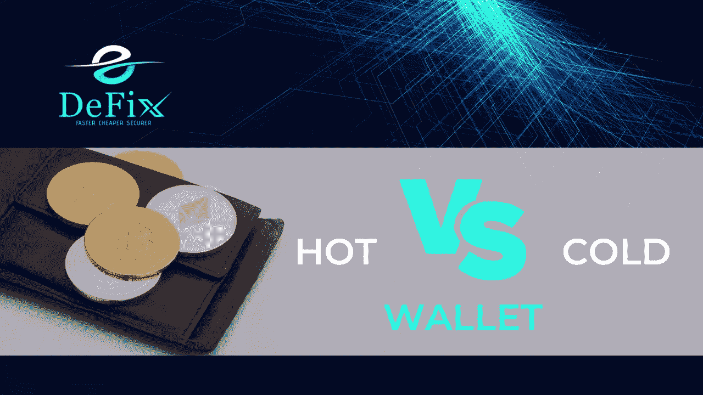

# 热钱包还是冷钱包:对密码爱好者来说哪个更好

> 原文：<https://medium.com/coinmonks/hot-wallet-or-cold-wallet-which-is-better-for-crypto-enthusiast-c216e6b3f865?source=collection_archive---------41----------------------->

为了交换和保存你的数字货币，比如比特币，你需要一个在线/硬件钱包。

不知道从哪里开始交易比特币或其他加密货币？比特币钱包是你需要的东西之一。在本文中，我们将解决一些关于加密货币钱包的常见问题，并向您展示如何选择最符合您需求的加密货币钱包。

了解加密钱包

加密货币钱包，也称为比特币钱包或简单的加密钱包，代替纸币，与标准钱包做同样的事情。

每一笔比特币或其他加密货币交易都有存储在加密货币钱包中的数字签名。这些数字钱包可能是硬件、软件或由密码交易所提供的服务。

如果你打算交易或消费你的加密货币，保持你的私钥安全是必不可少的。

## **可以用加密货币钱包交易比特币吗？**

是的。虽然许多加密货币交易所提供或建议您使用钱包，但您应该包含一个钱包地址来购买或出售比特币或其他货币，并拥有数字货币。

除了密码保护，许多数字钱包还有其他安全措施，如加密、双因素认证等。

钱包有哪些种类？

比特币或其他数字钱包有几种形式，在交易便利性和安全性方面各有利弊。然而，安全始于您，无论格式如何:通过始终保持数字钱包密码的安全来保护它们。

比特币钱包分为两类:热储钱包&冷储钱包。

## **冷热钱包**

热门加密钱包直接连接到互联网，包括移动应用程序、桌面软件应用程序或在线提供商。这些都是直接链接到互联网的加密货币钱包的例子。这是个好消息，因为你需要的一切都是免费的。可悲的事实是，它们都连接到互联网，因此它们都存在安全问题，因为它们可能会在网上被盗。

尽管比特币失窃会引发新闻，但加密货币交易所和钱包提供商似乎越来越能抵御网络犯罪。尽管加密货币越来越受欢迎，但区块链安全与分析机构 CipherTrace 的一项调查发现，2020 年，被盗的加密货币数量下降了 57%。

尽管如此，请记住，你的数字钱包里的现金就像你钱包里的现金一样:它是犯罪分子的主要目标。不惜一切代价保护它。

你可以下载和携带你的密码在一个小的，加密的，有密码保护的冷钱包里。

冷钱包可能高达 100 美元，尽管它们比热钱包更安全，因为货币是离线持有的(因此是“冷”术语)。

冷钱包的提供商包括:

*   特雷佐

这家公司出售钥匙大小的冷钱包，价格从 60 美元到 200 美元不等。

*   **总账**

莱杰的冷钱包看起来像拇指驱动器，价格在 60 美元到 120 美元之间。

## **最适合你的加密货币钱包是什么？**

对于拥有许多加密货币资产的市场参与者，建议他们使用用于即时交易/购买的热钱包和冷钱包的混合，以确保其大部分比特币资源的安全。

事实是，比特币等数字资产被认为极其不稳定。一个可靠的普遍原则是，无论市场状况如何，永远不要卖出或持有超过你承受能力的股票。

> 加入 Coinmonks [电报频道](https://t.me/coincodecap)和 [Youtube 频道](https://www.youtube.com/c/coinmonks/videos)了解加密交易和投资

# 另外，阅读

*   [3 商业评论](/coinmonks/3commas-review-an-excellent-crypto-trading-bot-2020-1313a58bec92) | [Pionex 评论](https://coincodecap.com/pionex-review-exchange-with-crypto-trading-bot) | [Coinrule 评论](/coinmonks/coinrule-review-2021-a-beginner-friendly-crypto-trading-bot-daf0504848ba)
*   [莱杰 vs Ngrave](/coinmonks/ledger-vs-ngrave-zero-7e40f0c1d694) | [莱杰 nano s vs x](/coinmonks/ledger-nano-s-vs-x-battery-hardware-price-storage-59a6663fe3b0) | [币安评论](/coinmonks/binance-review-ee10d3bf3b6e)
*   [Bybit Exchange 审查](/coinmonks/bybit-exchange-review-dbd570019b71) | [Bityard 审查](https://coincodecap.com/bityard-reivew) | [Jet-Bot 审查](https://coincodecap.com/jet-bot-review)
*   [3 commas vs crypto hopper](/coinmonks/3commas-vs-pionex-vs-cryptohopper-best-crypto-bot-6a98d2baa203)|[赚取加密利息](/coinmonks/earn-crypto-interest-b10b810fdda3)
*   最好的比特币[硬件钱包](/coinmonks/hardware-wallets-dfa1211730c6) | [BitBox02 回顾](/coinmonks/bitbox02-review-your-swiss-bitcoin-hardware-wallet-c36c88fff29)
*   [BlockFi vs Celsius](/coinmonks/blockfi-vs-celsius-vs-hodlnaut-8a1cc8c26630)|[Hodlnaut 点评](/coinmonks/hodlnaut-review-best-way-to-hodl-is-to-earn-interest-on-your-bitcoin-6658a8c19edf) | [KuCoin 点评](https://coincodecap.com/kucoin-review)