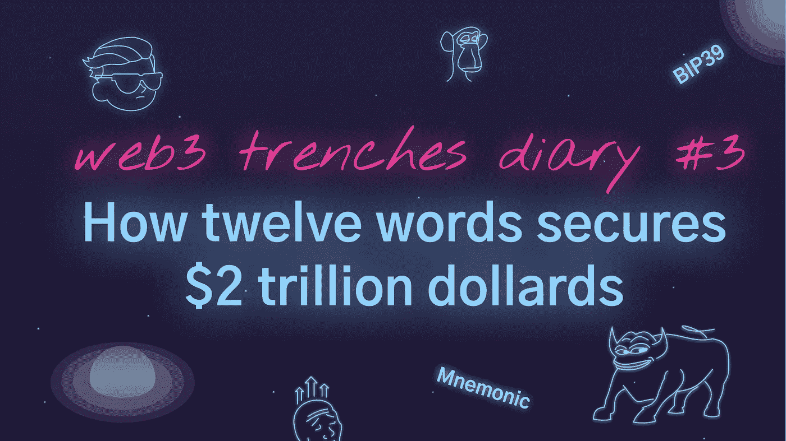

# 两万亿美元是如何被 12 个字担保的？助记符| Bip39

> 原文：<https://medium.com/coinmonks/how-2-trillion-of-dollars-are-secured-by-12-words-mnemonics-bip39-6f5d9a2824d9?source=collection_archive---------45----------------------->

Live Colab 笔记本[这里](https://colab.research.google.com/drive/1zAfJKUQ4M4lBxmDFaEMa9TBzwD8BIcI1?usp=sharing)。Github 回购[这里](https://github.com/sonsofcrypto/videosSampleCode/tree/master/bip39)。

首先，我们需要密码安全的随机来源。至少有 128 位。

```
# valid entropy bit sizes [128, 160, 192, 224, 256]
entropyBitSize = 128# secure source of randomness
entropyBytes = os.urandom(entropyBitSize // 8) # Byte has 8 bits
print(“Entropy:”, entropyBytes.hex())
```

将我们的熵字节转换为位数组，这样更容易处理。

```
from bitarray import bitarray
entropyBits = bitarray()
entropyBits.frombytes(entropyBytes)
print(“Entropy bits:”, entropyBits)
```

我们需要在熵的末尾添加校验和位。校验和是熵字节的“sha256”散列的第一个“校验和”位。

```
# checksum length depends on the length of entropy
checksumLen = entropyBitSize // 32
print(“checksum size:”, checksumLen)# We need to take a hash of our entropy
hashBytes = hashlib.sha256(entropyBytes).digest()
print(“hashed bytes:”, hashBytes.hex())hashBits = bitarray()
hashBits.frombytes(hashBytes)
checksum = hashBits[:checksumLen]
print(“checksum bits:”, checksum)# Add checksum bits at the end of entropy
entropyBits.extend(checksum)
print(“entropy length:”, len(entropyBits))
```

将“entropyBits”分组到 11 位的组中。并将它们转换成整数。这些整数

```
# Get indexed from bits
indexes = list()
from bitarray.util import ba2intfor idx in range(len(entropyBits) // 11):
 startIdx = idx * 11
 endIdx = startIdx + 11
 wordIndex = ba2int(entropyBits[startIdx:endIdx])
 indexes.append(wordIndex)print(indexes)
```

Bip39 是标准的，它定义了 2024 个单词的列表。我们把单词放入一个数组。

```
# Load bip 39 words
fileObj = open(“bip-0039/english.txt”, “r”)
words = fileObj.read().splitlines()
fileObj.close()
print(“words len:”, len(words))
```

我们将索引从熵映射到词。

```
# Map indexes onto words
mnemonic = list(map(lambda idx: words[idx] , indexes))
print(“mnemonic:”, mnemonic)
```

添加可选密码。

```
# Generate salt
password = “”
salt = “mnemonic” + password
```

最终我们得到了一颗种子。

```
# Finally, we derive seed
mnemonicStr = ‘ ‘.join(mnemonic)
seed = hashlib.pbkdf2_hmac(
 “sha512”,
 mnemonicStr.encode(“utf-8”),
 salt.encode(“utf-8”),
 2048
)print(“seed len:”, len(seed))
print(“seed hex:”, seed.hex())
print(“priv key:”, seed[0:32].hex())
print(“chain co:”, seed[32:64].hex())
```

它的前 32 个字节是我们的主私钥，后 32 个字节是链码。你如何获得钱包私钥和地址是另一篇文章。

你们中的一些人可能会说，等等，就这样？这 128 个随机位，尽管它们很漂亮，却是保护所有加密的全部。如果其他人碰巧得到了和我一样的熵呢？128 位给你 2 个⁸数。这比宇宙中的起始数还要多。如果用 24 个字。你正在接近比宇宙中原子数量还要多的数量。那种安静的可能性简直是天文数字。在任何情况下，加密的整体性，每次你登录到某个地方，都以类似的方式工作，所以不要担心。它工作了。

以上这些都很好，但是如何让普通人也能轻松使用呢？我们来看看帖子顶部的视频。

Live Colab 笔记本[这里](https://colab.research.google.com/drive/1zAfJKUQ4M4lBxmDFaEMa9TBzwD8BIcI1?usp=sharing)。Github repo [这里](https://github.com/sonsofcrypto/videosSampleCode/tree/master/bip39)。



> 加入 Coinmonks [电报频道](https://t.me/coincodecap)和 [Youtube 频道](https://www.youtube.com/c/coinmonks/videos)了解加密交易和投资

# 另外，阅读

*   [印度最佳 P2P 加密交易所](https://coincodecap.com/p2p-crypto-exchanges-in-india) | [柴犬钱包](https://coincodecap.com/baby-shiba-inu-wallets)
*   [八大加密附属计划](https://coincodecap.com/crypto-affiliate-programs) | [eToro vs 比特币基地](https://coincodecap.com/etoro-vs-coinbase)
*   [最佳以太坊钱包](https://coincodecap.com/best-ethereum-wallets) | [电报上的加密货币机器人](https://coincodecap.com/telegram-crypto-bots)
*   [交易杠杆代币的最佳交易所](https://coincodecap.com/leveraged-token-exchanges) | [购买 Floki](https://coincodecap.com/buy-floki-inu-token)
*   [3 commas vs . Pionex vs . crypto hopper](https://coincodecap.com/3commas-vs-pionex-vs-cryptohopper)|[Bingbon Review](https://coincodecap.com/bingbon-review)