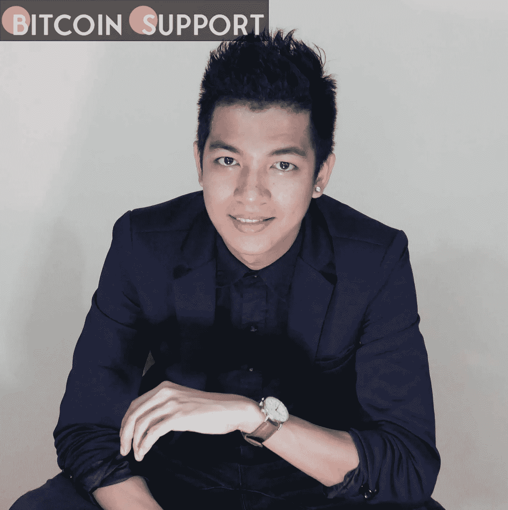
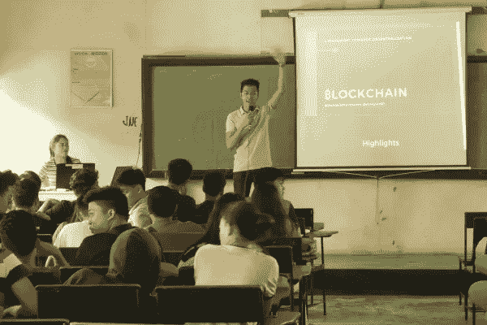

# 一个庞氏骗局的受害者如何成为一个密码传播者

> 原文：<https://medium.com/coinmonks/how-a-ponzi-victim-became-a-crypto-evangelist-2fe1d31bf52a?source=collection_archive---------87----------------------->

**Visit our website:-** [**https://bitcoinsupports.com/**](https://bitcoinsupports.com/)

马克·曼南萨拉在一次糟糕的经历后迷上了加密货币的世界，但他并没有被阻止学习更多关于比特币的知识。因庞氏骗局而遭受财务损失，这可不是对加密生态系统的理想介绍。幸运的是，马克·戴夫·马南萨拉重新向克罗珀和区块链介绍了自己，并发展了新欢。

这一切都始于 2017 年，当时一位朋友接触了马南萨拉，希望他加入一个非常著名的加密货币项目。作为免费代币的交换，该项目的团队要求他制作一个自己的视频。随后，有人建议他将利润进行再投资。曼南萨拉被巨大的回报所吸引，最终向该项目投入了额外的资金，却发现这是一个骗局。

**“在对我的钱进行了大约三个月的研究和投资后，很明显这是一个骗局。我尽我所能来恢复和挽救我所能做的，我能够在他们的象征彻底崩溃之前保留一些投资。”当被问及该事件是否改变了他对 crypto 的看法时，Manansala 表示，尽管“确实被那个特定的平台激怒了”，但他并没有消极地看待 crypto。当生活递给他柠檬时，马南萨拉做了柠檬水。“由于这次经历，我对加密货币、比特币以及支撑它的技术产生了兴趣，”马南萨拉解释道。这位庞氏受害者解释说，他开始自学，在对该行业改变生活的前景充满信心后，他想分享他所学到的东西，以便其他人也可以发现加密。

**“了解了一点之后，我在根山组织了一次每周聚会。这是一场相当直白、非正式的讲座，或者说是咖啡馆里的‘公开谈话’，对任何有兴趣了解加密和区块链的人开放。”**

马南萨拉在 2017 年开始了他与最亲近的人——他的女朋友——的密码之战。据加密布道者称，她曾接受培训成为一名药剂师，但最终全部投资于加密货币领域。

“从那以后，我们发展成了一前一后的关系。我们有一个共同的语言，那就是密码学——我们永恒的话题。然后，在 2018 年，当我们对自己的知识充满信心时，我们共同创立了 meetup，”马南萨拉解释道。**

**Visit our website:-** [**https://bitcoinsupports.com/**](https://bitcoinsupports.com/)

**马克在菲律宾桑托斯将军城的 NDDU 学校给学生讲授区块链技术。**

接下来，这位菲律宾比特币制造者将注意力转向了他的朋友和家人。然后，他将这个小组扩大到了他所在城市中任何对学习加密货币或区块链技术感兴趣的人。一年后，他开始收到在学校和活动中演讲的邀请，并能够前往越南和印度尼西亚等国家传播比特币(BTC)和区块链技术。加密演讲者指出，他的相当一部分听众对加密货币和区块链并不熟悉。因此，他的演讲集中在货币的历史上。“区块链对一些人来说有点太复杂了，但如果他们想学习加密的基础知识，了解钱从哪里来是至关重要的，”马南萨拉解释道。

**“有些人认为比特币和区块链是同义词。因此，我们需要在这方面努力。我提供了一些例子，并阐明了比特币仅仅是利用区块链技术的一种应用和方法。此外，我还讨论了区块链可能的应用。”根据马南萨拉的说法，很多过去参加他聚会的人后来都成了交易者。crypto advocate 表示，他目前正在指导四名学生，他们一开始并不理解。此外，他还在培训一批高级员工创建智能合同和复杂网站。马南萨拉设想有一天，他的听众会因为从他那里学到的东西而具备就业的能力。他表示，他希望教育他人，以便成为一名机会倡导者。即使市场下滑，加密倡导者相信信息可以使个人工作和谋生。

**访问我们的网站:-**[**https://bitcoinsupports.com/**](https://bitcoinsupports.com/)

**免责声明:以上为作者观点，不应视为投资建议。读者应该自己做研究。****

> 加入 Coinmonks [电报频道](https://t.me/coincodecap)和 [Youtube 频道](https://www.youtube.com/c/coinmonks/videos)了解加密交易和投资

# 另外，阅读

*   [如何在 Uniswap 上交换加密？](https://coincodecap.com/swap-crypto-on-uniswap) | [A-Ads 评论](https://coincodecap.com/a-ads-review)
*   [WazirX vs coin dcx vs bit bns](/coinmonks/wazirx-vs-coindcx-vs-bitbns-149f4f19a2f1)|[block fi vs coin loan vs Nexo](/coinmonks/blockfi-vs-coinloan-vs-nexo-cb624635230d)
*   [本地比特币审核](/coinmonks/localbitcoins-review-6cc001c6ed56) | [加密货币储蓄账户](https://coincodecap.com/cryptocurrency-savings-accounts)
*   [什么是融资融券交易](https://coincodecap.com/margin-trading) | [成本平均法](https://coincodecap.com/dca)
*   [支持卡审核](https://coincodecap.com/uphold-card-review) | [信任钱包 vs 元掩码](https://coincodecap.com/trust-wallet-vs-metamask)