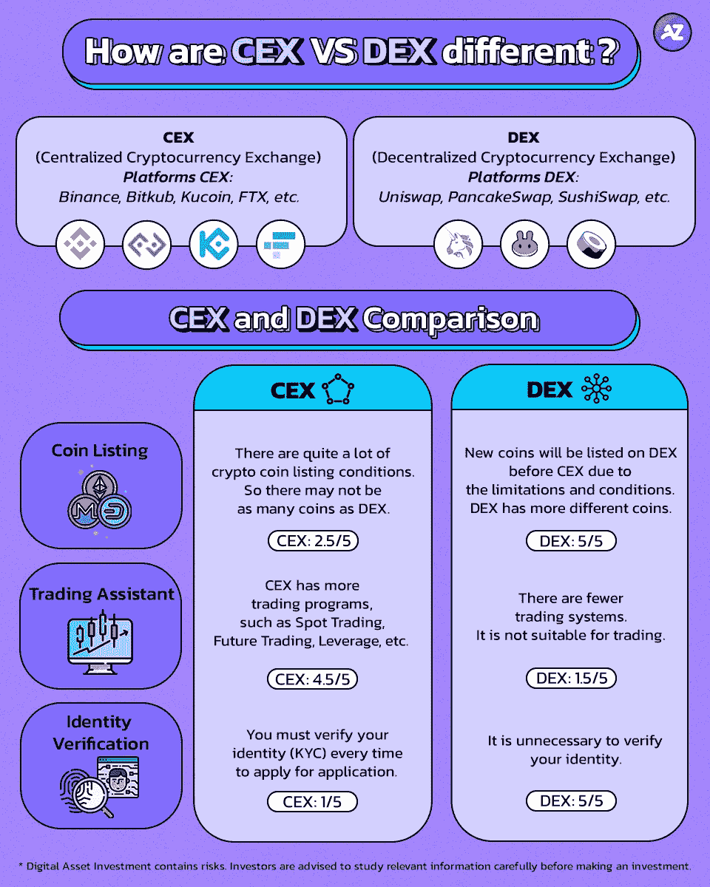

# CEX 和德克斯有什么不同？

> 原文：<https://medium.com/coinmonks/how-are-cex-vs-dex-different-f8feeb1f0984?source=collection_archive---------57----------------------->

## 让我们看看 CEX 和德克斯有什么不同

# 在密码交易市场中，许多人可能已经多次看到这些术语，但您知道真正的含义吗？

今天，我们想澄清这些术语，无论 CEX 和德克斯是什么意思，他们有什么不同？

对于加密交易，我们通常进入交易市场，在那里人们互相交换硬币。可以分为两类。CEX(集中式加密货币交易所)是一个人们通过中间人交换硬币的市场，而 DEX(分散式加密货币交易所)是一个没有中间人的交易市场。

**了解 CEX(加密货币集中交易所)**

它是一个交换加密货币的平台，而中间人是平台所有者。用户可以用普通货币兑换加密货币。用户可以设定价格。中间人充当用户资产的保护者。当密码丢失时，中间人可以帮助找回它。万一你把硬币转错了账户，中间人可以介入提供帮助。

**CEX 站台如下:**

币安、Bitkub、Kucoin、FTX 等等。

**DEX(分散加密货币交易所)**

它是一个没有中间人的加密货币交换平台。只需要加密货币进行交换。现实世界的货币不能在交易所使用，因为没有中间人来帮助验证，因此，交易将在区块链技术上进行，以验证交易所。

DEX 平台举例如下:Unisswap、PancakeSwap、SushiSwap 等。

**CEX 和德克斯对比**

**1。硬币列表**

在密码市场中，一直有不同的硬币被推出。投资者必须等到硬币进入交易板后才能购买。如果你仔细检查，由于限制和条件，硬币将在 CEX 之前在 DEX 上市。所以德克斯有更多不同的硬币。

性能指标 CEX: 2.5/5

**2。交易助理**

CEX 有更多的交易项目，如现货交易、期货交易、杠杆交易等。然而，并不是所有的交易程序都能在 DEX 上正常执行。

表现得分
CEX: 4.5/5
指标:1.5/5

**3。身份验证**

如果您使用 CEX，您必须在我们每次申请时验证我们的身份(KYC)——这个过程需要相当长的时间来验证。对于 DEX 来说，验证身份是没有必要的。你所要做的就是在使用前连接到你的钱包。

业绩得分
CEX: 1/5
指标:5/5

所有这些都只是使用 CEX 和德克斯的例子。这取决于你使用它们的目的。有些人两种都用，因为他们想以不同的形式投资。但是，建议在进行投资之前仔细研究相关信息。

*数字资产投资包含风险。建议投资者在投资前仔细研究相关信息。

如果投资者对分散资产管理投资感兴趣，您可以咨询我们了解更多信息。

您可以在
推特:[https://twitter.com/azirafinance](https://twitter.com/azirafinance)媒体:[https://medium.com/@azirafinance](/@azirafinance)脸书:[https://www.facebook.com/azirafinance](https://www.facebook.com/azirafinance)Reddit:[https://www.reddit.com/user/azirafinance](https://www.reddit.com/user/azirafinance)白皮书:[https://azira-finance.gitbook.io/product-docs/](https://azira-finance.gitbook.io/product-docs/)

> 加入 Coinmonks [电报频道](https://t.me/coincodecap)和 [Youtube 频道](https://www.youtube.com/c/coinmonks/videos)了解加密交易和投资

# 另外，阅读

*   [火币交易机器人](https://coincodecap.com/huobi-trading-bot) | [如何收购 ADA](https://coincodecap.com/buy-ada-cardano) | [Geco？一次回顾](https://coincodecap.com/geco-one-review)
*   [币安 vs 比特邮票](https://coincodecap.com/binance-vs-bitstamp) | [比特熊猫 vs 比特币基地 vs Coinsbit](https://coincodecap.com/bitpanda-coinbase-coinsbit)
*   [如何购买 Ripple (XRP)](https://coincodecap.com/buy-ripple-india) | [非洲最好的加密交易所](https://coincodecap.com/crypto-exchange-africa)
*   [非洲最佳加密交易所](https://coincodecap.com/crypto-exchange-africa) | [胡交易所评论](https://coincodecap.com/hoo-exchange-review)
*   [eToro vs robin hood](https://coincodecap.com/etoro-robinhood)|[MoonXBT vs Bybit vs Bityard](https://coincodecap.com/bybit-bityard-moonxbt)
*   [交易信号是什么？](https://coincodecap.com/trading-signal) | [Bitstamp vs 比特币基地](https://coincodecap.com/bitstamp-coinbase)