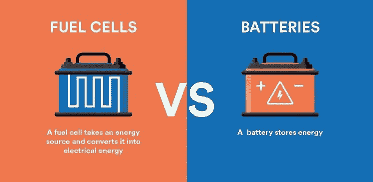

# 燃料电池和电池有什么不同？

> 原文：<https://medium.com/coinmonks/how-are-fuel-cells-different-from-batteries-8667e3d2de93?source=collection_archive---------29----------------------->

燃料电池是一种将燃料中的化学能转化为电能的装置。这个过程是通过氢原子和氧原子结合时发生的电化学反应来完成的。燃料电池通常用于车辆，以及其他应用，如便携式电子设备和航天器。在这篇博文中，我们将讨论燃料电池的基本工作原理，以及它们的一些优点和缺点。

燃料电池常被比作电池，因为它们都将化学能转化为电能。然而，这两种技术之间有一些关键的区别。燃料电池需要持续供应燃料(通常是氢气)和氧气才能运行，而电池在其自身结构中储存所有必要的化学物质。这意味着只要有燃料和氧气供应，燃料电池理论上可以无限期运行。相比之下，电池最终会耗尽储存的能量，需要更换或充电。

燃料电池和蓄电池的另一个关键区别是它们发电的方式。电池通过一种叫做电解的过程发电，这种过程包括利用化学反应产生电流。另一方面，燃料电池通过氧化还原过程发电。在氧化还原反应中，电子在分子间转移，从而产生电流。

与传统电池相比，燃料电池有许多优点。首先，它们将化学能转化为电能的效率要高得多。燃料电池也往往比电池更小更轻，使它们成为空间有限的应用的理想选择。此外，燃料电池可以在非常高的温度下工作，这使得它们非常适合用于发电厂和其他工业环境。

然而，燃料电池也有一些缺点。燃料电池技术面临的一个主要挑战是制造成本。燃料电池启动也相对较慢，这在需要快速响应的应用中可能是一个问题。此外，燃料电池需要持续供应燃料和氧气，这在某些情况下可能难以提供。

总的来说，燃料电池是一项有前途的技术，与传统电池相比有许多优点。然而，在燃料电池真正成为主流之前，还有一些挑战需要解决。希望随着持续的研究和开发，我们将在未来看到燃料电池更广泛的应用！

感谢阅读！燃料电池有可能彻底改变我们为世界供电的方式！你对这项技术有什么看法？请在下面的评论中告诉我们！

"燃料电池技术绝对是未来几年值得关注的东西！"博客的读者之一约翰说。“我认为它有很大的潜力，但肯定有一些挑战需要解决。”你同意约翰的观点吗？请在下面的评论中告诉我们你的想法！

 [## Hydrogencoin -基于 Solana 区块链的 DeFi 基金

### Hydrogencoin.io 是全球首个绿色氢的 DeFi 基金

氢币. io](http://hydrogencoin.io) 

> 加入 Coinmonks [电报频道](https://t.me/coincodecap)和 [Youtube 频道](https://www.youtube.com/c/coinmonks/videos)了解加密交易和投资

# 另外，阅读

*   [加密套利](/coinmonks/crypto-arbitrage-guide-how-to-make-money-as-a-beginner-62bfe5c868f6)指南| [如何做空比特币](/coinmonks/how-to-short-bitcoin-568a2d0b4ae5)
*   [币安期货交易](https://coincodecap.com/binance-futures-trading)|[3 commas vs Mudrex vs eToro](https://coincodecap.com/mudrex-3commas-etoro)
*   [如何购买 Monero](https://coincodecap.com/buy-monero) | [IDEX 评论](https://coincodecap.com/idex-review) | [BitKan 交易机器人](https://coincodecap.com/bitkan-trading-bot)
*   [尤霍德勒 vs 考尼洛 vs 霍德诺特](/coinmonks/youhodler-vs-coinloan-vs-hodlnaut-b1050acde55a) | [Cryptohopper vs 哈斯博特](https://coincodecap.com/cryptohopper-vs-haasbot)
*   [顶级付费加密货币和区块链课程](https://coincodecap.com/blockchain-courses)
*   [MXC 交易所评论](/coinmonks/mxc-exchange-review-3af0ec1cba8c) | [Pionex vs 币安](https://coincodecap.com/pionex-vs-binance) | [Pionex 套利机器人](https://coincodecap.com/pionex-arbitrage-bot)