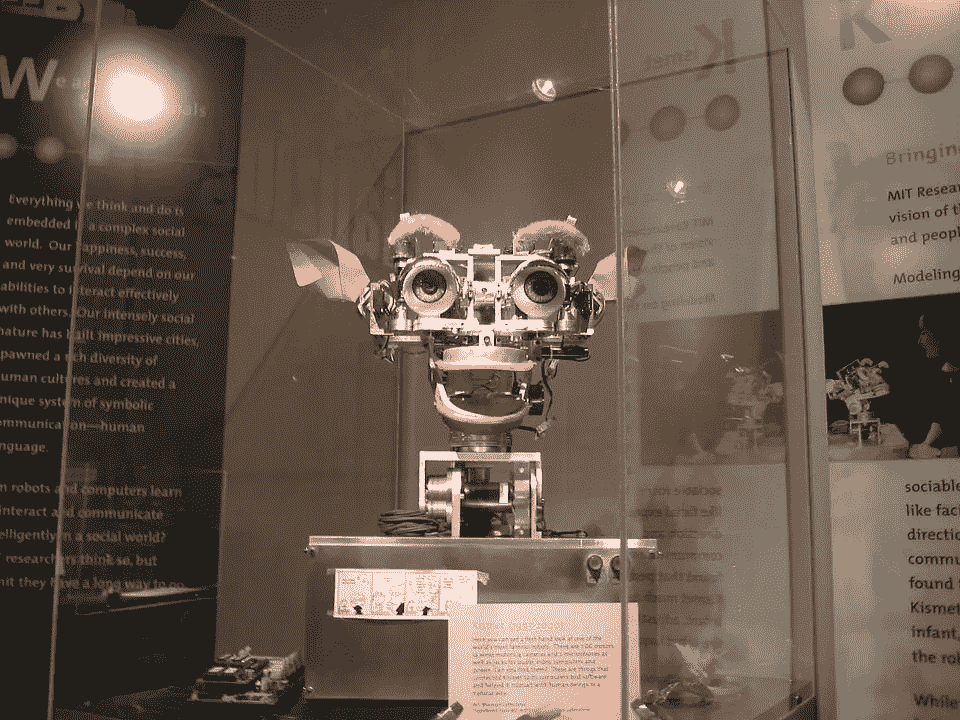
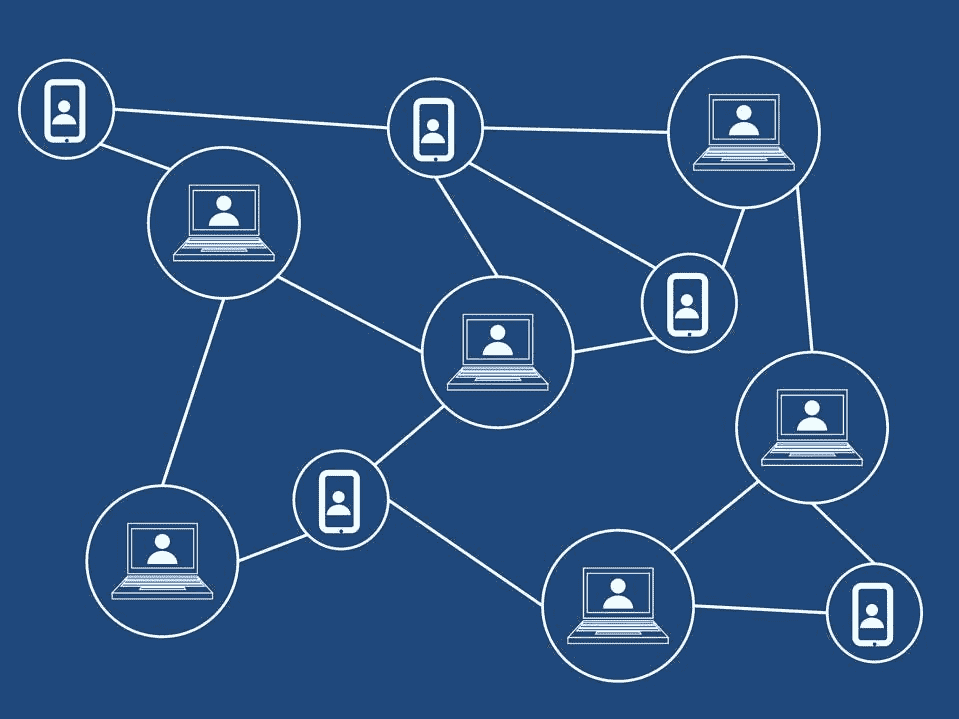

# 人工智能如何改变分散的账本

> 原文：<https://medium.com/coinmonks/how-artificial-intelligence-can-change-the-decentralized-ledger-97f1e9d536d1?source=collection_archive---------46----------------------->

专家表示，人工智能相对于区块链技术的变革力量被严重忽视了。

一个原因是，区块链对分散式分类账的使用提供了对人工智能系统工作方式以及这些平台可能使用的数据来源的洞察。因此，在维护可靠的数据完整性的同时，可以在高度信任的情况下促进交易。不仅如此，使用区块链系统来存储和分发以人工智能为中心的运营模型有助于创建审计线索，从而提高数据安全性。

此外，人工智能和区块链的结合，至少在理论上，似乎是极其有效的，能够改善几乎每个实施它的行业。例如，这种结合有可能增强当今现有的食品供应链物流、医疗记录共享生态系统、媒体版税分发平台和金融安全系统。

也就是说，虽然有很多项目在吹捧这些技术的使用，但它们实际上提供了什么好处，尤其是因为许多人工智能专家认为这项技术仍处于相对初级阶段？有许多公司正在将人工智能的使用作为其当前产品的一部分进行营销，这引发了一个明显的问题:*这里到底发生了什么？*

随着加密货币市场在过去几年中不断发展壮大，人工智能(AI)进入加密/区块链技术领域的想法继续在全球范围内引起越来越多的主流兴趣。

# 艾和是一对好搭档吗？

为了更广泛和更深入地了解这个问题，Cointelegraph 采访了 Bullieverse 的首席增长官 Arunkumar Krishnakumar，这是一个开放世界的 3D 元宇宙游戏平台，利用了人工智能技术的各个方面。在他看来，区块链和人工智能解决了数据集整个生命周期的不同方面。

虽然区块链主要处理数据完整性和不变性等问题，确保区块链上的信息数据是高质量的，但人工智能使用有效存储的数据来提供有意义和及时的见解，供研究人员、分析师和开发人员采取行动。

> *“人工智能不仅可以帮助我们在特定情况下做出正确的决定，而且随着它变得更加训练有素和智能，它还可以提供预测性的提醒。然而，作为一个框架，区块链完全有能力成为一条信息高速公路，只要随着这项技术的成熟，可伸缩性和吞吐量方面的问题得到解决。”*

当被问及人工智能是否是一项太过新生的技术，无法对现实世界产生任何影响时，他表示，像包括人工智能、量子计算甚至区块链在内的大多数技术范式一样，这些想法仍处于被采用的早期阶段。他将这种情况比作 90 年代的 Web2 热潮，人们现在才开始意识到需要高质量的数据来训练引擎。

此外，他强调，人工智能已经有几个日常用例，大多数人在日常生活中认为理所当然。“我们拥有可以在手机上与我们对话的人工智能算法，以及可以跟踪社会情绪、预测网络攻击等的家庭自动化系统。Krishnakumar 说。

基于人工智能量子的金融平台 Fluid 的首席执行官兼总裁 Ahmed Ismail 指出，有许多人工智能让区块链受益的例子。根据 Ismail 的说法，这种结合的一个完美例子是加密流动性聚合器，它使用人工智能和机器学习的子集来进行深度数据分析，提供价格预测并提供优化的交易策略来识别当前/未来的市场现象，并补充道:

> *“这种结合可以帮助用户抓住最好的机会。这实际上是一种针对碎片化流动性的超低延迟和超低成本解决方案，这是一个困扰当今虚拟资产市场的数万亿美元的问题。”*

从更全面的角度来看，伊斯梅尔指出，每项技术都必须经历一个进化和成熟的周期。在这一点上，他强调说，即使当银行和金融部门开始采用数字资产时，人们也普遍担心这些资产是否已经发展到足以成功实施的程度。“人工智能及其子集给密码行业带来了巨大的优势，但应该以长期愿景为核心，在道德上予以推动，”他最后说。

# 可能需要做更多的工作

旨在将人工智能引入加密货币经济的区块链项目 Fetch.ai 的首席执行官胡马云·谢赫(Humayun Sheikh)表示，随着 Web3 和区块链技术的发展，人工智能将成为为企业带来新价值的关键要素，他补充道:

> *“去中心化的人工智能可以消除当今数字经济中的中介，将企业与消费者直接连接起来。它还可以提供对来自组织内外的大量数据的访问，当使用 AI scale 进行分析时，可以提供更具可操作性的见解，管理数据使用和模型共享，并创建值得信赖的透明数据经济。”*

就人工智能与其明显缺乏用例之间存在的差距而言，Sheikh 认为二分法并不成立，因为已经有许多用例可供每个人查看。例如，Fetch.ai 一直在构建在供应链生态系统、停车自动化框架、分散金融(Defi)等领域部署人工智能和区块链的系统。Fetch 还计划近期在美国发布消费者友好的人工智能应用程序。

> 例如，这可以将药物发现的时间从 12 年缩短到几年。另一个例子是模拟固氮并将其工业化以减少化肥厂的碳排放。模拟蛋白质折叠和为癌症提供定制药物是另一个可以实现的用例。”

# 区块链需要人工智能才能成功吗？

智能合约和去中心化应用平台 Oraichain 的首席执行官兼联合创始人钟道认为，区块链科技不仅仅是大多数人愿意相信的那样，它是一个封闭的金融交易世界，与现实世界的资产和事件没有任何联系。他告诉硬币电讯报:

> *“人工智能必须帮助区块链认识现实世界的效用，扩大其适用性，并实现智能决策。这两项技术都处于早期阶段，但不是“非常早期”有许多成功的人工智能解决方案比人类更好地识别模式，在广泛的业务中，自动化无疑有许多优势。”*

道指出，人工智能已经有了一个强大的基础设施，可以在现有的区块链技术上实现，可以增强整个空间的“信任，识别和分散”。在这方面，Oraichain 有一个完整的生态系统致力于此:该项目利用 oracle 机制将人工智能集成到智能合同中，并利用以人工智能为中心的数据管理系统和市场的力量。

因此，随着我们进入由去中心化原则驱动的未来，人工智能等未来技术在未来几个月和几年将继续在全球密码领域占据更多席位，这是显而易见的。

点击这里，关注我们的更多故事[。](http://t.me/etellworld)

> 加入 Coinmonks [电报频道](https://t.me/coincodecap)和 [Youtube 频道](https://www.youtube.com/c/coinmonks/videos)了解加密交易和投资

# 另外，阅读

*   [如何在 FTX 交易所交易期货](https://coincodecap.com/ftx-futures-trading) | [OKEx vs 币安](https://coincodecap.com/okex-vs-binance)
*   [CoinLoan 评论](https://coincodecap.com/coinloan-review) | [YouHodler 评论](/coinmonks/youhodler-4-easy-ways-to-make-money-98969b9689f2) | [BlockFi 评论](https://coincodecap.com/blockfi-review)
*   [XT.COM 评论](https://coincodecap.com/profittradingapp-for-binance)币安评论 |
*   [SmithBot 评论](https://coincodecap.com/smithbot-review) | [4 款最佳免费开源交易机器人](https://coincodecap.com/free-open-source-trading-bots)
*   [比特币基地僵尸程序](/coinmonks/coinbase-bots-ac6359e897f3) | [AscendEX 审查](/coinmonks/ascendex-review-53e829cf75fa) | [OKEx 交易僵尸程序](/coinmonks/okex-trading-bots-234920f61e60)