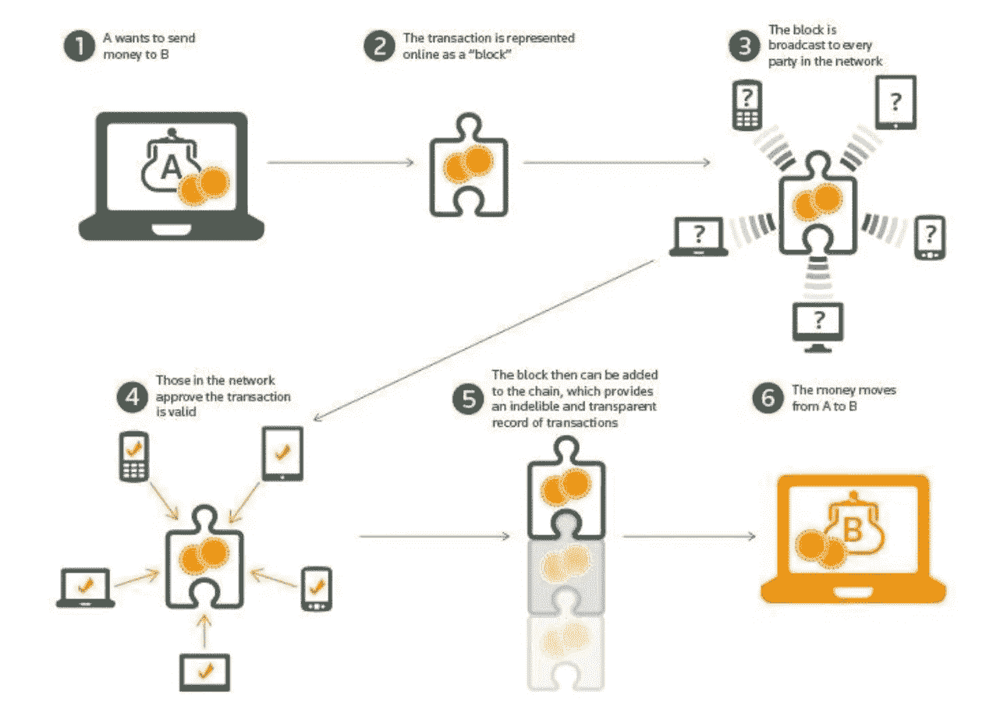
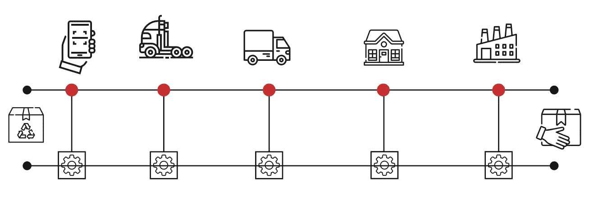
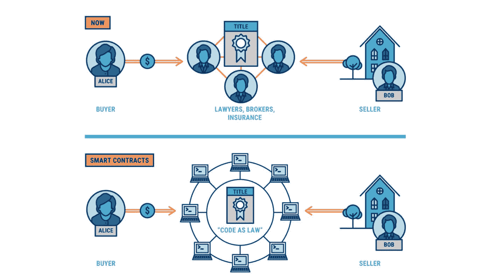
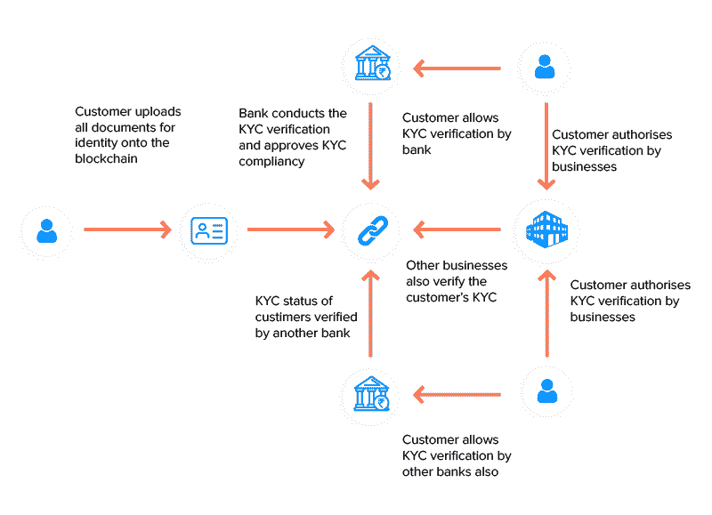

# 区块链如何帮助反腐

> 原文：<https://medium.com/coinmonks/how-blockchain-can-help-fight-against-corruption-e32d2bdf2782?source=collection_archive---------50----------------------->

腐败是当今几乎每个行业和几乎每个国家的最大问题之一。根据世界经济论坛，发展中国家每年因腐败损失 1.26 万亿美元。即使在美国这样的发达国家，腐败也是一个需要尽快解决的问题。

贪污就是有人利用职务之便谋取私利或者利用职务之便为他人谋取私利。在商业和政府中，这可以采取许多不同的形式，从贿赂到裙带关系、人情、与竞争对手的秘密合作、内幕交易等等。

区块链技术已经证明了其在反腐败方面的潜力。它可以用于透明地跟踪资金和捐款；以不腐败的方式管理供应链；提供经过验证的用户属性的不可变数字身份证；在没有中央权力机构的情况下实施 KYC 进程；等等。让我们看看区块链如何帮助打击腐败。

# 透明地跟踪资金和捐赠

谈到跟踪资金和捐款，我们看到越来越多的组织接受加密货币。然而，这些资金转移或捐赠并不总是透明和廉洁的。

以[委内瑞拉](https://www.thedialogue.org/analysis/corruption-and-crisis-in-venezuela-asset-repatriation-for-humanitarian-relief/)为例，有些人和组织致力于改善这个国家的状况，但是很难确定钱去了哪里，是否到了正确的人手中。

Money Transfer in Blockchain System ([Source: Ensar Sahine, 2018)](https://www.researchgate.net/figure/Money-Transfer-in-Blockchain-System_fig2_329775273)

区块链的分布式账本技术允许信息被验证并存储在防篡改系统中。由于分类账是公开的，这使得过程透明且可追溯。这为执法机构提供了追踪罪犯和扣押其资产所需的工具。此外，区块链技术有助于使捐赠过程透明和可验证，并保留记录。

# 供应链中没有欺诈和腐败

通过供应链跟踪实物商品和库存是经营企业或出于保险目的跟踪库存的重要组成部分。在某些情况下，供应链可能会导致腐败和造假。中介公司可能会产生很高的腐败风险。区块链有潜力使这一进程变得高效、诚实和透明。例如，假设您正在跟踪从供应商 A 到客户 b 的一批实际库存。供应商 A 可能有他们在区块链上的库存记录，以证明他们没有什么可隐瞒的。

Bridging the last mile gap between offline and online worlds ([SOURCE: Gearchain, 2022](http://www.gearchain.io))

该系统将记录产品从工厂到消费者的每一步，并确保过程的每一步都得到验证。这些信息一旦被记录下来，就不能被更改或删除，这就使它具有了防篡改性。

# 具有经过验证的用户数据的不可变数字身份证

身份验证已经进行了很长时间。例如，考虑护照或驾照。为了证明我们的身份，我们用这个。

假设你想从银行获得抵押贷款。为此，银行将进行信用检查。如果承销商和/或经纪人腐败了怎么办？即使腐败有所减少，许多金融机构仍保留着自己的筛选流程，这使得信息孤立且耗时，有时很难甚至不可能获得批准。

Traditional Mortgage Process vs Smart Contracts using Blockchain([SOURCE: Inflooens, 2020](https://www.inflooens.com/blockchain-technology-transforming-the-mortgage-lifecycle))

区块链技术可以通过提供经过验证的用户属性的不可变数字 id，帮助我们从证明身份的传统方式转移到更安全的方式。您可以创建一个基于区块链的分散式身份系统，无需信用评分或社会保险号。用户的验证数据存储在区块链上。没有必要让中介来检查和核实你的身份或财务状况。

不变的交易和身份记录有助于识别欺诈活动。腐败也是如此，腐败是滥用公职谋取私利。区块链的记录可以用来识别试图掩盖腐败的行为。

例如，像 [Bloom](https://bloom.co/) 这样的公司为身份证明、风险评估和信用评分提供端到端协议；完全在区块链。Bloom 允许传统和数字货币贷款机构为数十亿目前无法获得银行账户或信用评分的人提供服务。

# KYC 和区块链

The Blockchain for KYC Process ([SOURCE: Appinventiv, 2022](https://appinventiv.com/blog/use-blockchain-technology-for-kyc/))

了解客户(KYC)是反洗钱的主要要求之一。它旨在识别企业或交易的受益所有人，并确保他们没有参与任何非法活动。在这方面，使用区块链进行客户识别非常有帮助。区块链公共分类帐可用于识别和跟踪参与交易和投资活动的各方。这是区块链相对于传统数据库的一个显著优势。此外，区块链网络的设计是“无许可”的。这意味着任何人都可以在没有特殊许可的情况下访问网络。这对反洗钱合规性有明显的好处:无需征得客户同意即可识别客户身份。

# 结论

区块链并不是打击腐败的唯一途径，还有许多其他技术也可以帮助打击腐败。然而，区块链在打击腐败方面的潜力是无穷的。下次有人试图说服你区块链是无用的，请记住区块链技术可以应用于许多不同的行业，也可以帮助解决许多不同类型的腐败。

> 那么，你觉得这篇文章有帮助吗？如果你喜欢我的其他文章，请给我买杯咖啡。为什么请我喝咖啡？没有第三方广告，没有附属链接，没有跟踪 cookies。只是诚实的内容。谢谢！给哈利买些咖啡。

> 加入 Coinmonks [电报频道](https://t.me/coincodecap)和 [Youtube 频道](https://www.youtube.com/c/coinmonks/videos)了解加密交易和投资

# 另外，阅读

*   [3 商业评论](/coinmonks/3commas-review-an-excellent-crypto-trading-bot-2020-1313a58bec92) | [Pionex 评论](https://coincodecap.com/pionex-review-exchange-with-crypto-trading-bot) | [Coinrule 评论](/coinmonks/coinrule-review-2021-a-beginner-friendly-crypto-trading-bot-daf0504848ba)
*   [莱杰 vs n rave](/coinmonks/ledger-vs-ngrave-zero-7e40f0c1d694)|[莱杰 nano s vs x](/coinmonks/ledger-nano-s-vs-x-battery-hardware-price-storage-59a6663fe3b0) | [币安评论](/coinmonks/binance-review-ee10d3bf3b6e)
*   [Bybit Exchange 审查](/coinmonks/bybit-exchange-review-dbd570019b71) | [Bityard 审查](https://coincodecap.com/bityard-reivew) | [Jet-Bot 审查](https://coincodecap.com/jet-bot-review)
*   [3 commas vs crypto hopper](/coinmonks/3commas-vs-pionex-vs-cryptohopper-best-crypto-bot-6a98d2baa203)|[赚取秘密利息](/coinmonks/earn-crypto-interest-b10b810fdda3)
*   最好的比特币[硬件钱包](/coinmonks/hardware-wallets-dfa1211730c6) | [BitBox02 回顾](/coinmonks/bitbox02-review-your-swiss-bitcoin-hardware-wallet-c36c88fff29)
*   [BlockFi vs Celsius](/coinmonks/blockfi-vs-celsius-vs-hodlnaut-8a1cc8c26630)|[Hodlnaut 点评](/coinmonks/hodlnaut-review-best-way-to-hodl-is-to-earn-interest-on-your-bitcoin-6658a8c19edf) | [KuCoin 点评](https://coincodecap.com/kucoin-review)