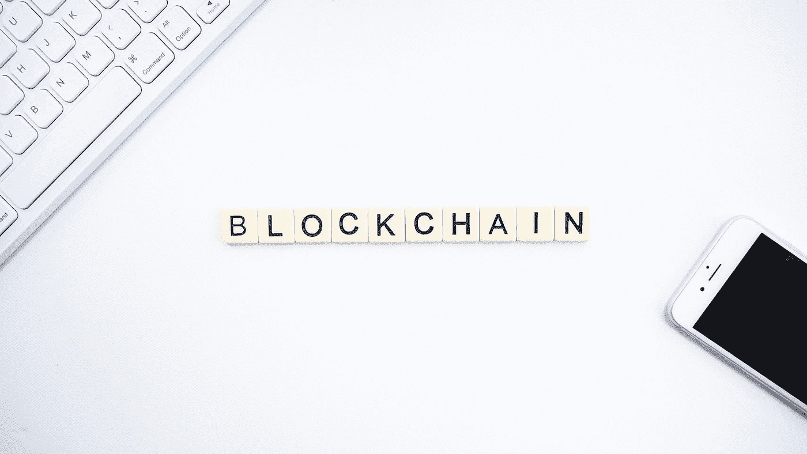

# 区块链如何改变 50 万亿美元的供应链产业

> 原文：<https://medium.com/coinmonks/how-blockchain-could-change-the-50-trillion-dollar-supply-chain-industry-233c6f8f063c?source=collection_archive---------52----------------------->

Photo by [Launchpresso](https://unsplash.com/@launchpresso?utm_source=medium&utm_medium=referral) on [Unsplash](https://unsplash.com?utm_source=medium&utm_medium=referral)

想象一下，在市场上购买一种产品，并能够准确地知道它是在哪里制造的，何时制造的，谁制造的，甚至原材料是从哪里收集的？那不是很酷吗？现在最大的问题是。这可能吗？实际上，还没有人这么大规模地尝试过，但理论上，这是非常可能的。怎么会？在一种叫做区块链的新技术的帮助下。

当大多数人听到或读到区块链这个词时，他们首先想到的是比特币、以太坊或任何其他加密货币。确实存在某种关系，但事实并非如此。

什么是区块链？区块链是一种技术，可以让个人或组织记录数据，并使改变、黑客攻击或欺骗系统变得非常困难。区块链本质上是交易的数字分类账，它被复制并分布在系统的整个计算机网络中。

**区块链如何工作**

要理解这一点，你首先需要理解我们为什么需要区块链。区块链的全部意义在于让人们——尤其是不信任彼此的人们——以安全和防篡改的方式共享数据。

区块链由三大概念组成:区块、节点、矿工。

**街区**

每个链由多个块组成。每个模块都有三个关键要素:

*   块中的数据。
*   称为**随机数的 32 位整数。**创建块时随机生成随机数，然后生成块头哈希。
*   **散列**是一个 256 位的数字，与随机数绑定在一起。它必须以大量的零开始(即非常小)。

当创建链的第一个块时，nonce 生成加密哈希。数据块中的数据被认为是经过签名的，除非被挖掘，否则将永远与 nonce 和 hash 绑定在一起。

**矿工**

矿工通过称为采矿的过程在链条上创造新的区块。

在区块链中，每个块都有其唯一的 nonce 和 hash，但也会引用链中前一个块的 hash，因此挖掘一个块并不容易，尤其是在大型链中。

矿工使用特殊的软件来解决难以置信的复杂数学问题，即找到一个生成可接受散列的随机数。因为 nonce 只有 32 位，而 hash 是 256，所以在找到正确的组合之前，必须挖掘大约 40 亿个可能的 nonce-hash 组合。当这种情况发生时，矿工们被认为找到了“黄金现时”，他们的区块被添加到链中。

对链中较早的任何块进行更改不仅需要重新挖掘发生更改的块，还需要重新挖掘后面的所有块。这就是为什么操纵区块链技术极其困难。可以认为这是“数学上的安全”,因为寻找黄金随机数需要大量的时间和计算能力。

当一个区块被成功开采时，网络上的所有节点都接受这种改变，并且开采者得到经济上的回报。

**节点**

区块链技术中最重要的概念之一是去中心化。没有一台计算机或组织可以拥有这个链。相反，它是一个通过连接到链的节点的分布式分类账。节点可以是维护区块链副本并保持网络运行的任何类型的电子设备。

每个节点都有其区块链的副本，网络必须通过算法批准任何新挖掘的块，以便链被更新、信任和验证。由于区块链是透明的，账本中的每一个动作都可以很容易地被检查和查看。每个参与者都有一个唯一的字母数字标识号，显示他们的交易。

将公共信息与制衡系统相结合有助于区块链保持完整性，并在用户之间建立信任。本质上，区块链可以被认为是信任通过技术的可扩展性。

**区块链如何改变供应链行业？**

为了完美地实现这一点，需要有一个区块链来负责管理供应链中的所有数据。利益相关者之间的信息流动是任何企业的关键。在当今世界，利益相关方将数据存储在一个集中的位置，这可能看起来不错，但并不安全。如果有人更改数据或未能提供关键细节，可能不会被注意到，这可能会给相关方带来灾难性的损失。

为了解决这个问题，我们使用区块链。一个典型的农业供应链包括各种利益相关者之间复杂的相互关联的过程，如生产者检验、保险公司、物流和

船务代理。然而，在这个漫长的过程中，进口商发现很难追踪原产地，以了解原产地和进口产品的质量，因为产品在多个利益相关者之间流动。所有权或保管人信息变得难以追踪。国际进口商可能不信任认证农作物的中央机构，尤其是私人机构。利益相关者之间的信息流依次导致下游决策的潜在延迟。总的来说，利益相关者在这一过程中缺乏透明度，并且失去了对相关交易的跟踪。

那么，我们如何应对这些挑战呢？区块链。只有在所有参与者达成共识的情况下，才能将任何活动记录并存储在分布式分类帐中。从而使网络比任何单个实体更值得信赖。

不受信任的利益相关者可以通过区块链在彼此之间进行交易，而不需要中央机构。每个利益相关者都将有一份相同的分布式分类账，这使得信息访问近乎实时。

**使用区块链的整个供应链的例子**

认识一下来自乌塔的詹姆斯，他专门研究芒果种植。每年，詹姆斯都会把他的大部分芒果产品卖给拥有皇家果肉工厂的莫汉。Mohan 实习生收到一份订单，要向查尔斯·贝克尔出口芒果果肉，贝克尔在德国拥有贝克尔包装食品公司。

詹姆斯将添加关于他的作物的细节，并要求检查。视察队和詹姆斯之间以及莫汉和查尔斯之间的合同都存放在区块链上。相关利益相关者用标准证书认证产品。芒果收获后，James 开具发票并要求提货。物流公司从詹姆斯的农场提取这些芒果，并运送到莫汉。交货收据被更新并可用于

网络上的所有利益相关者。一旦莫汉接受了委托，莫汉和詹姆士之间的合同就在区块链保存了下来。莫汉和詹姆斯之间的交易细节也被放到了区块链上。

莫汉为查尔斯制作芒果果肉。Mohan 向 James 发送了一张发票，James 可以跟踪产品经过的所有流程和认证。一旦 Charles 批准了装运，交易细节也将被放入区块链。支付细节也被添加到区块链中。

区块链使人们能够跟踪产品和评估风险成为可能。这使得人们能够很容易地知道在什么时候出现了问题。

你对区块链有什么想法？

下面评论。

> 加入 Coinmonks [电报频道](https://t.me/coincodecap)和 [Youtube 频道](https://www.youtube.com/c/coinmonks/videos)了解加密交易和投资

# 另外，阅读

*   [3 商业评论](/coinmonks/3commas-review-an-excellent-crypto-trading-bot-2020-1313a58bec92) | [Pionex 评论](https://coincodecap.com/pionex-review-exchange-with-crypto-trading-bot) | [Coinrule 评论](/coinmonks/coinrule-review-2021-a-beginner-friendly-crypto-trading-bot-daf0504848ba)
*   [莱杰 vs Ngrave](/coinmonks/ledger-vs-ngrave-zero-7e40f0c1d694) | [莱杰 nano s vs x](/coinmonks/ledger-nano-s-vs-x-battery-hardware-price-storage-59a6663fe3b0) | [币安评论](/coinmonks/binance-review-ee10d3bf3b6e)
*   [Bybit Exchange 评论](/coinmonks/bybit-exchange-review-dbd570019b71) | [Bityard 评论](https://coincodecap.com/bityard-reivew) | [Jet-Bot 评论](https://coincodecap.com/jet-bot-review)
*   [3 commas vs crypto hopper](/coinmonks/3commas-vs-pionex-vs-cryptohopper-best-crypto-bot-6a98d2baa203)|[赚取加密利息](/coinmonks/earn-crypto-interest-b10b810fdda3)
*   最好的比特币[硬件钱包](/coinmonks/hardware-wallets-dfa1211730c6) | [BitBox02 回顾](/coinmonks/bitbox02-review-your-swiss-bitcoin-hardware-wallet-c36c88fff29)
*   [BlockFi vs 摄氏](/coinmonks/blockfi-vs-celsius-vs-hodlnaut-8a1cc8c26630) | [Hodlnaut 点评](/coinmonks/hodlnaut-review-best-way-to-hodl-is-to-earn-interest-on-your-bitcoin-6658a8c19edf) | [KuCoin 点评](https://coincodecap.com/kucoin-review)
*   [Bitsgap 审查](/coinmonks/bitsgap-review-a-crypto-trading-bot-that-makes-easy-money-a5d88a336df2) | [Quadency 审查](/coinmonks/quadency-review-a-crypto-trading-automation-platform-3068eaa374e1) | [Bitbns 审查](/coinmonks/bitbns-review-38256a07e161)
*   [密码本交易平台](/coinmonks/top-10-crypto-copy-trading-platforms-for-beginners-d0c37c7d698c) | [Coinmama 审核](/coinmonks/coinmama-review-ace5641bde6e)