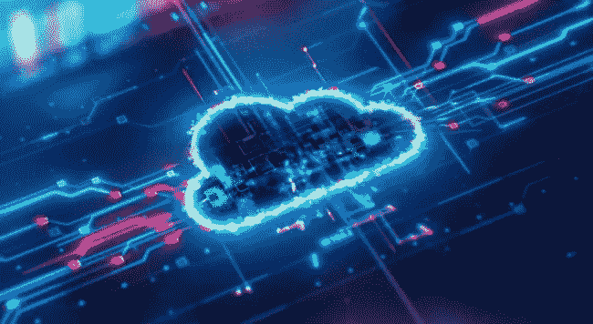
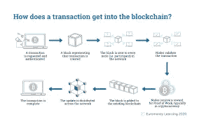
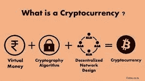
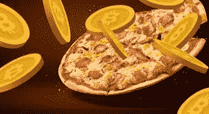
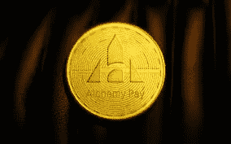
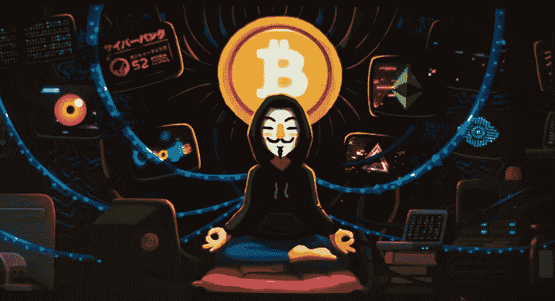
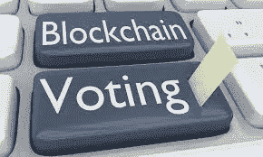
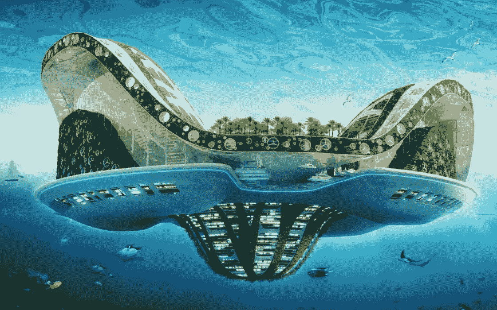

# 区块链将如何改变世界

> 原文：<https://medium.com/coinmonks/how-blockchain-will-change-the-world-77f65aaf5696?source=collection_archive---------13----------------------->

[*作者:麦克·詹姆斯*T3*T5*](https://www.youtube.com/watch?v=dQw4w9WgXcQ)*[F○RK @ AlchemyPayACH](https://medium.com/u/160b69b2d108?source=post_page-----77f65aaf5696--------------------------------)*

区块链是一个记录信息的系统。以一种使**不可能改变的方式填充信息块。难以侵入或欺骗系统。区块链是交易的数字分类账，它被复制并分布在整个计算机网络中。任何人都可以运行采矿钻机，任何人都可以下载采矿软件，并帮助完成区块链上的交易。区块链都不同地运行到它们的网络参数。通常，最快的计算机是完成交易的计算机，这取决于网络，然后必须确认一定数量的钻机。如果你的电脑被用来完成方块，那么你会收到“方块奖励”，这些奖励以被开采的货币的形式出现。这不是“免费的钱”,因为你必须支付电力来驱动采矿钻机。这个**必须**以有效的方式完成才能获利。你开采的货币的价格也是一个因素，因为它决定了你的利润。所以选赢链吧！大多数加密货币矿商完成交易长达数年，只是在牛市顶部出售他们的奖励。**

## 区块链的两种主要类型是 P.O.S,“利益证明”和 P.O.W,“工作证明”。

*工作证明*意味着你需要购买采矿设备，使其始终保持最新，钻机必须无限期地保持运行，同时会产生电力成本。比特币是第一个工作证明系统。

*赌注证明*意味着某人只买入一次，你购买了 Crypto 并在 P.O.S .网络上下了一大笔赌注，你的赌注池现在是从计算机网络中随机选择的，以验证交易。

这是区块链的两个基本版本，请记住，不同的网络在选择谁来验证下一个区块的方式上有所不同。为了跟上前沿技术的发展，你必须站在最新版本的最前沿，与未来的开发人员保持同步，同时密切关注困扰行业的宏观经济和监管问题。选择工作证明或利害关系证明有好的和不好的理由。但是随着技术的进步，原因很快就变得模糊了。

[Blockchain Definition](https://www.investopedia.com/terms/b/blockchain.asp)

既然明白了什么是区块链，那就来说说什么是加密货币。真的很简单，密码就是你在区块链上交易的东西。每个代币的价值取决于有多少代币。它们是如何被开采的在最初的白皮书中有所阐述，如果它们将被更多地制造是由创始人所安排的，那么投入多少钱都将增加你的代币的价格。一个项目的总投资额被称为市值。如果你将市值除以所有公开发行的代币，你会得到每一个代币的价值。

> 如果加密货币是汽车，区块链是高速公路。

许多区块链能够作为一个没有所有银行家和中间人的银行系统运行，加密货币是这个系统的货币，区块链是银行。第四次工业革命将为没有银行账户的人提供银行服务，帮助贫穷国家的地方工业创造价值。这将使世界上任何一个偏远地区都有能力快速外包他们的发明和产品。如果你有一个偏远的小村庄，可以生产出世界上最好的篮子。只要他们能使用手机，他们就能把他们的商品拿出来出售，然后直接从顾客那里把钱收到他们的钱包里！所有这些都不涉及银行，所有跨境汇款和税收都通过智能合同处理。随着无人机送货服务的发明，距离一年比一年小。如果手机服务是问题所在，那么埃隆正带着 StarLink 赶过来。无论你在地球的哪个角落，区块链都会联系到你。

[Cryptocurrency Definition](https://www.investopedia.com/terms/c/cryptocurrency.asp)

> 未来一切都将被令牌化，放到区块链上。一切…这包括你的社会安全卡，这将导致全球身份证。

区块链是人们互动的一种去中心化方式，每个人都可以访问免许可银行业务。现在，双方可以在没有信任问题的情况下进行交互，无需第三方验证和托管即可签订合同。所有互动都是公开的，并存储在账本上，任何人都可以随时看到。它们是永恒不变的！

**10k BTC**的传奇披萨交易仍然存储在区块链上，并且仍然在那里供任何人查看。请记住，当时没有真正的支付形式。2010 年，绝对没有披萨店会接受比特币。有人承包了披萨订单。Laszlo Hanyecz 在一个加密论坛上发布了一条消息，解释说他想用比特币订购一份披萨，如果有人想代理订单，他可以用比特币支付。很快有人回复了留言板并同意了，订购了比萨饼并把它送到了拉斯洛·汉耶茨的店里。披萨饼店老板随后收到了 10K·BTC。意味着交易是在两个私人钱包之间进行的。

“哦，天哪！所有的钱 10K 比特币！”为了两个披萨！冷静下来，记住 BTC 当时一文不值。它值收到的比萨饼的价值。就像你兑换的任何一种货币一样，当时收到的货物所兑换的货币金额需要是市场价值。如果他有一万 BTC 可以用来吹披萨，成为传奇，我敢肯定他能在接下来的一周买一万 BTC。这也表明，在加密货币中赚钱意味着你必须持有多年。20 年后，两块披萨的价值可能相当于两栋房子的价值。我们总是从不耐烦的人那里听到这句话。如果 ID 为，则只保留！！！这些人是“本来应该买下底层人群”的！！这个博客的读者将会是“去过那里，做过那件事，卖过顶的人群”！！永远保持学习，走在人群的前面。

[Mmmmm Bitcoin](https://www.moneycontrol.com/news/business/cryptocurrency/bitcoin-pizza-day-2021-some-interesting-facts-about-this-special-cryptocurrency-day-6924731.html)

> **额外事实:**由于区块链是永恒的，比特币是最初的共识网络。这意味着 BTC 也有世界上最古老的账本历史！有一条中本聪写的消息，他把它留在了第一个区块链的第一个区块上， [BTC](https://www.google.com/search?rlz=1C1JZAP_enUS993US994&sxsrf=APq-WBskfo768Beog5ol2nirJuBpxYCEqA:1646112181917&q=What+did+Satoshi+write+in+the+first+block%3F&sa=X&sqi=2&ved=2ahUKEwj4hfTelaT2AhXWGbkGHZgSA_cQzmd6BAgeEAU&biw=1600&bih=757&dpr=1) 。只要代码仍然有效，它就会存在，至少有一个节点必须保持活动状态。我会让你去寻找隐藏的信息，它就在那里！！

当区块链的篇章被写进历史书的时候，他们会提到像 T2、中本聪、T4、大卫·施瓦茨、查尔斯·霍斯金森和维塔利·布特林这样的人。但是真正让区块链成为可能的人是你！社区！！有人会认为，上述四人在加密货币和区块链的全球发展和扩张中发挥了关键作用，我坚定地站在这场辩论的这一边。但是如果没有社区，Satoshi 将只是一个默默无闻的软件开发者。是这些人让他成为传奇。是社区采用了比特币，并用它来买披萨。现在，随着 ISO20022 数据丰富系统的推出，我们将看到世界采用加密货币和 CBDC 的加密货币。当新技术出现时，每个人都有责任去学习它。如果你落后了，那是因为你没有采取必要的主动。如果你是 Crypto 新手，并且你想成为一个伟大的积极社区的一部分，我会推荐这篇文章的作者在 twitter 上领导的#ACHFAM。

> **你不需要我，我需要你，他们需要我们！**
> 
> 猿强在一起！所有存在于大学环境中的信息也存在于互联网上。为了获得优势，你需要学会学习。从阅读 PDF 文件和白皮书开始。只看别人怎么说。不要看着别人告诉你他们说了什么。DYOR，挖深一点！
> 
> 在“信息时代”,无知是一种选择。

**什么是钱包**？解释钱包最简单的方法是，它们是支票账户、储蓄账户和托管银行，所有这些都被打包到你手机上的一个应用程序中。当你使用代币作为价值交换时，需要有一种方法让个人安全地持有代币。我们称这些私人安全账户为“钱包”。任何人都可以拥有一个钱包，并使用区块链在世界任何地方转移资金。一些国家已经禁止或限制了加密货币的使用，因此使用某些区块链可能需要使用 VPN。限制使用的是政府或交易所，而不是区块链本身。

Satoshi is that you?!

**区块链的未来会怎样？**这是我被问得最多的。答案很简单，**一切，**未来一切都将被令牌化，放到区块链上。一切…这包括你的社会保障卡。这将导致全局 ID。你的车钥匙将会是你手机上的 NFTs，你的驾驶执照，抵押贷款，汽车登记，你能想到的所有东西都将保存在你的个人钱包里，价值将以加密的形式保存，物品以 NFTs 的形式保存。 ***{NFTs 在以前的文章中解释过，很快会重新上传到 medium！}***

## 现在我们已经有了区块链、加密货币和许多用例的基本知识。让我们进入一些第一次真正的应用和利用新技术的最佳方式。

首先让我们从最简单的过渡开始，这将是游戏。该系统目前是“付费游戏”的一部分，本质上已经是为数字分类帐系统设计的系统。游戏币是加密的典型代表，物品/皮肤是 NFTs。要成为 NFT，这些皮肤只需要在任何区块链上铸造。这就像上传个人资料图片到 Twitter 一样简单。在 Algo 和 Matic 等链上，铸造 NFTs 对任何人都是免费的。

**随着 [NFTs](https://ethereum.org/en/nft/) 和加密货币的发明，几年后游戏将成为朝九晚五的工作。除了区块链社区本身之外，游戏玩家是第一个真正加入区块链的社区。游戏玩家已经收集数字物品，所以这是一个自然的和期待已久的系统。**

许多家长对堡垒之夜的 20 美元皮肤太熟悉了。你家孩子求来求去要个“皮”。你不明白他们在说什么。但它似乎对他们很重要，所以你买了它。不到两天，他们就要求再来一次，然后一次又一次！！现在，如果堡垒之夜的服务器瘫痪了，所有的钱都没了。但是一旦这些物品被添加到分类账中，并成为一个 NFTs，那么即使游戏消失了，这些物品也将作为收藏品存在。玩家不仅将拥有他们的物品，并能够转售它们，而且他们可以赚取它们。现在，当龙掉下一把稀有的剑时，它可能会值很多真正的钱。这深入探讨了不同的赚钱方式。在[的元宇宙游戏](https://app.gala.games/)中，他们创造了一个拥有大片土地和预制商业和商店的广阔世界。人们可以在这些土地上建造房屋。如果你买了一栋建筑/一家企业，但你没有任何土地，那么你必须租一块土地来建造它。然后你必须雇人在你的店里工作来生产商品。假设你买了一个魔药店。你设置你的药水的价值包括开销。足够支付员工的工时和房租。人们用加密货币支付你的物品，人们会像正常生意一样经营，每个月都会有剩余的药剂和利润。像任何游戏或商业一样扩张和招聘。

许多人会说，“那永远行不通”，对此我说，“[已经有了](https://www.playerauctions.com/sell-wow-items/)”。看看魔兽世界，这个游戏在游戏经济中有很长一段时间，人们通过种植黄金并在黑市上非法出售来赚钱。这使得它成为一个合法的商业投资。

这也是为什么进入区块链行业是如此容易的决定。区块链不仅是未来，而且无论你的工作领域如何，它都将被整合。每个人都不需要公开他们的加密货币。这些区块链分类账将被制作并保持私有，仅用于物流和运营。为了理解区块链的用途，我们必须了解**智能合约**的使用。

[**什么是智能合约**](https://www.ibm.com/topics/smart-contracts#:~:text=Next%20Steps-,Smart%20contracts%20defined,intermediary's%20involvement%20or%20time%20loss.) **？智能合约是在区块链上编写的简单程序，在满足预定条件时运行。它们通常用于先前协议的自动化。这意味着所有各方都可以是无权限的，当满足某些条件时，结果是预先确定的。他们还可以自动化工作流，在另一个动作完成时触发下一个动作。这些是区块链上的“长期订单”，它们将在触发价值得到满足时履行。**

举个例子，让我们以一个简单的互联网服务计划为例。你必须每月支付一定数额的款项。目前，互联网提供商需要一大批员工来“开关”不按时付费的服务。当区块链被利用时，就像你支付智能合同一样简单。然后，智能契约会向 Oracle 发送信号，让您的服务保持活动状态。Oracle 系统是区块链的一部分，它与外界联系，获取包含在链本身之外的所有信息。如果你没有按时履行你的合同，也就是说你没有支付你的网络账单，这将触发合同关闭你的服务。与此同时，任何能上网的人都可以看到这些交易。这是一个非常简单的支付账单服务版本。但区块链的使用范围是无限的，并将带我们开始。

现在，我们已经了解了区块链和加密的基础知识和初始用例，让我们来看看一个真实的用例，它将永远改变我们所知道的世界。想象一下能够看到实时投票的情况。不再有福克斯、CNN 或 MSMBC 告诉你数字是多少。通过在区块链上投票，您可以看到实时百分比，因为它们精确到分钟。

US Postal Service Patents 2020

[**美国大选将全部跑上区块链**](https://nerdist.com/article/u-s-post-office-files-patent-for-blockchain-voting-system/) 。这些将在未来几年用于主权投票，因为许多美国州甚至美国邮政服务已经[使用区块链服务的专利投票平台](https://patents.google.com/patent/US20200258338A1/en)。这将使安全可靠的选举成为可能，同时完全避免选民身份证或选民登记的所有问题。这将直接来自你的政府社保区块链。KYC 将来会在你出生时附上你的 NFT 出生证明。这些都不是谣言和炒作，都是可以被搜索和验证的。一年前，当我谈到这个的时候，人们笑了。他们已经不笑了，他们在主动问朋友和家人怎么买比特币！

> 区块链的发明和互联网的发明不相上下。在内燃机发明之前，投资加密货币相当于投资油田。

涉及区块链的互联网新形式将轻松移动价值和数字物品。这就是为什么它被称为物联网或 IOT，有时也被称为价值互联网，这也是术语 Web3.0 的来源。Web2.0 给了我们一种以数字方式发送图片和信息的方式，仅仅是数据。3.0 让我们能够通过互联网以数字信息的形式传递价值。现在在 2.0 上发送值，信息被发送，值被托管，然后在现实生活中被传送。区块链使得价值直接在人与人之间传递成为可能。

如果我们不努力保持区块链中的匿名性，它可以并将被用于实现社会信用评分和普遍基本收入“UBI”。这是一整罐的蠕虫，我们将在另一个时间打开。如果你对现实世界的收养感兴趣，请看看 ISO20022，我将在下一篇文章中更深入地探讨这个问题。如上所述，ISO20022 将于 2025 年取代 SWIFT，这一数字基础设施将在加密货币上运行，并将于 2022 年 8 月至 11 月投入使用

区块链的未来会怎样？它代表着人类的未来。

Stay Ahead of the News

感谢您的阅读，联系我的链接在我的名字上方。订阅每周文章和新闻。[在 Twitter](https://twitter.com/AlchemyPayACH) 上关注我，了解加密和 [AlchemyPay](http://ALCHEMYPAY.ORG) 的相关更新

**什么是炼金术报酬？**[**AlchemyPay.Org**](https://alchemypay.org/)

[BIA.Network](https://bia.network/)

Alchemy Pay 的旗舰服务是一个面向企业的一体化法定和加密支付网络。Alchemypay 提供一种白标支付服务，可以部署在任何系统中，无论是离线(POS 终端和移动设备)、在线还是应用内，都可以通过菲亚特移动钱包、加密货币和信用卡接受支付。

早在 2021 年 8 月，我就找到了 Alchemypay，并开始与他们合作。他们在以太坊上有一个区块链支付网络，将接管支付领域。欲了解更多关于$ACH 加密，Alchemypay，BIA。网络，或为 Alchemypay 工作的信息，请在 Twitter 上与我联系。我现在是首席大使，从事营销工作。BIA 是一个缩写词，意思是“区块链基础设施联盟”,它是由$MATIC @0xPolygon Alchemypay 和许多其他人创建的！