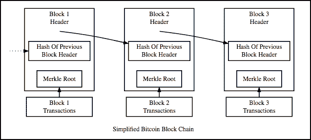
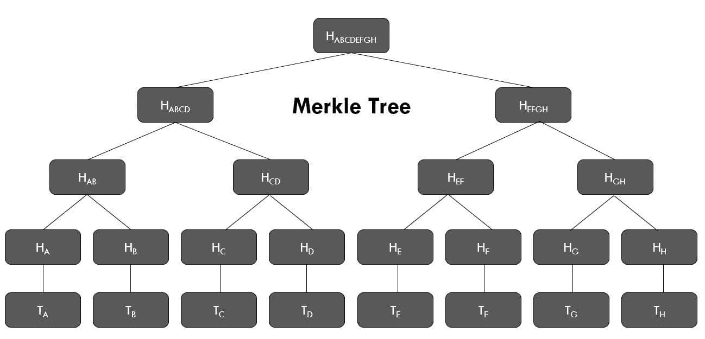
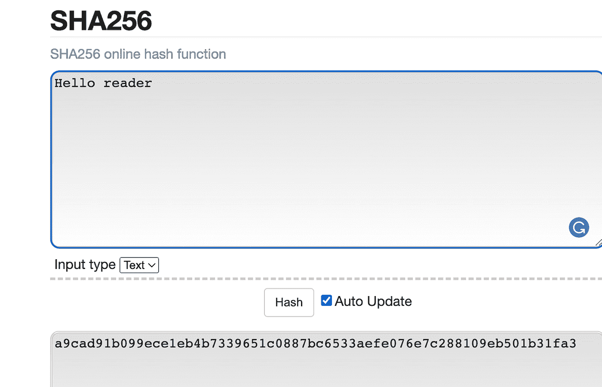
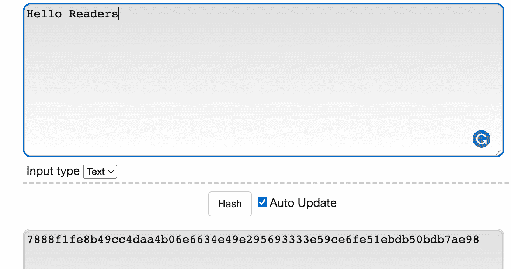
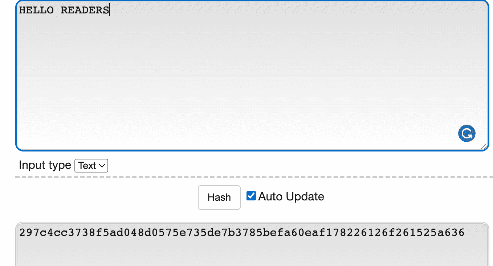
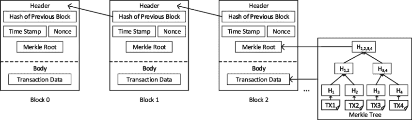
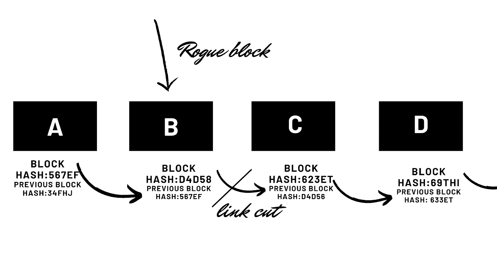

# 区块链是如何工作的。

> 原文：<https://medium.com/coinmonks/how-blockchain-works-bb243142375c?source=collection_archive---------51----------------------->

**深入了解比特币的区块链技术**

photo by jaydeep_

在我读过的大多数文章中，作者似乎对区块链的概念摸不着头脑。然而，区块链是我们最喜欢的 [cryptos](https://derbymatoma.com/2021/10/23/introduction-to-cryptocurrencies-for-investors/) 所基于的技术，对此优柔寡断对任何人都没有好处。

作家们普遍认为，读者对加密货币和区块链的本质细节不感兴趣。

但这忽略了好奇的读者。

我明白了，开汽车不一定要懂内燃机。

但是知道不会杀人。在这一节中，我们将深入探讨区块链机制。

让我们假设你是那种想知道任何事情的极客。你知道哪一类人知道*倭黑猩猩、*这个词的来源、海豚睡觉的时间以及公象性器官的平均大小吗？。让我们假设你很好奇。

# 区块链

我们走吧！

区块链是一个巨大的电子表格，包含由字面意义上的匹配数字连接的数据块。技术描述是一个共享的公共分类账。

至于链接数字，它们被称为散列。每个块携带前一个块的散列创建链接。稍后会有更多关于哈希的内容。

illustration by blockgeeks

信息被打包在链接的块中，因此如果一个块被打乱，整个事情都会被打乱。这就是**块+链**名称的由来。

在高层次上，数据是链式的，因此更改一个数据块需要更改数据链中的后续数据块。改变所有进行中的程序块是非常累人的。除了不可能之外，通常还不值得去做。

此外，摧毁一个长链将遭到所有区块链成员的一致反对。

这个*电子表格*可供网络中的每个参与者使用。参与者有一个好听的名字，“节点”。当您用典型的电子表格行为更新区块链时，每个节点也会更新它的副本。

# [比特币交易如何运作。](https://www.simplilearn.com/bitcoin-mining-explained-article)

看够了区块链的高层视角；让我们看看在事务(Tx)级别发生了什么。

交易是区块链存储的主要数据。例如比特币和莱特币。然而，在最近的升级中，一些区块链可以携带计算机程序和其他形式的数据。例如卡尔达诺和以太坊区块链。

事务有三个关键组成部分。这些是**输入**、**数量、**和**输出。**

**输入**包括*账户*收到的交易；他们决定可以向其他*账户汇多少钱。*

**金额**是指要发送的比特币数量。

**输出**是比特币被发送到的地址(公钥)。

## 交易与钱包

现在，在实际情况下，你没有一个接收硬币的钱包地址。您的输入是由所有接收地址的总和构成的。

注意，为了方便起见，我使用了 ***账户*** ，但实际术语是 ***地址*** 。

假设你想给女朋友送两个比特币；在区块链，应该有记录表明你在某个时候收到了 2+个比特币，但你从未使用过它们。

或者至少余额保持在两个比特币以上，以迎合交易费用。

生态系统的其他成员也能看到这一点。光是这一步，我们就能消灭任何双重消费的企图。)

这个系统确保没有人发送他们从未收到过的比特币。这一过程和其他附加过程抑制了重复支出。

至于交易的安全性，我们使用两个密钥对。公钥和私钥。

私钥是产生公钥的密钥。但是，不能用公钥来推算私钥。

# 示例私钥

下面是我的私钥例子；

*———开始 RSA 私钥——*

*miicxqibaakbgqdjvbipoayzputsvilp 61g 7 yhji 3 leorfxsbngtsif 5 w 6 asdej 74 zpluyzse+pzy 8 jhnuiv 3 eal9n 3/ypxdaybpaxdighrnxqmh 5 kiru 6 I 11 mpuvzheyem 1 xir 7+kWFCYKG+9 pmfrgf 4xadocuzlt/AE 0 ymazfecz+esaiykjduwidabaogbakyss+ojbq 0 pemou 3 DJ 9 csuz*

*———结束 RSA 私钥——*

# 示例公钥

这里是对应的 public

———开始公钥———

*MIG fma 0 gcsqgsib 3d qebaquaa 4 gnadcbiqkbgqddjvbipoayzptusvilp 61g 7 yhji 3 leorfxsbngtsif 5 w 6 as dej 74 zpluyzse+pzy 8 jhnuuv 3 eal9n 3/ypxdaybpaxdighrnxqm H5 kiru 6 I 11 mpuvpzhye m1 xir 7+kWFCYKG+9 pmfrgf 4xadocuzlt/ae0 ymazfecz+EsAIYkjDuwIDAQAB*

*———结束公钥——*

# 私钥和公钥对如何工作。

在比特币区块链的例子中，这是通过一种叫做**椭圆曲线加密**的不对称算法来实现的。

逻辑是，我可以告诉你一个倍数，但找出产生倍数的因素并不容易。

例如，我的公钥是 12，它是由 x^bxy.形成的这些未知变量就是私钥。所以你可能有 2 x 3，4 x 3，等等。

注意，颠倒表达式给出了私钥的不同解决方案。因此，有很多可能的解决方案，但实际上，当真正的解决方案。

现在想象一个比这个复杂一百万倍的函数，有不同的解。

最终，私钥很难找到，但仍然对应于公钥。

## 公开密钥

来自其名字的公钥对区块链中的每个人都是可用的；因此，它被发送方用作接收地址(输出)。

## 私人密钥

另一方面，私钥由拥有钱包的人保管(除非信任此人，否则不要共享)。

私钥控制收到的硬币(输入)的花费

还记得我说过的密钥是**对，**所以私钥可以访问发送给公钥的硬币。这意味着一旦硬币被发送到公钥，每个节点都可以看到它们，但只有匹配的私钥可以花掉它们。

从绝对意义上来说，没有钱包、账户等等。我们将硬币发送到一个公共密钥，该密钥标识一个地址。为了花掉这些硬币，你应该有匹配的私人钥匙。

*你的公钥负责接收硬币。因此，你可以分享它，接受硬币。事实上，您必须将它交给发送方，以用作事务的输出。你的私人钥匙允许你花费收到的硬币。*

# 签名

发币的时候；

签名来自您的私钥；这个签名验证了交易。这个签名是为了确认你就是送硬币的人。而且一旦创建就无法更改。

从这里，您的事务被发送到一个 mempool，一堆未确认的事务加入其中。此时，事务正在等待矿工将其添加到块中。

但是在我们谈到矿工之前，让我们停下来思考一下。

现在，你应该对区块链有了新的认识。

区块链不记录账户余额。相反，它记录了所有地址间转移的硬币。同样，这些地址指向私钥和公钥。

不用说，如果你检查一个网络中所有地址之间发生的交易，你就会检查它们的余额。

这些交易(转账)很重要，因为技术上不存在账户余额和硬币。存在的是转移。输入交易为地址创造价值。

# 处理

让我们回到交易上来，

交易的工作方式很像电子邮件。如果向公众发送电子邮件，只有拥有正确密钥的用户才能访问其中的内容。

例如，你想把比特币寄给你的莎拉阿姨。她会把她的地址发送给你——一个从她的公钥得到的地址(*地址和公钥经常互换使用)。*

然后你把比特币转到她的地址，并在信息上签名。

签名来自您的私钥。因此，如果没有人知道您的私钥，消息就不会被篡改。

在收到验证交易的信息时，您的公钥用于确保您是拥有用于签署交易的私钥的人。记住公钥和私钥是相互关联的。

该交易向公众广播以添加到区块链中。一组被称为 ***矿工*** 的节点将验证你的交易的有效性。这包括检查您的交易中的输入是否从未被使用，更重要的是检查您是否拥有您声称拥有的私钥，而不知道您的私钥。

如果您的交易通过了这些流程，它将被添加到区块链中。

将事务添加到区块链的过程称为 ***挖掘*** 。网络中挖矿的节点(人/计算机)就不用说了，就是**矿工。**

矿工通过在仔细检查伪造后将每笔交易添加到网络中来为区块链提供安全性。

# 哈希 1

挖掘器构造块，使得每个事务的散列摘要与另一个事务的散列摘要结合，并再次散列它。

他们重复这个过程，直到所有的事务被散列以形成一个 ***Merkle 根*** 来标识整个块中的所有事务。

Image by OIB News

此外，他们通过工作证明建立了区块链，因此很难撤销交易。作为交换，他们获得支付的比特币和交易费。

那么他们是如何做到这一点的呢？

挖掘器收集构成 1 MB 数据的所有有效事务。他们单独检查他们的合法性。之后，他们尝试将事务添加到区块链中。

但是等一下！因此，这可能意味着矿商可以在系统中伪造交易。即便如此，这些矿工通过在一分钟内制造尽可能多的街区来制造混乱？

通过工作证明添加区块。为了限制可以添加块的矿工的数量，每个矿工应该通过产生小于或等于目标散列的块散列来证明他们已经做了一些工作。

***目标 hash*** 是区块链软件自动设置的数值，用来调节向网络添加块的时间。添加一个块应该需要 10 分钟；更多将导致大量的孤立块和能源浪费。

我说得太多了；让我们放松一下。

# 哈希 2

一个**散列**是一个数学函数，它将任意长度的输入转换成固定长度的输出。信息的微小变化会完全改变结果。

我为你好的读者做了一些 SHA 256 散列的例子。我对每个哈希的输入做了一点小小的改变，但是注意到了它对哈希摘要的巨大影响。

这使得在处理大量数据时，输入数据的特定变化很容易被注意到。

Image by derbymatoma.com

Image by derbymatoma.com

Image by derbymatom.com

最终，块报头中的所有信息都应该被散列；这样，数据中的所有微小变化都会导致输出发生变化。任何恶意的改变都很容易被挑出来反对。

每个块都包含前一个块的散列。在一个块中，如果前一个块值的散列与前一个块中的实际散列相匹配，我们就得到连接两者的链接。这就是区块链链条的制作过程。

Illustration from research gate.

一个块的散列的改变会断开它与后续块的连接。

# 比特币挖矿

回矿；

你已经意识到哈希是多么重要。为了开采一个区块，矿工收集以下材料

*   根哈希
*   前一个块的哈希
*   时间戳
*   客户端软件版本
*   称为随机数的随机数

这些值被放入 SHA 256 哈希函数中，以生成块的哈希。但是，该哈希应该小于或等于哈希目标。哈希目标越小，越难找到。

哈希是一个 64 位十六进制数。所以你可以想象得出准确的答案有多难。计算机不得不猜测；幸运的是，他们可以有无限的猜测。

因此有了散列率(散列能力)的概念，拥有最好处理器的计算机可以通过改变随机数和散列头数据来最快地猜测。

# 猜谜游戏

当挖掘时，计算机本质上是改变 nonces 来寻找低于目标散列的散列。随机数是通过试错法(猜测)获得的。 *Nonce 表示只使用一次的数字*。因此，他们不会重复失败的猜测。每当他们想要散列数据时，他们必须改变它。

猜测最快的计算机在概率上有优势。

这是乏味的猜测。最初，基本的计算机可以做到这一点。然而，随着竞争的加剧，哈希目标被调整为保持 10 分钟的区块链心跳。目前，用于挖掘比特币的计算机是 ASICs(专用集成电路)。

专用集成电路是功能强大的计算机。因此，它们使用大量的能量。这就是为什么矿商需要激励的原因；他们的电费很高。

# 当一个矿工得到一个正确的随机数时会发生什么？

假设一个矿工得到了正确的随机数；它们将块传输到其他节点进行确认。区块链的矿工同事检查传输块中添加的交易的有效性。

最后，它们对给定的 nonce 和块头数据进行哈希运算，以验证它是否低于或等于哈希目标。

证明不需要花费精力或时间，因为这是一个证明方程的解是有效的问题，*给定变量*的所有值。

在此过程之后，块被添加到区块链中。它通过其块头中的 ***前一散列*** 连接到前一个块。

# 如果一个矿工伪造交易怎么办

如果矿商伪造交易，一旦该交易被传递给其他矿商，他们会很快发现。该块被丢弃。在制作工作证明时，他们进行了无用的检查，这使得矿工在工作证明过程中耗费了大量的精力。

因此，创建有效的块以避免浪费能量是最有利的。

Illustration from derbymatoma.com

如果块 B 被篡改，则块散列会改变。因为块 B 的散列用于将其与块 c 连接，所以该链接被切断。此外，块 B 的散列用于产生块 C 的散列。这可能会打乱所有进行中的程序。

一个区块的变化会对后续区块产生多米诺骨牌效应；为了保持这种可持续性，黑客还必须为进行中的散列计算匹配散列，考虑到能量需求，这是不可行的。因此，块 B 上的更改将被整个区块链节点丢弃。

总之，我们不会发生任何变化。

# 叉

现在有矿工同时发现有效区块的例子。这些块可以加在一起，形成一个 ***叉。* ***一致性算法*** 将确保具有最长链的块成为主链。**

这是怎么发生的？

大多数矿商添加的附属区块最终成为主链。

对我来说，这看起来像是多数人获胜的民主制度。

这也阻止了欺诈区块成为主链的一部分。如果黑客计划添加一个坏块，他们将不得不与更有可能从矿工那里获得更多支持的正版块竞争。

当然，这是真的，直到 51%的攻击发生。在这种情况下，一个黑客或一群黑客拥有 51%的挖掘能力。因此，他们可以很容易地选择哪个链变得最长。

这是违背共识算法的一种方式。

# 那么什么是区块链呢？

总的来说，比特币区块链自动处理信任问题，而不使用中央权威机构。

通过验证事务和添加块，挖掘器在保护对等系统中起着关键作用。他们的工作得到交易费和比特币的奖励。

使用的资源

[https://www . oreilly . com/library/view/mastering-bit coin/9781491902639/ch08 . html](https://www.oreilly.com/library/view/mastering-bitcoin/9781491902639/ch08.html)

> 加入 Coinmonks [电报频道](https://t.me/coincodecap)和 [Youtube 频道](https://www.youtube.com/c/coinmonks/videos)了解加密交易和投资

# 另外，阅读

*   [如何在 Uniswap 上交换加密？](https://coincodecap.com/swap-crypto-on-uniswap) | [A-Ads 评论](https://coincodecap.com/a-ads-review)
*   [加密货币储蓄账户](/coinmonks/cryptocurrency-savings-accounts-be3bc0feffbf) | [YoBit 审核](/coinmonks/yobit-review-175464162c62)
*   [Botsfolio vs nap bots vs Mudrex](/coinmonks/botsfolio-vs-napbots-vs-mudrex-c81344970c02)|[gate . io 交流回顾](/coinmonks/gate-io-exchange-review-61bf87b7078f)
*   [CoinFLEX 评论](https://coincodecap.com/coinflex-review) | [AEX 交易所评论](https://coincodecap.com/aex-exchange-review) | [UPbit 评论](https://coincodecap.com/upbit-review)
*   [AscendEx 保证金交易](https://coincodecap.com/ascendex-margin-trading) | [Bitfinex 赌注](https://coincodecap.com/bitfinex-staking) | [bitFlyer 审核](https://coincodecap.com/bitflyer-review)
*   [Bitget 回顾](https://coincodecap.com/bitget-review)|[Gemini vs block fi](https://coincodecap.com/gemini-vs-blockfi)cmd |[OKEx 期货交易](https://coincodecap.com/okex-futures-trading)
*   [AscendEx Staking](https://coincodecap.com/ascendex-staking)|[Bot Ocean Review](https://coincodecap.com/bot-ocean-review)|[最佳比特币钱包](https://coincodecap.com/bitcoin-wallets-india)