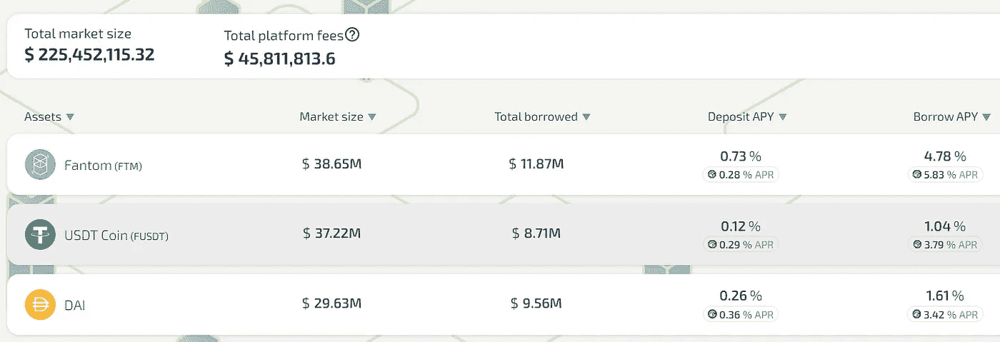
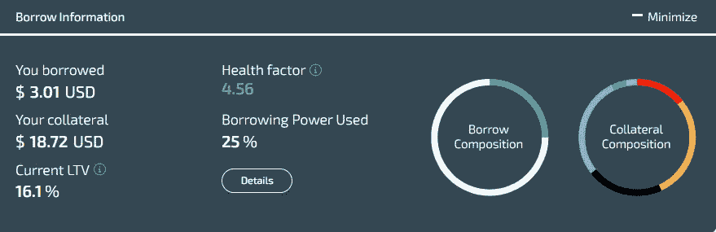
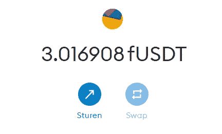
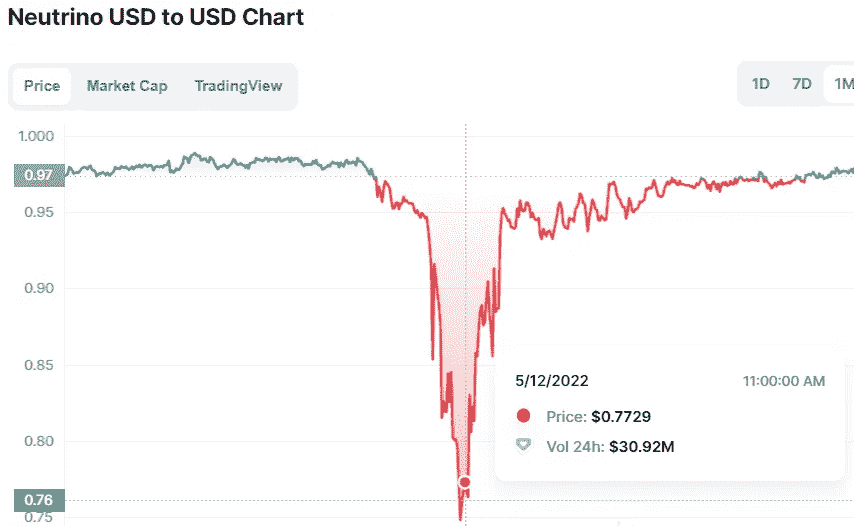

# 在 DeFi 中通过借贷赚更多的钱！

> 原文：<https://medium.com/coinmonks/how-borrowing-and-lending-in-defi-can-make-you-more-money-696ee4bf3253?source=collection_archive---------7----------------------->

## DeFi 保证金交易介绍。

# 贷款/借款

DeFi 是一个令人兴奋的空间，在这里新技术被创造出来，并准备好被成千上万兴奋地探索这些机会的人所使用，只是受到编码轮背后聪明头脑的限制。DeFi 正试图利用区块链的力量，然后通过创建应用程序来扩展其效用，从而进一步改善供应链。

这些新想法中的一个是 Dapps，它像现代银行一样工作，但最大的不同是这些应用程序的工作没有许可，并且是分散的！这些借贷平台会以一定的利率借给你钱，你可以随心所欲地使用这些钱。你可以用这笔钱投资回到 crypto，但也可以支付一些新的太阳镜或基金你的下一个房子！

Geist finance lending/borrowing dashboard

我听到你想知道这将如何运作吗？太好了！让我们更深入地探讨一下…

# DeFi 中的借贷是如何工作的

这些平台通过资产池来工作，这些资产池用于向人们提供流动性(资产)。你总是需要自己存一些资产，作为抵押。这是必要的，这样你将永远能够偿还你的贷款。每当贷款资产的价值下降超过存款资产的价值时，您自己的一部分资产将被清算，以确保您能够还清债务。这种贷款价值(LTV)比率通常在 80%左右。

Borrowing USDT creates a 16% LTV ratio, and gives me $3.01 in my metamask wallet

**现在我觉得你这话听起来有点复杂，所以让我举个例子；**

> 梅塔想买一辆跑车，但她所有的钱都投资在了以太上。因此，为了给她的车提供资金，她在借贷平台上的以太坊里存了 15 万美元。然后，她借入价值 5 万美元的 USDC，开始贷款，LTV 为 50/150=33%。她把 USDC 兑现到她的银行账户，然后用这些钱给她买了一辆超级豪华的汽车！**尽管她不得不小心；她必须确保她存放的以太的价值不会低于所借的 50K 美元，否则，她的以太坊将被清算并出售以偿还贷款！**

我希望你现在对贷款是如何运作的有了更好的理解。你可以用你的贷款做任何事情，所以你可能不想买一辆车，而是想买一个 dip 并得到更多的密码。如果你和我一样，没有资金，把你的密码作为抵押品来获得一些美元是扩大你头寸的一个完美方式！

# 做多/做空

利用这些借贷平台，你也可以做空或做多。你可以用你自己的以太坊作为抵押来借贷和做空卢娜。然后你在 DEX 上卖掉这个 Luna，等价格下跌后再买 Luna。你偿还你的贷款，你保持利润！

做多可以通过存放你的资产，然后用借来的钱购买你想要的资产来实现。你可以存入 AVAX，用它作为抵押借入 USDC，然后买入更多的 AVAX，并以更高的价格卖出。然后你偿还你的贷款，并保持利润！

***这里有一个小小的警告！*** *虽然这是获得更多投资资金的绝佳方式，但要记住加密是不稳定的！你的抵押品永远不应该高于你愿意损失的水平，特别是因为即使低的 ltv 也能让你在大的市场波动中被清算。*

# 短路稳定线圈

使用前面提到的做空策略，我们也可以做空稳定的债券。假设你存了 USDT，然后在平台上借了 UST。你在 USDT 的现货市场上出售这种 UST，因为你预计 UST 的联系汇率将会下降。一旦出现这种情况，你就以比最初出售时更低的价格买回 UST，并偿还贷款。利润你可以留着！这里最难的部分是找到既有 USDT 又有 UST 的站台，但是也许你可以找到其他的路线来实现这一点！

Shorting NUSD might be a profitable strategy!

# 结论

几乎每个链家都有活跃的借贷平台。[以太坊(L2)](https://app.aave.com/) 、 [Fantom](https://geist.finance/) 、 [Avax](https://app.benqi.fi/) 和[币安链](https://valasfinance.com/)已经有多个 Dapps 支持这个功能，如果你搜索正确，你可能会找到更多！这是一个很好的方式来释放更多的法定购买权，但请记住，这也使您的头寸面临清算风险，并可能导致您所有的资金被清算。**小心使用它，并探索机会，因为有人可能会说，早起的鸟儿有虫吃，对于 crypto 来说，这一点从未如此正确过！**

如果您有任何意见、讨论点、问题或评论，请随时评论或给我发电子邮件。我很想和你谈谈这件事！

**其他链接:**

*   为了让我的故事对每个人都免费，请给我买杯咖啡吧！[https://ko-fi.com/igormd](https://ko-fi.com/igormd)
*   想开始交易吗？用我推荐的库币！[https://www.kucoin.com/r/rf/1de5d](https://www.kucoin.com/r/rf/1de5d)
*   想从每天 1%的活塞赛跑开始吗？考虑使用我的好友链接！[https://piston-token.com/ref/igormd](https://piston-token.com/ref/igormd)
*   想成为页面上的特色吗？给我发邮件！

> 加入 Coinmonks [电报频道](https://t.me/coincodecap)和 [Youtube 频道](https://www.youtube.com/c/coinmonks/videos)了解加密交易和投资

# 另外，阅读

*   [折叠 App 审核](https://coincodecap.com/fold-app-review) | [Kucoin 交易机器人](/coinmonks/kucoin-trading-bot-automate-your-trades-8cf0ca2138e0) | [Probit 审核](https://coincodecap.com/probit-review)
*   [如何匿名购买比特币](https://coincodecap.com/buy-bitcoin-anonymously) | [比特币现金钱包](https://coincodecap.com/bitcoin-cash-wallets)
*   [币安 vs FTX](https://coincodecap.com/binance-vs-ftx) | [最佳(SOL)索拉纳钱包](https://coincodecap.com/solana-wallets)
*   [比诺莫评论](https://coincodecap.com/binomo-review) | [斯多葛派 vs 3Commas vs TradeSanta](https://coincodecap.com/stoic-vs-3commas-vs-tradesanta)
*   [Capital.com 评论](https://coincodecap.com/capital-com-review) | [香港的加密借贷平台](https://coincodecap.com/crypto-lending-hong-kong)
*   [如何在 Uniswap 上交换加密？](https://coincodecap.com/swap-crypto-on-uniswap) | [A-Ads 评论](https://coincodecap.com/a-ads-review)