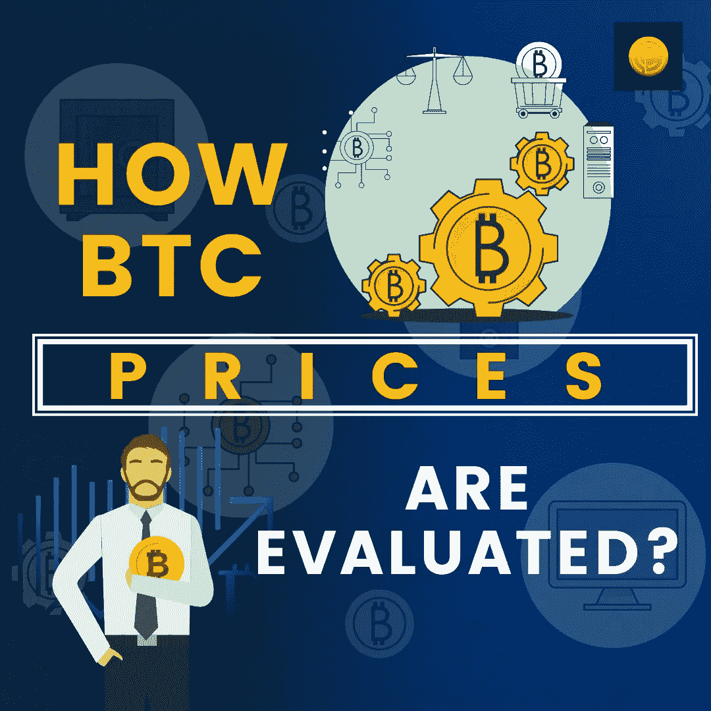

# BTC 价格是如何评估的？

> 原文：<https://medium.com/coinmonks/how-btc-prices-are-evaluated-explained-7f1ee304faea?source=collection_archive---------51----------------------->

BTC 是通货膨胀的对冲工具！这是下一个数字黄金！它是储存你价值的最好的资产！你问，媒体会提供，肯定。这就是围绕 BTC 的言论如何随着时间的推移而变得成熟。事实上，当一项资产在 10 年内从每枚代币几美分变成数百万美元，达到 6 位数时，它应该表现得如此。话虽如此，人们肯定对价格实现的经济在比特币领域如何运行有点好奇。在本文中，我们已经谈到了这一点！如果你想知道 BTC 的价格是如何形成的，是什么刺激了 BTC 的价格，请做好准备！

# 什么是 BTC？

BTC 是一个名叫中本聪的匿名开发者的创意，他创造了一个完美的去中心化、密码保护的货币系统来挑战传统的金融系统。在由 Satoshi 概念化和执行的上述货币体系中，社区通过采矿来管理和运行生态系统。在这个过程中，他们获得了 BTC 奖。

# 是什么决定了 BTC 的价格？

在传统的金融体系中，政府完全控制国库。这意味着，他们可以简单地通过抵押债券和其他抵押品来印刷货币。然而，这些政策和技术并不适用于 BTC，因为它不受通货膨胀、经济增长和货币政策的影响。相反，它完全被采用、供求、开采和新闻报道所控制。你可能已经很好地听到了伊隆·马斯克发推特消息，市场一落千丈。

# 生产成本和 BTC

所有生产出来的东西都会受到生产成本的影响。BTC 也不例外，因为它非常依赖电力和网络活动。随着时间的推移，由于越来越多的参与挖掘 BTC 节点，BTC 的主导地位已经从 80%下降到 45%。BTC 价格下跌 50%表明，随着参与度的上升，BTC 求解算法变得复杂了。因此，当节点参与时，它们需要更多的时间来解决挖掘块的问题。因此，时间越长，意味着耗电量越大，系统磨损越严重，冷却系统的需求也越大。所有这些都归结为降低采矿的激励性。因此，经常可以看到，在熊市期间，采矿活动明显受到打击。

# [BTC](https://www.coindhan.com/trading/btcinr) 好投资吗？

引用迈克尔·塞勒的话，“没有一个长期持有 BTC 的人会变穷！”所谓长时间，并不是指 5 年或 10 年，而是指一年减半到下一年。用数字来表示，4 年，其中两年赚的钱足够维持剩下两年的冷静期。即使在熊市，BTC 也有回报。而且，如果你看看 BTC 过去十年产生的利润，它远远超过 CAGR 的 142.45%，标准偏差至少为 180.62%。

这些事实足以得出这样的结论:尽管主导地位正在减弱， [BTC](https://blog.coindhan.com/2022/06/21/top-ways-to-earn-btc-when-you-do-not-have-ample-money-to-buy-it/) 仍然被同行认为是最纯粹、最好的货币形式。

> 加入 Coinmonks [电报频道](https://t.me/coincodecap)和 [Youtube 频道](https://www.youtube.com/c/coinmonks/videos)了解加密交易和投资

# 另外，阅读

*   [用信用卡购买密码的 10 个最佳地点](https://coincodecap.com/buy-crypto-with-credit-card)
*   [加拿大最佳加密交易机器人](https://coincodecap.com/5-best-crypto-trading-bots-in-canada) | [Bybit vs 币安](https://coincodecap.com/bybit-binance-moonxbt)
*   [阿联酋 5 大最佳加密交易所](https://coincodecap.com/best-crypto-exchanges-in-uae) | [SimpleSwap 评论](https://coincodecap.com/simpleswap-review)
*   购买 Dogecoin 的 7 种最佳方式
*   [最佳期货交易信号](https://coincodecap.com/futures-trading-signals) | [流动性交易所评论](https://coincodecap.com/liquid-exchange-review)
*   [用于 Huobi 的加密交易信号](https://coincodecap.com/huobi-crypto-trading-signals) | [Swapzone 审查](/coinmonks/swapzone-review-crypto-exchange-data-aggregator-e0ad78e55ed7)
*   [最佳加密交易机器人](/coinmonks/crypto-trading-bot-c2ffce8acb2a) | [购买索拉纳](https://coincodecap.com/buy-solana) | [矩阵导出评论](https://coincodecap.com/matrixport-review)
*   [Coldcard 评论](https://coincodecap.com/coldcard-review) | [BOXtradEX 评论](https://coincodecap.com/boxtradex-review)|[uni swap 指南](https://coincodecap.com/uniswap)
*   [比特币基地评论](/coinmonks/coinbase-review-6ef4e0f56064) | [德里比特评论](/coinmonks/deribit-review-options-fees-apis-and-testnet-2ca16c4bbdb2) | [FTX 评论](/coinmonks/ftx-crypto-exchange-review-53664ac1198f)