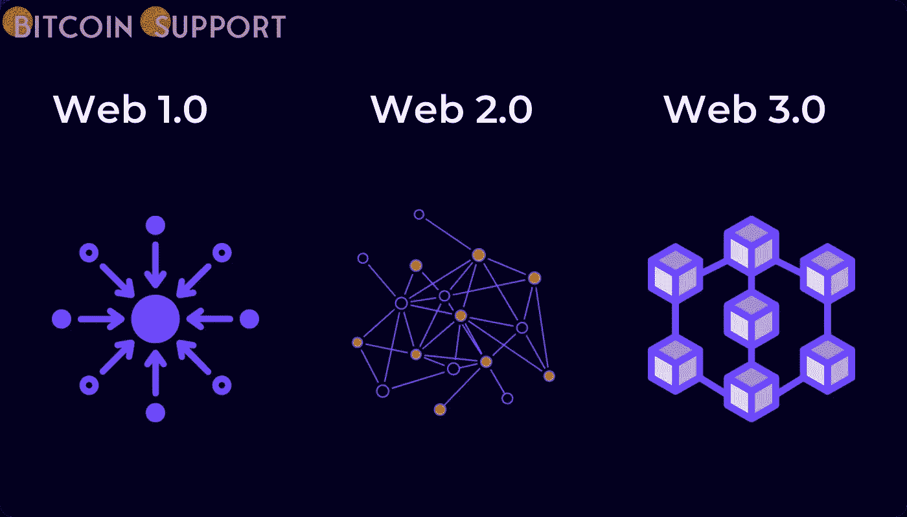
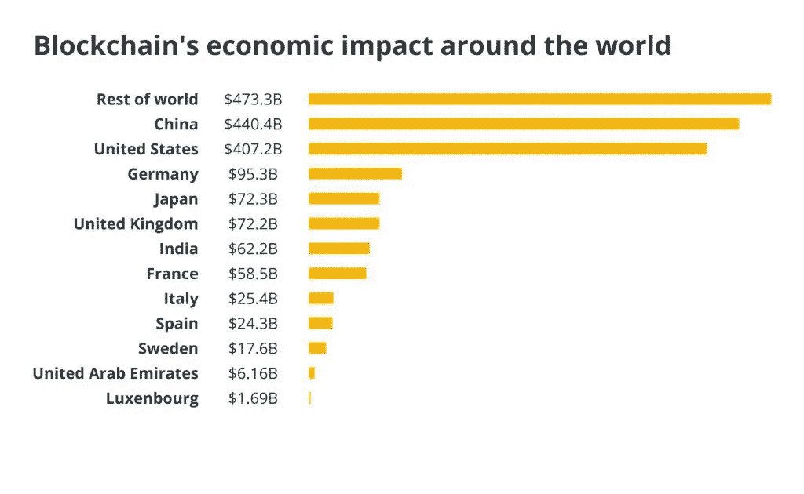
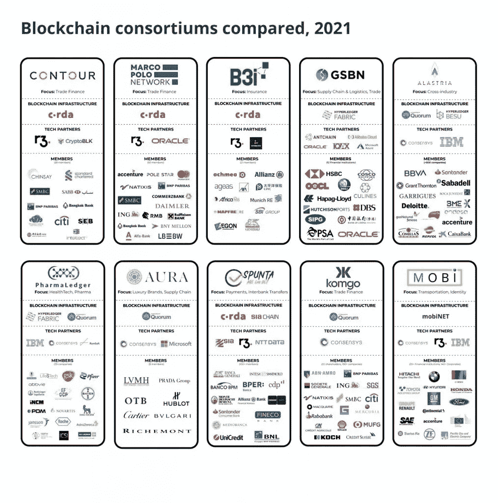

# 在后联盟时代，企业如何拥抱 Web3 结构

> 原文：<https://medium.com/coinmonks/how-businesses-are-embracing-web3-structures-in-the-post-consortia-era-faa7773b6fa3?source=collection_archive---------57----------------------->

**Visit our website:-** [**https://bitcoinsupports.com/**](https://bitcoinsupports.com/)

尽管区块链支持的联盟成为企业的标准，但他们现在在一个融合了 Web3 的环境中运营，他们正确适应是至关重要的。在围绕区块链应用程序的早期兴奋和随后漫长的区块链“冬天”之后，我们现在正处于“春天”的中间，这有助于公司重新想象他们如何提供价值。据普华永道估计，到 2030 年，区块链将为全球经济贡献 1.76 万亿美元。

**Visit our website:-** [**https://bitcoinsupports.com/**](https://bitcoinsupports.com/)

B2B 部署将从基于区块链的交易和连接所提供的安全性、不变性和简化选项中受益最多，可能会占这一增长的很大一部分。很难夸大企业从包括许多合作伙伴、数十种(如果不是数百种)商品和几乎任何业务运营的繁琐官僚程序的流程中受益的程度，尤其是考虑到更敏捷的竞争对手的到来。

然而，中小企业采用新技术和新产品的速度更快、更灵活，而企业的采用速度则更慢。销售周期更长，有更多的入口，各种内部利益相关者都有强烈的动机保持事物不变。

**财团成立**

部分业务区块链的崛起得益于企业决策者与他人合作开发和测试类似解决方案的愿望日益高涨。每个人都希望，在生成和管理概念证明或试点阶段进行合作的实体越多，结果就越有用。更大的合作团体或“旧世界”联盟的成员资格被用来实施这些计划。针对某些行业的各种专业化区块链财团，如 RiskStream 和 B3i，已经开始出现。

**Visit our website:-** [**https://bitcoinsupports.com/**](https://bitcoinsupports.com/)

现有的工业联盟和治理组织也开始为其成员建立专用网络，类似于 GSMA 在移动市场的举措。根据德勤的全球区块链调查，92%的高管表示，他们已经是某个财团的成员，或者预计将在 2019 年加入其中。

回顾过去，企业区块链的实现似乎都有一个共同点:它们中很少是由财团领导的。当然，一些企业已经组成了特别联盟，代表特定生态系统中的许多利益相关者，以鼓励早期采用并获得初步共识(Mediledger 和 Tradelens 就是两个例子)。然而，基本的事实是，解决方案是由营利性提供商开发和部署的，并被营利性企业接受，而没有在每一步由行业范围的财团审查或批准部署。

**产业分工的理由正变得越来越站不住脚**

由于其局限性，希望试验技术、建立用例并获得牵引力的企业通常不鼓励在公共链上这样做，尤其是那些更喜欢保持内部和私有运营的企业。在互操作性成为业界优先考虑的问题之前，开发人员被迫用分离的方法创建区块链。财团授予许可，拥有和管理它们。然而，十年后，联盟仍然依赖于私有许可的解决方案。进化在企业区块链产业中是不可避免的。更好的互操作性和即将到来的 Web3 浪潮使得重新思考区块链财团在等式中的角色成为必要。

**DAOs 最终会在企业中排挤掉财团吗？**

新的基础设施以及使用智能合同和治理协议的分散自治组织(Dao)所扮演的角色，可能会取代区块链财团成为行业焦点。道甚至激起了更传统投资者的兴趣，比如马克·库班，他把它们描述为“资本主义和进步主义的理想结合体”“随着 Dao 与成熟企业的较量，组织的未来可能会截然不同，”他在 5 月份发推文说，“如果社区在治理方面表现出色，每个人都会分享好处。”

Andre essen Horowitz，或 a16z，是一家风险投资公司，为个人 DAO 和帮助 DAO 建立的公司领导了数百万美元的融资轮。然而，Dao 只在某些情况下有用，并不是所有寻求一致性的行业都可以将这个概念付诸实践。2022 年，请关注这个行业一些真正有趣的发展。

那么，财团在哪里最有用呢？正在定义的是标准，而不是网络。例如，对于大多数生态系统来说，就一个共同的数据模型达成一致将是向前迈出的重要一步。这不是不可能的。当 Contour 和 GSBN(被认为是竞争对手)致力于一种模式来鼓励全球航运业的数字化时，Contour 和 GSBN 解决方案的用户都从中受益。这就是财团帮助公司和企业合作并实现共同目标的地方。尽管尽了最大努力，行业联盟还是没有机会跟上科技行业创造解决方案、平台和网络的疯狂步伐。如果他们坚持定义堆栈的确切形状，他们很快就会过时。如果他们选择开发允许采用任何堆栈进行转换的标准，他们将为他们所服务的组织增加价值。在 Web3 时代，投票和就功能或共享路线图达成共识将无需使用中介。

**访问我们的网站:-**[**https://bitcoinsupports.com/**](https://bitcoinsupports.com/)

**免责声明:以上为作者观点，不应视为投资建议。读者应该自己做研究。**