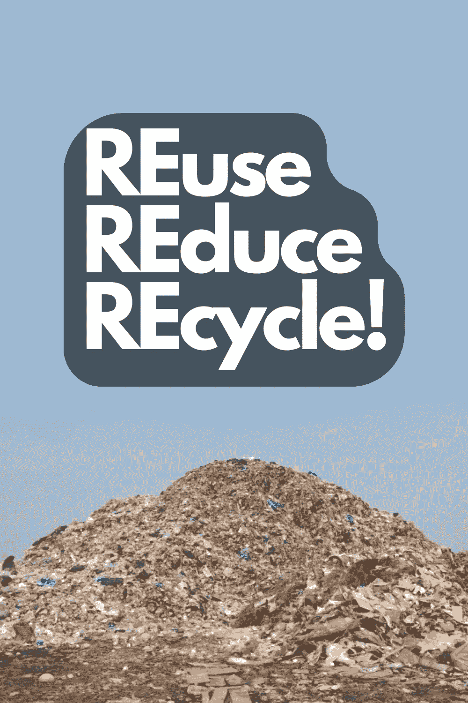

# 区块链技术如何减少全球变暖？

> 原文：<https://medium.com/coinmonks/how-can-blockchain-technology-reduce-global-warming-fb8971cf8aee?source=collection_archive---------37----------------------->

# 介绍

区块链是一项令人印象深刻的技术，有可能彻底改变我们的生活方式，但如果它也能彻底改变更大的东西:我们星球的未来，会怎么样？没错，快速浏览一下区块链相关的帖子，就会发现成千上万篇关于这项技术可能如何用于减缓全球变暖的帖子。但这对你我意味着什么？这只是一厢情愿的想法，还是另有隐情？

# 跟踪物流和食品生产

一个基于区块链的系统可以监控食物从农场到餐桌的整个过程。当一家公司下订单时，该块被创建，然后与整个网络共享。这样，供应链中的每个人都知道食物实际上在哪里，所以他们知道它是否被浪费或被转移到其他用途。

区块链还可以用来追踪公司对绿色倡议的捐赠。如果一家公司捐赠了因生产过剩或储存期间变质而未售出的产品，那么这些信息将被记录下来并直接反馈给他们，作为对整个社会的善意行为。

# 减少食物浪费

你可能想知道区块链技术如何帮助减少食物浪费。答案很简单:通过跟踪它。

区块链可以跟踪我们生产的所有食物，然后准确地计算出浪费的食物最终到了哪里。通过这样做，我们可以避免在未来浪费如此多的食物，这将意味着更少的温室气体进入大气层。

# 除掉中间人

*   除掉中间人。如果你熟悉区块链，你会知道这是一个分散的系统。这意味着在交易之间没有中央机构或中央把关人。这可以应用于货币以外的系统——例如，Spotify 或 Apple Music 等音乐流媒体服务不需要唱片公司这样的中介来分发内容，因为他们使用点对点网络，而不是依赖一家公司来控制他们的所有资产。
*   用智能合约代替人类。智能合同是双方或多方之间的协议，它被写入代码并存储在区块链数据库中(其他任何信息也是如此)。当满足某些条件时，例如某人为另一人提供的服务付款，而对在该交易过程中支付了多少钱没有争议或分歧；那么双方都将完成他们的最终目标，而不需要任何人为干预！

# 鼓励向绿色倡议捐款

由于区块链是一个分散的数字分类账，它可以被用作跟踪捐赠的平台。这有助于减少腐败和欺诈。区块链允许捐赠者在整个分配过程中跟踪他们的捐赠，因此他们确切知道他们的钱去了哪里。如果一个捐赠者想知道他或她的捐赠的影响，区块链让这些信息很容易获得。

区块链还鼓励那些想捐赠但没有太多钱的人直接向绿色倡议捐款，为他们提供了一种简单的方式，而不必先等待别人的批准(甚至通过任何类型的交易)。通过去除这些交易中的中间人——无论是银行还是政府——我们将会看到与这些过程相关的交易费用更少，总体管理费用更低，因为对基础设施(如建筑物)的需求更少，这意味着更多的钱将到达其预期目的地，而不是在到达最终目的地之前沿着机构之间的各种路径丢失(如果有人认为他/她比其他人更了解资金应该去哪里，这可能会发生)。

# 区块链可以在许多与全球变暖相关的领域帮助跟踪、创造透明度和减少浪费。

区块链可以在许多与全球变暖相关的领域帮助跟踪、创造透明度和减少浪费。

让我们来看一些例子:

*   食品工业是最大的废物制造者之一。区块链可用于跟踪从农场到餐桌的供应链，确保未使用的食物被送回而不是扔掉。这将减少资源的使用量，同时也减少垃圾填埋场的温室气体排放(通过阻止它们进入)。它还可以帮助农民出售他们认为已经变质的农产品，而不是因为人们认为不够新鲜而卖不出去。
*   物流公司——如 UPS 和联邦快递——是另一大浪费源，因为他们的客户使用低效的跟踪系统和流程(例如，亚马逊使用跨不同大陆的多家公司)..区块链技术有助于确保相关各方都知道他们的货物何时安全抵达，因此他们不会在途中迷路；这减少了海运产品到海外的温室气体排放，因为在到达目的地之前不需要这么多的旅行。它还消除了因员工检查不够好或注意力不集中(这种情况时有发生)而导致的任何人为错误，从而使整体交付更加准确..

# 结论

总的来说，区块链技术是解决气候危机的一种有前途的新方法。它有可能帮助我们提高市场的透明度和效率，减少我们的碳足迹，并为每个人创造一个更加绿色的未来。

> 加入 Coinmonks [电报频道](https://t.me/coincodecap)和 [Youtube 频道](https://www.youtube.com/c/coinmonks/videos)了解加密交易和投资

# 另外，阅读

*   [3 商业评论](/coinmonks/3commas-review-an-excellent-crypto-trading-bot-2020-1313a58bec92) | [Pionex 评论](https://coincodecap.com/pionex-review-exchange-with-crypto-trading-bot) | [Coinrule 评论](/coinmonks/coinrule-review-2021-a-beginner-friendly-crypto-trading-bot-daf0504848ba)
*   [莱杰 vs n rave](/coinmonks/ledger-vs-ngrave-zero-7e40f0c1d694)|[莱杰 nano s vs x](/coinmonks/ledger-nano-s-vs-x-battery-hardware-price-storage-59a6663fe3b0) | [币安评论](/coinmonks/binance-review-ee10d3bf3b6e)
*   [Bybit Exchange 审查](/coinmonks/bybit-exchange-review-dbd570019b71) | [Bityard 审查](https://coincodecap.com/bityard-reivew) | [Jet-Bot 审查](https://coincodecap.com/jet-bot-review)
*   [3 commas vs crypto hopper](/coinmonks/3commas-vs-pionex-vs-cryptohopper-best-crypto-bot-6a98d2baa203)|[赚取加密利息](/coinmonks/earn-crypto-interest-b10b810fdda3)
*   最好的比特币[硬件钱包](/coinmonks/hardware-wallets-dfa1211730c6) | [BitBox02 回顾](/coinmonks/bitbox02-review-your-swiss-bitcoin-hardware-wallet-c36c88fff29)
*   [BlockFi vs 摄氏度](/coinmonks/blockfi-vs-celsius-vs-hodlnaut-8a1cc8c26630) | [Hodlnaut 审核](/coinmonks/hodlnaut-review-best-way-to-hodl-is-to-earn-interest-on-your-bitcoin-6658a8c19edf) | [KuCoin 审核](https://coincodecap.com/kucoin-review)