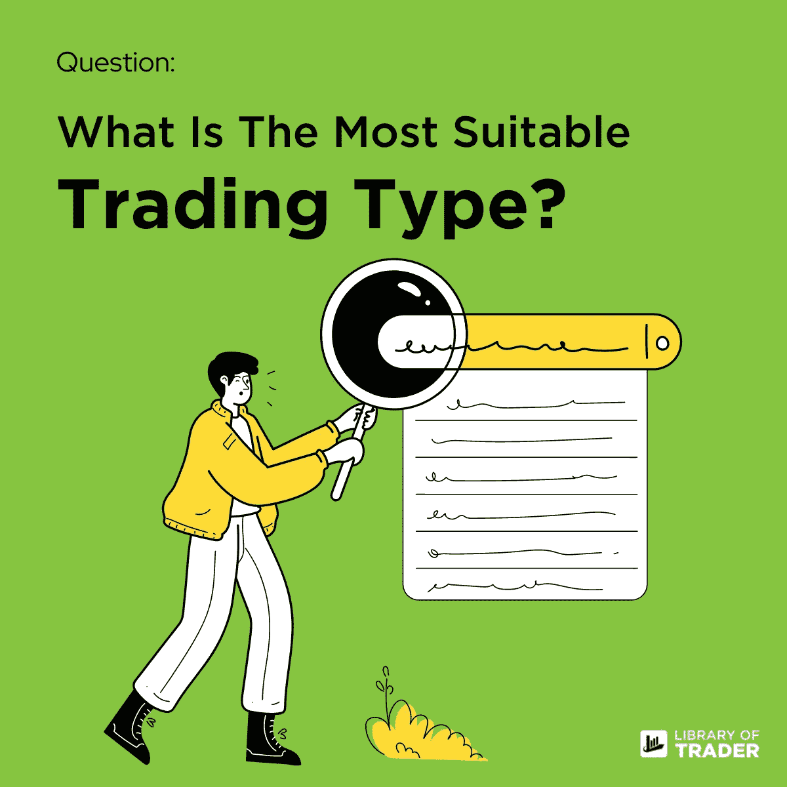

# 怎样才能选择最合适的交易类型？

> 原文：<https://medium.com/coinmonks/how-can-i-choose-the-most-suitable-trading-type-3b270863be2d?source=collection_archive---------18----------------------->

对于新手来说，学习交易应该是第二重要的技能。学会选择交易类型应该是首要的。因为它在整个交易过程中起着至关重要的作用！

*想象一下，你投资了一些不合适的交易类型，显然，亏损的可能性很高。这篇文章涵盖了你应该考虑选择最匹配的交易类型的一些要素！*

# 时间承诺

你愿意把所有的时间都用来交易吗？

你认为交易是一种职业还是一种被动收入的来源？

回答这些问题可以清楚你愿意花多少时间和精力在交易上。例如，当你已经有一份全职工作，而且没有辞职的打算时，你就不应该做[日内交易](/@libraryoftrader/what-do-novice-day-traders-need-to-know-about-38e2b7bad3a9)！

顾名思义，日内交易包括在一天内完成交易行为——买卖证券。因此，它需要很长的时间来跟上市场趋势，并通过技术分析解码下一个市场走势的信号。

 [## 新手日内交易者需要了解什么？

### 日内交易因其快速盈利而引人入胜。然而，它也包括高风险暴露于不稳定的…

medium.com](/@libraryoftrader/what-do-novice-day-traders-need-to-know-about-38e2b7bad3a9) 

同时，如果你不想粘在监控屏幕上，你可以考虑摇摆交易或长期投资。更长的持有期使你能够专注于你的全职工作，同时有来源来丰富你的收入。

 [## 摇摆交易与日内交易:有什么区别？

### 摇摆交易和日交易都是创造短期利润的好方法。然而，他们不是…

medium.com](/@libraryoftrader/swing-trading-vs-day-trading-what-is-the-difference-1f411f27da81) 

# 风险承受能力

除了交易的速度，风险承受能力是你必须考虑的。简单来说就是表明你能承受多少损失，能坚持多久。

交易市场的波动使亏损成为常识。所以，为可能的风险做好准备比及时对逆转和市场趋势做出反应要好得多！

如果你把所有的钱投资在一项持续数年的投资上，但你希望快速回报，这可能会让你陷入困境，因为你的钱被锁定在这项投资上。

例如，如果你想花一些闲钱来获得更多的利润，摇摆交易和长期投资是相当可观的选择。

然而，如果你的预算不允许你多年持有失败的证券，摇摆交易可以是你的选择。否则，投资是一个很好的选择。

 [## 日内交易和投资:哪个更好？

### 日内交易和投资是一个让很多人犹豫是否开始他们的职业生涯的话题

medium.com](/@libraryoftrader/day-trading-vs-investing-which-is-better-ef7556195df2) 

# 在你走之前

它总是回到**你想要得到什么，你愿意交换什么**。没有免费的午餐，这意味着你不会坐以待毙，交易的利润自然会进入你的账户！

当然，在选择交易类型之前，还需要考虑更多的因素。然而，上面的两个因素——时间承诺和风险承受能力——是有抱负的交易者看到成功之路最需要的，无论他们的目标是成为专业交易者还是仅仅从他们的钱中获得更多利润！

你怎么想呢?在回复中分享你的想法！

我们将带回来关于每种交易类型的更详细的文章。关注我们的简介，敬请关注！

> 交易新手？试试[密码交易机器人](/coinmonks/crypto-trading-bot-c2ffce8acb2a)或者[复制交易](/coinmonks/top-10-crypto-copy-trading-platforms-for-beginners-d0c37c7d698c)