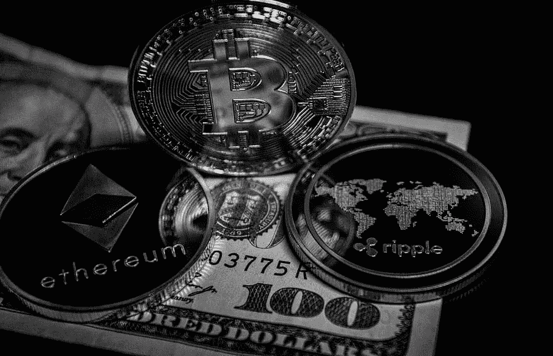

# 我如何保护我的“虚拟资产”的安全？

> 原文：<https://medium.com/coinmonks/how-can-i-keep-my-virtual-assets-safe-141d80b81d8f?source=collection_archive---------28----------------------->

D 由于“虚拟资产”的独特属性，从一开始就解决“虚拟资产”所有者如何首先保护他们的数字资产，其次在他们死亡或丧失行为能力时将他们的“虚拟资产”转移给他们的继承人是至关重要的。在本文中，我们将探讨保护您的数字钱包的重要性，以及如果您的私钥落入他人之手可能会出现的潜在风险。简单地说，如果你的私人密钥资料被盗、放错地方或存储在崩溃的设备上，没有银行或金融机构支持你或给你更换；您只是无法访问您的数字钱包和其中的内容。

**什么是‘虚拟资产’？**

根据最近颁布的《2021 年毛里求斯虚拟资产和初始代币发行服务法》,“虚拟资产”被定义为一种“*”价值的数字表示，可以进行数字交易或转移，并可用于支付或投资目的；但不包括法定货币、证券和毛里求斯 2005 年证券法*管辖范围内的其他金融资产的数字表示。

换句话说，“虚拟资产”将包括所有形式的加密货币，如比特币和以太坊，并将涵盖数字代币(例如，基于智能合同的代币)，如 Solana、PolkaDot 和不可替代代币(也称为 NFT)。

The biggest difference between a cryptocurrency and a token is that cryptocurrencies are the native asset of a blockchain like BTC, RBTC, or ETH, whereas tokens are built on an existing blockchain, using smart contracts. Most commonly, these are EIP-20 tokens.

**保护您的数字钱包的重要性**

> 分析区块链技术趋势的公司 Chainalysis 发布了一份[报告](https://go.chainalysis.com/2022-Crypto-Crime-Report.html?)，该报告显示，2021 年与加密相关的盗窃、诈骗和损失创下历史新高，非法地址在这一年中获得了超过 140 亿美元，高于 2020 年的 78 亿美元。

网飞的纪录片《不要相信任何人:狩猎的密码大王》揭示了历史上最臭名昭著的“虚拟资产”丑闻之一，说明了保护你钱包钥匙的重要性；。安大略省证券委员会发布了一份[审查报告](https://www.osc.gov.on.ca/quadrigacxreport/),内容涉及 QuadrigaCX 的运营方式、客户资产的变化、亏空的原因以及加拿大证券法的影响。实际上，QuadrigaCX 是由商科毕业生 Gerald Cotton ( **Gerald** )于 2013 年 11 月创建的，它很快就成为加拿大领先的加密货币交易所之一(**交易所**)。大多数用户将他们的持有物保存在交易所的数字钱包中，并且 Gerald 据称是唯一控制私钥并且可以访问交易所钱包的个人。

据称，由于缺乏监督和似乎不存在的内部控制机制，杰拉尔德多年来能够滥用客户资金，没有受到质疑，也没有被发现，最终导致整个交易所在 2019 年倒闭。例如，杰拉尔德会在交易所创建假账户，用虚构的钱和加密资产余额来给自己赊账，然后他会用这些钱和加密资产余额与不知情的交易所会员进行交易。随着时间的推移，Gerald 遭受了真正的损失，因为加密资产的价值波动，导致缺乏资产来满足客户提款。杰拉尔德用其他客户的存款来弥补差额。换句话说，该交易所在操作一个包裹着区块链技术的老式庞氏骗局。

受影响的用户仍在试图根据新斯科舍省最高法院批准的命令从 quadri gax 遗产中收回分配，该命令指定安永公司作为 quadri gax 的破产托管人。因此，QuadrigaCX 丑闻表明，如果你不采取必要的措施来保护你的“虚拟资产”和虚拟钱包，丢失资产或放错加密货币的风险要高于传统资产。

如何安全地将我的“虚拟资产”转移给我的继承人？

没有“更改密码”选项，也没有针对数字货币交易所的追索权来找回丢失的密钥。没有适当规划的突然死亡或丧失工作能力会让个人的数字财富瞬间变得一文不值。

信托是持有个人资产(包括“虚拟资产”)的常用工具，并指导受益人有序处置此类资产。个人应明确识别、授予和/或分配信托的“虚拟资产”,以确保受益人和受托人知道此类资产的存在。在所有者死亡或丧失行为能力后，信托人应能够轻松访问包含有关 cryptoexchange 账户、数字钱包信息(包括但不限于私钥、用户名、pin、密码)的详细说明和信息的单独备忘录。在此之前，备忘录应安全地存放在保险箱或其他安全的地方。

采取必要的保护措施并理解遗产规划中“虚拟资产”的复杂性，对于所有者来说是至关重要的，以确保他们的财富按照他/她的意愿安全地转移给他们的受益人和亲人。

艾扬·索雷凡 *被授予英格兰、威尔士和毛里求斯的律师资格。他是普华永道法律部(毛里求斯)的高级助理律师。他的业务重点是金融科技、公司法以及银行和金融。*

欲了解更多信息，请联系 rayyan.sorefan@pwc.com 的雷扬

*本文旨在提供信息，仅阐述出版之日适用的毛里求斯法律的一般原则。它仅提供一般概述，并不构成或取代全面的法律意见，我们建议您在就虚拟资产相关事宜采取任何行动之前寻求全面的法律意见。*

> 加入 Coinmonks [电报频道](https://t.me/coincodecap)和 [Youtube 频道](https://www.youtube.com/c/coinmonks/videos)了解加密交易和投资

# 另外，阅读

*   [有哪些交易信号？](https://coincodecap.com/trading-signal) | [Bitstamp vs 比特币基地](https://coincodecap.com/bitstamp-coinbase) | [买索拉纳](https://coincodecap.com/buy-solana)
*   [ProfitFarmers 点评](https://coincodecap.com/profitfarmers-review) | [如何使用 Cornix 交易机器人](https://coincodecap.com/cornix-trading-bot)
*   [十大最佳加密货币博客](https://coincodecap.com/best-cryptocurrency-blogs) | [YouHodler 评论](https://coincodecap.com/youhodler-review)
*   [MyConstant Review](https://coincodecap.com/myconstant-review) | [8 款最佳摇摆交易机器人](https://coincodecap.com/best-swing-trading-bots)
*   [MXC 交易所评论](/coinmonks/mxc-exchange-review-3af0ec1cba8c) | [Pionex vs 币安](https://coincodecap.com/pionex-vs-binance) | [Pionex 套利机器人](https://coincodecap.com/pionex-arbitrage-bot)