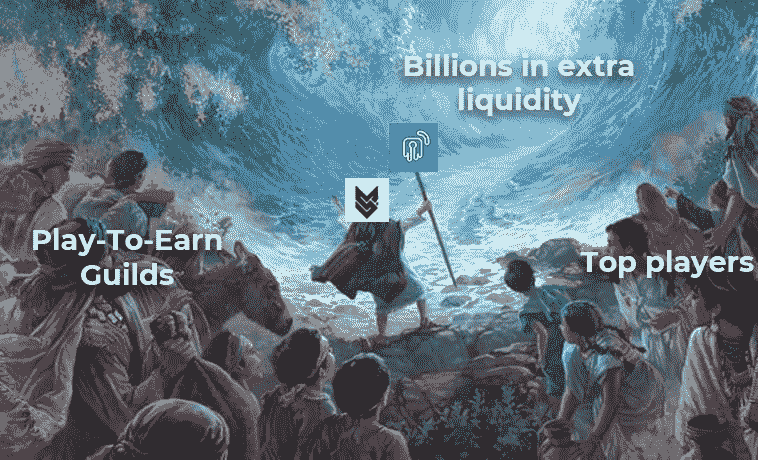

# P2E 行会如何释放数百万的流动资金来扩大经营规模？

> 原文：<https://medium.com/coinmonks/how-can-p2e-guilds-unlock-millions-in-liquidity-to-scale-their-operations-613c109ba711?source=collection_archive---------2----------------------->

Unlockd x Metasports: the gateway to the Guild financing revolution

# TL；速度三角形定位法(dead reckoning)

*   P2E 博彩业的发展趋势是爆炸性增长。
*   公会正在引领这种模式，但是扩展是一个挑战。
*   解锁允许公会释放前所未有的流动性来扩大业务。
*   Metasports 团队正努力成为领先的 web3 品牌和运营商。
*   解锁 x Metasports 合作伙伴关系将为+350 个公会带来融资机会。
*   加入解锁生态系统的公会将从独一无二的增长机会中受益。

# 游戏:从部落到数百万美元的公会

多年来，甚至几十年来，游戏经历了一种特殊的趋势，这种趋势彻底改变了视频游戏的享受方式和竞争方式。

部族、派系或公会——最初只是在每个网络世界中联合起来共同成长的玩家团队——随着时间的推移，已经发展成为几十、几百或几千个玩家的洲际联盟，他们在同一旗帜下追求共同的目标。

从打倒巨型怪物到征服整个游戏世界，部落一直是游戏中最令人印象深刻的壮举背后的驱动力。

曾经是几个朋友一起施法，或者十几个人在使命召唤中组成一个部落，如今不仅产生了以 Dao 形式存在的数万名协调玩家的革命性操作结构，而且还产生了一个系统，允许许多这些玩家通过加入这些组织来谋生。

**GameFi 现在是个东西，机会遍地开花。**

联盟变成了行会，他们曾经共享的虚拟盔甲、武器和土地以非战斗堡垒的形式出现。由于区块链技术和电子竞技比赛的爆炸式增长，技术娴熟的玩家之间卓有成效的联盟现在价值数百万美元。

宗族已经成为工业化、高度组织化的实体，管理着成千上万的资产，围绕玩家之间的协同作用以及他们对 P2E 游戏的影响，一个市场已经形成。像所有快速发展的行业一样，他们的主要代理商、公会和游戏玩家需要必要的工具来为他们的运营提供资金，并且不被落下。

**玩赚公会需要采取新的措施来利用他们现有的资源。**而那一步是通过解锁带给他们的。

# 数百万人锁定了资产，但是…流动性在哪里？

无论是在当前的各种 P2E 游戏中赢得胜利和代币，还是在电子竞技锦标赛中击败竞争对手，玩家都需要最强大的资源才能在 GameFi 生态系统中茁壮成长。

公会将这些玩家聚集在一起，租借他们所需的资源，以换取公平的利润分成。因此，获得最好的生物、武器或角色意味着胜利和失败的区别。学者和公会之间的关系是富有成效还是浪费时间和金钱取决于技能和资源的组合。我们相信有解决后者的方法。

但是还有更多。领先的公会容纳了数以千计的玩家，他们已经能够与提供给他们的 NFT 进行游戏或比赛。但成本和缺乏流动性意味着，成千上万的用户在这些公会门口排队，等待在这个游戏和金融的新生时代开创自己未来的机会。

这实际上是有道理的，因为尽管公会拥有数亿美元的资产——游戏中的非功能性交易——但这些资本是被锁定的。仅仅利用他们与学生分享的收入来扩大经营规模变得越来越困难。这就是为什么公会特别遭受获得他们需要的非功能性交易的机会成本。

如果行会可以利用他们拥有的资产，不仅从他们的学者的游戏活动中赚取收入，还能释放数十亿的额外流动性，会怎么样？

**同样的资产+债务=** **更多的流动性=更多的资产=更多的学者=更多的收入。**

简单的数学。

# 公会现在可以使用他们拥有的资产来为他们的运作融资

随着市场的成熟，我们看到公会正在成为越来越专业的组织，寻找获得最佳资产、吸引顶级玩家和发展的方法。他们中的许多人也专注于他们的投资，早期购买高潜力的 NFT 或关闭与游戏开发商的合作伙伴关系，以成本价购买物品。

从设计上来说，行会是“NFT 富人”但“现金穷人”。他们不断地将利润进行再投资，而且经常是全额投资。这导致他们错过了一些大的投资机会和相关的新项目。

解锁的出现是为了解决这个问题。无论是铸造下一个大项目，还是购买下一个大游戏的 genesis NFTs，Unlockd 都是为了提供释放所需资本的工具。

**公会绝不会因为流动性的限制而错过一个项目。**

Unlockd 通过允许公会接受 NFT 支持的贷款来做到这一点，这允许他们在获得额外预算来资助他们的运营的同时保持所有权津贴。最终的贷款价值比取决于收藏和特定的 NFT。Unlockd 使用基于不同合作伙伴协议的风险评估模型来确定资产的价值。这种混合评估整合了基于算法和博弈论的评估，允许用户根据资产的类型获得高达资产价值 85%的贷款。

随着子公会的建立，以及一些主要的 NFT 游戏公司向新的市场和垂直行业扩张，我们相信 Unlockd 将巩固作为首选的流动性支持合作伙伴——以**非稀释性资金**支持协议运营，这将帮助公会**发展并优化闲置资源。**

一个特别强的用例是虚拟土地，因为许多公会一直在积累元宇宙地块 NFT，目前没有产生收益。NFT 支持的债务将成为改善他们可用资源的完美解决方案，同时仍然允许他们和他们的学者在游戏中利用这些资产。

# 解锁 x 元体育:公会融资革命的大门

Unlockd 希望公会释放资金来发展并专注于他们的核心业务。

采访了 100 多个世界级的公会，我们意识到他们中有多少人喜欢尝试新游戏，与他们的学者接触并练习，但他们被管理任务，筹款，或担心运营所淹没。

这就是为什么我们坚信为公会构建基础设施工具是一个很好的机会，我们将与 Metasports 密切合作，以获取他们的知识并一起迭代我们的解决方案。

MetaSports 代表“元宇宙电子竞技”，是一个旨在为 Web 3 重新想象电子竞技和游戏的组织。他们正在努力:

*   利用区块链和 NFTS，建设、创新和投资他们的 Web 3 电子竞技愿景。
*   加入更多的游戏赚取公会、玩家和对电子竞技有影响的人。
*   通过他们的集体经验，指导、支持并为 NFT 游戏项目带来价值。
*   用 SEAesport 继续 360 电竞制作，包括 NFT 游戏和非 NFT 游戏。
*   向投资者和社区展示他们的产品和体验。

**我们钦佩 Metasports，并相信他们成为 NFT 最大的博彩连锁店之一的愿景。**我们真的看到他们最终成为 Web3 的电子竞技/ UFC，拥有强大的专有内容和显著的影响力，为各种顶级游戏组织职业联赛。

我们喜欢 Metasports 在行业发展过程中一直专注于 B2B 优先，从其他领先组织收集反馈，并利用他们的社区来改进他们的产品。我们希望共同努力，使 P2E 电子竞技产业专业化，并支持其发展。

我们认为，公会获得额外的资本来发展业务和购买更好的资产对于奖励关键玩家和培养职业关系至关重要。Unlockd 将与一些表现最佳的游戏玩家密切合作，帮助他们释放其 NFTs 的全部价值，为顶级 NFT 收藏家和专家量身定制我们的解决方案。

Unlockd x Metasports 合作关系的一个重要方面是共同努力发现新兴游戏，并为他们提供 Unlockd 的早期用户，确保与主要公司和 NFT 工作室的合作关系，共同塑造市场。

我们喜欢 Metasports 团队如何努力成为领先的 web3 品牌和运营商，他们的目标不仅仅是扩展服务，而是发现游戏和公会的附加链上价值。

# 公会，加入我们来提升你的升级潜力

通过这种合作关系，我们将使 Metasports 合作伙伴协会能够在测试阶段利用解锁工具，并成为 NFT 支持的新融资模式的早期采用者和先行者。

除了一起测试解锁功能和开发量身定制的解决方案以应对未来的挑战，我们还将提供额外的激励措施来共同开发一个生态系统。折扣贷款、交叉营销、社区发展、代币奖励和限量版 NFT 是成为**解锁核心用户**的一些好处。

因此，我们目前正在开发一个与行会合作的特定项目，并伴随它们走上专业化的道路。Unlockd 现在开始与主要的公会和游戏赚取行业驱动者合作——很高兴为共同增长建立持久的伙伴关系。**公告即将发布。**

对于游戏和 GameFi 领域的高绩效去中心化组织来说，关键的缺失部分是 NFT 支持的债务。

Unlockd 正在开发释放这种潜力所需的工具。

回头见。

-解锁的实验室

# TL；速度三角形定位法(dead reckoning)

*   P2E 博彩业的发展趋势是爆炸性增长。
*   公会正在引领这种模式，但是扩展是一个挑战。
*   解锁允许公会释放前所未有的流动性来扩大业务。
*   Metasports 团队正努力成为领先的 web3 品牌和运营商。
*   解锁 x Metasports 合作伙伴关系将为+350 个公会带来融资机会。
*   加入解锁生态系统的公会将从独一无二的增长机会中受益。

**关于解锁**

Unlockd 是一个分散的跨链协议，为艺术、DeFi、元宇宙、现实世界和游戏提供民主化的 NFT 流动性和效用。

Unlockd 提供即时贷款，并实现无缝的跨链借贷。随着解锁，借款人可以通过 NFT 支持的贷款增加他们的财富，同时保持 100%的所有权。

[**网站**](https://unlockd.finance/) **|** [**推特**](https://twitter.com/Unlockd_Finance) **|** [**不和**](http://discord.gg/unlockd) **|** [**电报**](http://t.me/unlockd_finance) **|** [**博客**](https://unlockd-finance.medium.com/)

**关于 Metasports**

MetaSports 代表“元宇宙电子竞技”，是一个旨在为 Web 3 重新想象电子竞技和游戏的组织。他们正在努力:

*   利用区块链和 NFTS，建设、创新和投资他们的 Web 3 电子竞技愿景。
*   加入更多的游戏赚取公会、玩家和对电子竞技有影响的人。
*   通过他们的集体经验，指导、支持并为 NFT 游戏项目带来价值。
*   用 SEAesport 继续 360 电竞制作，包括 NFT 游戏和非 NFT 游戏。
*   向投资者和社区展示他们的产品和体验。

[**网站**](https://novaguild.io/) **|** [**推特**](https://twitter.com/NovaGuildGames) **|** [**不和**](https://discord.com/invite/aSszSMXZHA)|**|**[**电报**](https://t.me/novaguildgames)|[**YouTube**](https://www.youtube.com/channel/UC2N3YMdfUv3qlL17dNhtKbQ/about)