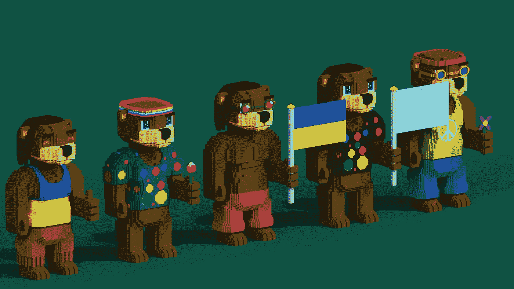
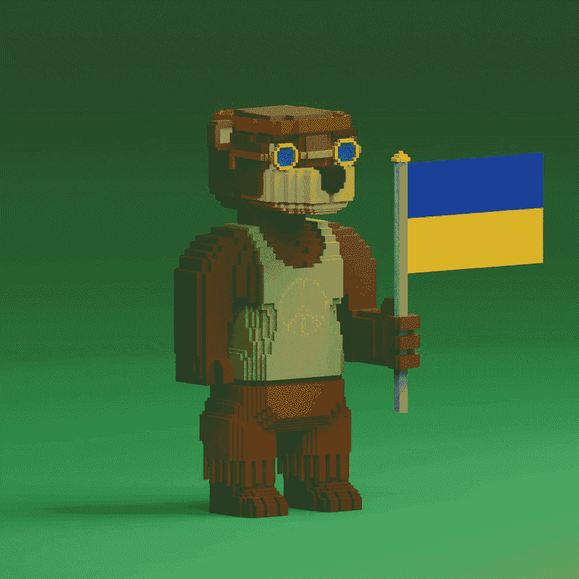
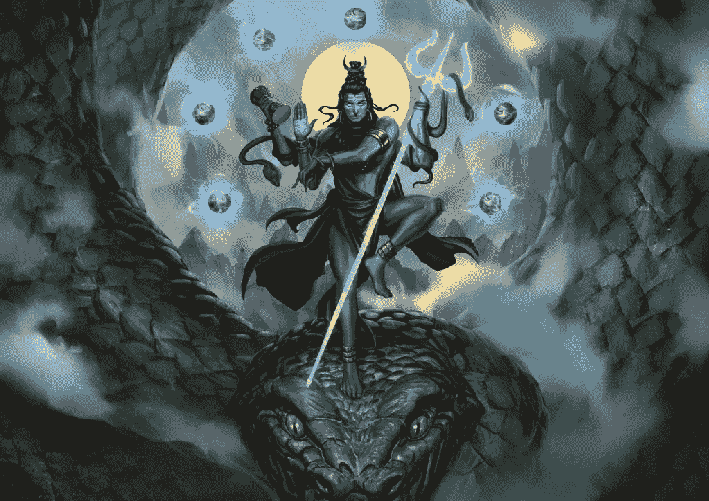

# 如何善用区块链和 NFT 市场？

> 原文：<https://medium.com/coinmonks/how-can-the-blockchain-and-nft-market-be-used-for-good-24048c7c5963?source=collection_archive---------53----------------------->

Image by [Invisible Friends](https://invisiblefriends.io/)

不可否认的事实是，NFT 是当今世界上增长最快的资产之一。仅在 2020 年和 2021 年之间，[总交易量](https://nonfungible.com/reports/2021/en/yearly-nft-market-report-pro)就从仅仅 8250 万美元增长到 177 亿美元，一年之内增长了 200 多倍！

随着这种爆炸式的增长，竞争也大幅上升。大多数行业都是如此。但是对于 NFTs，经常听到用户抱怨缺少以人为中心的、目的驱动的项目。真正对社会产生影响的创作严重不足。

Shaanti 是一个 NFT 创造者试图改变这一声誉，并利用区块链好。让我们看看是什么让这个项目不同于大多数收藏。

# 1.有目的的和平熊

[Shaanti](https://shaanti.io) 是 100 只基于多边形的熊的集合，目的发布在 [Opensea](https://opensea.io/collection/shaanti-nft) 上。尽管经过了细致入微和充满激情的构思，这件艺术品并不是这个系列的主要焦点。相反，它以致力于为饱受战争蹂躏的乌克兰的儿童带来真正的改变而自豪。**该系列的惊人之处在于，它的价格相当于两人晚餐的价格！**

创造者认为，特别是区块链和 NFTs，可以作为一个巨大的出口来推动变革。Shaanti 系列通过捐赠机制体现了这一信念。

通过出售这 100 只 NFT 熊获得的所有收入中，70%将捐赠给救助儿童会，这是一个最受尊敬的组织，帮助乌克兰儿童度过这段可怕的时光。

此外， [Shaanti](https://shaanti.io) 对所有二级市场销售收取 5%的版税。在本系列的整个生命周期内，每一次转售都会产生 5%的税收。创作者已经承诺将所有版税收入的 70%用于救助儿童会的捐赠。

# 2.用户授权

Shaanti 哲学的另一个方面是在项目的每个方面赋予用户权力。

例如，许多项目在证明捐赠的时候让用户蒙在鼓里。但是 Shaanti 将采取不同的方法，将权力交到用户手中。

只要售出 80%的收藏(即 100 个 NFT 中的 80 个)，创作者就会将 70%的收益发送到[救助儿童会](https://www.savethechildren.org/us/where-we-work/ukraine)官方静态钱包地址。交易发生后 5 天内，交易证明将在 Shaanti 的社交媒体渠道和网站上公布。

**由于交易将通过区块链进行，它将是公开可追踪和可验证的，因为任何人都可以看到资金从创作者的钱包流向慈善机构的钱包。**

# 3.最大影响

为什么你应该买 NFT 而不是直接捐赠？这是一个经常出现在慷慨的用户脑海中的问题，他们希望确保他们的贡献能够为那些需要的人带来真正的改变。

这是 Shaanti 真正比其竞争对手更耀眼的地方，因为它通过双管齐下的战略最大化了影响。

首先，该项目通过奖励捐赠者各种津贴来激励捐赠，包括但不限于:

●可交易的 NFT，随着时间的推移有升值的潜力。生活在 Polygon(以太坊)的这 100 只 NFT 熊同样可爱，对社会有益。

●对创作者未来项目的白名单访问。这包括项目启动前的先睹为快，以及在允许公众进入前以折扣价购买 NFTs 的机会。

另一方面，Shaanti 也旨在吸引更多的眼球和捐款，鼓励捐赠者在朋友和家人之间推广藏品。

鉴于这些可爱的艺术作品和这些 NFT 熊将为经历难以想象的残酷战争现实的儿童带来的无可辩驳的差异，捐赠者完全有理由在他们的社交媒体上展示这些 NFT。这样做，他们将抓住其他人的好奇心，并激励他们也通过这个 NFT 收藏进行捐赠。

这两个方面将共同创造一个积极的循环，随着时间的推移，将带来越来越多的捐赠，(通过版税支付机制无限期地)。这种方法的影响将远远超过所有 100 个非功能性测试的原始美元价值。

# 4.未来项目

我们很高兴告诉你我们即将到来的项目，我们还不能透露太多的细节，但会给一点洞察力。

几千年来，印度次大陆形成了悠久的丰富文化。宗教、艺术运动、哲学、文学:这些都是世界上独一无二的，都同等程度地汲取了印度人的思想和心灵。我们*知道*有很多值得庆祝的关于我们已经完成和创造的一切。然而，为了有效地做到这一点，我们需要跳出框框去思考*。*

这就是我们未来项目的目标。这将是一个手工策划的艺术收藏，拥有独特的个人非艺术作品，比一堆非艺术作品多得多。我们正在开发这个 NFT 系列，以此作为一种手段，在这两个世界走过的两条道路之间形成一个十字路口，即印度历史和现代技术。在我们看来，这两个世界将*永远*不可分割，彼此互补。我们已经发现，在数字艺术中，有一种方式来传播印度文化*到*。

拥有桑蒂·NFT 的一部分将在 creativebutterchicken 未来的两个项目中担任直接的 OG 角色。

Image by [Temple Wars](https://www.templewars.com/universe/)

# **更多精彩新闻**

这整个收藏将直接链接到我们正在构建的开放世界游戏。我们认为我们的游戏是一种吸引人的手段，通过开放的世界环境和第一人称射击/冒险游戏，所有这些都与印度文化、印度主题甚至印度武器有关。一起，我们可以使印度的奇迹为所有人所用，以一种游戏体验的形式，这种体验对于像战神系列这样的游戏迷来说是熟悉的，也是全新的！

# 结论

虽然承诺捐款的 NFT 收藏并不新鲜，但 Shaanti 的方法令人耳目一新，鼓舞人心。鉴于创作者的透明性，这个集合的成功可能会激励其他人创造更多有意义和有影响力的非物质文化遗产。

此外，Shaanti 的创造者着迷于区块链和 NFTs 在让世界变得更美好方面的潜力。用他自己的话说，这很快从随机的好奇变成了终生的痴迷。

为此，创作者已经在进行许多新的项目。例如，他即将推出的系列将把印度的美丽和神秘带到区块链。从一系列引人入胜的次大陆艺术品开始，该项目最终将转化为对元宇宙印度纪念性景观的迷人再现。还有一些游戏体验正在筹备中，这将使观众有机会以更有趣、更刺激的方式参与进来。

Shaanti 的持有者将自动解锁该集合中的 OG 角色额外津贴以及其他许多额外津贴。

## 请访问[**https://shaanti.io/**](https://shaanti.io)了解更多信息

*该项目由*[*creative butterchicken*](https://saranshseth.me/)*又名 codesloth 所有！*

> 加入 Coinmonks [电报频道](https://t.me/coincodecap)和 [Youtube 频道](https://www.youtube.com/c/coinmonks/videos)了解加密交易和投资

# 另外，阅读

*   [10 本最佳加密书籍](https://coincodecap.com/best-crypto-books) | [英国 5 个最佳加密机器人](https://coincodecap.com/uk-trading-bots)
*   [ko only Review](https://coincodecap.com/koinly-review)|[Binaryx Review](https://coincodecap.com/binaryx-review)|[Hodlnaut vs CakeDefi](https://coincodecap.com/hodlnaut-vs-cakedefi-vs-celsius)
*   [MoonXBT vs Bybit vs 币安](https://coincodecap.com/bybit-binance-moonxbt) | [硬件钱包](/coinmonks/hardware-wallets-dfa1211730c6)
*   [火币交易机器人](https://coincodecap.com/huobi-trading-bot) | [如何收购 ADA](https://coincodecap.com/buy-ada-cardano) | [Geco？一次审查](https://coincodecap.com/geco-one-review)
*   [币安 vs 比特邮票](https://coincodecap.com/binance-vs-bitstamp) | [比特熊猫 vs 比特币基地 vs Coinsbit](https://coincodecap.com/bitpanda-coinbase-coinsbit)
*   [如何购买 Ripple (XRP)](https://coincodecap.com/buy-ripple-india) | [非洲最好的加密交易所](https://coincodecap.com/crypto-exchange-africa)