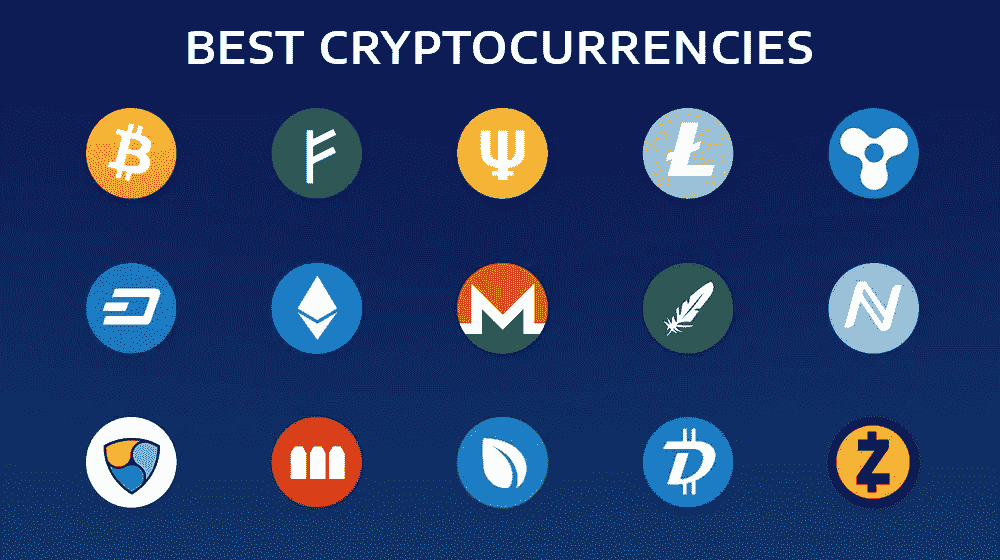

# 如何识别最好的加密货币？

> 原文：<https://medium.com/coinmonks/how-can-you-identify-the-best-cryptocurrency-17573bccd231?source=collection_archive---------27----------------------->

这是你在日常生活中可能很快就会遇到的常见情况；你可能正在与朋友和同事谈论投资，当你开始谈论数字货币时，你可能会面临一些不同的反应。经验丰富的投资者普遍担心，任何不了解股票市场和商品交易所的人都不应该涉足加密货币——风险太大。

Photo Source on Google

> **让我们澄清一下——加密货币可以是一种投资，而且可以盈利。最佳买入时间是 10 年前，第二个最佳买入时间是昨天。**

虽然加密货币最初被认为是未来的货币，但它现在更多的是一种投资，希望它最终会比最初的成本更值钱。
换句话说，与传统的股票市场投资相比，加密货币可能会给你带来更好的(被低估的)投资回报。

这里有一个问题:虽然了解投资的基本知识很好，但你不需要了解加密货币。尽管最近有所增长，但该行业仍处于起步阶段，我们应该展望未来 10 年、20 年，而不是明天。

不过不要担心；你很安全。加密货币社区是一个庞大的投资伙伴网络，他们非常乐意像我们一样帮助您解决加密货币问题！
在今天的帖子中，我们将为新投资者介绍识别和投资有利可图的加密货币的基础知识。

**投资加密货币时需要注意的首要因素**

# **1。确保硬币有用途**

在投资任何加密货币或 ICO 时，重要的是要确定一个项目的核心特征，使其区别于市场上的其他硬币。

例如，当比特币首次推出时，有许多原始比特币的克隆版本，只是做了一些小调整，如增加供应量、加快交易时间，或者只是改变名称。快进到今天，你会发现这些克隆人大部分都死了。唯一赚钱的是那些仿制硬币的创造者。
证明这一点的最好例子就是看以太坊。与比特币不同，以太坊的重点不仅仅是成为另一种数字价值储存手段。相反，这位创始人意识到，用于数字交易的相同技术(区块链)也可以用于传输数据和信息。

由于以太坊的创新和独特的使用案例，它的价值有理由上涨，正如以太坊从 2017 年 1 月到 5 月从 10 美元涨到 400 美元所示。以太坊允许开发者建立基于加密货币的平台，开发智能合约，同时也是一种价值储存手段。智能合约的运作方式与它们听起来的完全一样；根据天气情况自动执行的合同条款是否得到满足。

另一系列创新的加密货币项目包括 MaidSafe、Storj 和 Sia。同样，这些项目的目标不是成为另一种数字货币，而是成为未来的云存储。
投资一种有利可图的货币的总体思路是:

*   确保加密货币或令牌有实际使用案例。如果只是作为一种价值储存手段，比特币做得很好，还有无数的其他硬币做同样的事情
*   令牌的用例越通用，成功的可能性就越小。如果一个令牌只是另一个“去中心化的令牌”的话，请保持清醒。请记住，去中心化是一个时髦词，而不是真正说明硬币的用途
*   确保用例符合逻辑。一枚硬币可以有独特的用例，但并不是所有的事情都必须去中心化并在区块链上完成。例如，你可能会遇到一个 ICO，它将自己标榜为一个分散的社交媒体平台。当一个社交媒体平台的全部目的就是提供你的信息，让它真正成为一个社交平台时，去中心化是如何运作的？看硬币的时候用你的常识；如果您知道 ICO 或令牌绝对没有必要使用加密，那么就放弃它。

# **2。确保开发是有能力的、有信誉的、透明的**

每当你发现一个你想投资的 ICO 或硬币，直接去他们的网站，看看开发者或团队页面。

确保 ICO 或 coin 的开发者和团队成员拥有真实姓名、照片和证书。如果没有信息或者团队是匿名的，请保持清晰。
一个有能力的创业团队绝对没有理由不把自己的信息放在网站或其他公司网站上。

**提示:在谷歌上逆向图片搜索团队成员的照片。如果你发现图像是假的或重复的，避免该项目。一旦你找到项目背后的人，谷歌一下他们的名字，尽可能多地找到他们。LinkedIn 档案是衡量一枚硬币背后是否有一个好团队的好方法。
需要注意的一些有用信息包括:**

*   他们在哪里上学？
*   他们学的是什么/专业领域？
*   他们的工作经历是怎样的？
*   他们以前是一家有影响力的公司的一部分吗？
*   他们有这个行业的经验吗？
*   他们以前有任何显示其潜力和技能的职位吗？

除了 LinkedIn 之外，另外两个值得关注的平台是该团队的 Github 和 Twitter 个人资料。

虽然我们不建议你成为互联网侦探，但在 Github 和 Twitter 上发现一个团队的成就是发现一个项目是否会成功的好方法。假设你找到一个开发者的 Github，他们没有什么特别的东西，几乎是一个空白的页面。

## 你会信任开发商用你的钱来运营这个项目吗？

关于开发人员的可信度，如果一个团队或开发人员将他们的证书设置为公共的，那就有很多话要说(以一种好的方式)。当一个开发团队是公开的，他们被认为是组织的代言人。因此，他们对项目的成败负有责任。

你可能有匿名开发者制作的 ico 或硬币，其中一些可能有很强的背景。然而，常识表明，不参与匿名开发人员的项目是明智的。
匿名项目可能会在两种情况下出错:

*   没有责任，如果开发商削减和运行，没有以前的项目可以看
*   因为你对他们一无所知，所以没有办法知道他们是否有能力履行承诺
    在考虑 ICO 投资时，一件值得注意的事情是确定负责处理 ICO 托管的机构。

声誉良好的开发团队将招募在金融行业中拥有良好声誉的组织，作为可信赖的募集资金持有人。由于他们的声誉岌岌可危，这些人不太可能带着筹集到的资金跑路。
此外，强大的开发团队将设立一个条件，如果没有达到一定的资金水平，将退还做出贡献的个人。这在项目资金不足的情况下起到了故障保险的作用。
优秀的团队还会制定政策，确保他们不会立即出售筹集到的代币。相反，他们会逐步出售，为他们的项目筹集资金，以避免市场冲击。

例如，以太坊团队为他们的 ICO 筹集了数千 BTC，总计达数百万。然而，该团队每年只出售 10%的 BTC 作为他们项目的资本。
他们知道，如果他们立即出售所有的 BTC，他们可能会降低 BTC 的价值，并使市场崩溃，这对加密货币不利。一般来说，好的开发不在乎钱，更在乎确保他们的愿景是成功的。

# **3。白皮书有意义吗？**

当加密货币为 ICO 筹集资金时，该团队将拿出一份名为白皮书的文件。
白皮书简单地包括:

*   项目是关于什么的。白皮书将解释该项目的愿景、希望实现的目标以及硬币的技术。
*   这个项目需要筹集的资金数额。
*   分配给投资者的代币或硬币数量。例如，以太坊为其 ICO 分配了大约 8000 万 ETH。一般来说，发行的代币越少，由于供应有限，其价值就越高。
*   ICO 活动的持续时间。

如果你打算投资一个 ICO，白皮书一定是你首先要读的东西。这份白皮书可能很无聊或太长，无法阅读，但它列出了该公司的风险和机遇，以及 ICO 筹集的资金的拟议用途。
例如，白皮书将解释硬币持有者是否将拥有投票权，或者硬币是否根据你持有的硬币数量支付股息，以及这些股息何时支付(每月、每年等)。).

如果白皮书过于乐观，请保持谨慎，因为过高的目标往往会导致失望。此外，如果白皮书过于复杂(过多的术语、含糊的解释、复杂的英语等)。)，要警惕，因为他们可能通过故意让项目难以理解来隐藏团队的无能。

# **4。分散资产，不要孤注一掷，只投资自己能承受损失的**

就像任何其他投资一样，拥有多种资产的投资组合以及分散风险是一个明智的选择。不要把所有的鸡蛋放在一个篮子里，投资一个硬币，认为它会大幅上涨。相反，找 3 或 4 个你认为好的硬币投资其中。
加密货币的一个好策略是 80/20 或 70/30 的比率。
你的加密货币投资的 80%或 70%(大部分)应该放在比特币和以太坊等成熟的货币中。该金额应由您保管和持有；除非你知道自己在做什么，否则不要交易。
之后，根据你剩余的硬币和你达到目标的可能性，你可以将它们放入风险更高的多元化投资组合(有潜力但尚未建立的硬币)。
一些值得长期持有的硬币包括:

*   比特币(BTC)
*   以太坊
*   莱特币
*   斯特拉提斯
*   波浪(波浪)

# **5。不要天天看价格；
长期来看，买入并持有仍是最佳策略**

对于 99%的加密货币投资者来说，日内交易和查看图表以及买卖订单是不可行的。除非你有巨大的资本，否则你从日内交易和根据硬币价值的微小变化做决定中获得的收益是很少的。如果你做了一笔糟糕的交易，你不仅不会获得太多，还会有更高的损失净值的风险。

市场上还有一种说法，永远不要把握市场时机。虽然事件和发展更新是确定一枚硬币未来价值的好方法，但从长远来看，试图通过在“正确的时间”买卖来把握时间总是会赔钱。为了让加密货币的 TA(技术分析)交易物有所值，你应该至少有 50，000 美元的加密货币才能盈利。相反，大多数投资者的最佳策略是买入并持有。你应该相信你的投资，只投你能承受损失的钱；有了这两个因素，你就不需要像鹰一样每天关注你投资的价格。

如果你做了一个理性的投资决定，不要让你的情绪控制和否定你在价格下跌或上涨时的决定。
我们建议每周、每月或每季度检查一下你的净资产和市场行情。每天检查市场是好的，但是记住不要感情用事。
你不仅在拿自己的幸福冒险(从技术上来说),还因为过于依赖市场，没有给自己的个人生活足够的时间和关注，而拿自己的社交生活和人际关系冒险。

例如，不到一个月前，比特币从几乎达到每 BTC 3000 美元跌至 1800 美元。
今天？
1 BTC 已经相当于 4000 美元——如果你保持冷静，拿着你的硬币，它的价值几乎增加了 100%。

# **6。不要选择市场时机。
买卖没有好坏之分**

再说一遍，不选择市场时机的规则非常重要，我们不得不两次提及。
与股票市场不同，何时买卖加密货币没有通用规则，因为这个行业如此年轻且不为人知。
如果你不得不遵循一套规则，只要你不恐慌性抛售或买入，这些规则在大多数时候都会有效:

*   只有当你达到目标时才出售。如果你的投资目标是 50，000 美元，只有达到这个数字时才卖出。

> 加入 Coinmonks [电报频道](https://t.me/coincodecap)和 [Youtube 频道](https://www.youtube.com/c/coinmonks/videos)了解加密交易和投资

# 另外，阅读

*   [瓦济里克斯 NFT 评论](https://coincodecap.com/wazirx-nft-review)|[Bitsgap vs Pionex](https://coincodecap.com/bitsgap-vs-pionex)|[Tangem 评论](https://coincodecap.com/tangem-wallet-review)
*   [如何使用 Solidity 在以太坊上创建 DApp？](https://coincodecap.com/create-a-dapp-on-ethereum-using-solidity)
*   [最好的卡达诺钱包](https://coincodecap.com/best-cardano-wallets) | [Bingbon 副本交易](https://coincodecap.com/bingbon-copy-trading)
*   [氹欞侊贸易评论](https://coincodecap.com/anny-trade-review) | [Paybis 评论](https://coincodecap.com/paybis-review) | [Keevo 钱包评论](https://coincodecap.com/keevo-wallet-review)
*   [印度最佳 P2P 加密交易所](https://coincodecap.com/p2p-crypto-exchanges-in-india) | [柴犬钱包](https://coincodecap.com/baby-shiba-inu-wallets)