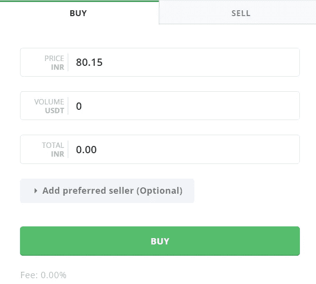
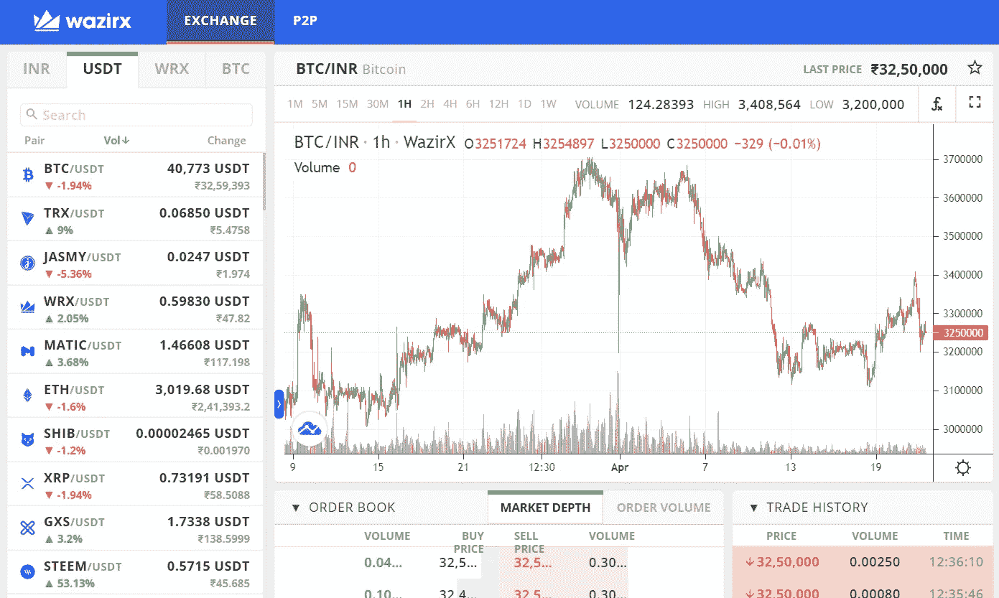

# 如何在买卖密码时少付很多费用？

> 原文：<https://medium.com/coinmonks/how-can-you-pay-a-lot-less-charges-while-buying-and-selling-cryptos-845160762154?source=collection_archive---------41----------------------->

Frustrated investor

这个故事是关于那些正在使用 *WazirX* 或者计划在未来使用 *WazirX* 的人。

如果您想开立 WazirX 账户，您可以使用此链接-

*现在，故事时间—*

*很久以前，由于 UPI 设施不活跃，我不时会遇到在 *WazirX* 存钱的问题。我不愿意使用网上银行和支付费用来简单地把钱转移到钱包里。*

*除此之外，我还计划用我的少量以太坊做另一个 Web3 项目。但是有 0.01ETH 的提款费，相当于超过 2000 卢比(最近一次检查)，最低提款金额为 0.02ETH。*

*所以我泄气了很多。*

*但是在做了大量研究之后，我开始了解 P2P。所以让我来指导你如何在买卖密码时避免支付大量费用-*

*第一步:使用 P2P 将你的印度卢比兑换成 USDT*

**

*您使用印度卢比发出购买 USDT 的购买指令，这将直接从您的关联银行账户中扣款，不收取任何费用，您将获得同等数量的 USDT。*

*第二步:去 USDT 交易所，用你刚买的 USDT 买密码。*

**

*只需遵循这些步骤，你就可以节省很多费用。*

*同样，如果你想取钱，你按照相反的顺序执行相同的步骤，即在 USDT 交易所出售你的密码，然后在 *WazirX* P2P 中出售你的 USDT，你就会把钱存入你的银行账户。*

*~再见*

*在 Twitter 上关注我: [@syntnsrkr](https://twitter.com/syntnsrkr)*

> *加入 Coinmonks [电报频道](https://t.me/coincodecap)和 [Youtube 频道](https://www.youtube.com/c/coinmonks/videos)了解加密交易和投资*

# *另外，阅读*

*   *[WazirX vs CoinDCX vs bit bns](/coinmonks/wazirx-vs-coindcx-vs-bitbns-149f4f19a2f1)|[block fi vs coin loan vs Nexo](/coinmonks/blockfi-vs-coinloan-vs-nexo-cb624635230d)*
*   *[BlockFi 信用卡](https://coincodecap.com/blockfi-credit-card) | [如何在币安购买比特币](https://coincodecap.com/buy-bitcoin-binance)*
*   *[火币交易机器人](https://coincodecap.com/huobi-trading-bot) | [如何购买 ADA](https://coincodecap.com/buy-ada-cardano) | [Geco。一次复习](https://coincodecap.com/geco-one-review)*
*   *[加密复制交易平台](/coinmonks/top-10-crypto-copy-trading-platforms-for-beginners-d0c37c7d698c) | [五大 BlockFi 替代方案](https://coincodecap.com/blockfi-alternatives)*
*   *[CoinLoan 点评](https://coincodecap.com/coinloan-review)|[Crypto.com 点评](/coinmonks/crypto-com-review-f143dca1f74c) | [火币保证金交易](/coinmonks/huobi-margin-trading-b3b06cdc1519)*
*   *[Bybit vs 币安](https://coincodecap.com/bybit-binance-moonxbt)|[stealth x 回顾](/coinmonks/stealthex-review-396c67309988) | [Probit 回顾](https://coincodecap.com/probit-review)*