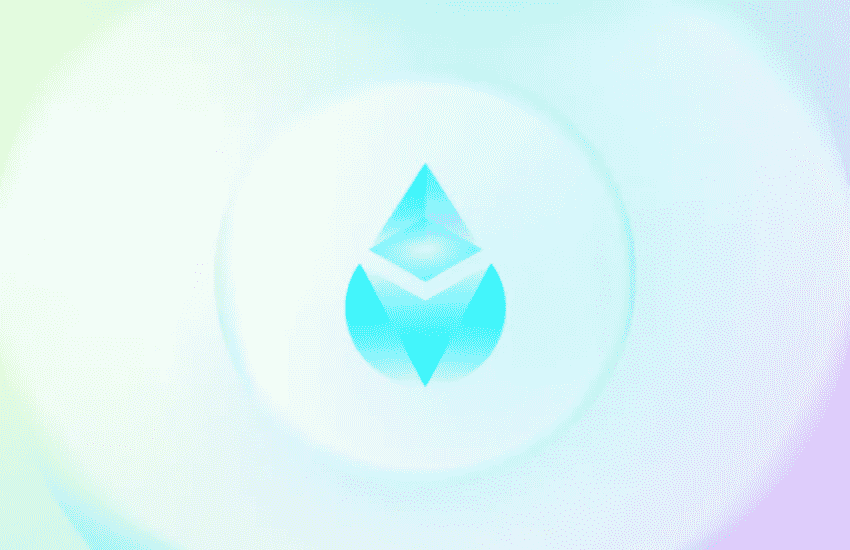
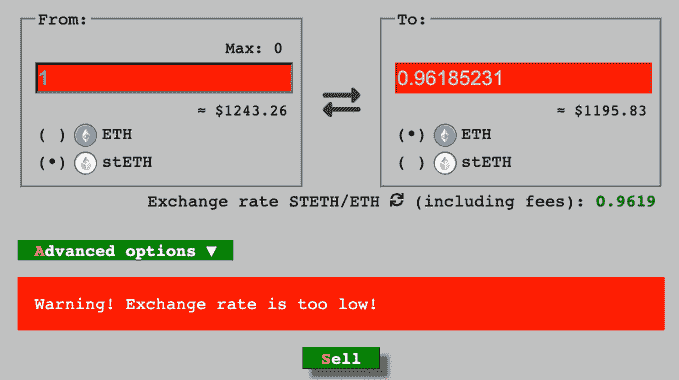

# 摄氏温度骤降，解释说——这是哪里出了问题

> 原文：<https://medium.com/coinmonks/how-celsius-dug-its-own-grave-through-empty-promises-and-negligence-d351a1dadcb6?source=collection_archive---------10----------------------->

## 摄氏温度结束了吗？

## 还有一家公司欺骗用户

Celsius 是一家知名的加密借贷平台。然而，在过去的几天里，它已经成为冻结用户资金和暂停所有提款的焦点。

> 该公司会复苏吗，或者这将是密码行业的下一次大爆炸？用户有机会收回他们的钱吗？

在本文中，我将做一个简要的概述，解释 Celsius 的问题所在，以及用户对短期未来的期望。加油！

> 在 Twitter 上向 [@jonwu_](https://twitter.com/jonwu_) 致谢！

# 形势概述

> 由于极端的市场条件，今天我们宣布 Celsius 暂停所有账户之间的提款、互换和转账。我们今天采取这一行动，是为了让 Celsius 在一段时间内更好地履行其提款义务。

这是 Celsius 月 12 日在 Medium 上发表的内容。紧接着，他们以极端的市场条件和社区利益为由冻结了提款。这当然全是谎言。

事实是，Celsius 不负责任地将其用户资金投资于高风险的 DeFi 工具、协议和代币；导致银行挤兑。

> 总的来说，我们谈论的是超过 100 万客户的超过 10 亿美元的 3B 资金。

这虽然非常不负责任，但仍然是合法的，并且包含在平台的条款和条件中。Celsius 本质上是一家银行，当你将硬币存入他们的平台时，他们就完全控制了硬币。

Photo by [Georg Bommeli](https://unsplash.com/es/@calina?utm_source=medium&utm_medium=referral) on [Unsplash](https://unsplash.com?utm_source=medium&utm_medium=referral)

但是，Celsius 破产，无法处理用户提款，这是怎么回事呢？他们犯了两个大错误，这使他们进退两难。这些是:

*   杠杆率过高的头寸。
*   过度暴露于 stETH。

让我们花一点时间来研究一下这些问题。

## 过度杠杆化的头寸

为了让用户的借款利率保持在较低水平，Celsius 本身通过 MakerDAO 这样的链上货币市场使用杠杆。

换句话说，他们把用户的资金放入像这样的资产中，然后存起来借戴。

> ***注**:在撰写本文时，据报道，Celsius 已经支付了他们对 DAI 的部分债务，将清算价格降至 1.51 万美元

这个头寸的问题是，随着加密市场的强劲回撤，Celsius 这笔贷款的抵押品价值迅速下跌，接近清算价格。

如果 Celsius 的抵押品价值低于清算阈值，协议将自动清算头寸，导致 Celsius 失去其用户的所有资金。

> 这些信息是公开的，每个人都可以在网上查看，这是造成恐慌推动“银行挤兑”的主要原因之一。

## 过度暴露于 stETH

在合并的预期中，在利多金融上有 32 ETH 或更高余额的人。作为回报，利多以 1:1 的比例给予赌注者 stETH，从而在被锁定时保持赌注硬币的流动性。

目前，抵押 ETH 的收益率约为 4.2%。然而，通过 stETH，用户可以通过将其借贷或在公开市场上提供流动性来获得更多收益。

也就是说，stETH 可以在大多数分散的交易所交易为 ETH，但它不能以 1:1 的比例兑换为 ETH。这是 Celsius 破产危机的一个主要因素。

**为什么？** Celsius 持有**大量**stETH，要到几个月后才能兑换成$ETH。最重要的是，stETH 不再以 1:1 的比例与 ETH 进行交易。

事实上，由于价格下跌引发的恐慌，人们一直在抛售房产，以换取更硬的抵押品 ETH 的安全性。

由于美元汇率的不确定性，目前美元兑瑞士法郎的汇率约为 0.96 美元。更糟糕的是，任何地方都没有足够的流动性让 Celsius 将 stETH 换成 ETH，即使是亏本。

# 摄氏度是不溶的

基本上，这种情况可以通过三个关键步骤恢复:

1.  Celsius 开设了几个过度杠杆化的头寸，寻求更高的租金。
2.  他们拿走了用户的资金，并获得了不负责任的 stETH——staked ETH 的非流动性收据令牌。
3.  他们负债累累，面临头寸清算；他们缺乏资金来偿还，或者给用户他们的资金。

简而言之，亚历克斯·马辛斯基(Alex Mashinsky)领导的公司极其不负责任、疏忽大意、无知，或者说这三者加在一起——事实似乎就是如此。

为了实现高收益的承诺，在贪婪的驱使下，他们用用户存款赌博，低估了风险，使自己陷入了不归路。

Photo by [Gabriel Meinert](https://unsplash.com/@gabriel_meinert?utm_source=medium&utm_medium=referral) on [Unsplash](https://unsplash.com?utm_source=medium&utm_medium=referral)

# 结束语

Celsius 从用户那里拿钱，过度杠杆化，不负责任地在公开市场上赌博，并对所有客户和社区撒谎，让他们相信他们的资金是安全的，而实际上，他们被锁定在高风险、非流动性的头寸中。然后，当用户不再相信他们时，Celsius 阻止了取款。

即使马辛斯基和他的公司设法获得资金来摆脱这种局面，Celsius 也背叛了它的社区。在加密领域，这是不可饶恕的罪行。包括我在内的许多 Celsius 用户再也不会信任这个平台了。

对许多公司来说，这意味着游戏结束了。

> 特别感谢 Twitter 上的 [**@jonwu_**](https://twitter.com/jonwu_) 对摄氏情况做了总结，这是本文的来源。

## 你喜欢这个故事吗？

我很高兴你这么做了！我叫桑蒂。我喜欢并写作视频游戏、加密货币和流行文化。如果你想阅读更多类似的内容，请关注我的****和 [**推特**](https://twitter.com/SantiagoSchw_) 。我真的很感激！****

## ****如果你喜欢这个，你应该读…****

**** [## 如何将隐秘的熊市变成改变人生的机会

### 隐秘的冬天来了——你准备好了吗？

medium.com](/coinmonks/how-to-turn-the-crypto-bear-market-into-a-life-changing-opportunity-fa3f778021be)  [## 现在是勇敢的投资者成为新的密码百万富翁的时候了

### 有了风险管理和足够的勇气，你就能脱颖而出

medium.com](/coinmonks/now-is-when-brave-investors-become-the-new-crypto-millionaires-96705243ebe2)  [## 5 可靠的加密被动收入流赚钱在线

### 这里有一些简单的加密策略，让你在睡觉的时候学会

medium.com](/coinmonks/5-reliable-crypto-passive-income-streams-to-make-money-online-c55e9e1ecaea) 

> 加入 Coinmonks [电报频道](https://t.me/coincodecap)和 [Youtube 频道](https://www.youtube.com/c/coinmonks/videos)了解加密交易和投资

# 另外，阅读

*   [加密保证金交易交易所](/coinmonks/crypto-margin-trading-exchanges-428b1f7ad108) | [赚取比特币](/coinmonks/earn-bitcoin-6e8bd3c592d9) | [Mudrex 投资](https://coincodecap.com/mudrex-invest-review-the-best-way-to-invest-in-crypto)
*   [WazirX vs coin dcx vs bit bns](/coinmonks/wazirx-vs-coindcx-vs-bitbns-149f4f19a2f1)|[block fi vs coin loan vs Nexo](/coinmonks/blockfi-vs-coinloan-vs-nexo-cb624635230d)
*   [比斯勒评论](https://coincodecap.com/bitsler-review)|[WazirX vs coin switch vs coin dcx](https://coincodecap.com/wazirx-vs-coinswitch-vs-coindcx)
*   [7 大副本交易平台](https://coincodecap.com/copy-trading-platforms) | [BuyCoins 点评](https://coincodecap.com/buycoins-review)
*   [XT.COM 评论](https://coincodecap.com/profittradingapp-for-binance) | [币安评论](https://coincodecap.com/xt-com-review)
*   [SmithBot 评论](https://coincodecap.com/smithbot-review) | [4 款最佳免费开源交易机器人](https://coincodecap.com/free-open-source-trading-bots)****