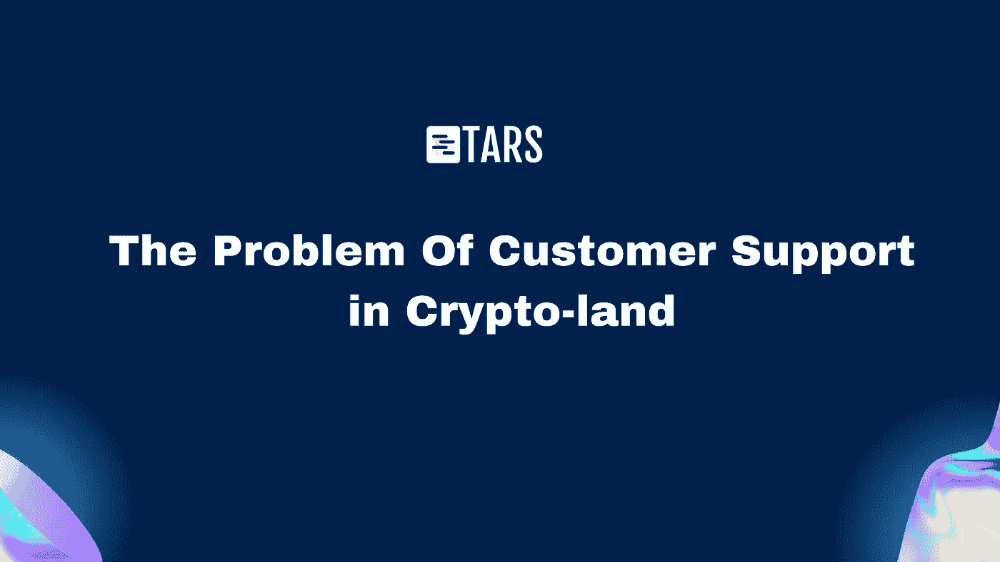
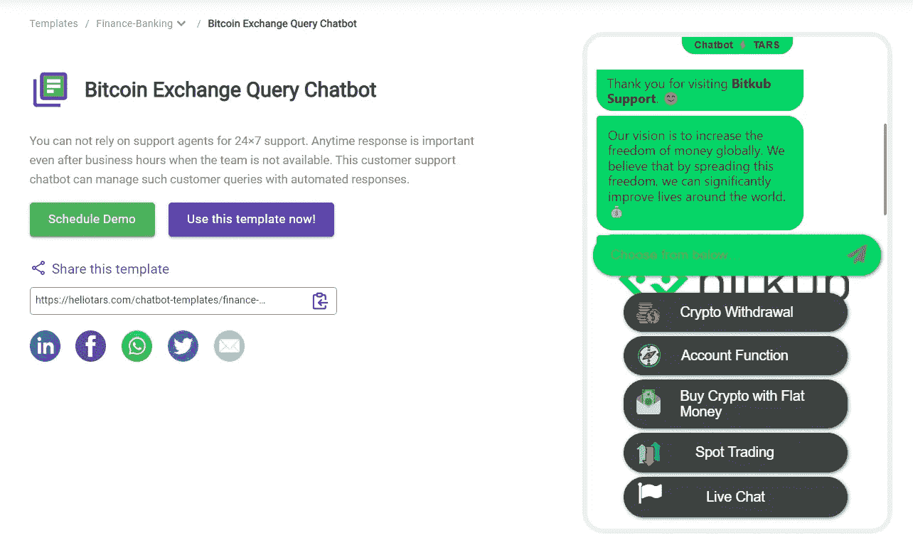
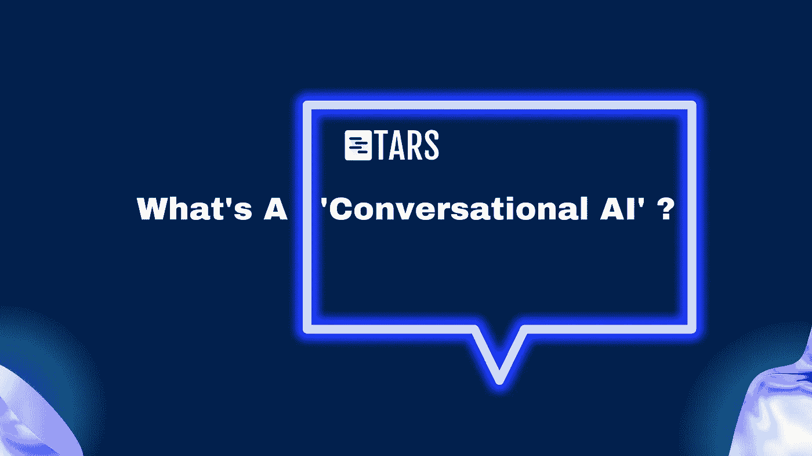
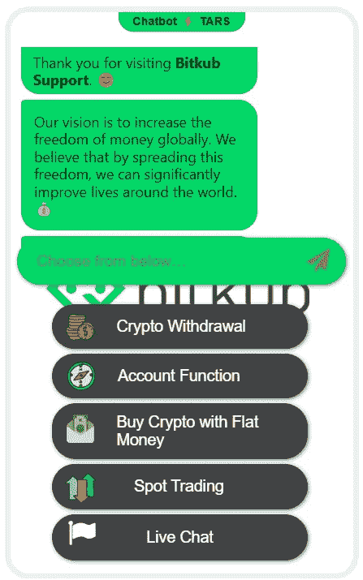
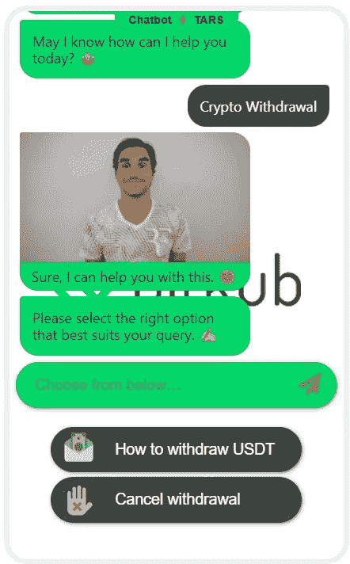
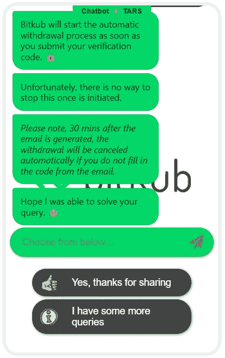

# 密码交换如何受益于对话式人工智能

> 原文：<https://medium.com/coinmonks/how-crypto-exchanges-can-benefit-from-conversational-ai-260f01b910f5?source=collection_archive---------26----------------------->

如果你在加密的早期很活跃，在像[比特币对话](https://bitcointalk.org/)这样的论坛上一决高下，你一定不会错过这句话:*“如果你不相信我或者不明白，对不起，我没有时间来说服你。*

这是 2010 年比特币中本聪的创始人，[为比特币系统的可扩展性争论](https://bitcointalk.org/index.php?topic=532.msg6269#msg6269)。虽然 Satoshi 可能在比特币是狂热爱好者的利基好奇心时拥有这一选项，但今天迎合数百万散户投资者的加密货币交易所却没有。

# 密码世界中的客户支持问题

对于一些令人费解的观点，请考虑这个:该集团的[合法指数报告](https://www.theblockcrypto.com/linked/128526/centralized-crypto-exchanges-14-trillion-trading-volume-2021)显示，2021 年，全球集中式加密交易所处理的交易量超过 14 万亿美元，是加密货币市场有史以来的最高纪录。这比 2020 年“仅仅”1.8 万亿美元的交易量增长了 689%。

这种交易量的爆炸是由流行的加密货币交易所用户群的大规模激增直接导致的。为了让你了解这种情况发生的规模，以印度为例:

*   2021 年，就用户数量而言，印度最大的股票经纪公司 Zerodha 被多家加密交易所超越。
*   Zerodha 拥有 700 万用户，Coinswitch 俱吠罗公司和 Wazir X 分别拥有 1100 万和 850 万用户。

自然，加密货币的这种超越地心引力的崛起吸引了全球散户投资者的注意力。但是像这样的关注从来不会没有问题。对于像加密这样尚处于起步阶段的新型资产类别，问题有以下几种形式👇🏼

*   **申请查询** **关于开户和 eKYC**
*   **技术查询** **关于区块链钱包，加密&安全**
*   **法律查询** **关于交易限额，国家规定&纳税义务**
*   **支持查询** **周边技术故障，支付问题&账号访问。**

但是用电子邮件和网络表单来解决这些问题，在技术上相当于伊隆用信鸽来回答关于 SpaceX 的常见问题。这不仅导致 24x7 交易世界中的响应明显延迟，而且还使个人不得不在加密论坛(和其他社交平台)中寻找相关建议。再加上迅速变化的新闻周期，你已经为自己找到了一个在加密平台和普通投资者之间建立信任鸿沟的完美方法。

采用主流加密意味着解决这个精确的问题。

乍一看，有人可能会说答案很简单:实时聊天！但是更深入地看，局限性变得相当明显。这些限制中最重要的是实时聊天对人工代理的依赖，人工代理不像机器人那样需要休息和睡眠。对于大型加密交易所来说，这意味着如果他们想让客户享受低响应时间，就要雇佣一大批实时聊天代理。历史告诉我们——军队极其昂贵。

那么，密码交易所需要的是一个**自动化的系统，它参与、教育&解决客户的疑问**。这不仅会极大地改善像 CX CSAT 这样的传统关键绩效指标，而且更重要的是，它会弥合目前普遍存在于公众之间的信任鸿沟，而不会让银行破产。

这就是对话式人工智能的用武之地，看起来像这样👇🏼

你可以在这里查看这个加密交换支持聊天机器人:[https://hello tars . com/Chatbot-templates/customer-Support/utkU-O/bit coin-Exchange-query-Chatbot](https://hellotars.com/chatbot-templates/customer-support/utkU-O/bitcoin-exchange-query-chatbot)

# 等等，什么是“对话式人工智能”？

简而言之，对话式人工智能是一种先进的技术，可以在客户旅程的任何时间点部署用于自动化任何类型的客户对话。它们旨在通过基于文本的交互从人类用户那里提取信息，并实时回答问题，以提供模拟与人自然交流的用户体验。

对于加密平台，对话式人工智能的相关性基于其以下特征:

*   **24/7 决议:**由于全球交易全天候在加密市场进行，对于客户支持来说，时间是一种宝贵的商品。对于涉及用户帐户被锁定或可能被黑客攻击的时间敏感问题来说尤其如此。使用对话式人工智能，加密平台可以提供 24x7 的支持，从而提高其操作的可靠性和声誉。在一个充斥着被黑客攻击的服务器的世界里，可靠性是游戏的名字。
*   **全渠道支持:**无论是作为加密登录页面上的一个小工具，还是作为 WhatsApp 聊天机器人，对话式人工智能都可以准确地到达客户所在的位置。考虑到每年进入秘密世界的年轻人数量，让他们在他们喜欢的平台上进行交谈:即 WhatsApp 可以让一切变得不同。
*   **自然语言处理(NLP):** 你有没有想过用自己的话键入一个查询，而不受聊天机器人中预先确定的选项的限制，会是什么样子？使用现代的 NLP 集成，对话式人工智能可以准确地破译一个人的意图，从而使他们能够用自己的话提出疑问。
*   **多语言支持:** Crypto 的客户遍布世界各地，他们希望获得母语支持。研究表明，42%的客户从不购买其他语言的产品和服务。因此，让人们能够以他们喜欢的语言获得问题的答案是建立信任和信心的关键，同时也为新的加密客户铺平了道路。
*   **大规模成本效益**:与其所有替代品——电子邮件、短信、实时聊天——相比，对话式人工智能在成本效益和投资回报率方面是无与伦比的。虽然传统的支持渠道往往是一个钱坑，但对话式人工智能有可能成为普通散户投资者的私人管家。对于拥有大规模用户群的加密平台来说，这反过来可以转化为显著的成本节约。

# 对话式人工智能如何用于客户支持？

对话式人工智能的主要应用之一是提供自动化客户支持，做你期望客户支持代表做的一切，尽管是以一种令人难以置信的快速、高效和成本有效的方式。因此，与一个加密交易所让一个团队通过电子邮件处理查询，另一个团队通过电话处理客户请求不同，他们可以让一个对话式人工智能为他们的整个受众服务，作为解决重复查询的第一联系点。

想知道它实际上是什么样子吗？👇🏼

当对话式人工智能无法有意义地解决复杂的查询时，会发生什么？它可以立即创建一张票，并将查询交给现场代理，然后代理可以回答客户的需求。因此，它不是“取代”加密领域的客户支持团队，而是作为补充。双赢。

# 对话式 AI 还能如何用于加密货币行业？

除了基于网络的客户支持，对话式人工智能在加密领域还有另外两个轰动一时的用例:

*   **基于 WhatsApp 的保留营销活动:**与潜在客户营销活动不同，保留营销是一种向现有客户营销的策略，目的是“保留”和“扩大”他们的客户。虽然电子邮件&短信等渠道传统上用于保留营销活动，但它们往往具有极低的打开率和不存在的回复率。

然而，当使用对话式人工智能执行并部署在 WhatsApp 上时；保留营销活动允许加密平台使用以下方式激励其现有客户:

— **不同加密货币的降价通知**

— **不同加密货币的观察列表提醒**

— **新加密产品的独家交易**

— **首次发行硬币的特别交易(ICO)**

*   **基于 WhatsApp 的重新定位活动:**每个成长型营销人员都非常熟悉重新定位活动，包括将你的广告放在至少访问过你的网站一次但目前没有参与的人面前。对话式人工智能与 WhatsApp 的结合，通过在目标收件箱中开始有趣的个性化对话，增强了这种互动。这使得加密平台将客户带回买方/交易者的旅程，并发现他们漏斗中隐藏的价值。