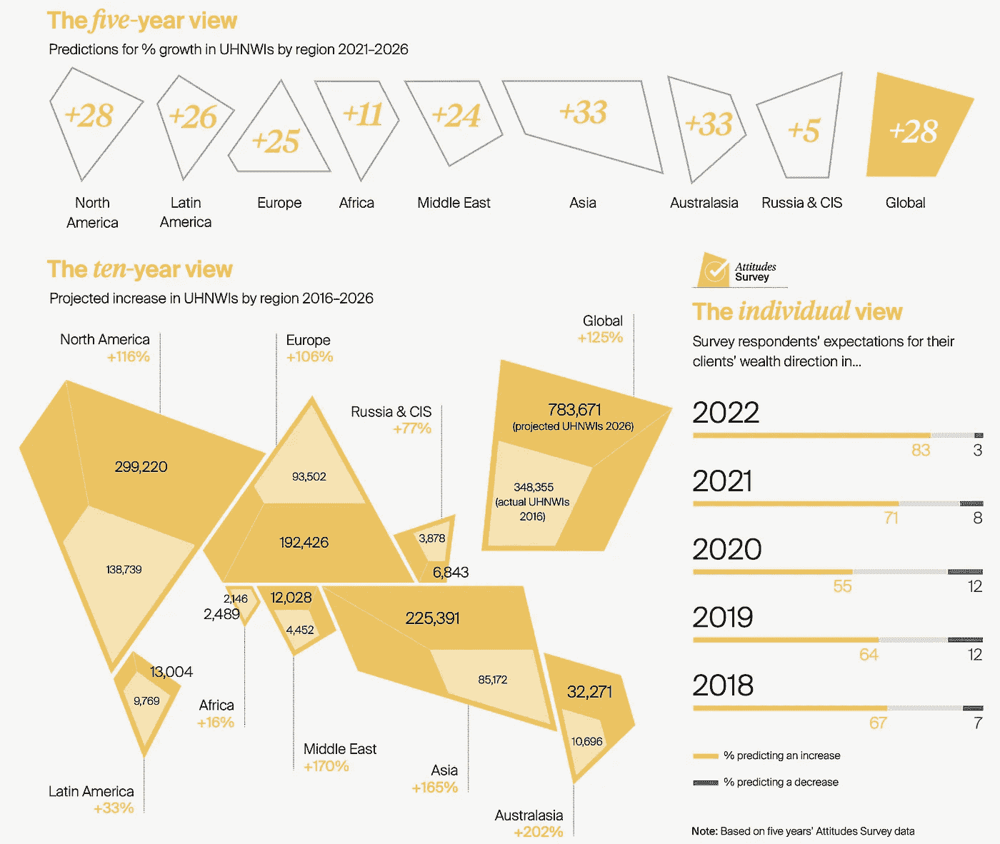
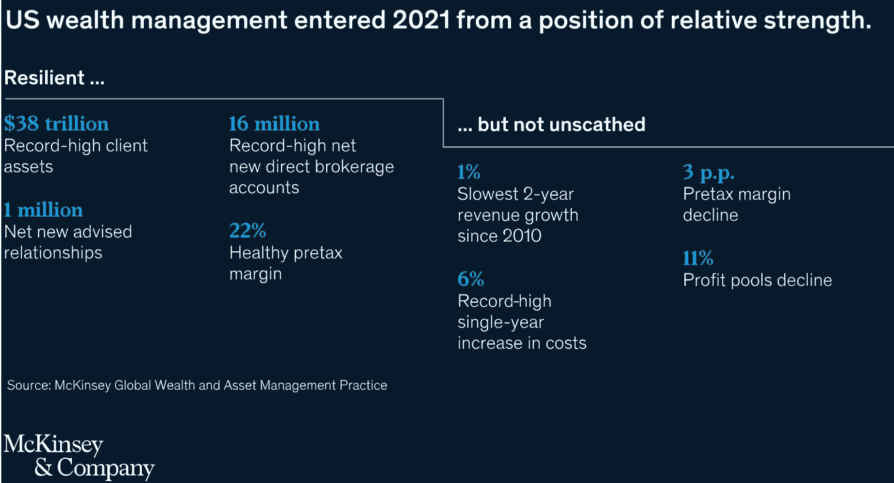
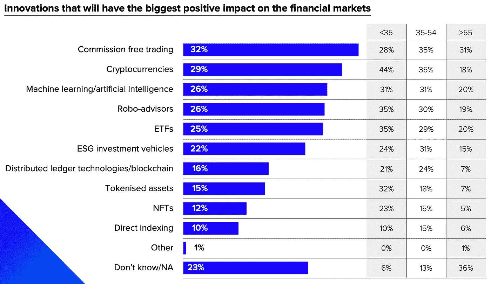
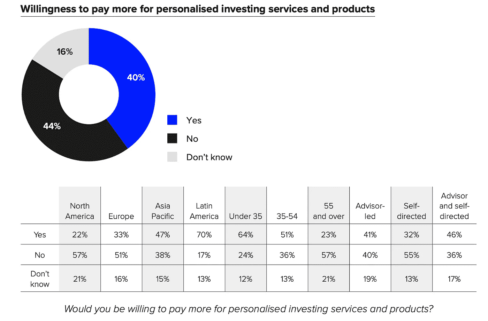
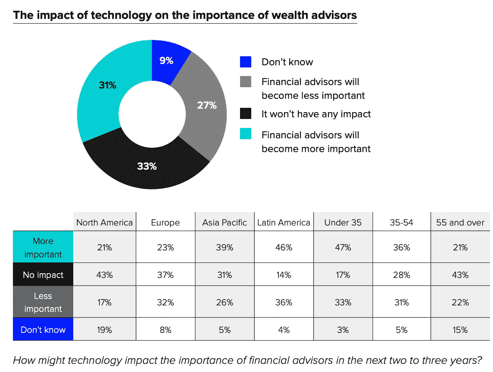

# 加密如何提升财富管理

> 原文：<https://medium.com/coinmonks/how-crypto-increases-the-role-of-wealth-managers-d2149f9d17c4?source=collection_archive---------15----------------------->

与普遍看法相反，得益于加密技术和科技，财富管理公司正变得对客户至关重要。

> 31%的财富管理客户认为，技术进步将增加财富管理公司的未来角色
> 
> 41%的人愿意为更好、更个性化的建议支付更多费用
> 
> 29%(44%的千禧一代)认为加密将对金融市场产生最大的积极影响

# 大卫与歌利亚—加密与财富管理

数字资产行业从 2019 年的估值 1000 亿美元增长到今天的市值超过 2.5 万亿美元[2][4]。尽管它的采用令人震惊，但它仍然远远落后于传统财富管理中管理的资产:仅在美国就有 38 万亿美元，在世界上有 100 万亿美元(与 crypto 11%的增长相比，这是温和的增长)。

> 数字资产的总价值为 2.5 万亿美元，而传统资产管理行业的总资产为 100 万亿美元

世界上最大的财富管理公司——瑞银财富管理公司——为客户的 2.4 万亿美元资产提供咨询。据莱坊称，全球超高净值人群的数量预计将在 5 年内增长 28%

Source: Knight Frank

根据福布斯 2021 年世界亿万富翁排行榜*，“2021 年每 17 个小时就有一个新的亿万富翁诞生”，去年有 493 名新人加入亿万富翁俱乐部。这种趋势将会继续，因为莱坊预测未来 5 年超高净值将会有 28%的增长。*

Source: McKinsey

一旦我们将财富管理市场的两位数增长轨迹与富裕客户对 crypto 的兴趣(几乎 80%)联系起来，预计这些财富的一部分**将重新分配给 crypto** 。

# 密码对财富管理的影响

在最新的报告中，Refiniv(伦敦证券交易所集团)调查了 13 个国家的 1500 多名大众富裕和高净值投资者。这些报告证实了重塑当今财富管理的主要趋势——T4、ESG 和加密。

Source: Refinitiv

加密货币被列为对金融市场产生最大积极影响的顶级创新之一。主要领域包括

1.  可访问性
    Crypto 使世界上任何人(只要能访问互联网)都可以访问金融服务。这是相当重要的，因为今天世界上上网的人比有银行账户的人还多
2.  速度
    国内和国际支付都在几秒钟内完成，无需银行账户即可发送/接收(加密)转账。
3.  没有中间人
    金融服务(如支付)是在没有任何中间人的情况下进行的
4.  完全透明的 DeFi(去中心化金融)和区块链技术(DeFi 的基础)带来了前所未有的透明度。每一个 DeFi 应用程序(和每一个加密令牌)允许全面了解其国库，历史，所有客户(及其余额)，历史交易，…
5.  开放源代码
    DeFi 应用程序的源代码对任何人开放，可以阅读、检查、验证…和复制。

Source: Refinitiv

这对财富管理公司和加密公司意味着什么？

*   富裕和富有的客户比机器人顾问、ETF、TradeFi(传统金融)中的基金更想要个性化的建议。
*   在加密领域——收益农业、加密基金或 ETF——不会取代对提供个性化加密策略建议的加密财富管理公司的需求。

Source: Refinitiv

财富管理和私人银行业务现在和将来都与个人关系和信任有关。然而，考虑到发展的速度以及技术对我们生活和金融业的影响，财富管理公司将不得不采用新的技术解决方案来满足新客户的期望。客户仍然希望向财富管理公司寻求金融和密码建议，并愿意为正确答案支付更多费用。

**加密理财系列文章:**

1.  [财富管理公司对 Crypto 持什么态度？](/coinmonks/where-do-wealth-managers-stand-on-crypto-cdaf89b4362a)
2.  [加密如何提升财富管理](/@cyanustech/how-crypto-increases-the-role-of-wealth-managers-d2149f9d17c4)
3.  Defi 的幕后。财富经理简介
4.  从 TradeFi 到 deFi？财富经理入门指南

**Stablecoin 文章系列:**

1.  [极限稳定币分类](/coinmonks/ultimate-stablecoin-classification-bd70db1ae3f3)

来源:
1)路孚特，2022，变得个人化:财富公司如何吸引和留住现代投资者
2)麦肯锡，2022，美国财富管理:未来十年的增长议程
3)莱坊，2022，财富报告
4)罗兰·贝格，2022，秘密经济的崛起
5)波士顿咨询公司，2022，全球资产管理 2021 100 万亿美元的机器

> 加入 Coinmonks [电报频道](https://t.me/coincodecap)和 [Youtube 频道](https://www.youtube.com/c/coinmonks/videos)了解加密交易和投资

# 另外，阅读

*   [3 商业评论](/coinmonks/3commas-review-an-excellent-crypto-trading-bot-2020-1313a58bec92) | [Pionex 评论](https://coincodecap.com/pionex-review-exchange-with-crypto-trading-bot) | [Coinrule 评论](/coinmonks/coinrule-review-2021-a-beginner-friendly-crypto-trading-bot-daf0504848ba)
*   [莱杰 vs n rave](/coinmonks/ledger-vs-ngrave-zero-7e40f0c1d694)|[莱杰 nano s vs x](/coinmonks/ledger-nano-s-vs-x-battery-hardware-price-storage-59a6663fe3b0) | [币安评论](/coinmonks/binance-review-ee10d3bf3b6e)
*   [Bybit Exchange 审查](/coinmonks/bybit-exchange-review-dbd570019b71) | [Bityard 审查](https://coincodecap.com/bityard-reivew) | [Jet-Bot 审查](https://coincodecap.com/jet-bot-review)
*   [3 commas vs crypto hopper](/coinmonks/3commas-vs-pionex-vs-cryptohopper-best-crypto-bot-6a98d2baa203)|[赚取加密利息](/coinmonks/earn-crypto-interest-b10b810fdda3)
*   最好的比特币[硬件钱包](/coinmonks/hardware-wallets-dfa1211730c6) | [BitBox02 回顾](/coinmonks/bitbox02-review-your-swiss-bitcoin-hardware-wallet-c36c88fff29)