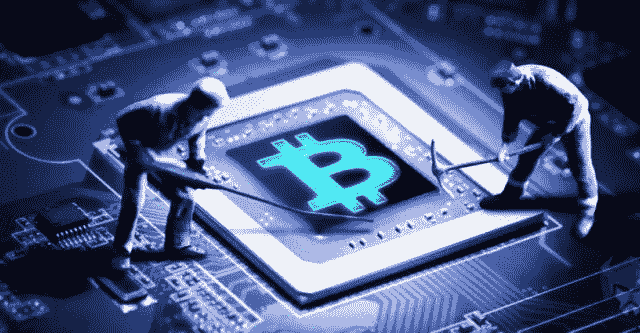

# 秘密采矿:只是结晶或劳动

> 原文：<https://medium.com/coinmonks/how-crypto-mining-works-the-crystallization-or-labor-e340c9e32dc?source=collection_archive---------37----------------------->

我从 https://www.thenewslens.com/article/167746/page2[翻译的文章](https://www.thenewslens.com/article/167746/page2)

在加密领域有许多经常被误解的技术术语——采矿就是其中之一。我将试着从不同的理解层面来解释到底什么是挖掘，这样你就能更好地理解了。

# 物理采矿:用铲子挖掘价值

在第 0 层，人们拿起铲子，在泥土中挖掘，寻找泥土中的矿物质，这是他们获取价值的方式。

当然，每个人都知道这一点，但困惑在于采矿与加密货币有什么关系。然而，查看传统世界中的术语可以帮助我们理解新的解释。

挖掘产生的价值完全是从零开始的。矿工可以赚钱，因为他们提供新的资源，创造新的价值。在一个正常的矿井中，是矿主和矿工获得利润…不太多，但这不是我们在这里讨论的。

与通过挖掘从零开始创造新价值相比，通过比较销售商品和服务是一个“增值过程”例如送货上门，添加一个好的设计，或者提供周到的客户服务；它们都基于现有的产品或服务，并增加了额外的价值。

# 比特币挖矿:有计算能力的会计

理解了解释之后，你就能理解为什么中本聪把架设服务器做会计工作的行为叫做‘挖矿’因为在比特币区块链中，随着每一个新的区块，一个之前在生态系统中不存在的新比特币将被生成并奖励给矿工。
帮助社区记录其在区块链的账目的行为是一项公共服务，因此采矿奖励不是由任何个人为所获得的服务支付，而是由整个团体为新产生的价值支付。

Satoshi Nakamotos 的会计设计让矿工们使用试错法无休止地解决一个数学问题，这耗费了大量的时间和计算能力。这个试错的过程可以比作挖掘过程；成功破解密码就像在沙子里随意挖掘寻找矿物一样。这个过程需要时间、电力和计算能力来挖掘。因为所有这些工作，这个机制被称为“工作证明”

每开采一个新区块，系统都会铸造一定数量的比特币，并奖励给第一个解决问题的人，其他矿工也证实了这一点。整个过程和物理开采非常相似。除了劳动力，矿工开采矿产也需要带点运气，但劳动力还是关键。运气的数学名称只不过是“概率”，从长远来看，一切都会扯平。一旦劳动量达到一定程度，挖矿奖励迫在眉睫。

# 密码挖掘的新模式:利益证明

比特币的发明无疑是人类价值存储和转移的一个突破。然而，作为第一代分散式分类帐，它具有长交易时间、低容量、大量浪费的能量等。
因此，下一代新一代区块链通常会使用新的采矿机制，最主流的是股权证明(PoS)。第二大区块链 Etherium 也正在从工作证明转变为利益证明

用简单但非常粗糙的话来说，利害关系的证明就是用钱投票。所有负责记账的矿工都需要存放一定数量的代币。如果他们的叙述和其他人的不同，那么就会被认为是不正确的；无论是故意作弊还是系统故障，他们都不会得到奖励，在严重的情况下，他们的赌注将被扣除。这鼓励每个人正确记账，或者反过来，防止有人犯错或作弊。

从“劳动力”到“计算能力”，我们现在转向“金融能力”，因此行业通常不把在股权凭证分类账上记账的人称为矿工，而是把他们称为验证者，更中性的术语称为节点。那里的活动不一定是采矿。

我听说有人坚持说，股权证明不使用计算能力，所以它不是采矿。但是我认为使用采矿作为比喻的关键点是产生以前世界上不存在的新价值。按照逻辑，社会不应该因为比特币节点不用铲子就坚持不应该叫挖矿吗？

“钱包”、“钥匙”和“签名”也是如此采矿只是一个类比，有助于通过旧的概念理解区块链，但他们真的不必抓住不放

# 挣钱的机会:播种甜瓜

除了 PoW 和 PoS 之外，还有通过进行特定活动来获得代币的系统。近年来，这种方法很少被称为采矿，但它更普遍地被称为“X-to-earn”。最近流行的 STEPN 就是一个很好的例子，它为我们带来了“移动赚取”,用户通过行走获得代币奖励。还有 Axie Infinity 的“玩到赚”模式。运用这一逻辑，我在 2017 年共同创立了 Likecoin，你可以称之为“写作赚钱”，这在当时的术语中并不存在。所以在白皮书中，我称之为“创造力的证明”,来描述创造社会价值的过程，同时像硬币一样赚钱。

# 空投:意外之财

进一步延伸这个概念，X-to-earn 的外围是 airdrop。两者都为做被认为有价值的特定行为提供了代币。在区块链行业，空投是一次性的活动，通常奖励早期参与者，而“X-to-earn”是持续的。此外，与“X-to-earn”不同，空投的条件通常不会提前披露，而是在没有警告的情况下宣布，根据参与者过去的链上行为对他们有利。不仅用户在大多数时候无法预测空投，甚至项目团队也可能不知道。相反，它可能只是在项目开发的某个阶段之后才被部署。

关于空投部署，用户不知道空投的细节是一个优势，因为它的目的是奖励早期采用者。空投越不可预测，用户行为真诚的可能性就越大。然而，当空投的方法被不同的项目重复使用时，越来越多的“空投猎人”将通过执行简单的链上交易来参与这些项目，从而推测未来潜在的空投。

空投猎人的动机是可以原谅的。但它们大大降低了空投的惊喜和力量，因为现在项目很难区分真实用户和虚假用户。只有通过‘突然空投’，真诚的用户才能得到回报。尽管如此，避免过度投机或不切实际，你可能会得到一个突然的大空投。仔细研究、尝试和参与每一种方法，通过坚持不懈，你可能会得到一个大惊喜。

> 加入 Coinmonks [电报频道](https://t.me/coincodecap)和 [Youtube 频道](https://www.youtube.com/c/coinmonks/videos)了解加密交易和投资

# 另外，阅读

*   [最好的卡达诺钱包](https://coincodecap.com/best-cardano-wallets) | [Bingbon 副本交易](https://coincodecap.com/bingbon-copy-trading)
*   [印度最佳 P2P 加密交易所](https://coincodecap.com/p2p-crypto-exchanges-in-india) | [柴犬钱包](https://coincodecap.com/baby-shiba-inu-wallets)
*   [8 大加密联盟项目](https://coincodecap.com/crypto-affiliate-programs) | [eToro vs 比特币基地](https://coincodecap.com/etoro-vs-coinbase)
*   [最佳以太坊钱包](https://coincodecap.com/best-ethereum-wallets) | [电报上的加密货币机器人](https://coincodecap.com/telegram-crypto-bots)
*   [交易杠杆代币的最佳交易所](https://coincodecap.com/leveraged-token-exchanges) | [购买 Floki](https://coincodecap.com/buy-floki-inu-token)
*   [3Commas 诉 Pionex 诉 crypto hopper](https://coincodecap.com/3commas-vs-pionex-vs-cryptohopper)|[Bingbon Review](https://coincodecap.com/bingbon-review)
*   [加密复制交易平台](/coinmonks/top-10-crypto-copy-trading-platforms-for-beginners-d0c37c7d698c) | [如何在 WazirX 上购买比特币](/coinmonks/buy-bitcoin-on-wazirx-2d12b7989af1)

— — — — — — — — — — — — — — — — — — — — — — — — — — — — — — — —

🔴点对点加密货币交易现在是、将来也会是规避日益恶化的资本管制的最重要工具。加入点对点加密交易革命。立即注册—[https://wild-west . trade](https://www.youtube.com/redirect?event=video_description&redir_token=QUFFLUhqbEs0WWgybWhXelY1SGZoRC1mN1FYS2tyZGRFd3xBQ3Jtc0tueUt1d01FcS00ZllzQzBBTndkOXktbVZnY2Rha1c1Q0xVWHp6aVJpNjdqMXUyN0FzMmpoaWJWT3NGQm5acE84V1Qtc0lUcGpaYU9ralN0NUVINlBlNGVzb1JCV3c3RElqaVVsQXRrUm9pR0RnTEFYaw&q=https%3A%2F%2Fwild-west.trade%2F&v=snmHTbk-DSU)